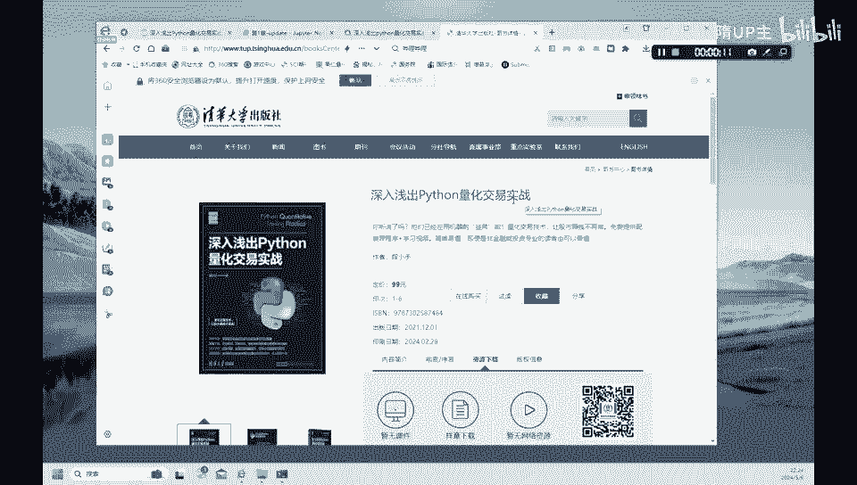
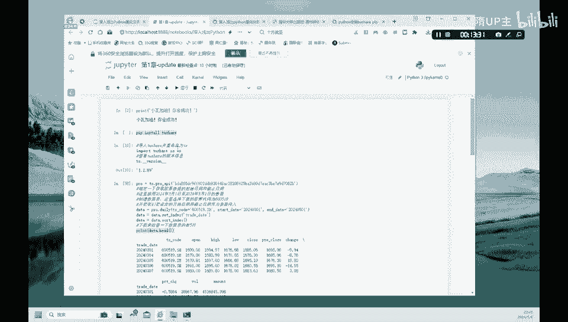

# 金融科技：1：Python量化交易入门与数据获取 📈




在本节课中，我们将学习如何使用Python进行量化交易的基础操作。主要内容包括：回顾Python基础语法、安装并使用Tushare金融数据库、下载股票数据、计算股价变化、生成交易信号，并最终通过图表可视化买入和卖出点。

---

## 课程概述与工具介绍

我们使用的教材是清华大学出版社出版的《深入浅出Python量化交易实战》。本书从零开始，通过主人公“小瓦”的故事，逐步介绍Python的用法以及如何应用简单的交易策略。

我们将使用Jupyter Notebook的网络版本进行操作。首先，进入操作界面，通过“Upload”功能可以上传本地的Python文件（第一章至第十四章）。我们使用Python 3解释器来运行代码。

## 回顾Python与设置环境

第一章的主要目的是帮助大家回顾Python语言。第一条命令类似于经典的“Hello World”，用于打印鼓励信息。

```python
print('小瓦，加油，你会成功！')
```

本书前三章原使用雅虎财经数据，但由于该数据源在国内已无法访问，我们将代码替换为广泛使用的**Tushare**金融数据库。如果你不熟悉Tushare，可以参考相关的入门视频。

## 安装与导入Tushare

在使用Tushare之前，需要先进行安装。以下是安装和验证的步骤。

首先，在命令行或Notebook单元格中执行安装命令：
```python
!pip install tushare
```

安装成功后，导入Tushare库并查看版本，以确认安装成功：
```python
import tushare as ts
print(ts.__version__)
```

## 配置数据接口与下载股票数据

Tushare目前主要通过Pro版接口提供数据服务。你需要注册Tushare账号以获取个人的API Token，用于数据查询。

以下是配置接口和下载数据的代码：
```python
# 设置你的Tushare Pro API Token
token = '你的Token_here'
pro = ts.pro_api(token)

# 下载贵州茅台（600519.SH）在指定时间段内的日线数据
data = pro.daily(ts_code='600519.SH', start_date='20240301', end_date='20240501')
```

下载数据后，我们通常将交易日期设置为数据索引，并按日期从早到晚进行排序，以便于后续的时间序列分析。

```python
# 将‘trade_date’列设置为索引，并转换为日期格式
data.index = pd.to_datetime(data['trade_date'])
# 按日期升序排列
data = data.sort_index()
# 查看前5行数据
print(data.head())
```

执行上述代码后，你将看到一个包含股票代码、开盘价、最高价、最低价、收盘价、成交量等信息的表格。

## 计算股价变化与生成交易信号

在量化交易中，我们经常需要分析股价的每日变化，并据此生成交易信号。

首先，我们计算每日收盘价的变化值（Difference）：
```python
data['diff'] = data['close'].diff()
print(data[['close', 'diff']].head())
```

`diff()`函数计算的是当前行与前一行的差值。例如，第二行的`diff`值等于3月4日的收盘价减去3月1日的收盘价。

接下来，我们根据`diff`列的值来定义交易信号（Signal）。规则如下：
*   当`diff > 0`（股价上涨）时，信号为1（视为卖出信号）。
*   当`diff <= 0`（股价下跌或持平）时，信号为0（视为买入信号）。
*   对于缺失值（NaN），也赋值为0。

以下是生成信号的代码：
```python
import numpy as np
data['signal'] = np.where(data['diff'] > 0, 1, 0)
data['signal'] = data['signal'].fillna(0)
print(data[['close', 'diff', 'signal']].head())
```

## 可视化股价与交易信号

最后，我们使用Matplotlib库将股价走势和交易信号绘制在同一张图上，以便直观观察。

以下是绘图步骤的代码：
```python
import matplotlib.pyplot as plt

# 设置画布大小
plt.figure(figsize=(10, 5))
# 绘制收盘价曲线
plt.plot(data.index, data['close'], color='black', label='Close Price')

# 标注卖出信号（diff>0, signal=1），用绿色倒三角表示
sell_signals = data[data['signal'] == 1]
plt.scatter(sell_signals.index, sell_signals['close'], color='green', marker='v', s=100, label='Sell Signal')

# 标注买入信号（diff<=0, signal=0），用红色正三角表示
buy_signals = data[data['signal'] == 0]
plt.scatter(buy_signals.index, buy_signals['close'], color='red', marker='^', s=100, label='Buy Signal')

# 添加图例和标题
plt.legend()
plt.title('Stock Price with Trading Signals')
plt.xlabel('Date')
plt.ylabel('Price')
# 展示图形
plt.show()
```

运行代码后，你将得到一张折线图。其中黑色曲线代表股价走势，绿色倒三角标注了建议卖出的时点，红色正三角标注了建议买入的时点。

---

## 课程总结



本节课我们一起学习了Python量化交易的基础入门操作。我们回顾了Python环境设置，重点介绍了如何安装和使用Tushare金融数据库来获取真实的股票数据。通过计算股价的日度变化，我们定义了一个简单的交易信号规则，并最终使用Matplotlib库将股价走势与买卖信号可视化出来。这为后续构建和测试更复杂的交易策略打下了坚实的基础。