# Python入门：1.1：Spyder界面介绍及简单使用 🐍

在本节课中，我们将要学习Spyder集成开发环境的基本界面布局和核心功能。Spyder是一个专为科学计算、数据分析和工程设计的强大Python开发工具。掌握其界面是高效编程的第一步。

## 界面布局概览

Spyder的界面主要分为四个核心区域，每个区域承担不同的功能，共同构成了一个完整的开发环境。

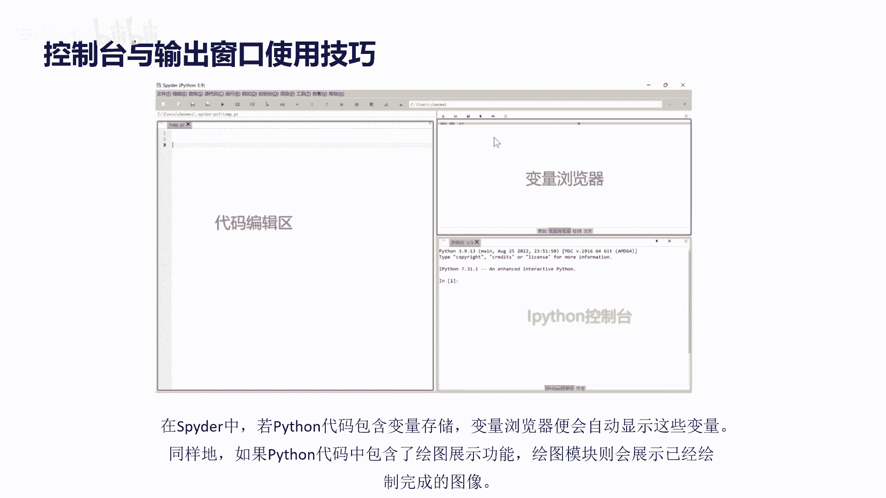

以下是Spyder的四个主要区域：
*   **菜单栏**：位于最上方，包含文件操作、运行代码等主要命令。
*   **代码编辑区**：通常位于左侧，用于撰写和编辑Python代码。
*   **变量浏览器**：通常位于右上方，用于实时显示代码中定义的变量及其值。
*   **IPython控制台**：通常位于右下方，用于交互式地执行代码并查看输出结果。


## 项目与文件管理

上一节我们介绍了界面的基本构成，本节中我们来看看如何开始一个项目。在编程时，我们通常不会只处理单个文件，而是创建一个独立的项目文件夹来管理所有相关文件。

在Spyder中，你可以通过右上方的“文件”面板打开目标文件夹。例如，当前演示使用的是名为 `spider intro` 的文件夹。

## 核心功能区详解

了解了项目结构后，我们来深入看看最常用的两个功能区：菜单栏和代码编辑区。

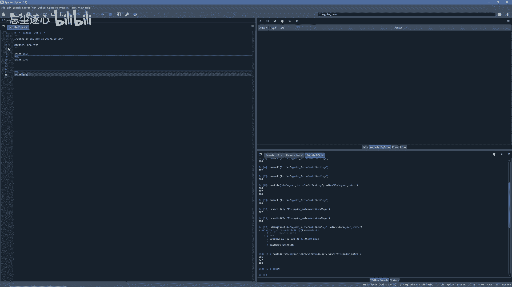

### 菜单栏：File与Run

菜单栏提供了软件的核心操作功能，其中最常用的是 **File** 和 **Run** 按钮。

以下是这两个按钮的主要功能：
*   **File**：用于创建新文件（`Ctrl+N`）、打开已有文件（`Ctrl+O`）以及保存当前文件（`Ctrl+S`）。
*   **Run**：用于执行在代码编辑区中编写的代码。

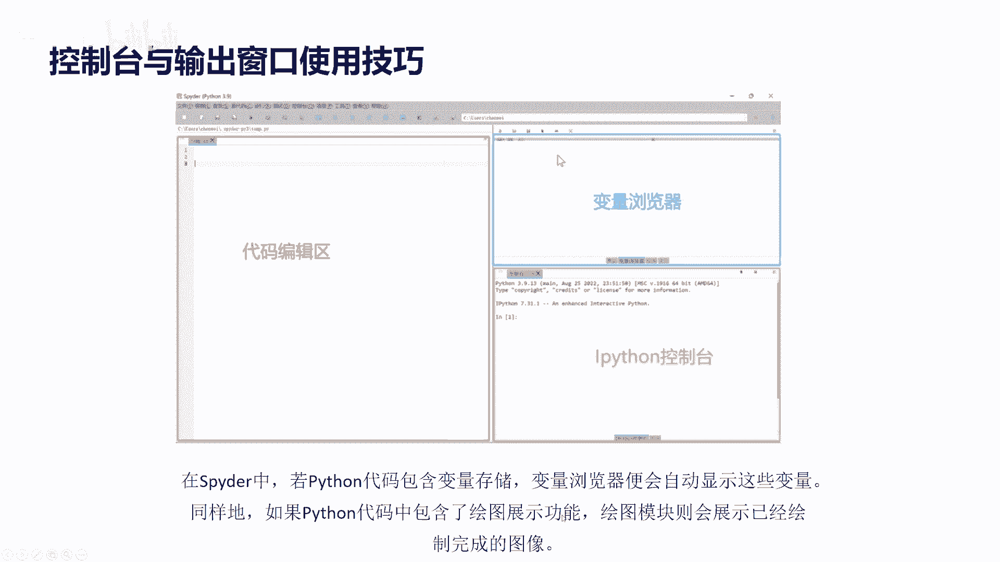

### 代码编辑与执行

代码编辑区是我们撰写Python脚本的主要场所。编写完代码后，点击 **Run** 按钮即可运行。

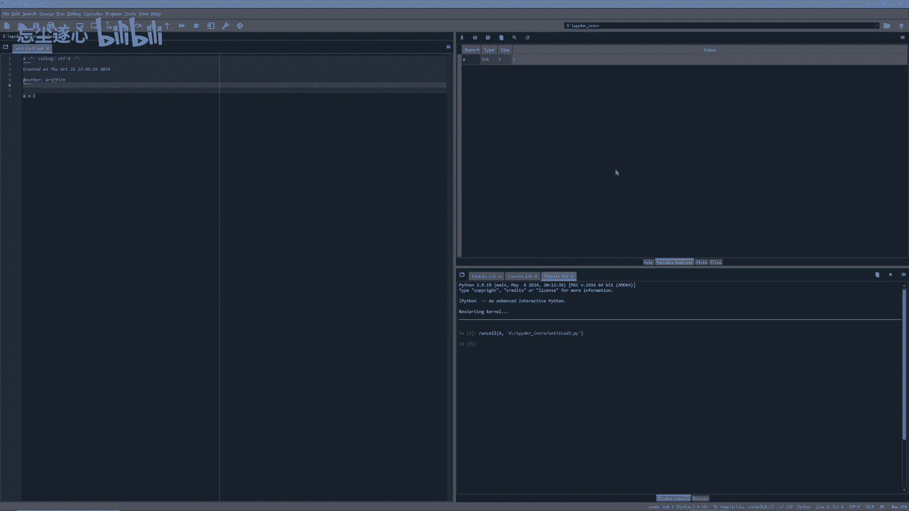


## 运行结果与交互

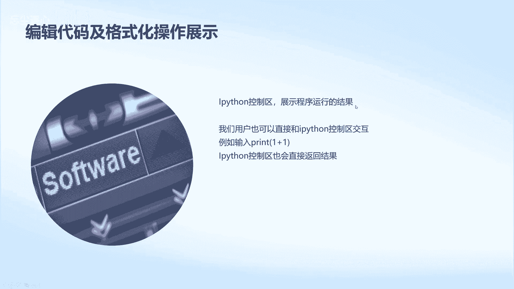

代码运行后，其结果会体现在不同的区域。如果代码中定义了变量，变量浏览器会自动更新。


同样，如果代码包含了绘图指令，绘图窗口会展示生成的图像。

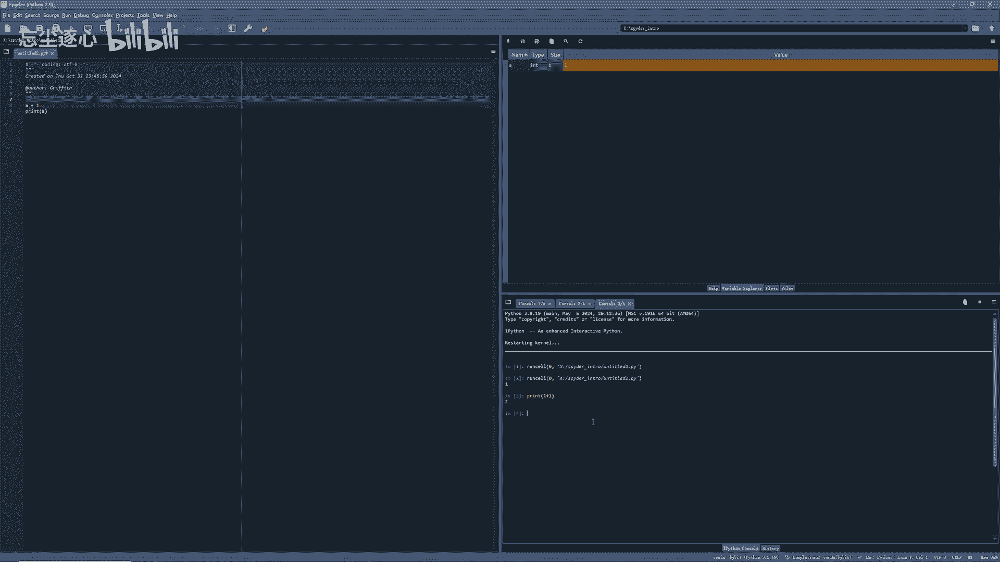

现在我们来做一个简单的实验。在代码编辑区输入 `a = 1` 并运行，可以看到变量浏览器中立即显示了变量 `a` 及其值。


程序运行的具体输出（如 `print` 语句的结果）则会显示在IPython控制台中。


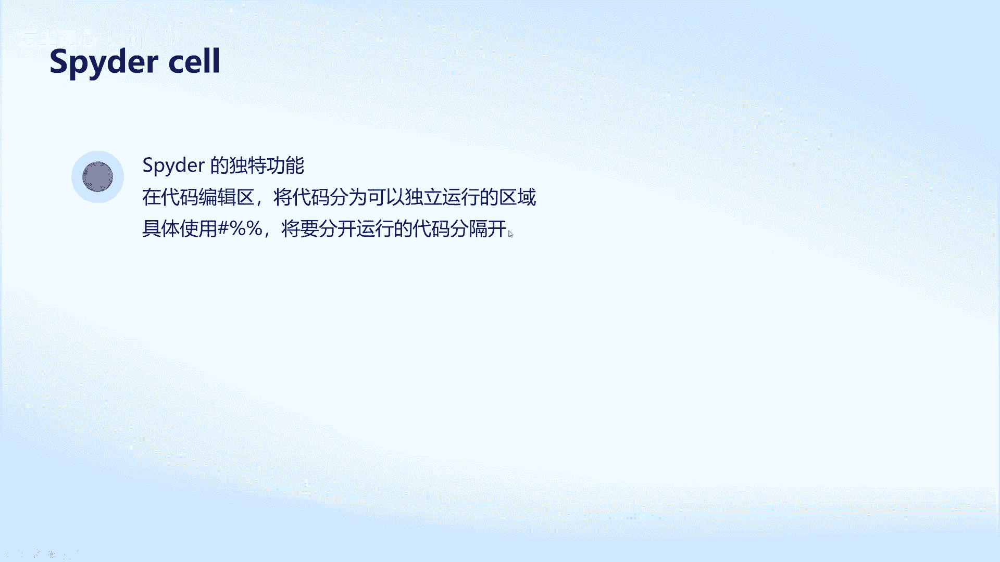

我们运行一段打印变量 `a` 的值的代码来查看结果。可以看到IPython控制台打印出了结果。此外，你还可以直接在IPython控制台中输入命令进行交互。


## Spyder特色功能：Cell单元

Spyder有一个独特的功能叫 **Cell**，它允许你将代码编辑区中的代码分割成可以独立运行的单元。具体方法是使用 `#%%` 符号将代码分隔开。

在没有使用Cell功能时，运行以下代码会一次性打印三行：

```python
print(11)
print(22)
print(33)
```


现在我们添加Cell分隔符：

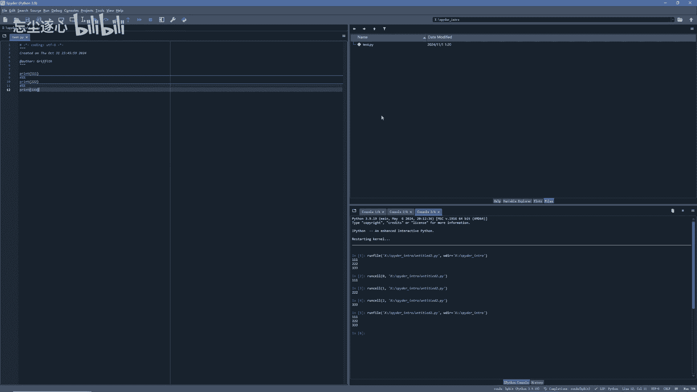

```python
#%%
print(11)
#%%
print(22)
#%%
print(33)
```

此时，三行代码被分割成三个独立的单元。你可以选择只运行其中一个单元（将光标置于该单元内，按 `Ctrl+Enter`），也可以点击工具栏的 **Run** -> **Run All** 来运行全部代码。

## 文件保存与布局自定义

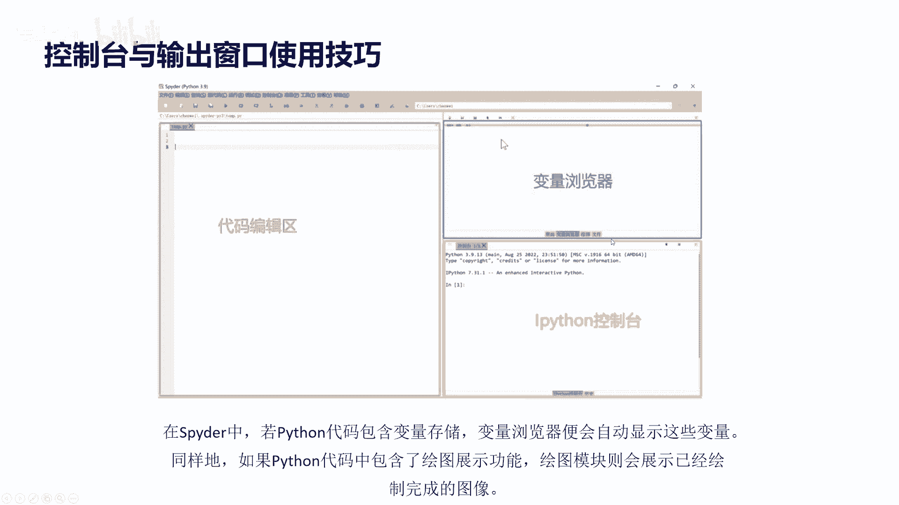

运行代码后，记得保存你的工作。点击 **File** -> **Save**，输入文件名即可。你也可以使用快捷键 `Ctrl+S` 快速保存。

Spyder的界面布局非常灵活。代码编辑区、变量浏览器、IPython控制台等面板的位置都可以根据你的喜好进行调整。


点击右上角的 **View** -> **Lock panes and toolbars** 解锁布局，然后就可以拖动各个面板了。


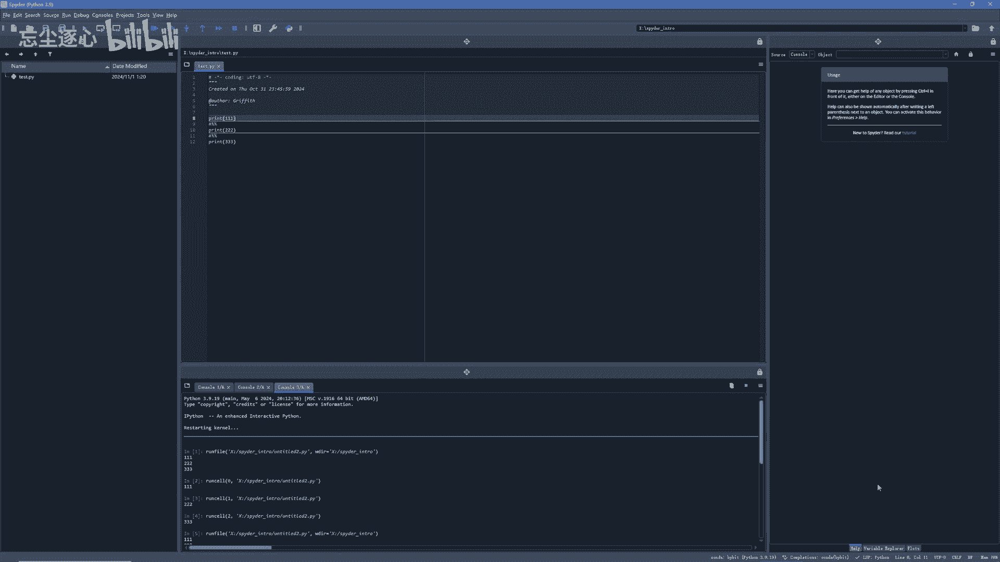

例如，你可以将文件面板移到最左侧，将控制台移到中下方，并关闭不需要的历史记录面板。调整到你满意的布局后，再次点击锁定即可固定位置。


## 总结

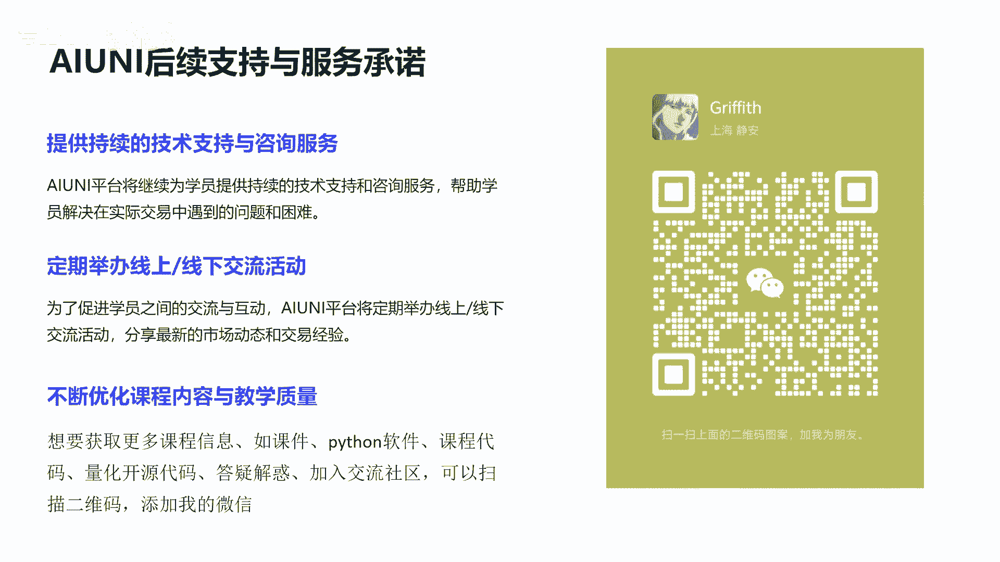

本节课中我们一起学习了Spyder集成开发环境的基础知识。我们认识了其四个核心区域：菜单栏、代码编辑区、变量浏览器和IPython控制台。我们学会了如何创建和管理项目文件，运行代码并查看变量与输出结果。此外，我们还探索了Spyder的特色Cell功能，以及如何自定义界面布局以适应个人编程习惯。掌握这些是使用Spyder进行高效Python开发的重要基础。

