# Python量化交易入门：1.1：Python安装与环境配置 🐍

在本节课中，我们将学习量化交易的第一步：安装Python编程语言及其核心库。我们将从官网下载安装包开始，完成Python的安装，并配置国内镜像源来加速后续第三方库的安装过程。

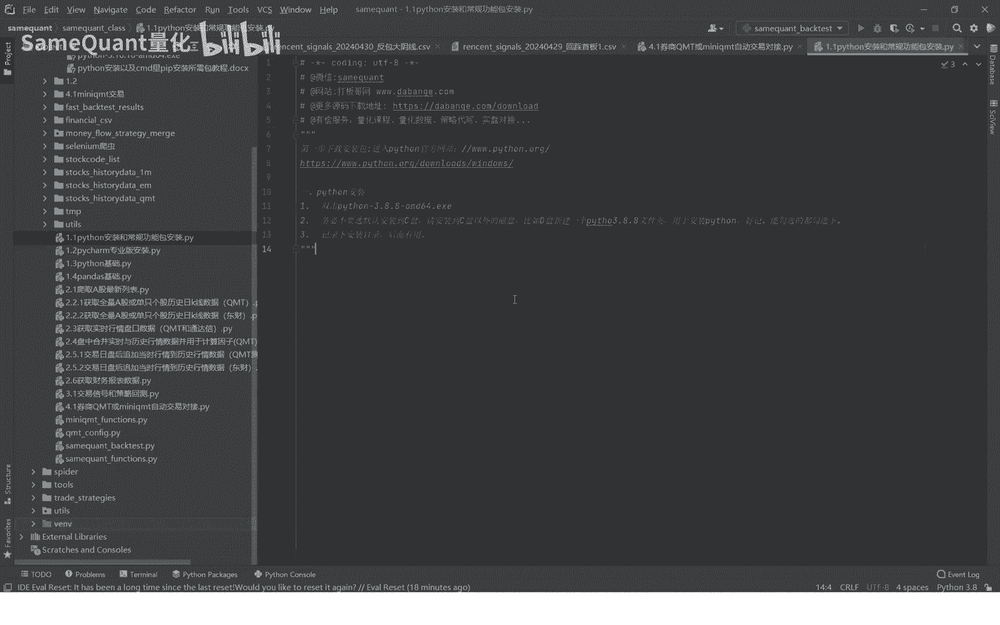

---

## 访问官网与下载安装包

首先，我们需要访问Python的官方网站。在浏览器中输入官网地址，进入下载页面。


页面上提供了多个操作系统和版本的Python安装程序。根据你的操作系统（例如Windows）选择合适的版本进行下载。点击对应的下载链接，安装包将开始下载。

---

## 安装Python程序

下载完成后，找到保存的安装包文件。直接双击该文件以启动安装程序。

在安装过程中，有几个关键细节需要注意。首先，在安装向导的初始页面，勾选“Add Python to PATH”选项。这会将Python添加到系统环境变量，方便在命令行中直接调用。

接下来，选择安装类型。建议选择“Customize installation”（自定义安装），而不是默认的“Install Now”。默认安装的路径通常较长且不易记忆。

在自定义安装设置中，你需要为Python指定一个自定义的安装路径。例如，你可以选择安装在D盘，并新建一个以Python版本号命名的文件夹（如`Python310`），这样便于管理未来可能安装的多个Python版本。

确认路径后，继续完成安装。安装过程需要一些时间，请耐心等待。安装完成后，关闭安装程序。

---

## 安装第三方库（以pandas为例）

安装好Python程序后，我们还需要安装量化交易中常用的第三方库，例如`pandas`和`numpy`。这些库需要通过Python的包管理工具`pip`来安装。

首先，进入Python的安装目录。在该目录下，找到并进入`Scripts`文件夹，这里存放着`pip.exe`等可执行文件。

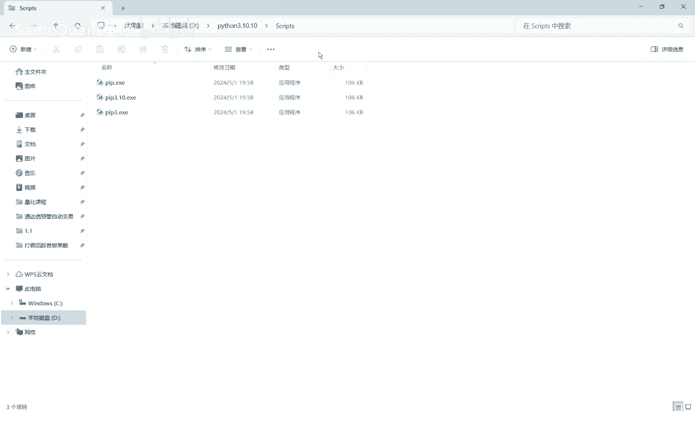


接下来，在`Scripts`文件夹的地址栏中直接输入`cmd`并按回车键。这将在此目录下打开命令提示符窗口。

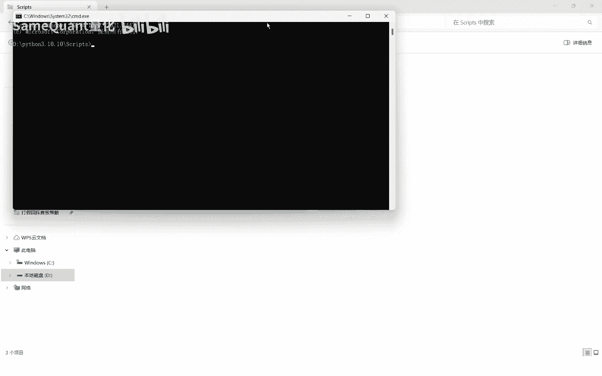


现在，我们可以使用`pip`命令安装包了。以下是安装`pandas`库的基本命令格式：

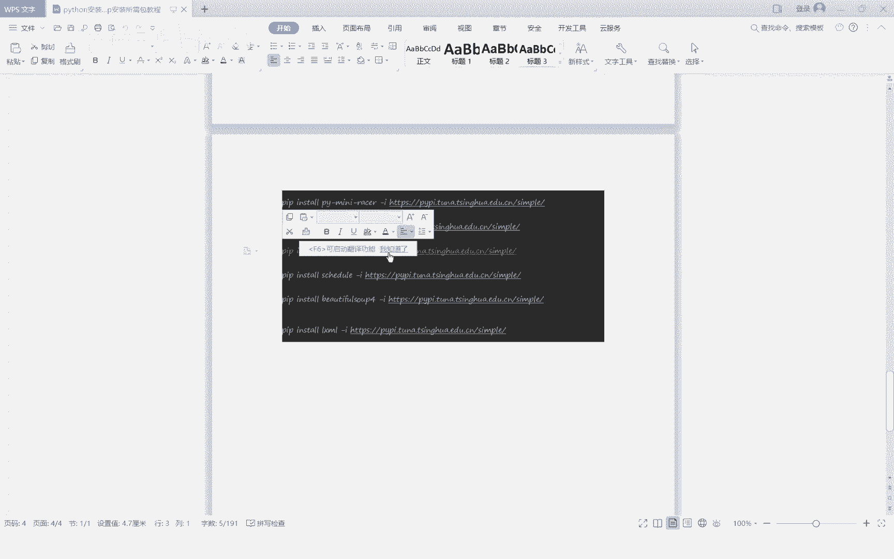

```bash
pip install pandas
```

但是，直接从Python官方源下载速度可能较慢。为了提高下载速度，我们可以在命令后添加国内的镜像源地址。例如，使用清华大学的镜像源：

```bash
pip install pandas -i https://pypi.tuna.tsinghua.edu.cn/simple
```

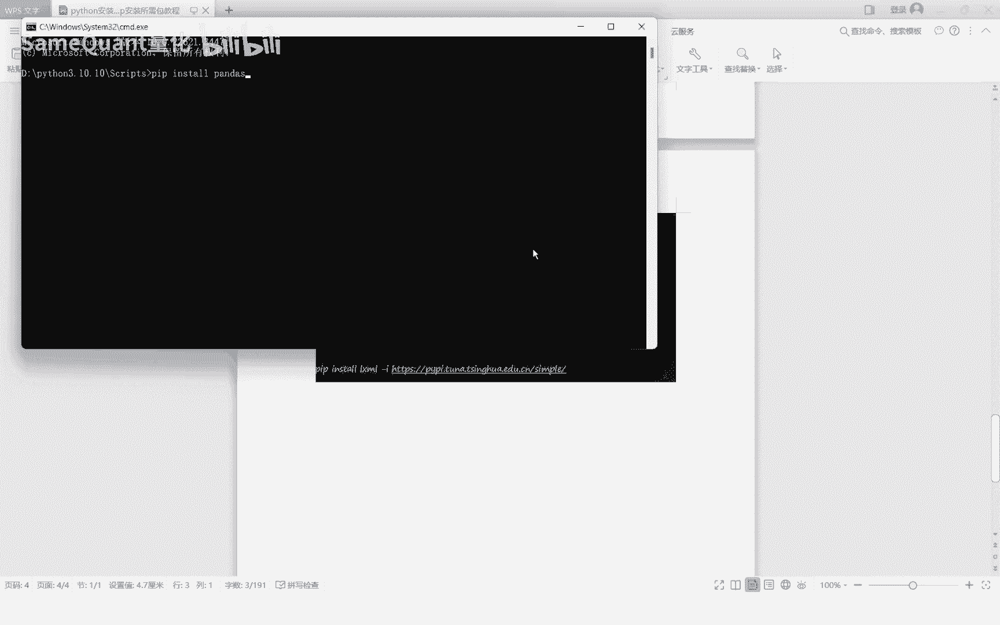


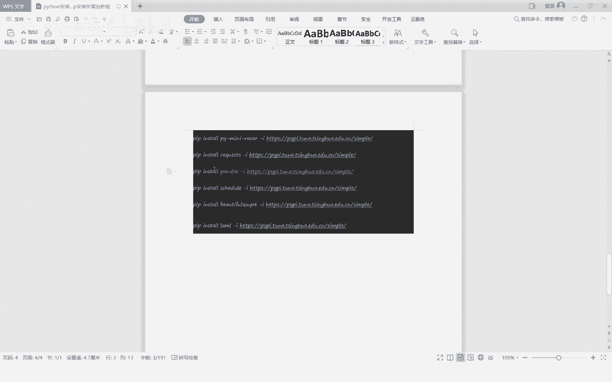

执行上述命令后，`pip`会从清华镜像源快速下载并安装`pandas`库及其依赖。安装完成后，你可以在Python安装目录的`Lib\site-packages`文件夹下找到已安装的`pandas`包，确认安装成功。

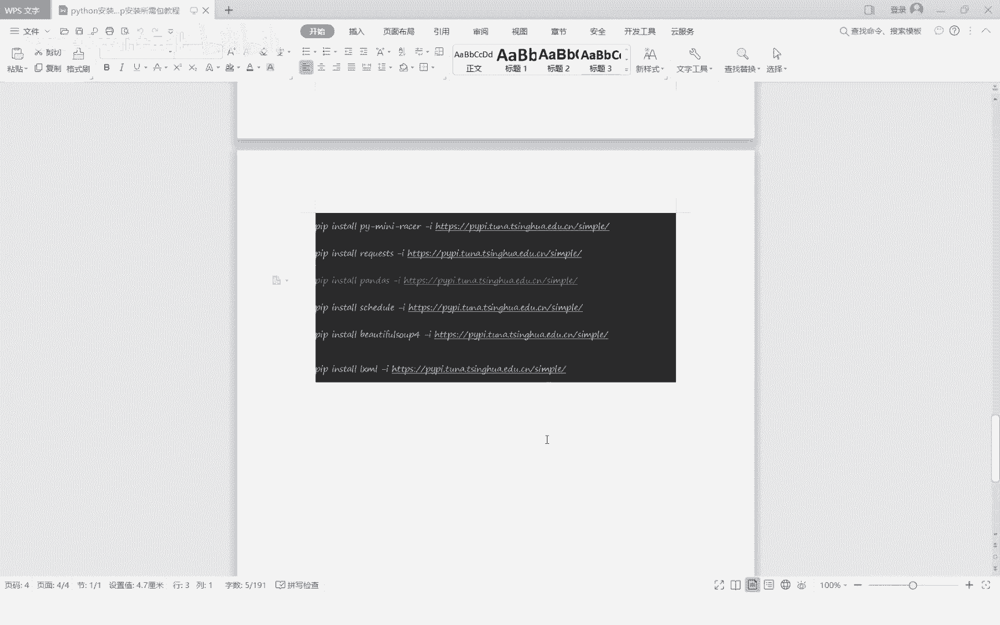

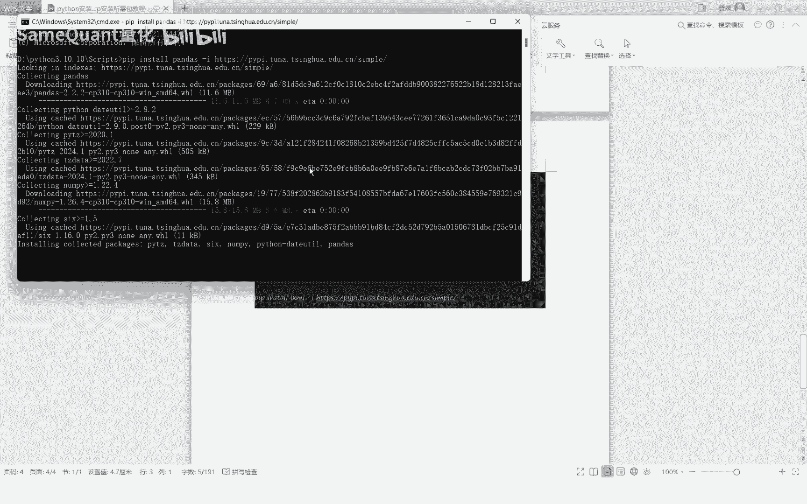

---

## 验证Python安装

为了验证Python及其库是否安装成功，我们可以运行一个简单的测试。


你可以通过系统搜索找到刚刚安装的Python程序（例如`Python 3.10`），双击打开它。这会启动一个Python交互式命令行窗口。

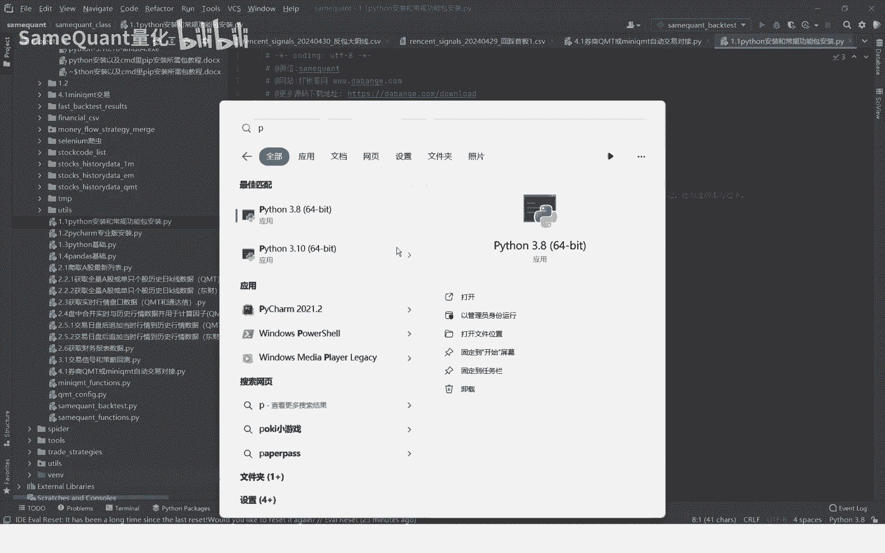

在打开的窗口中，输入以下代码并按回车：

```python
print(1+1)
```

如果安装和配置正确，窗口将显示计算结果 `2`。

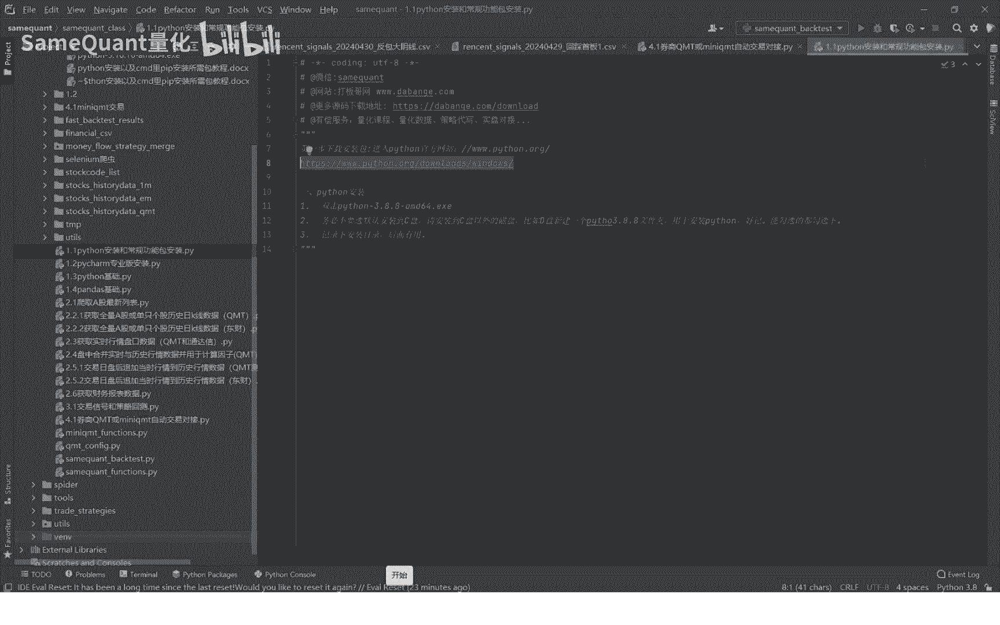

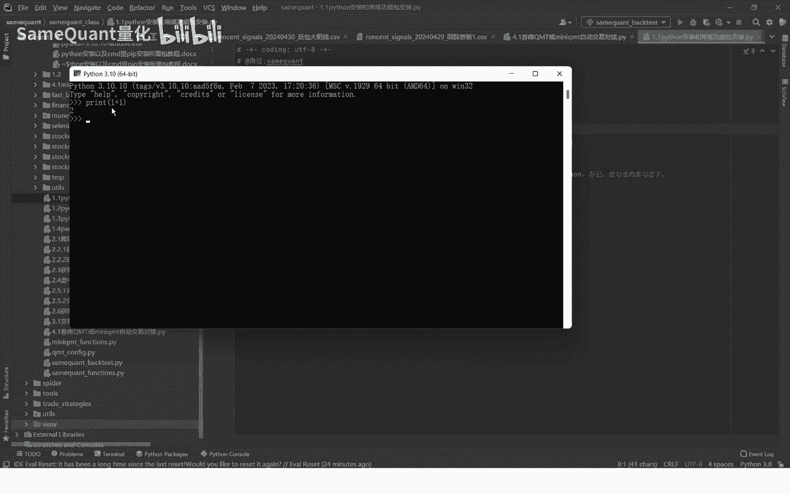

这证明Python环境已经可以正常工作。虽然直接使用这个命令行窗口编写代码不够方便，但它是一个有效的验证方式。通常，我们会使用更专业的集成开发环境（IDE），例如PyCharm。


---

## 总结


本节课中，我们一起学习了量化交易的基础环境搭建。我们完成了从Python官网下载、自定义安装Python程序，到使用`pip`并通过国内镜像源安装`pandas`等第三方库的全过程。最后，我们通过运行简单代码验证了安装是否成功。你已经成功迈出了量化编程的第一步。

在下节课中，我们将介绍专业集成开发环境PyCharm的安装与配置。

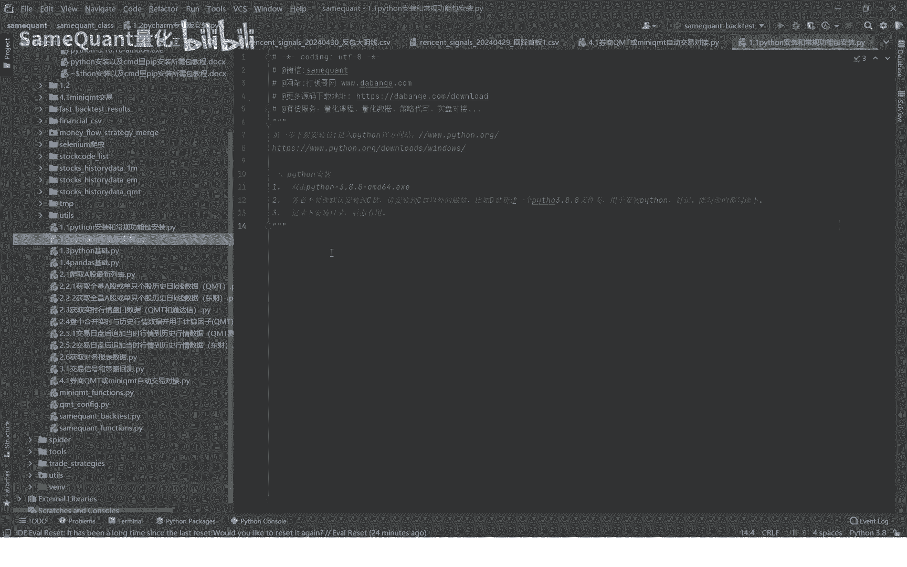

