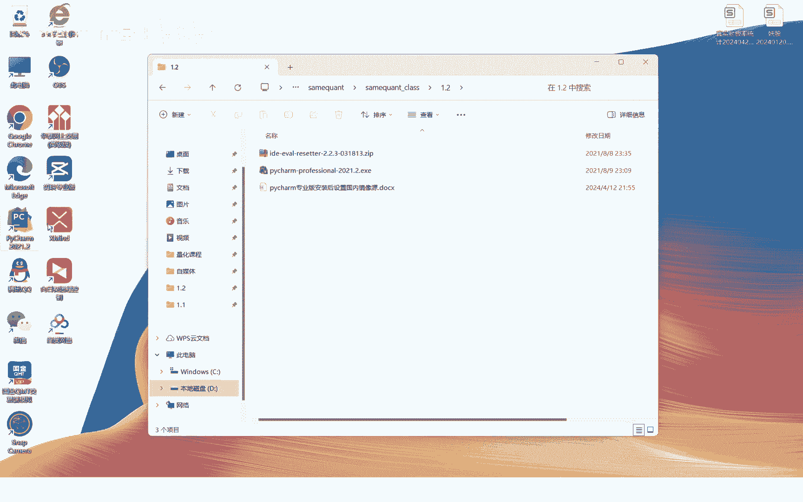
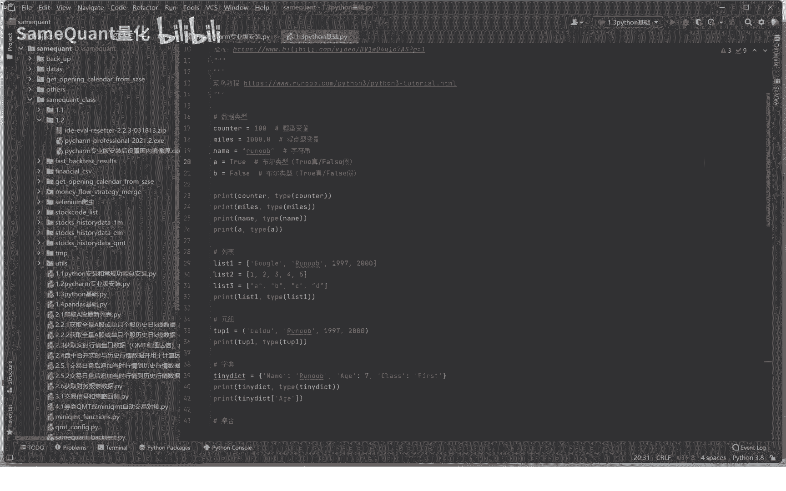
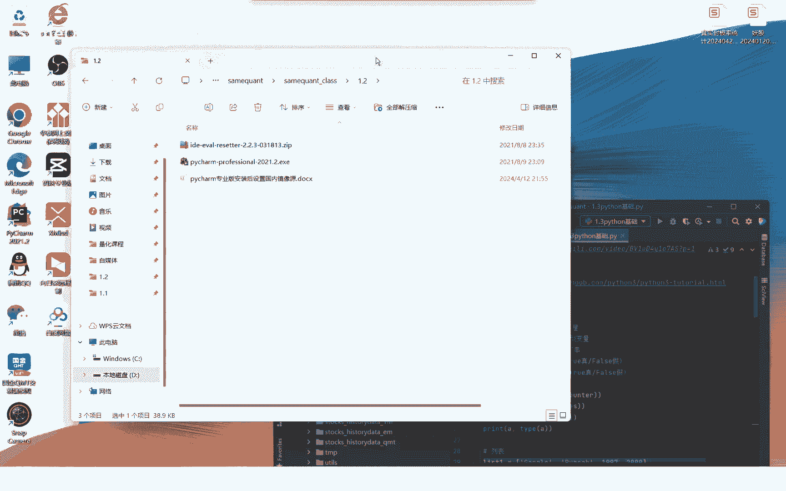
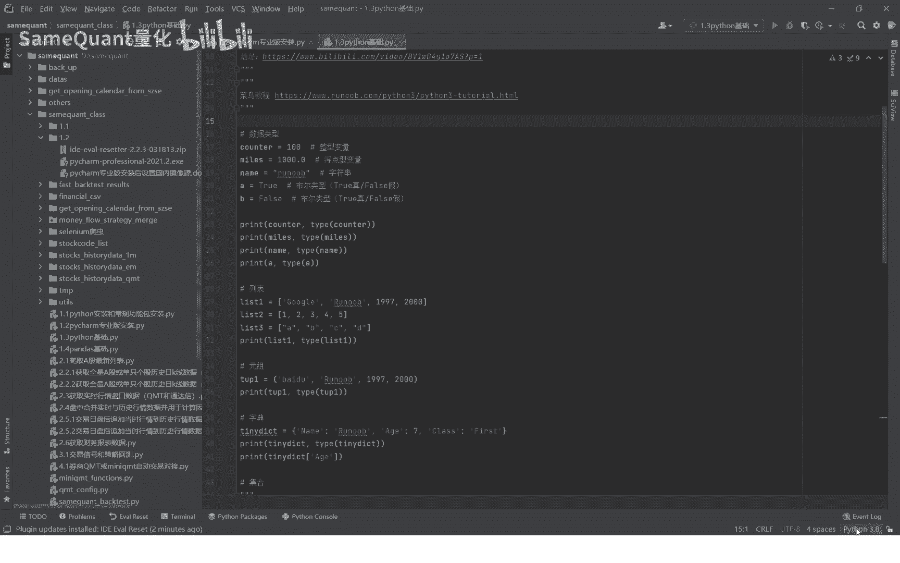
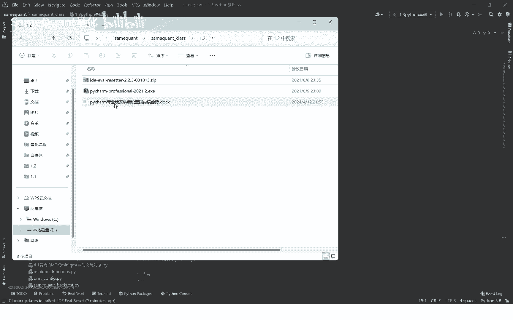
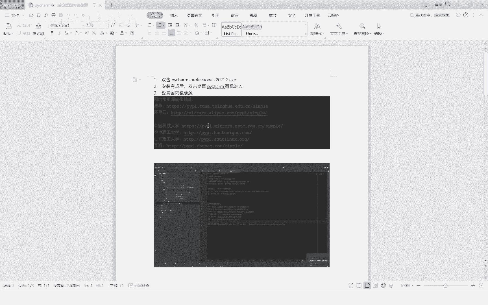
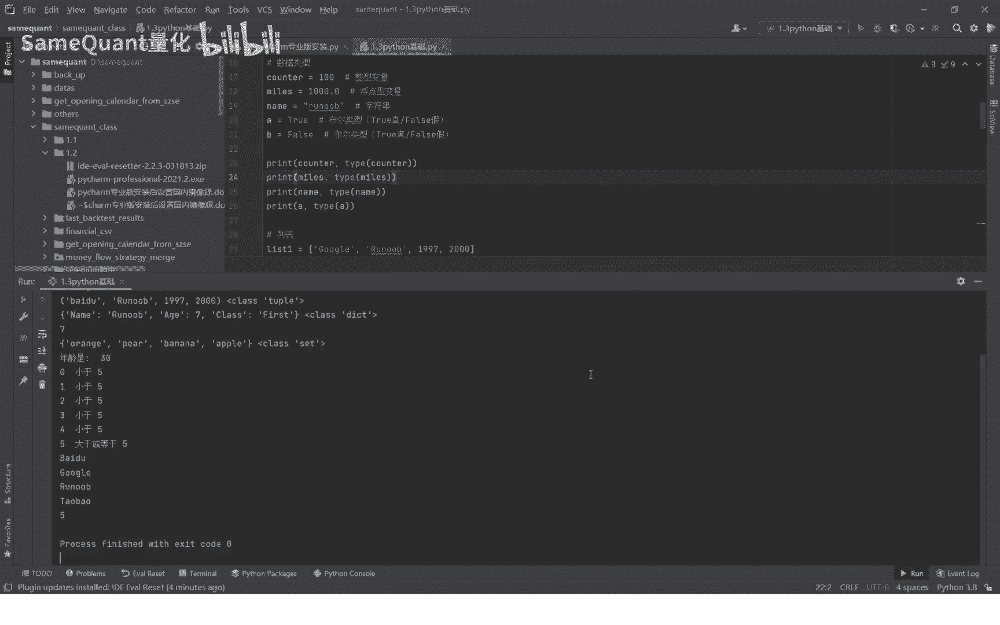
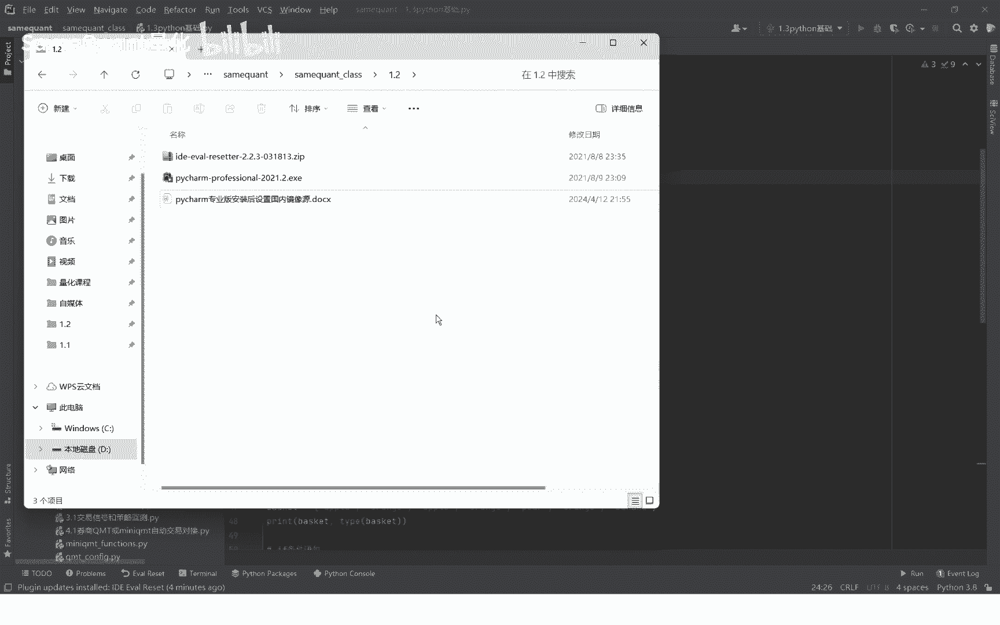

# Python量化入门：1.2：PyCharm专业版安装与配置指南 🛠️

在本节课中，我们将学习如何安装PyCharm专业版编辑器，并配置其永久免费使用。同时，我们也会将PyCharm与本机的Python环境关联起来，并学习如何在PyCharm内部安装Python功能包。

---

## 安装PyCharm专业版



课程资料包中准备了PyCharm专业版的安装包。必须使用此2021版的安装包。资料包中还有一个以`ide`开头的ZIP压缩文件，这是一个能让PyCharm免费使用的插件。安装此插件后，每次重启PyCharm程序，其使用期限会自动延期一个月。

以下是安装步骤：
1.  双击`EXE`程序文件，开始安装PyCharm。
2.  按照电脑提示完成安装。安装完成后，桌面会出现PyCharm图标。
3.  双击桌面图标启动软件。启动时会有提示，选择不输入许可证，直接进入。





## 安装免费使用插件

上一节我们完成了PyCharm的基础安装，本节中我们来看看如何安装免费插件以激活专业版功能。

启动PyCharm后，将资料包中的`ide`开头的ZIP文件直接用鼠标拖拽到PyCharm的窗口内。

拖拽后，软件会提示安装此插件。选择“立即重启”以完成安装。

重启完成后，插件即安装成功。可以验证有效期：点击菜单栏的 `Help` -> `Register`，可以看到许可证有效期已更新至未来一个月（例如2024年6月6日）。

请确保勾选 `Auto reset before expiry` 选项。勾选后，每次重启PyCharm时，使用期限会自动向后延期，从而实现永久免费使用专业版功能。

## 关联本机Python解释器

插件安装好后，我们需要将PyCharm与本机已安装的Python程序关联起来，这样PyCharm才能调用Python来运行和调试代码。

关联步骤如下：
1.  点击PyCharm界面右下角的 `Interpreter Settings`。
2.  在弹出的窗口中，点击加号 `+` 来添加解释器。
3.  选择 `System Interpreter`。
4.  在系统路径中找到你本机安装的Python解释器（例如 `D:\Python38\python.exe`），选中并点击确定。



关联后，PyCharm就可以调用本机的Python程序了。如果添加了多个解释器，可以删除重复项以避免混淆。



## 配置国内镜像源并安装Python包



我们已经将PyCharm与Python环境关联，本节中我们来看看如何在PyCharm内部安装Python功能包。为了提高下载速度，需要先将包下载源设置为国内镜像。


PyCharm默认从国外的Python官方源下载包，速度较慢。设置为国内镜像源可以显著提升下载速度。

设置镜像源的步骤如下，资料包中的Word文档也有详细说明：
1.  点击PyCharm右下角的 `Interpreter Settings`。
2.  点击解释器列表右侧的齿轮图标，选择 `Manage Repositories`。
3.  在弹出的仓库管理窗口中，点击加号 `+`。
4.  将国内镜像源地址（例如清华源：`https://pypi.tuna.tsinghua.edu.cn/simple`）复制进去，点击确定。

配置好镜像源后，即可在PyCharm中安装Python包。

安装Python包的方法如下：
1.  点击PyCharm下方的 `Terminal` 标签页，打开终端。
2.  在终端中，使用 `pip install` 命令安装包。例如，安装pandas包的命令是：
    ```bash
    pip install pandas
    ```
3.  执行命令后，pip会从设置的国内镜像源下载并安装包。

安装完成后，就可以在PyCharm中编写并运行Python脚本了。在代码编辑区右键点击文件，选择 `Run` 即可运行程序。



---



本节课中我们一起学习了PyCharm专业版的安装、免费插件的配置、与本机Python解释器的关联，以及如何设置国内镜像源并安装Python包。完成这些步骤后，你就拥有了一个功能强大且可永久免费使用的Python集成开发环境。