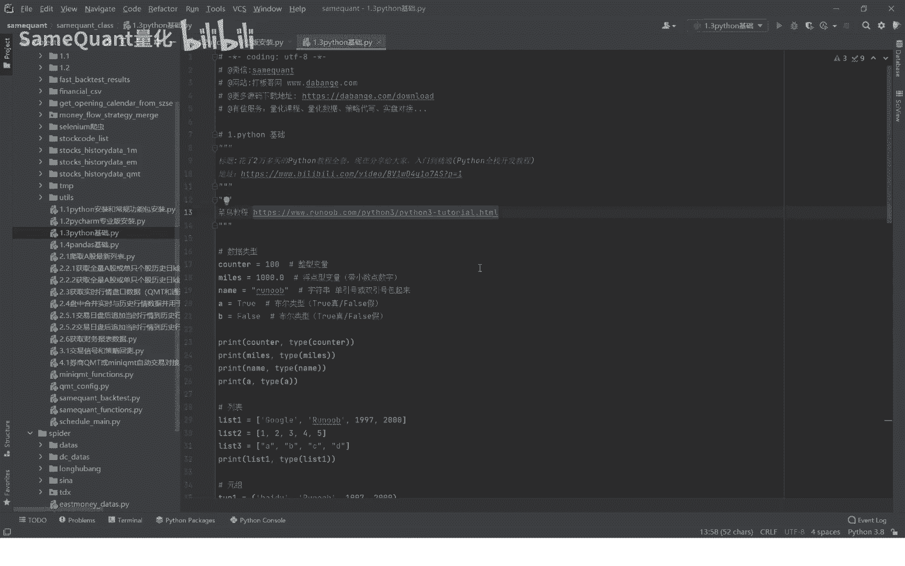
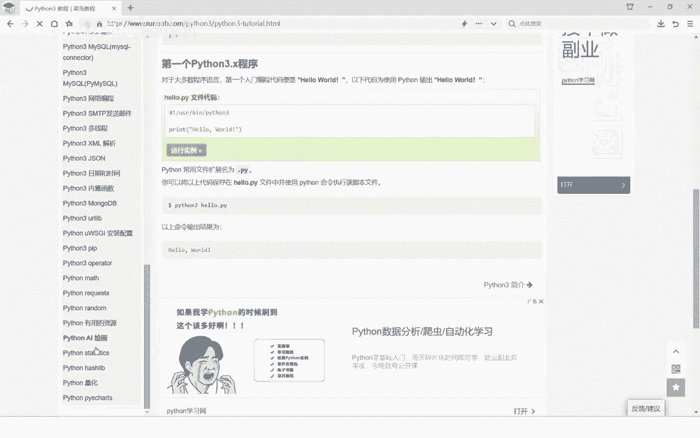
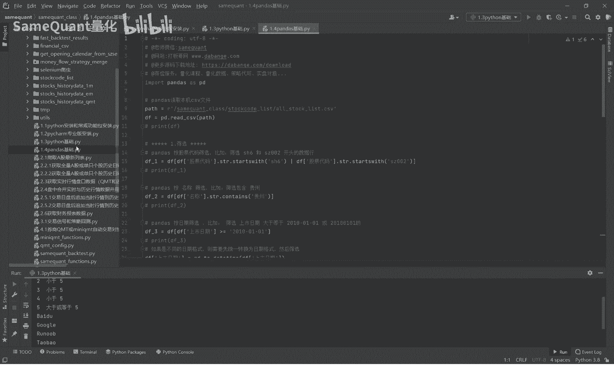

# Python量化基础入门：1.3：Python基础入门 🐍

在本节课中，我们将学习Python编程语言的基础知识。课程内容非常入门，旨在为零基础的同学提供一个快速上手的指引。掌握Python基础是进行后续量化分析和编程的关键第一步。



## 概述



Python基础的学习需要时间和实践，通常需要一个月左右的认真学习才能熟练掌握。本节课只是一个快速入门，更详细的学习资料将在后面提供。我们将从最基础的数据类型、条件语句、循环和函数定义开始讲解。

## 数据类型

在Python中，数据有不同的类型，这决定了数据可以进行的操作。理解数据类型是编程的基础。

以下是Python中几种基本的数据类型：

*   **整型 (int)**：表示整数。
    ```python
    weight = 100  # 变量 weight 是整型
    ```

*   **浮点型 (float)**：表示带小数点的数字。
    ```python
    price = 1000.01  # 变量 price 是浮点型
    ```

*   **字符串 (str)**：表示文本，用单引号或双引号包裹。
    ```python
    name = ‘ob’  # 变量 name 是字符串类型
    ```

*   **布尔型 (bool)**：表示真(True)或假(False)。
    ```python
    is_valid = True  # 变量 is_valid 是布尔型
    ```

我们可以使用 `print()` 函数输出变量的值，并使用 `type()` 函数查看变量的类型。

```python
print(weight, type(weight))  # 输出: 100 <class ‘int’>
```

上一节我们介绍了基本的数据类型，本节中我们来看看几种常用的复合数据类型。

## 复合数据类型

除了基本类型，Python还提供了用于存储多个数据的复合类型。

以下是几种重要的复合数据类型：

*   **列表 (list)**：用中括号 `[]` 表示，可以存放任意类型的数据，且元素可重复、可修改。
    ```python
    list1 = [100, ‘apple’, True, [1, 2]]  # 列表内可以混合不同类型，甚至可以嵌套列表
    ```

*   **元组 (tuple)**：用圆括号 `()` 表示，与列表类似，但创建后其元素**不可修改**。
    ```python
    tuple1 = (200, ‘banana’, 200)  # 元组允许元素重复
    ```

*   **字典 (dict)**：用大括号 `{}` 表示，存储“键-值”对。通过“键”可以快速找到对应的“值”。
    ```python
    student = {‘name’: ‘rainbow’, ‘age’: 7, ‘class’: 2}
    print(student[‘age’])  # 输出: 7
    ```

*   **集合 (set)**：也用大括号 `{}` 表示，但内部元素是单个值，不是键值对。集合的**元素不会重复**，会自动去重。
    ```python
    fruit_set = {‘apple’, ‘orange’, ‘banana’, ‘apple’, ‘orange’}
    print(fruit_set)  # 输出: {‘banana’, ‘orange’, ‘apple’} (顺序可能不同，且已去重)
    ```

了解了如何存储数据后，接下来我们学习如何让程序根据不同的情况做出判断。

## 条件语句 (if-elif-else)

程序需要根据条件执行不同的代码块，这时就要用到条件语句。

`if-elif-else` 结构让程序能够进行分支判断。程序会从上到下检查条件，一旦某个条件为真(True)，就执行对应的代码块，然后跳过其余部分。

```python
age = 30
if age < 12:
    print(‘你是个儿童’)
elif age <= 16:  # 相当于 age > 12 and age <= 16
    print(‘你是未成年’)
elif age <= 28:  # 相当于 age > 16 and age <= 28
    print(‘你是青年’)
else:  # 相当于 age > 28
    print(f‘你的年龄是{age}’)
# 当 age=30 时，输出: 你的年龄是30
```

条件语句让代码有了判断力，而循环语句则能让代码重复执行，处理大量数据。

## 循环语句

循环用于重复执行某段代码，直到满足特定条件。Python中常用的有 `while` 循环和 `for` 循环。

*   **while 循环**：当给定条件为真时，重复执行代码块。
    ```python
    count = 0
    while count < 5:
        print(count)
        count = count + 1  # 每次循环 count 增加 1
    else:
        print(‘循环结束’)
    # 输出: 0 1 2 3 4 循环结束
    ```

*   **for 循环**：常用于遍历一个序列（如列表、元组、字符串等）中的每个元素。
    ```python
    sizes = [‘S’, ‘M’, ‘L’, ‘XL’]
    for s in sizes:  # 变量 s 会依次代表列表中的每个元素
        print(s)
    # 输出: S M L XL
    ```

掌握了条件和循环，我们就可以组织复杂的逻辑了。最后，我们将这些逻辑封装成可重复使用的功能块，这就是函数。

## 函数定义

函数是一段组织好的、可重复使用的代码，用于执行一个特定的任务。使用 `def` 关键字来定义函数。

我们可以自定义函数来实现特定功能，例如比较两个数的大小并返回较大的那个。

```python
def my_max(x1, x2):  # 定义函数，接收两个参数 x1, x2
    if x1 > x2:
        return x1    # 使用 return 返回结果
    else:
        return x2

a = 4
b = 6
c = my_max(a, b)     # 调用函数，将 a, b 的值传递给 x1, x2
print(c)             # 输出: 6

# 另一种清晰的调用方式，指明参数名
c = my_max(x1=a, x2=b)
```

## 总结

本节课我们一起学习了Python编程的基础核心概念。我们首先认识了**整型、浮点型、字符串和布尔型**这些基本数据类型，以及**列表、元组、字典和集合**这些复合数据类型。接着，我们学习了如何使用 **`if-elif-else`** 结构让程序根据不同条件执行不同分支，以及如何使用 **`while` 和 `for` 循环**来重复执行代码。最后，我们了解了如何用 **`def` 关键字定义函数**，将代码封装成可重复调用的模块。

这些是Python编程的基石。要牢固掌握这些知识，强烈建议你结合以下两个优质资源进行系统学习：
1.  **网页教程**：[菜鸟教程 - Python3](https://www.runoob.com/python3/python3-tutorial.html)
2.  **视频教程**：B站上播放量很高的系统教学视频

建议投入一个月左右的时间认真学习和练习，打好Python基础，这样在学习后续的量化交易课程（如下一节要讲的Pandas数据分析库）时才会更加顺畅。如果在学习过程中遇到任何问题，可以随时在交流群中提问。



---
**下节预告**：下一节我们将讲解 **Pandas**，这是在量化交易中用于数据处理和分析的最重要的库。