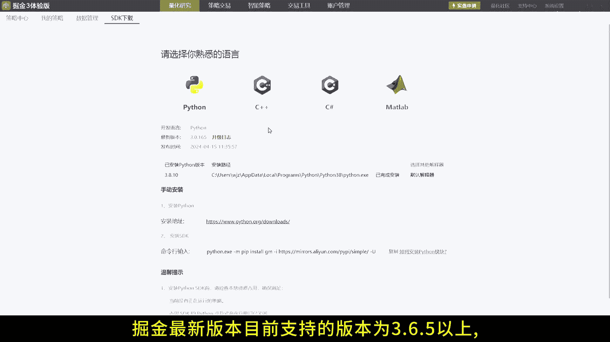
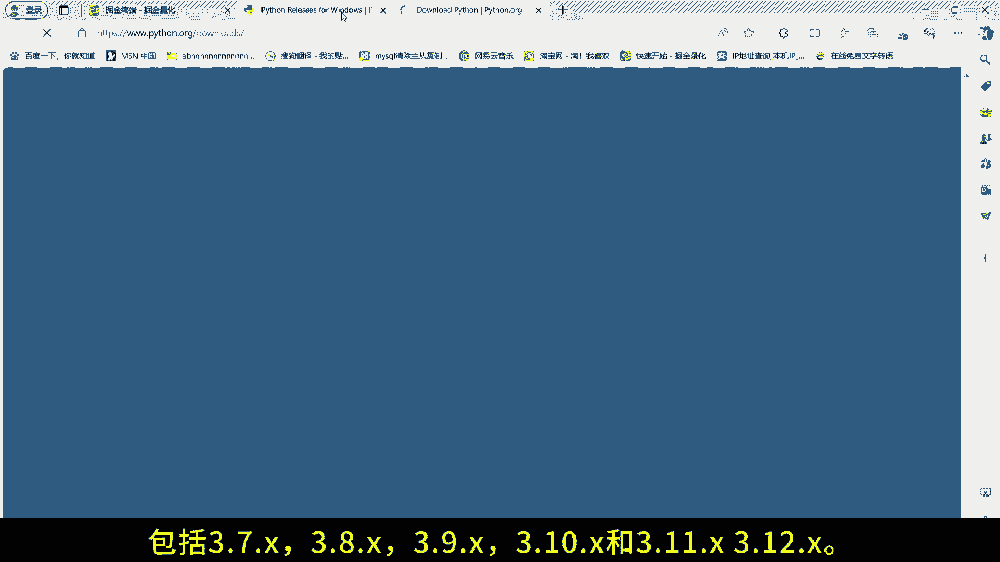
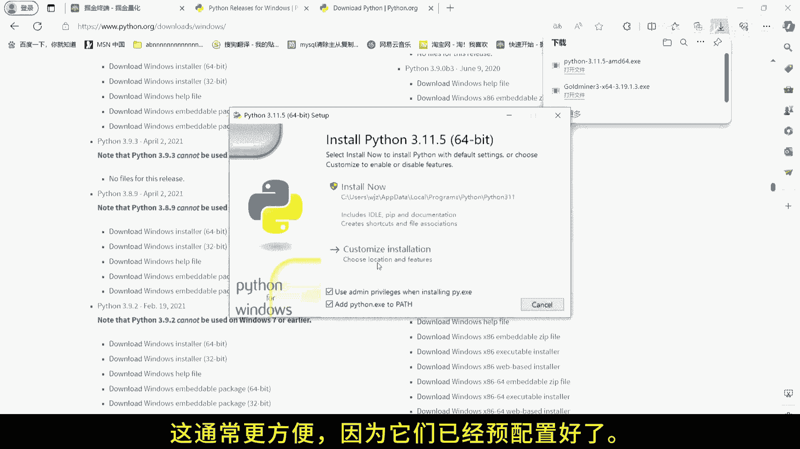
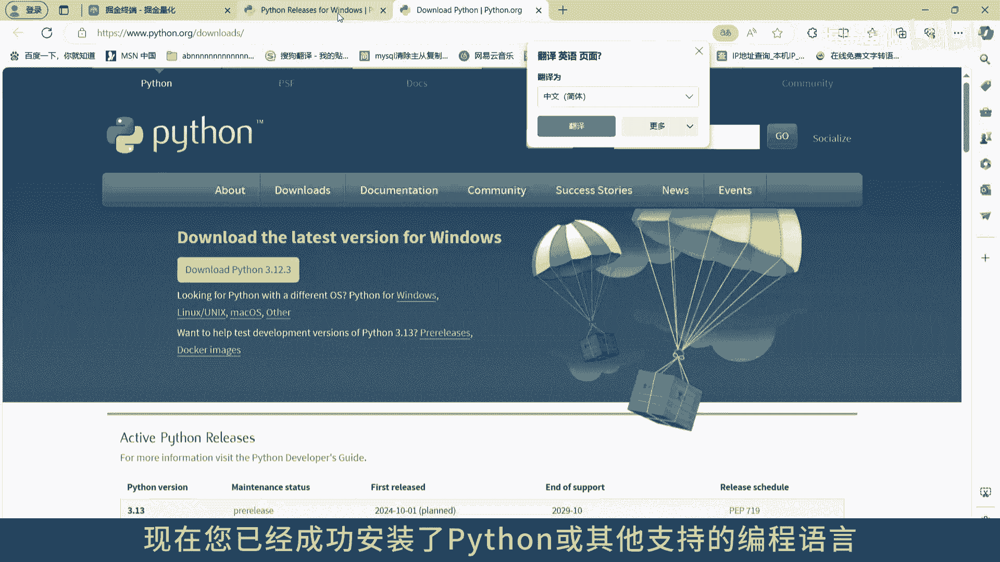
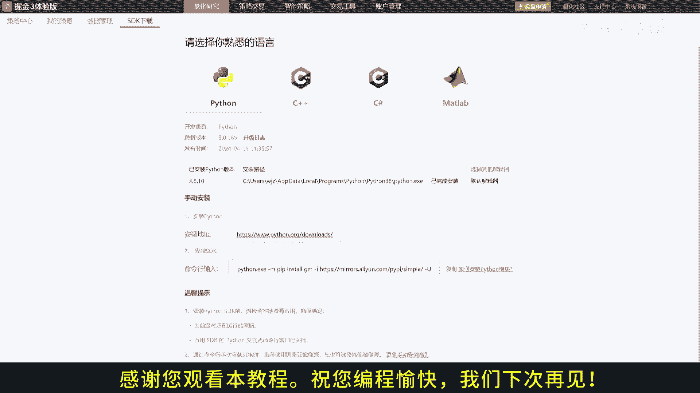

# 掘金量化终端：1.3：Python安装指南 🐍

在本节课中，我们将学习如何在掘金量化平台上安装Python环境。这是开始使用掘金进行量化编程的第一步。如果你已经安装了Python、C++、C#或MATLAB，可以跳过此步骤。

## 检查Python版本要求



上一节我们介绍了安装前的准备，本节中我们来看看掘金平台对Python版本的具体要求。

掘金量化终端目前支持的Python版本为**3.6.5**及以上，具体包括：
*   3.7.x
*   3.8.x
*   3.9.x
*   3.10.x
*   3.11.x



> **注意**：部分券商版本可能不支持最新的Python 3.12.x版本，如有疑问请咨询您的券商客户经理或技术支持。

## 下载与安装Python

了解了版本要求后，接下来我们进行实际的下载与安装操作。

1.  **访问官方网站**：前往Python官方网站，下载与掘金平台兼容的版本。
2.  **运行安装程序**：运行下载的安装程序。在安装过程中，**务必勾选“Add Python to PATH”选项**。这能确保你可以在系统的任何目录下通过命令行调用Python。
3.  **使用资料包（可选）**：如果你拥有我们提供的资料包，也可以直接使用其中预配置好的Python安装包，这通常更为便捷。

安装完成后，你可以在命令行或终端中输入以下命令来验证安装是否成功并查看版本：

```bash
python --version
```



## 开始你的项目



现在，你已经成功安装了Python或其他掘金支持的编程语言，可以在掘金量化平台上开始创建和运行你的量化交易项目了。

如果在安装或后续使用中遇到任何问题，请查阅官方文档或寻求相关帮助。



---

**本节课总结**：我们一起学习了掘金量化平台对Python的版本要求、从官网下载安装Python的正确步骤（关键点是勾选添加PATH），以及如何验证安装。完成这些后，你就为后续的量化编程打下了基础。祝你编程愉快！