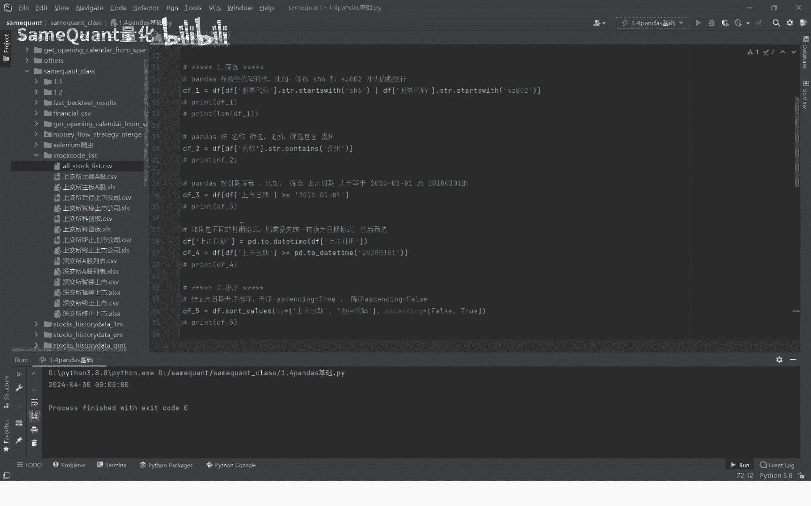

# Python量化交易：1.4：pandas基础入门 🐼

在本节课中，我们将学习Python量化交易中至关重要的`pandas`库的基础功能。我们将从读取数据开始，逐步掌握数据筛选、排序、分组统计以及时间戳转换等核心操作。

## 读取CSV文件

首先，我们学习如何使用`pandas`读取本地的CSV文件。我们将读取一个包含A股股票列表的文件。

以下是具体步骤：
1.  复制CSV文件在本地的完整路径。
2.  使用`pandas.read_csv()`函数读取文件。

```python
import pandas as pd

# 替换为你的CSV文件路径
file_path = '你的CSV文件完整路径'
df = pd.read_csv(file_path)
print(df.head())
```
运行代码后，你将看到一个包含股票代码、名称、上市日期和状态等信息的表格。`NaN`值通常表示该股票目前正常交易，未退市或暂停。

## 数据筛选

上一节我们介绍了如何读取数据，本节中我们来看看如何根据特定条件筛选数据。

### 按股票代码筛选

我们可以筛选出特定交易所或代码开头的股票。例如，筛选上交所（代码以`6`开头）或深交所`002`开头的股票。

```python
# 筛选上海6开头或深圳002开头的股票
filtered_df = df[df['股票代码'].str.startswith('6') | df['股票代码'].str.startswith('002')]
print(filtered_df.head())
print(f"筛选后数据量: {len(filtered_df)}")
print(f"原始数据量: {len(df)}")
```
此操作会过滤掉不符合条件的行，仅保留目标数据。

### 按股票名称筛选

除了代码，我们也可以根据股票名称包含的关键词进行筛选。

以下是按名称筛选的示例：
*   筛选名称中包含“贵州”的股票。

```python
# 筛选名称包含“贵州”的股票
guizhou_stocks = df[df['名称'].str.contains('贵州')]
print(guizhou_stocks)
```

### 按日期筛选

按日期筛选时，常遇到格式不统一的问题。为确保正确筛选，需要先将日期列和筛选条件都转换为统一的日期格式。

以下是操作步骤：
1.  将`上市日期`列转换为`datetime`格式。
2.  将筛选条件（如`'2010-01-01'`）也转换为`datetime`格式。
3.  执行筛选。

```python
# 确保日期列为datetime格式
df['上市日期'] = pd.to_datetime(df['上市日期'])

# 筛选2010年1月1日之后上市的股票
start_date = pd.to_datetime('2010-01-01')
recent_stocks = df[df['上市日期'] > start_date]
print(recent_stocks.head())

# 可以尝试筛选2020年之后的股票
start_date_2020 = pd.to_datetime('2020-01-01')
recent_stocks_2020 = df[df['上市日期'] > start_date_2020]
print(recent_stocks_2020.head())
```
如果筛选报错，建议分别检查数据列和筛选条件的类型（使用`type()`函数），确保格式一致。

## 数据排序

数据筛选后，顺序可能是乱的。接下来我们学习如何对数据进行排序。

`pandas`使用`sort_values()`方法进行排序。我们可以按单个或多个字段进行升序或降序排列。

以下是排序示例：
*   **单列升序**：按`上市日期`从早到晚排列。
*   **多列排序**：先按`上市日期`降序排列，日期相同的再按`股票代码`升序排列。

```python
# 按上市日期升序排列
df_sorted_asc = df.sort_values(by='上市日期', ascending=True)
print(df_sorted_asc[['股票代码', '名称', '上市日期']].head())

# 按上市日期降序，再按股票代码升序排列
df_sorted_multi = df.sort_values(by=['上市日期', '股票代码'], ascending=[False, True])
print(df_sorted_multi[['股票代码', '名称', '上市日期']].head())
```

## 重置索引

排序或筛选操作会打乱数据框原有的索引。为了使索引恢复有序，我们需要重置索引。

使用`reset_index()`方法可以重置索引。参数`drop=True`表示丢弃旧的索引列，`inplace=True`表示直接在原数据框上修改。

```python
# 重置索引，丢弃旧索引
df.reset_index(drop=True, inplace=True)
print(df.head())
print(f"最后一行索引为: {df.index[-1]}")
```
重置索引后，索引将从0开始连续编号，便于后续的数据定位和操作。

## 分组统计

在数据分析中，分组统计是常见需求。例如，统计每年上市公司的数量。

操作分为两步：
1.  从`上市日期`中提取年份，创建新列`上市年份`。
2.  按`上市年份`分组，并统计每组的股票数量。

```python
# 1. 提取年份信息
df['上市年份'] = df['上市日期'].dt.strftime('%Y')

# 2. 按年份分组并统计数量
yearly_count = df.groupby('上市年份')['股票代码'].size()
print(yearly_count.tail())  # 查看最近几年的数据
```
`groupby()`功能非常强大，本节课仅介绍了基础用法。

## 时间戳转换

量化交易中经常需要处理时间戳数据。我们将学习如何将数值型时间戳转换为可读的日期时间格式。

转换使用`pd.to_datetime()`函数。**关键点**：如果原始时间戳是以秒为单位（10位数字），且需要转换为北京时间，通常需要加上8小时（`unit='s'`）。如果时间戳包含毫秒（13位数字），则单位应设为`unit='ms'`。

以下是转换示例：
```python
# 示例：10位时间戳（秒），转换为北京时间
timestamp_seconds = 1714320000  # 示例时间戳
beijing_time = pd.to_datetime(timestamp_seconds, unit='s') + pd.Timedelta(hours=8)
print(f"北京时间: {beijing_time}")

# 示例：13位时间戳（毫秒），转换为北京时间
timestamp_milliseconds = 1714320000000  # 示例时间戳
beijing_time_ms = pd.to_datetime(timestamp_milliseconds, unit='ms') + pd.Timedelta(hours=8)
print(f"北京时间(毫秒): {beijing_time_ms}")
```
**特别注意**：务必根据时间戳的长度（10位或13位）正确设置`unit`参数（`'s'`或`'ms'`），并记得为北京时间添加8小时时差，否则会导致时间错误。



## 总结


本节课中我们一起学习了`pandas`在量化交易中的几个基础且重要的功能：读取CSV文件、按多种条件筛选数据、对数据进行排序、重置索引、进行分组统计以及正确转换时间戳。掌握这些操作是进行后续数据分析和策略构建的基石。`pandas`的功能远不止于此，在后续课程中我们会深入介绍更多高级功能。