# 掘金量化终端技术支持：1.5：如何获取帮助 📞

在本节课中，我们将学习在使用掘金量化终端时，如何获取全面的技术支持以解决安装或使用中遇到的问题。

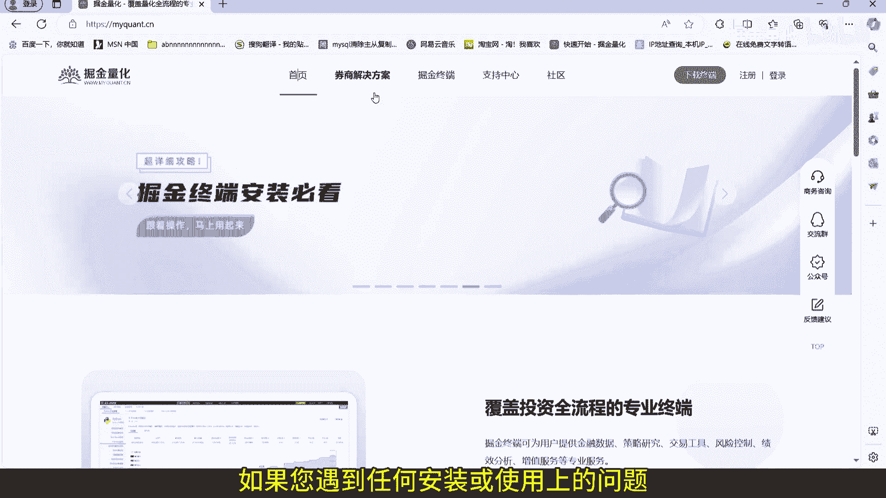

## 概述

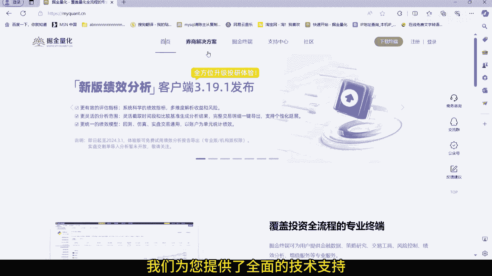

掘金量化提供了多种渠道的技术支持，确保用户在遇到问题时能够及时获得帮助。本节将详细介绍这些渠道及其使用方法。

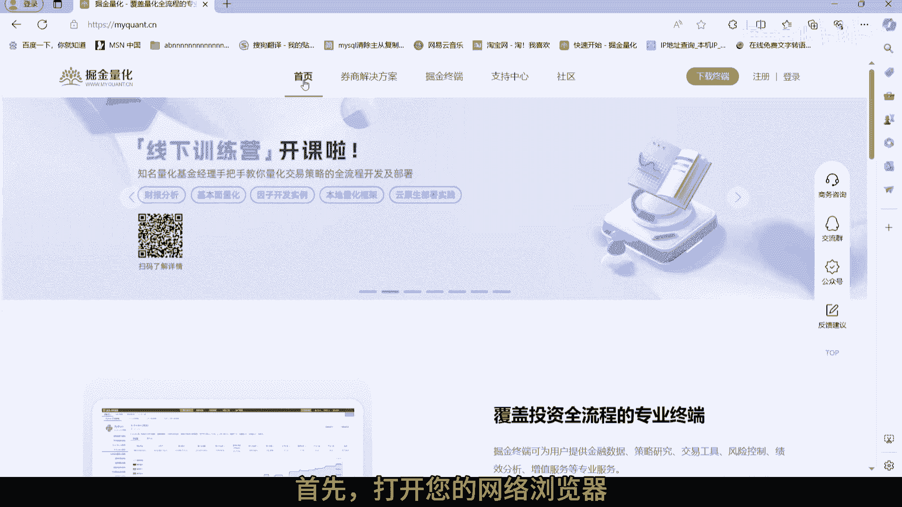

## 技术支持渠道

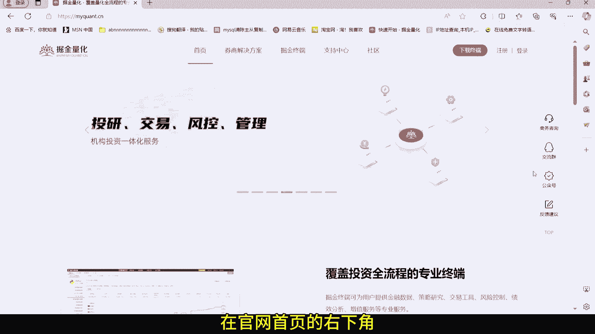

上一节我们介绍了掘金量化终端的基本情况，本节中我们来看看具体的支持渠道。以下是获取帮助的几种主要方式。

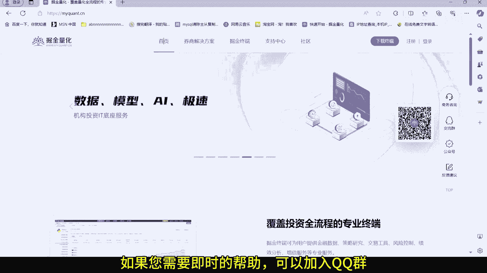

### 1. 加入官方QQ群

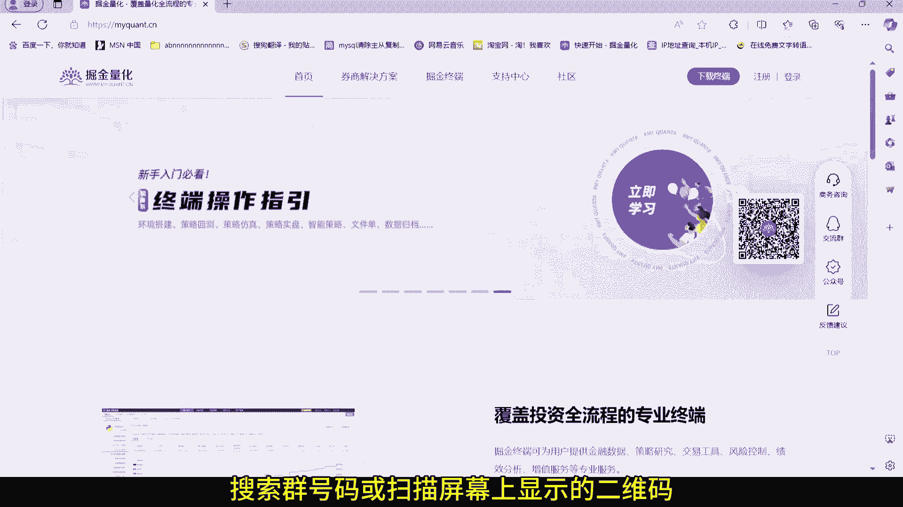

如果您需要及时、直接的帮助，可以加入掘金量化的官方QQ群。

*   打开您的网络浏览器。
*   访问掘金量化的官方网站。
*   在官网首页的右下角，您可以找到QQ群信息。
*   打开您的QQ应用，搜索群号码或扫描屏幕上显示的二维码。
*   申请加入我们的技术支持群。

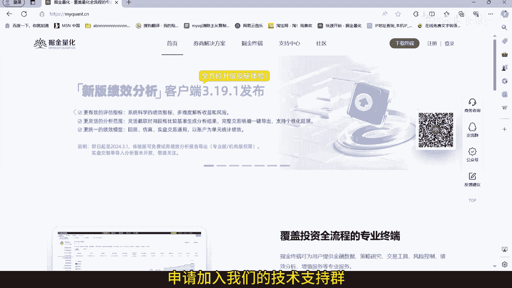

### 2. 提交商务咨询

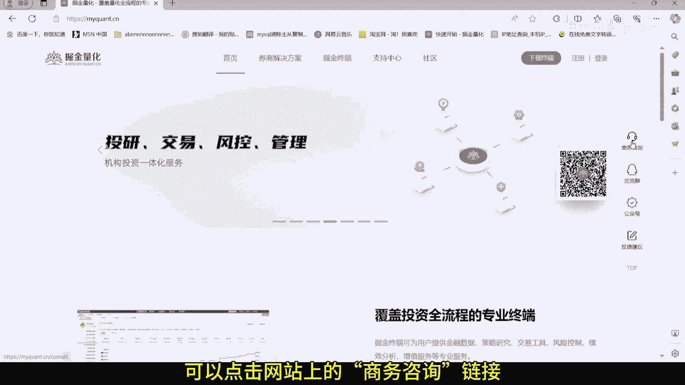

如果您需要更专业的帮助或商务合作，可以通过以下方式联系我们的商务团队。

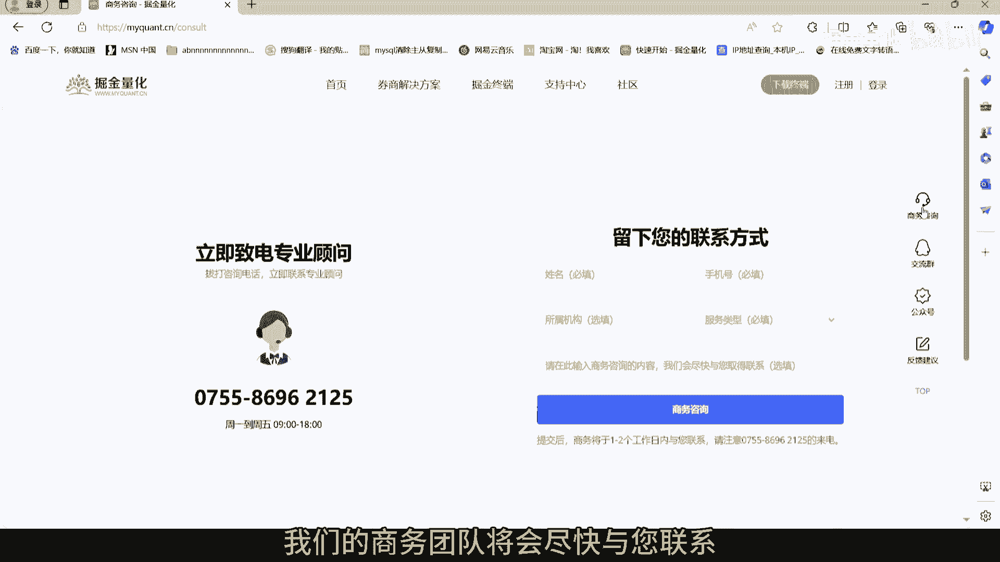

*   点击网站上的“商务咨询”链接。
*   填写您的联系信息和遇到的问题。
*   我们的商务团队将会尽快与您联系。

### 3. 访问社区论坛

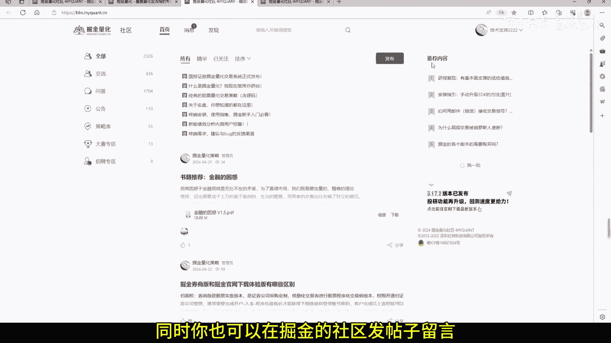

您也可以在掘金的社区论坛中寻求帮助或交流经验。

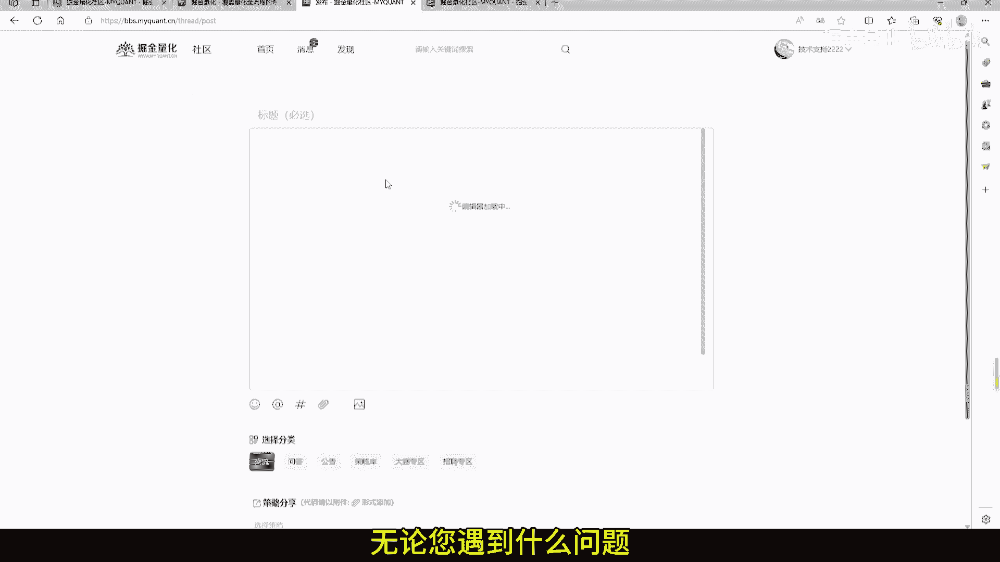

*   在掘金的社区发帖子留言。
*   与量化行业的专家们交流。

## 总结

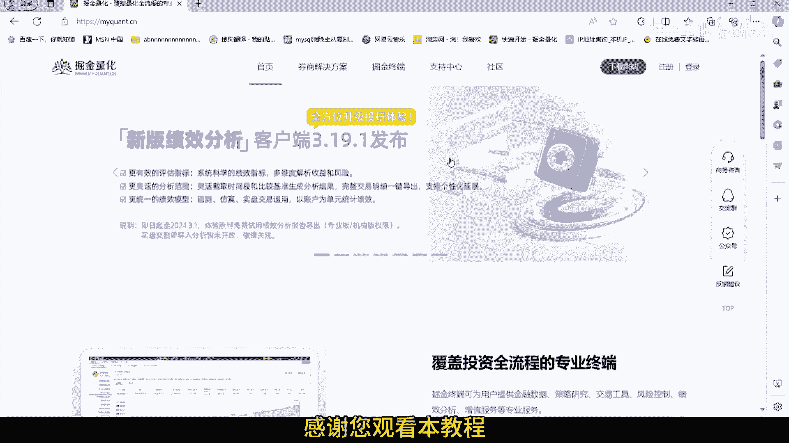

本节课中我们一起学习了获取掘金量化终端技术支持的三种主要途径：加入官方QQ群、提交商务咨询以及访问社区论坛。无论您遇到什么问题，我们的技术支持团队都会在这里帮助您。请随时联系我们，让我们共同解决您的问题。