# 加密小白书：1-CCXT基础使用 - P1

在本节课中，我们将要学习如何使用CCXT库来获取和整理加密货币的交易数据。CCXT是一个强大的工具，它为我们提供了一个统一的接口，可以方便地与全球众多交易所进行交互。

## 概述

CCXT是一个非常流行的加密货币交易所API封装库。它支持众多交易所，例如Kraken、火币、币安等。通过CCXT，我们可以获取交易所的市场数据、订单簿，并执行交易等操作。本节课程将重点介绍如何创建交易所对象、获取K线数据以及对数据进行初步整理。

## 创建交易所对象

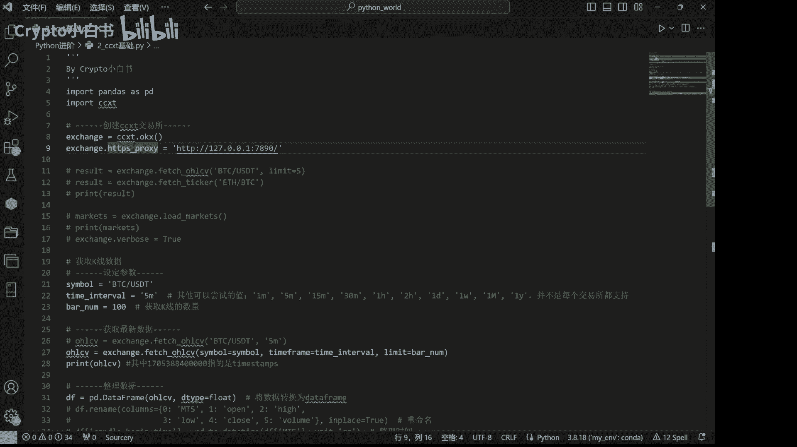

上一节我们介绍了CCXT的基本概念，本节中我们来看看如何开始使用它。首先，我们需要创建一个CCXT交易所对象。

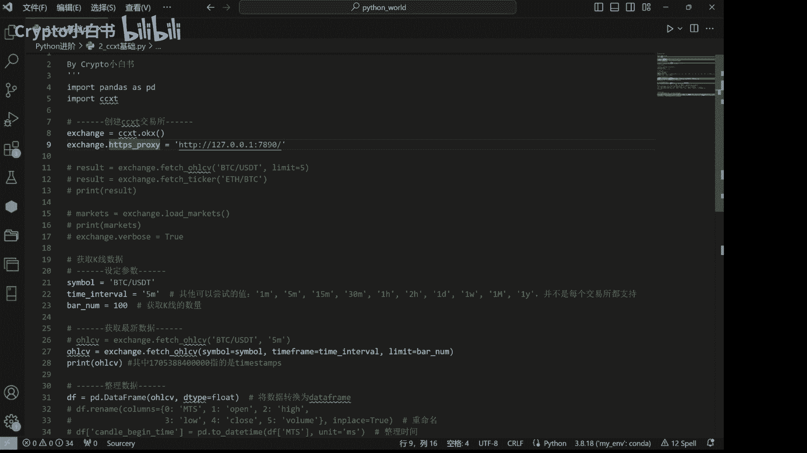

以下是创建Kraken交易所对象的代码示例：

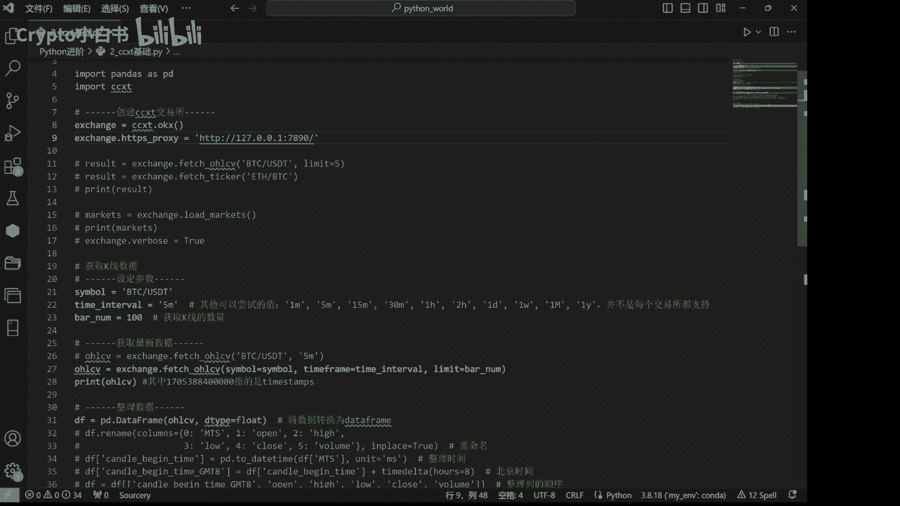

```python
import ccxt

exchange = ccxt.kraken({
    'proxies': {
        'http': 'http://your-proxy-server:port',
        'https': 'https://your-proxy-server:port',
    }
})
```

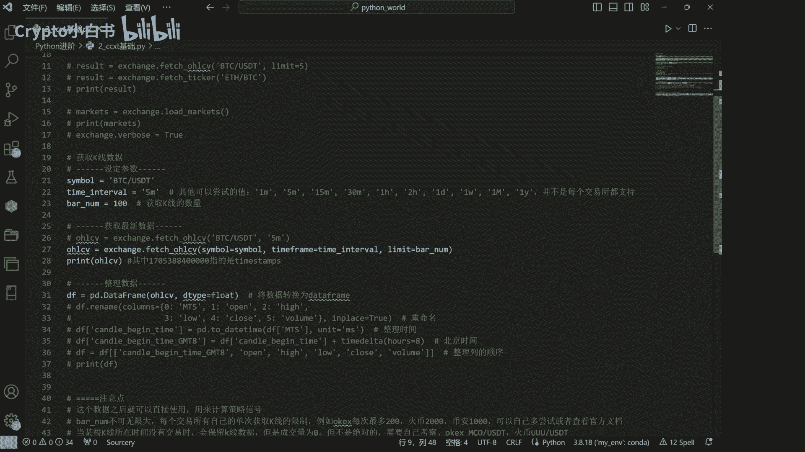

需要注意的是，这里我们设置了一个代理服务器，以便在国内的网络环境下进行访问。

## 获取市场数据

创建好交易所对象后，我们就可以通过CCXT提供的方法来获取市场数据了。例如，我们可以获取指定交易对和时间间隔的K线数据。

以下是获取K线数据的代码示例：

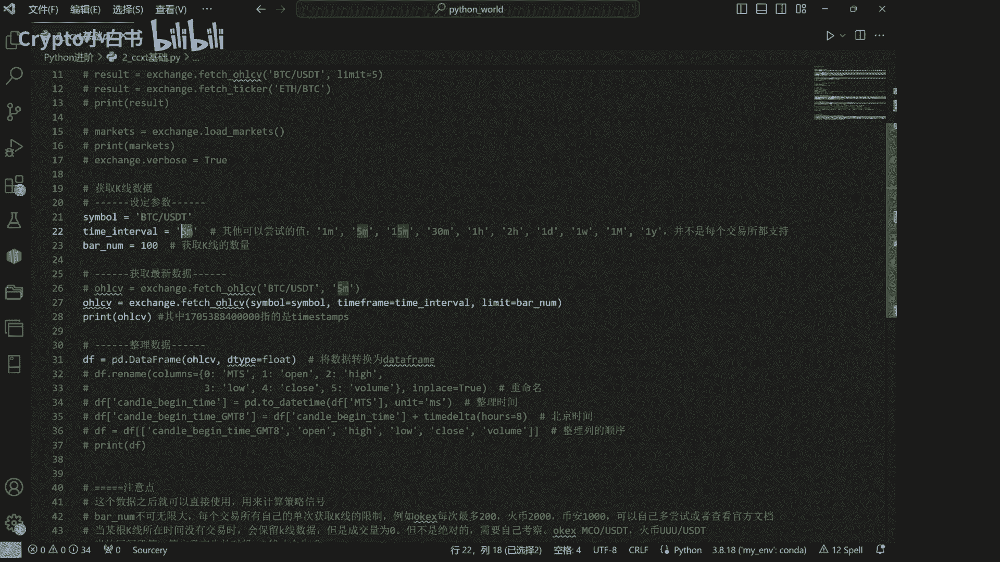

```python
symbol = 'BTC/USD'
timeframe = '5m'
limit = 10

ohlcv = exchange.fetch_ohlcv(symbol, timeframe, limit)
print(ohlcv)
```

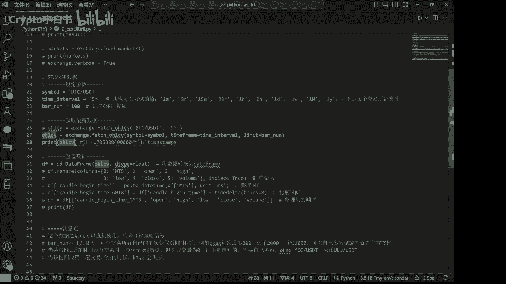

在这段代码中，我们设定了几个关键参数：
*   **`symbol`**：指我们想要获取的交易对，这里我们获取的是`BTC/USD`。
*   **`timeframe`**：指K线数据的时间间隔类型，例如`5m`（5分钟）、`1h`（1小时）等。
*   **`limit`**：设置获取K线的数量。

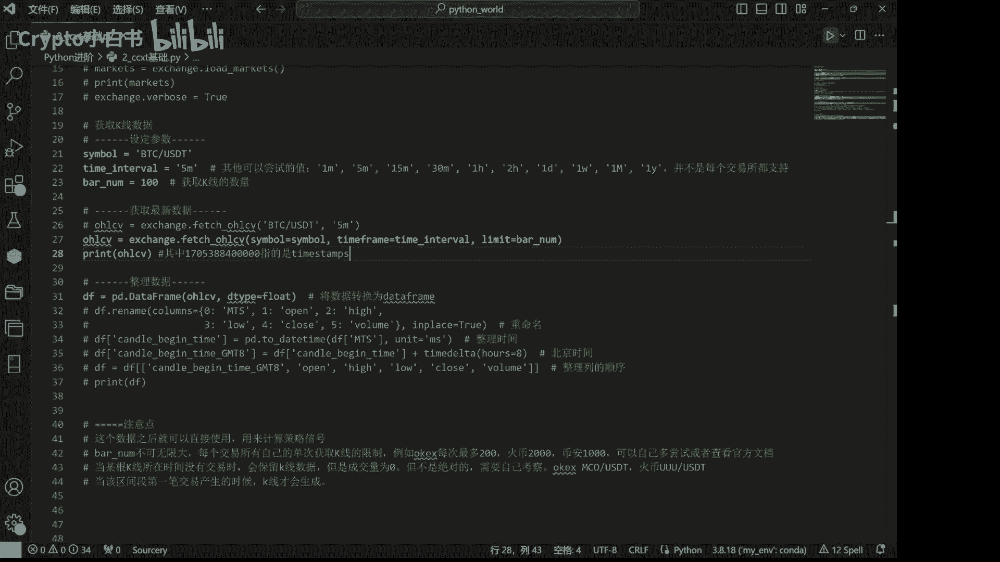

运行代码后，我们可以获取到最新的K线数据。这些数据可以用于后续的策略分析和信号计算。

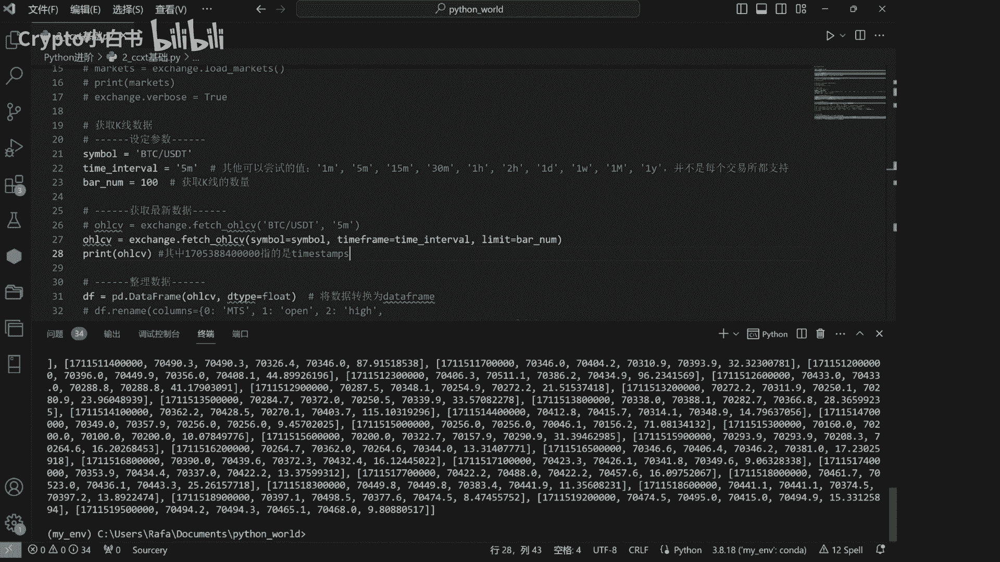

## 整理数据

我们获取到的原始数据可能看起来不够直观。为了便于分析，我们可以使用Pandas库对数据进行整理。

以下是将数据转换为Pandas DataFrame并进行整理的步骤：

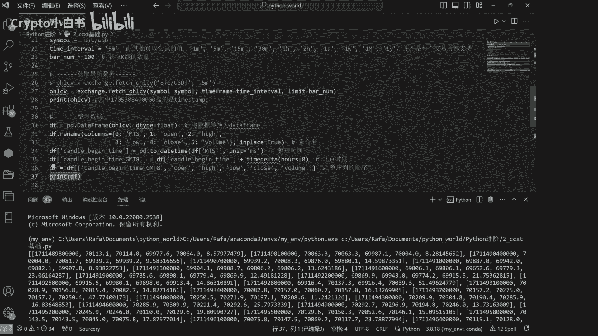

```python
import pandas as pd
from datetime import timedelta

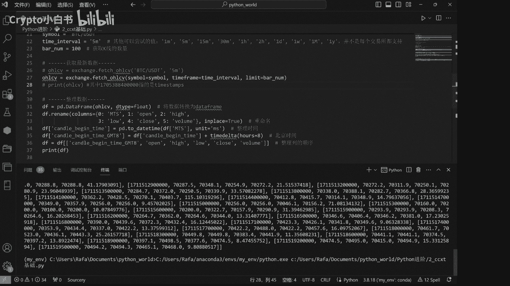

# 将数据转换为DataFrame
df = pd.DataFrame(ohlcv, columns=['timestamp', 'open', 'high', 'low', 'close', 'volume'])

# 整理时间列，转换为北京时间 (GMT+8)
df['candle_begin_time_GMT8'] = pd.to_datetime(df['timestamp'], unit='ms') + timedelta(hours=8)

# 设置时间列为索引并删除原始的timestamp列
df.set_index('candle_begin_time_GMT8', inplace=True)
df.drop(columns=['timestamp'], inplace=True)

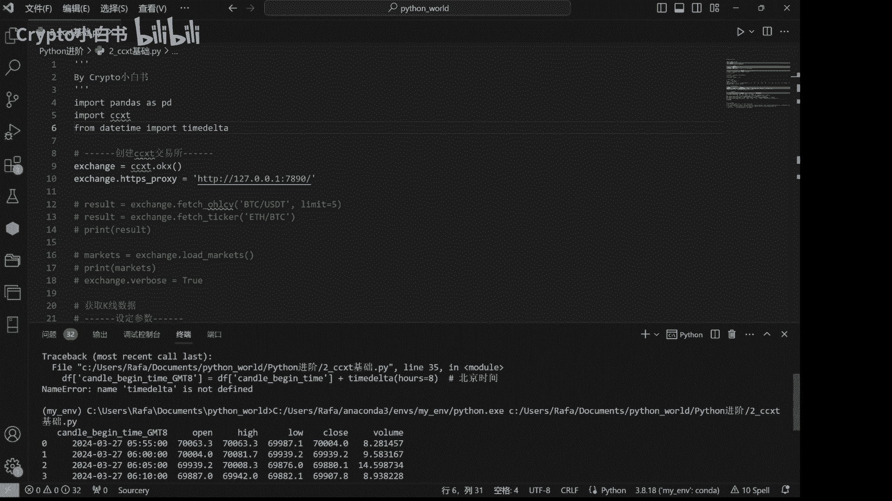

print(df)
```

运行整理后的代码，我们可以看到数据变得更加清晰。例如，`candle_begin_time_GMT8`列显示了每根K线开始的北京时间，后面则依次是开盘价、最高价、最低价、收盘价和成交量。

## 总结

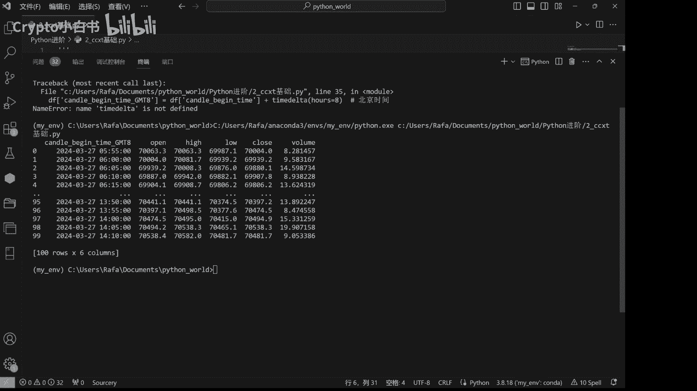

本节课中我们一起学习了CCXT库的基础使用。我们首先了解了CCXT是什么以及它的作用，然后实践了如何创建交易所对象、获取指定交易对的K线数据，最后使用Pandas对原始数据进行了整理，使其更易于阅读和分析。掌握这些基础操作是进行更高级量化交易策略开发的第一步。