# 期权希腊字母风险对冲理论与应用：10.8：平价公式套利策略的Python实现 🐍


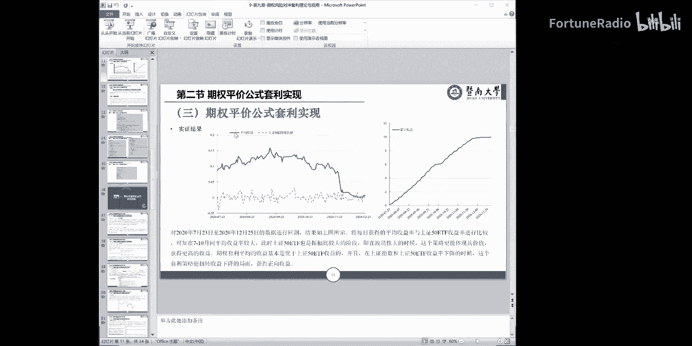

在本节课中，我们将学习如何利用期权平价公式进行套利，并使用Python程序实现这一策略。我们将从读取数据开始，逐步讲解套利逻辑的计算、收益的评估，并最终通过图表展示策略的绩效。

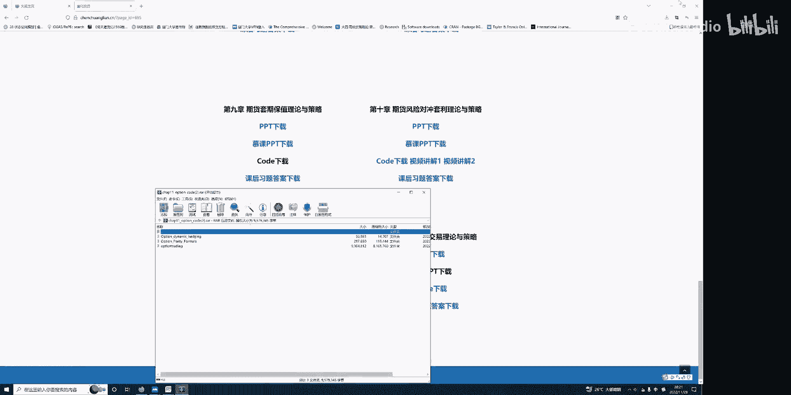

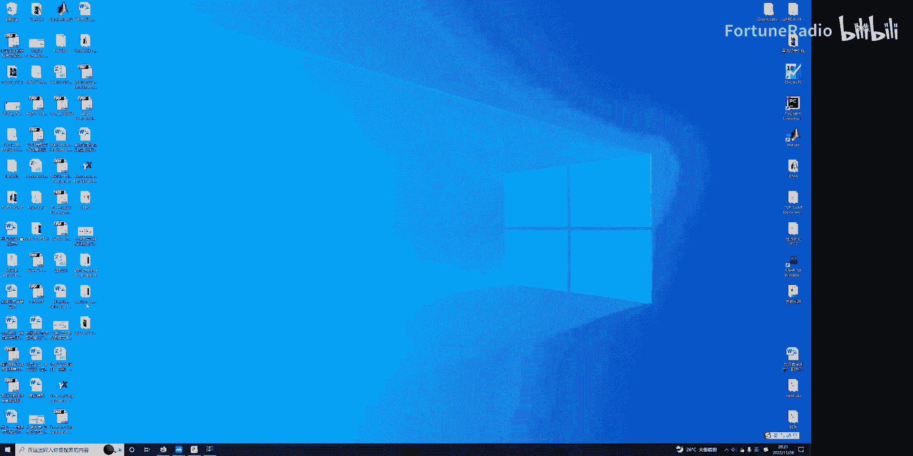

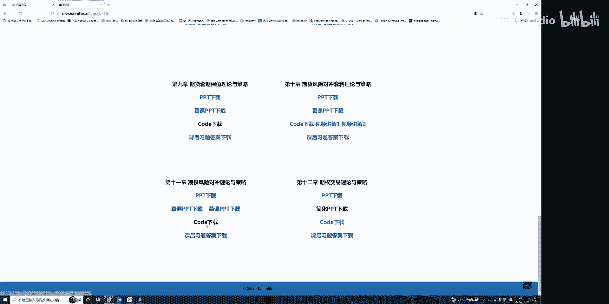

## 数据读取与准备

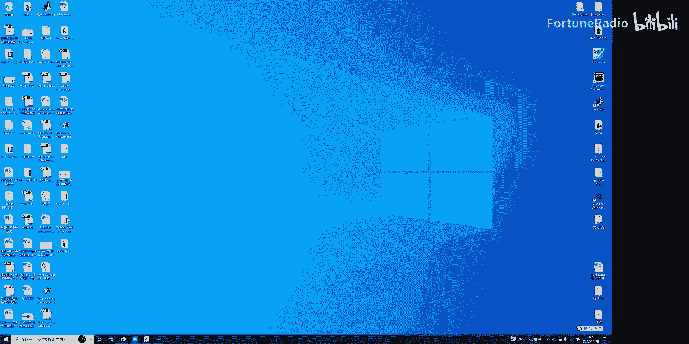

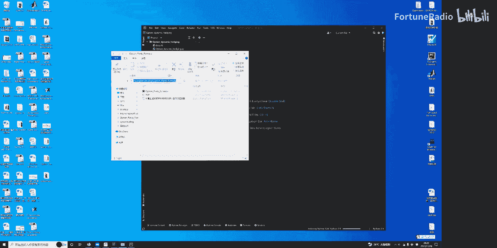

上一节我们介绍了期权平价公式的理论基础，本节中我们来看看如何用Python获取和处理所需数据。程序首先需要导入必要的软件包并读取数据文件。

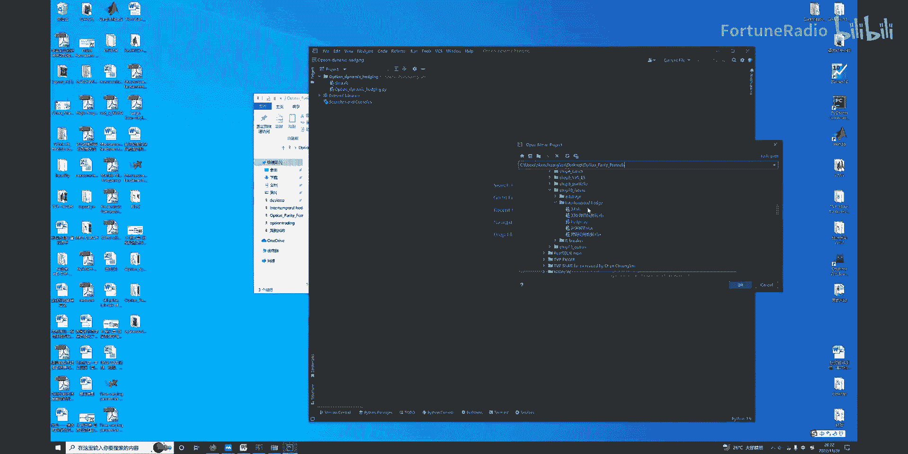

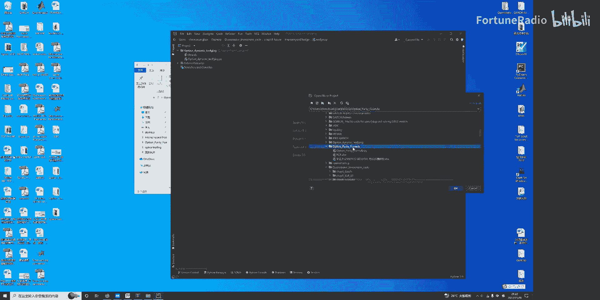

```python
import pandas as pd
import numpy as np
import matplotlib.pyplot as plt

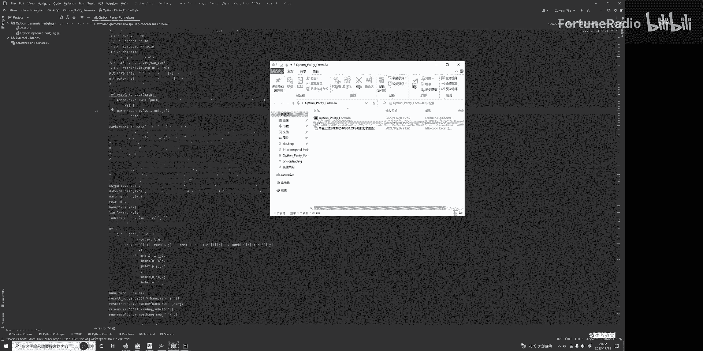

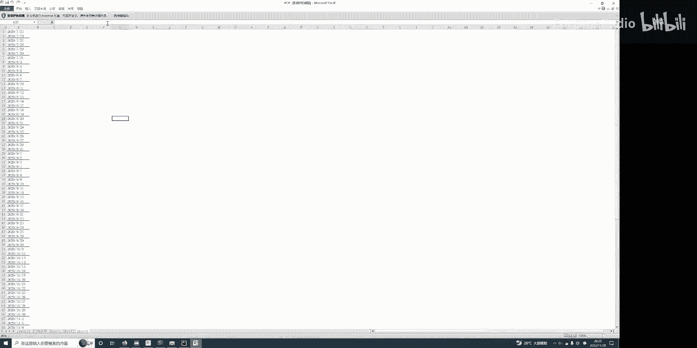

# 读取数据
data_call_put = pd.read_excel('PCP.xlsx', sheet_name=0)  # 看涨看跌期权数据
data_market = pd.read_excel('PCP.xlsx', sheet_name=1)    # 现货市场数据
```

以下是读取数据的关键步骤说明：
*   `data_call_put` 包含了看涨期权和看跌期权的信息，如行权价、到期时间、类型（看涨/看跌）和价格。
*   `data_market` 包含了标的资产（如上证50ETF）的现货价格以及无风险利率等市场数据。
*   原始教材案例使用了64个期权（32对），为简化理解，本教程修改为仅使用一对期权（一个看涨和一个看跌）进行演示。

## 套利逻辑与条件判断

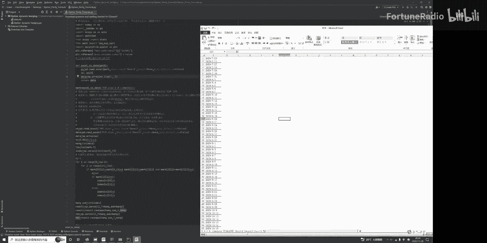

在准备好数据后，我们需要根据期权平价公式计算套利机会。期权平价公式的核心关系为：
**C + K * e^(-rT) = P + S**
其中，`C`是看涨期权价格，`P`是看跌期权价格，`K`是行权价，`S`是标的资产现货价格，`r`是无风险利率，`T`是到期时间（年化）。

程序将计算平价公式两边的差值（`arb_value`），并判断是否存在套利空间。

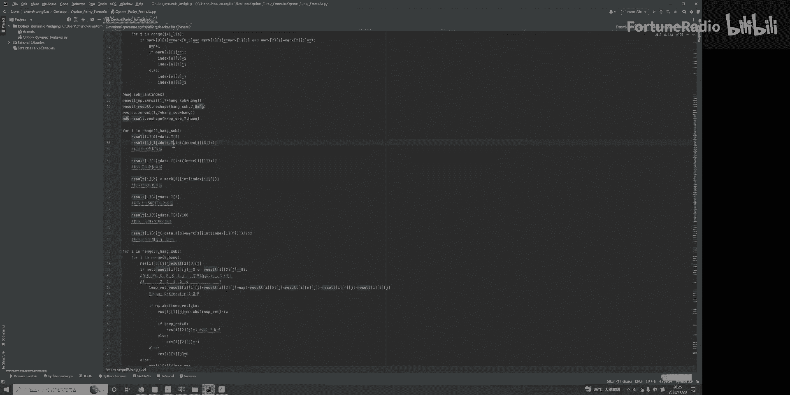

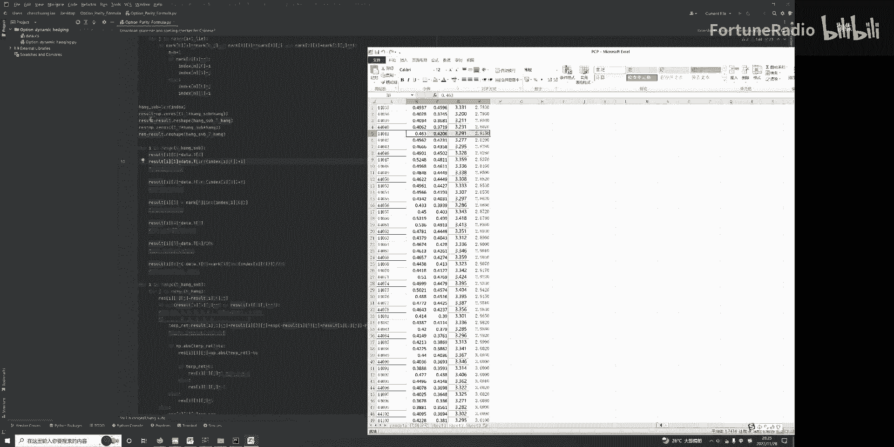

```python
# 提取关键数据
C = data_call_put['call_price']
P = data_call_put['put_price']
K = data_call_put['strike_price']
S = data_market['spot_price']
r = data_market['risk_free_rate']
T = data_market['time_to_maturity'] / 252  # 年化时间

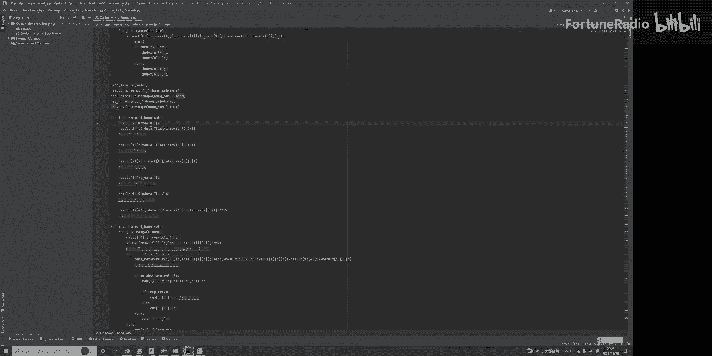

# 计算套利价值
arb_value = C + K * np.exp(-r * T) - P - S
TC = 0.001  # 交易成本
```

以下是套利操作的判断逻辑：
*   如果 `abs(arb_value) > TC`，则存在套利机会。
*   当 `arb_value > 0` 时，执行正向套利：卖出（做空）公式左边组合（看涨期权+债券），买入（做多）公式右边组合（看跌期权+标的资产）。
*   当 `arb_value < 0` 时，执行反向套利：买入（做多）公式左边组合，卖出（做空）公式右边组合。
*   每次套利的理论收益为 `abs(arb_value) - TC`。

## 收益计算与绩效评估

确定了套利操作后，我们需要计算策略的实际收益并评估其绩效。程序模拟了使用固定资金进行套利交易的过程。

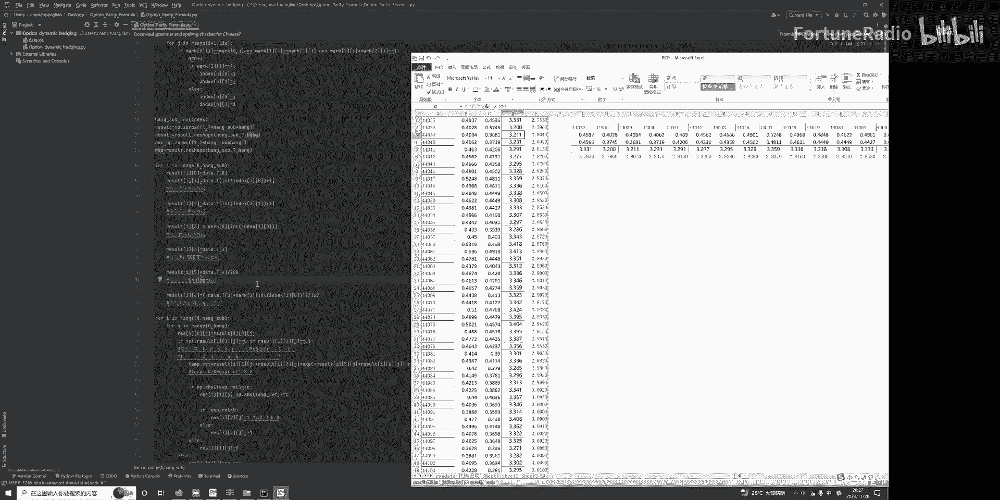

假设每张期权合约对应1万份标的，每份10元，则每张合约价值10万元。同时操作看涨和看跌期权，初始资金设为20万元。

```python
# 计算每次套利的收益
profit_per_trade = (np.abs(arb_value) - TC) * contract_multiplier
# contract_multiplier 为合约乘数（如10000）

# 计算累计收益率
cumulative_return = np.cumsum(profit_per_trade) / initial_capital * 100

# 计算年化收益率
annualized_return = (cumulative_return[-1] / len(profit_per_trade)) * 252

# 计算最大回撤
peak = np.maximum.accumulate(cumulative_return)
drawdown = (peak - cumulative_return) / peak * 100
max_drawdown = np.max(drawdown)

# 计算夏普比率（假设无风险利率为2%）
risk_free_rate = 0.02
return_std = np.std(profit_per_trade / initial_capital) * np.sqrt(252)
sharpe_ratio = (annualized_return/100 - risk_free_rate) / return_std
```

## 结果可视化与策略评价

最后，我们可以将策略的收益情况通过图表直观地展示出来，并对策略进行整体评价。

运行程序后，可以得到策略的绩效指标：
*   累计收益率
*   年化收益率
*   最大回撤
*   夏普比率

同时，程序会生成两张图：
1.  **每日收益率走势图**：展示每个交易日套利策略的收益波动。
2.  **累计收益率曲线图**：展示策略收益随时间累积增长的过程。

在本示例的简化模型中，策略显示出非常高的盈利潜力（例如年化收益率可能达到很高的水平），夏普比率也较为理想。这演示了利用市场定价短暂偏离平价公式进行套利的基本原理。在实际应用中，需要考虑更多复杂因素，如流动性、冲击成本、保证金要求等。

---

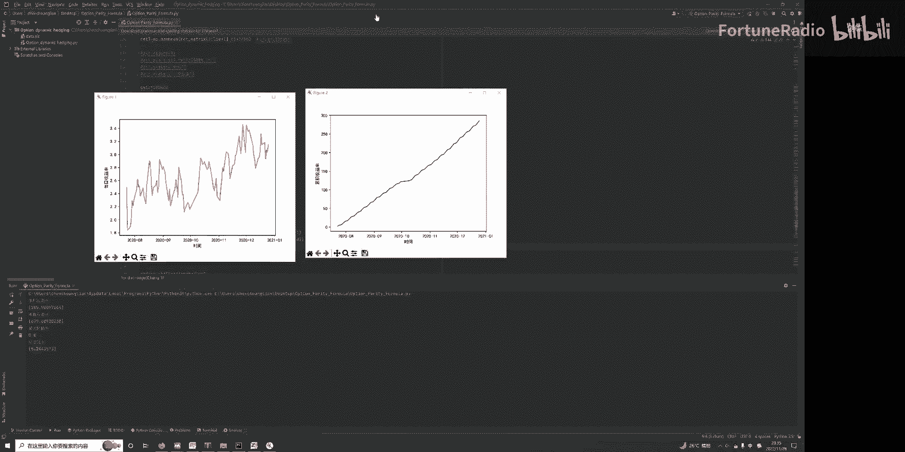

本节课中我们一起学习了期权平价公式套利策略的Python实现全流程。我们从数据读取开始，逐步实现了套利机会的识别、交易信号的生成、收益的计算以及最终策略绩效的评估与可视化。这个简化的例子清晰地展示了如何将金融理论转化为可执行的程序化策略。