# 期权风险对冲套利理论与应用：11.4：Python程序实现与动态对冲策略分析 📈


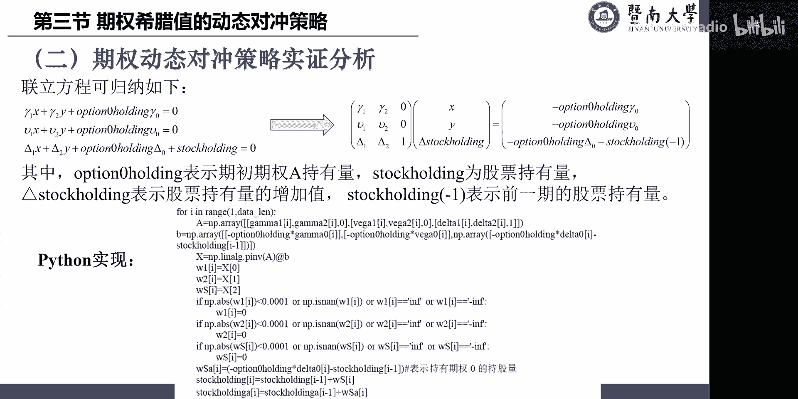

在本节课中，我们将学习如何利用Python程序实现期权的动态风险对冲策略。我们将通过构建和求解联立方程组，动态调整期权和标的资产的持仓，以对冲掉投资组合的Delta、Gamma和Vega风险，并分析策略的收益表现。


## 理论模型与方程组构建

上一节我们介绍了期权希腊字母（Greeks）的概念。本节中，我们来看看如何利用它们构建对冲组合。

假设我们持有一个期权A（Option 0），为了对冲其风险，我们引入了另外两个期权B和C。目标是使整个投资组合的Gamma、Vega和Delta暴露均为零。这构成了以下三条联立方程：

1.  **Gamma中性**：`Gamma1 * X + Gamma2 * Y + Option0_Holding * Gamma0 = 0`
    *   `Gamma1`, `Gamma2`, `Gamma0` 分别是期权B、C和A的Gamma值。
    *   `X`, `Y` 分别是需要持有的期权B和C的数量。
    *   `Option0_Holding` 是已持有的期权A的数量。

2.  **Vega中性**：`Vega1 * X + Vega2 * Y + Option0_Holding * Vega0 = 0`
    *   `Vega1`, `Vega2`, `Vega0` 分别是期权B、C和A的Vega值。

3.  **Delta中性**：`Delta1 * X + Delta2 * Y + Option0_Holding * Delta0 + Stock_Holding = 0`
    *   `Delta1`, `Delta2`, `Delta0` 分别是期权B、C和A的Delta值。
    *   `Stock_Holding` 是需要持有的标的资产（股票）的数量。其方向应与期权组合的Delta暴露相反。

为了便于求解，我们引入变量 `dStock_Holding`，代表股票持仓量的变化量（即 `Stock_Holding` - 上一期的 `Stock_Holding`）。这样，已知上一期持仓后，即可求出本期应持有的股票数量。

由此，方程组可以改写为矩阵形式 **A * X = B**：

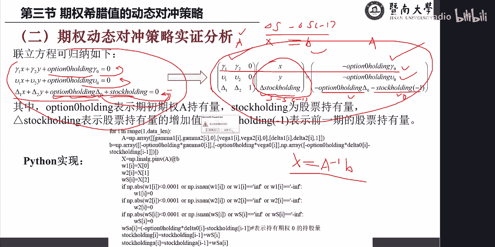

*   **A** 是系数矩阵，包含期权B和C的希腊值：
    ```
    A = [[Gamma1, Gamma2, 0],
         [Vega1,  Vega2,  0],
         [Delta1, Delta2, 1]]
    ```
*   **X** 是未知向量：`[X, Y, dStock_Holding]^T`
*   **B** 是常数向量，由期权A的持仓和希腊值决定：
    ```
    B = [[-Option0_Holding * Gamma0],
         [-Option0_Holding * Vega0],
         [-Option0_Holding * Delta0 - Stock_Holding_previous]]
    ```


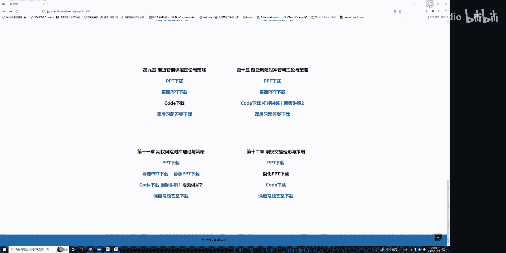


在每一期，已知期权A的持仓、各期权的希腊值以及上一期的股票持仓，即可通过求解 `X = inverse(A) * B` 得到当期需要对冲所需的期权B、C的持仓 `X`, `Y` 以及股票持仓的变化量 `dStock_Holding`。

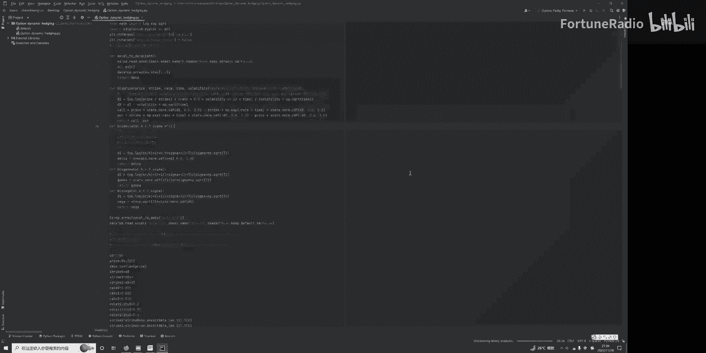

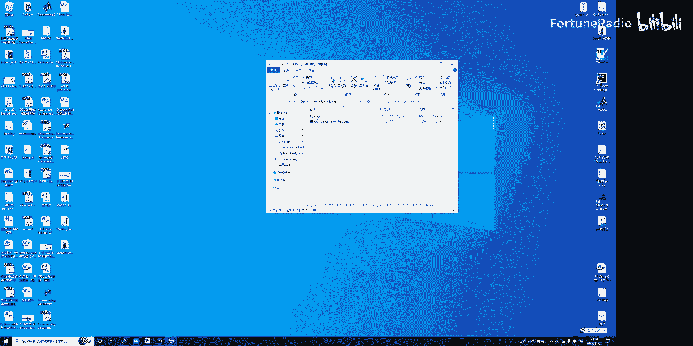

## Python程序实现步骤

以下是实现上述动态对冲策略的核心代码步骤解析。

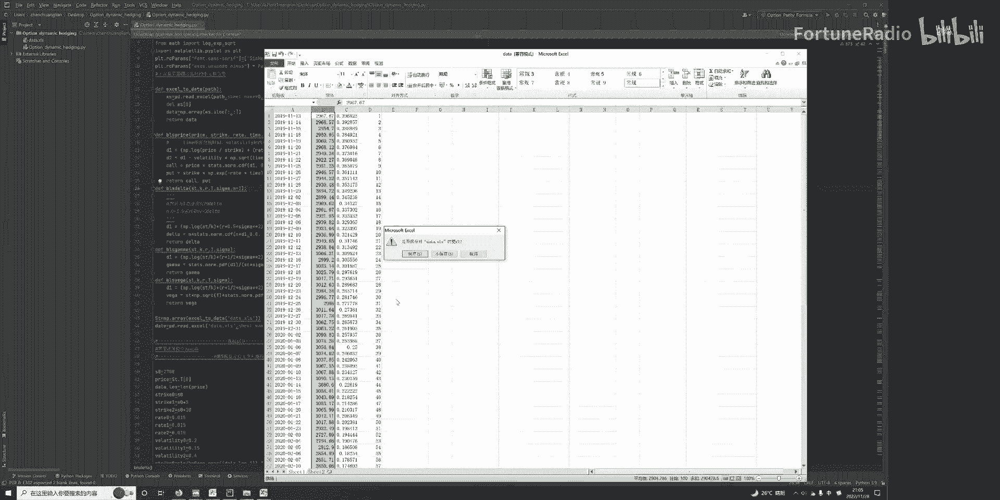

首先，程序需要导入必要的库（如NumPy, Pandas）并定义计算期权价格及希腊值的函数（例如Black-Scholes模型下的Delta, Gamma, Vega公式）。

```python
# 示例：定义计算看涨期权Delta的函数
def delta_call(S, K, T, r, sigma):
    from scipy.stats import norm
    d1 = (np.log(S / K) + (r + 0.5 * sigma ** 2) * T) / (sigma * np.sqrt(T))
    return norm.cdf(d1)
```

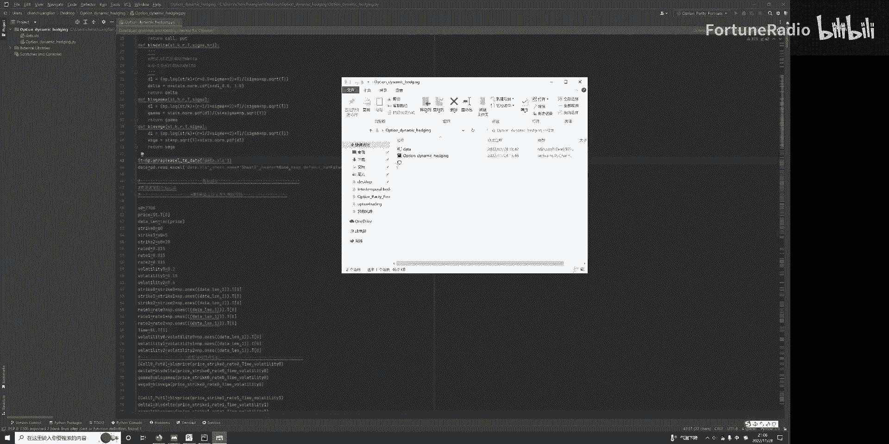

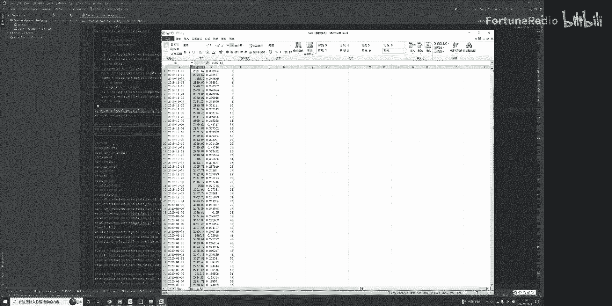

接着，程序加载标的资产价格和到期时间数据，并初始化参数。

```python
# 初始化参数
S0 = data[‘spot_price’].values # 标的资产价格序列
T = data[‘time_to_maturity’].values # 年化到期时间序列
K_A = 2700 # 期权A的行权价
K_B = 2705 # 期权B的行权价
K_C = 2710 # 期权C的行权价
r = 0.015 # 无风险利率
sigma_A = 0.20 # 期权A的波动率
sigma_B = 0.15 # 期权B的波动率
sigma_C = 0.40 # 期权C的波动率
option0_holding = 1000 # 期权A的初始持仓
stock_holding_prev = 0 # 股票初始持仓
```

然后，程序进入主循环，在每一个时间点执行以下操作：

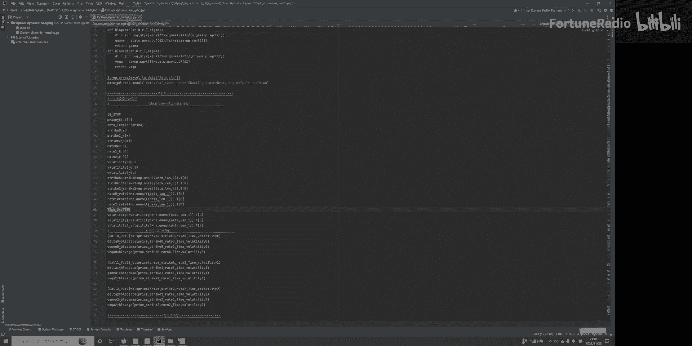

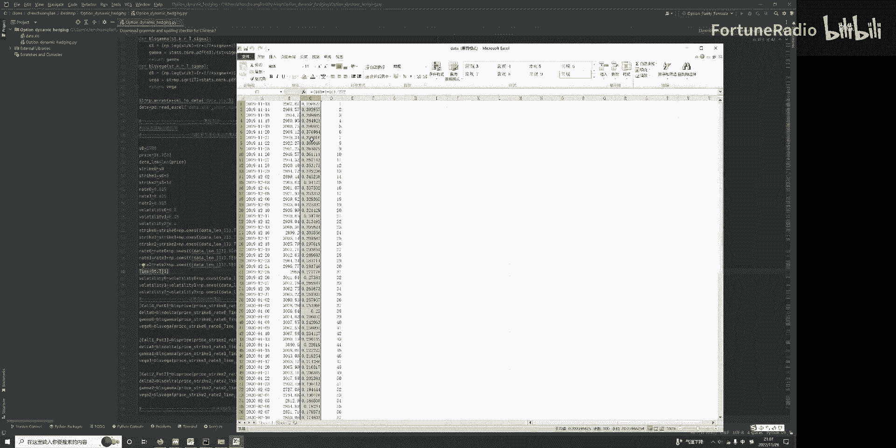

1.  计算当前时刻期权A、B、C的Delta, Gamma, Vega值。
2.  构建矩阵 **A** 和向量 **B**。
3.  求解线性方程组，得到对冲所需的期权B、C持仓 `X`, `Y` 以及股票持仓变化量 `dStock_Holding`。
4.  更新股票持仓：`stock_holding = stock_holding_prev + dStock_Holding`。
5.  记录持仓、计算投资组合价值及损益。
6.  为下一期准备：`stock_holding_prev = stock_holding`。

以下是求解方程组的核心代码块：

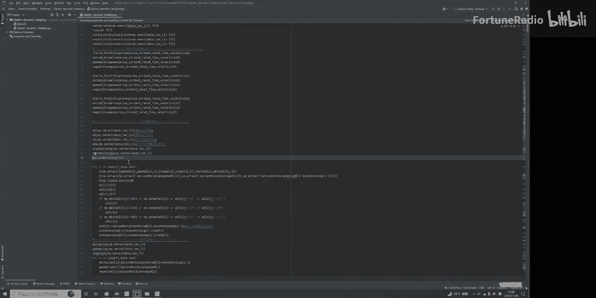

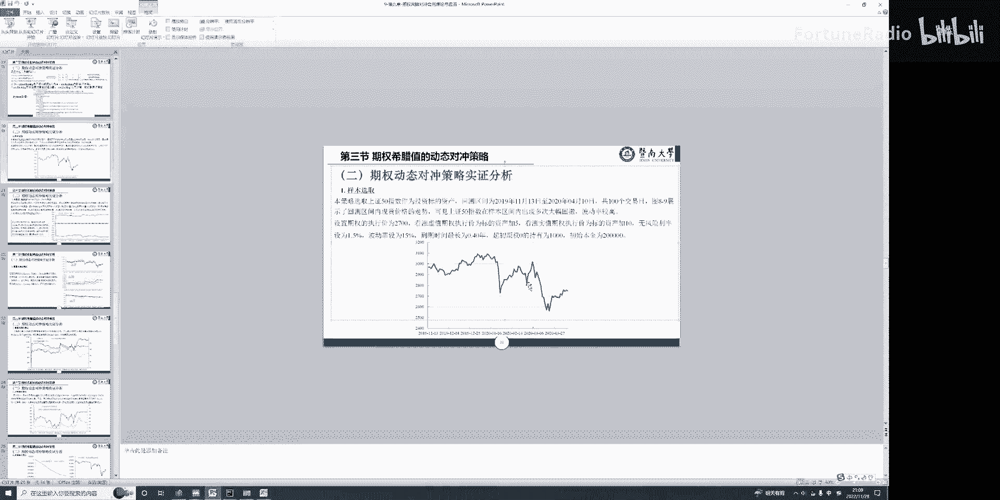

```python
# 构建矩阵A
A_matrix = np.array([
    [gamma_B, gamma_C, 0],
    [vega_B, vega_C, 0],
    [delta_B, delta_C, 1]
])

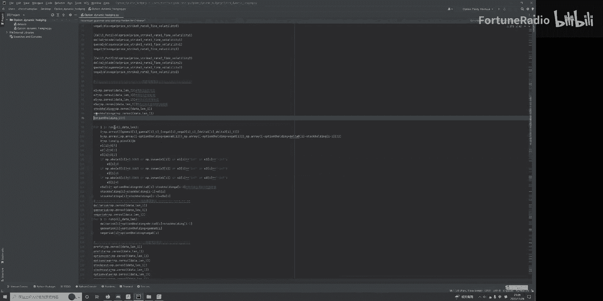

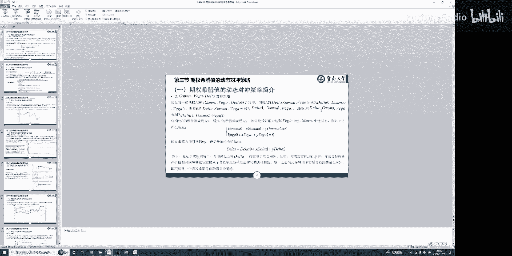

# 构建向量B
B_vector = np.array([
    [-option0_holding * gamma_A],
    [-option0_holding * vega_A],
    [-option0_holding * delta_A - stock_holding_prev]
])

# 求解X = [position_B, position_C, dStock_Holding]
solution = np.linalg.inv(A_matrix).dot(B_vector)
position_B = solution[0, 0]
position_C = solution[1, 0]
dStock_Holding = solution[2, 0]
```

最后，程序计算策略的累计收益率、年化收益率、最大回撤和夏普比率等绩效指标，并绘制相关图表进行分析。

## 策略结果分析与比较

程序运行后，我们可以得到一系列分析结果。

**绩效指标**：在本模拟案例中，完全对冲（Delta、Gamma、Vega均中性）的策略表现优异。
*   累计收益率达到35.5%。
*   年化收益率约为89%。
*   夏普比率约为1.1。

**持仓动态**：通过生成的图表，我们可以观察到：
*   期权B和C的持仓（`position_B`, `position_C`）在整个期间多为负值，意味着持续做空这两个期权以对冲期权A的Gamma和Vega风险。
*   股票持仓（`stock_holding`）则在零轴上下动态变化，时多时空，以精确对冲投资组合的Delta风险。

**策略对比**：程序还对比了不同对冲策略的效果：
1.  **完全对冲**（蓝线）：对冲Delta、Gamma、Vega。收益曲线稳步上升，始终为正，表现最佳。
2.  **仅对冲Delta**（绿线）：仅对冲Delta风险，忽略Gamma和Vega。收益曲线波动较大，前期出现亏损，后期虽转为正收益，但幅度远小于完全对冲策略。
3.  **无对冲**（仅持有期权A）：面临全部希腊字母风险暴露，收益不确定性强，模拟中未展示盈利。

这个对比说明，在对冲成本可控的前提下，进行多维度（Delta、Gamma、Vega）的风险对冲能有效改善投资组合的收益风险特征。值得注意的是，对冲Gamma可能需要频繁调仓，产生较高交易成本；此外，模型假设波动率为常数，与实际市场可能不符。在实际应用中，需要根据交易成本、波动率预测等因素对策略进行优化和选择。

## 总结

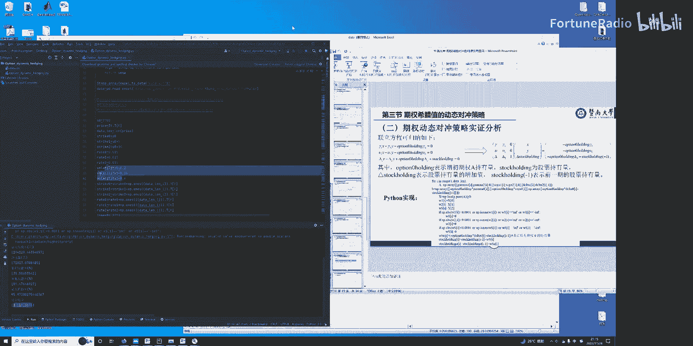

本节课中我们一起学习了期权动态风险对冲策略的Python实现。我们从构建Gamma、Vega、Delta中性的联立方程组出发，将其转化为矩阵形式进行求解。通过程序，我们实现了在每一个时间点动态计算并调整期权及标的资产持仓，以持续保持投资组合的风险中性。最后，通过分析策略的绩效指标和对比不同对冲方法的收益曲线，我们验证了完全对冲策略在模型假设下的有效性，并讨论了实际应用中需考虑的成本与模型局限。