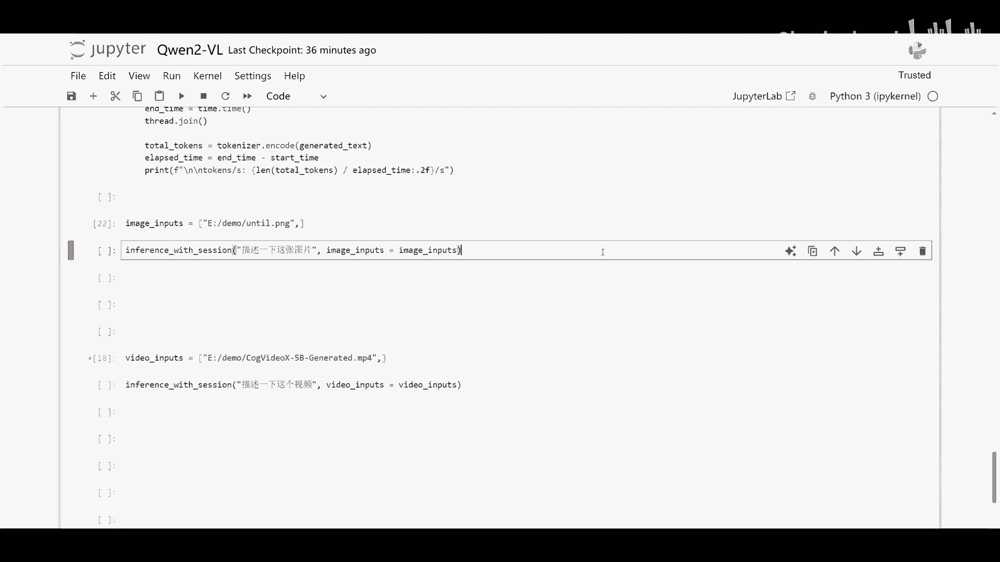
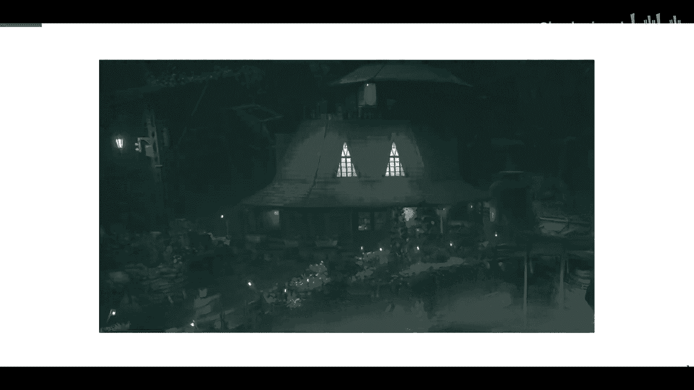
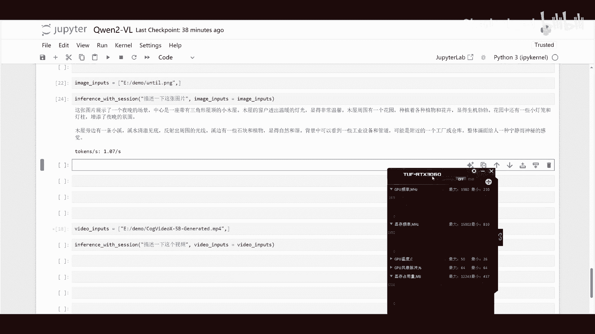

# 本地部署Qwen2-VL模型：P1：12GB版RTX 3060运行Int8量化推理教程 🚀

在本教程中，我们将学习如何在显存为12GB的NVIDIA RTX 3060显卡上，通过Int8量化技术，本地部署并运行Qwen2-VL-7B-Instruct模型。我们将涵盖从环境准备到模型加载与推理的完整流程，旨在帮助初学者成功运行这个强大的视觉语言模型。

## 概述

Qwen2-VL是一个支持视觉理解的7B参数规模大语言模型。其原始模型对显存要求较高，难以在消费级显卡上运行。通过应用Int8量化技术，我们可以显著降低模型对显存的需求，使其能够在像RTX 3060（12GB）这样的显卡上流畅运行。本教程将一步步指导你完成整个过程。

## 环境准备与依赖安装

上一节我们介绍了本教程的目标，本节中我们来看看运行模型所需的环境和软件依赖。你需要准备一个安装了NVIDIA显卡驱动的系统，并确保已安装Python和包管理工具pip。

以下是需要安装的核心Python库：

*   `transformers`: Hugging Face提供的库，用于加载和运行Transformer模型。
*   `torch`: PyTorch深度学习框架。
*   `accelerate`: 用于简化模型在多设备上运行的库。
*   `bitsandbytes`: 提供模型量化功能的库，特别是8位量化。
*   `Pillow`: 用于图像处理的Python库。

你可以使用以下命令一次性安装这些依赖：

```bash
pip install transformers torch accelerate bitsandbytes Pillow
```

## 模型下载与加载

环境准备就绪后，接下来我们需要下载并加载经过Int8量化的Qwen2-VL模型。我们将使用Hugging Face的`transformers`库来完成这一步骤。



加载模型的核心代码如下所示。请注意，`device_map="auto"`参数让库自动将模型分配到可用的设备（如GPU），而`load_in_8bit=True`参数则启用了关键的8位量化加载，这是降低显存占用的关键。

```python
from transformers import AutoModelForCausalLM, AutoTokenizer, BitsAndBytesConfig
import torch

model_id = "Qwen/Qwen2-VL-7B-Instruct"

# 配置8位量化
bnb_config = BitsAndBytesConfig(load_in_8bit=True)

# 加载模型和分词器
model = AutoModelForCausalLM.from_pretrained(
    model_id,
    quantization_config=bnb_config,
    device_map="auto",
    trust_remote_code=True
)
tokenizer = AutoTokenizer.from_pretrained(model_id, trust_remote_code=True)
```

运行这段代码后，模型将被加载到你的GPU显存中。由于应用了Int8量化，原本需要约14GB以上显存的模型现在只需要约8-9GB，从而可以放入12GB的RTX 3060中。

## 图像与文本处理及模型推理

模型加载成功后，我们就可以准备输入数据并进行推理了。Qwen2-VL是一个视觉语言模型，因此输入通常包含图像和相关的文本指令。



以下是准备输入并执行推理的步骤：

1.  **图像处理**：使用PIL库打开图像，并将其处理成模型可接受的格式。
2.  **对话构建**：按照Qwen2-VL要求的格式构建对话历史。通常，这是一个包含用户指令（含图像）和模型回复角色的列表。
3.  **文本编码**：使用分词器将构建好的对话文本转换为模型能理解的token ID序列。
4.  **生成回复**：将处理好的输入传递给模型，让模型生成对问题的回答。

其核心流程可以用以下伪代码表示：

```
输入 = 处理图像(图像路径) + 分词器(文本指令)
模型输出 = 模型生成(输入)
回答 = 解码(模型输出)
```

具体实现代码如下：

```python
from PIL import Image
import torch

# 1. 加载并处理图像
image_path = “your_image.jpg” # 替换为你的图片路径
image = Image.open(image_path).convert(“RGB”)



# 2. 构建消息（对话）
messages = [
    {
        “role”: “user”,
        “content”: [
            {“type”: “image”},
            {“type”: “text”, “text”: “请描述这张图片中的内容。”}
        ]
    }
]

# 3. 使用分词器准备模型输入
text = tokenizer.apply_chat_template(
    messages,
    tokenize=False,
    add_generation_prompt=True
)
image_inputs = [image]
inputs = tokenizer(text, return_tensors=“pt”).to(model.device)
inputs[‘pixel_values’] = model.image_preprocess(image_inputs).to(model.device)

# 4. 模型推理生成回答
with torch.no_grad():
    generated_ids = model.generate(
        **inputs,
        max_new_tokens=256,
        do_sample=False
    )
generated_ids_trimmed = [
    out_ids[len(in_ids):] for in_ids, out_ids in zip(inputs.input_ids, generated_ids)
]
response = tokenizer.batch_decode(generated_ids_trimmed, skip_special_tokens=True)[0]

print(“模型回答：”, response)
```

将代码中的`“your_image.jpg”`和`“请描述这张图片中的内容。”`替换为你自己的图像和问题，即可运行并获得模型的视觉理解结果。

## 总结

本节课中我们一起学习了在12GB显存的RTX 3060显卡上本地运行Qwen2-VL-7B-Instruct模型的全过程。我们首先了解了通过**Int8量化**来降低显存需求的原理，然后完成了环境依赖的安装。接着，我们使用`transformers`库并设置`load_in_8bit=True`参数，成功加载了量化后的模型。最后，我们学习了如何同时处理图像和文本输入，构建正确的对话格式，并执行模型推理以获得对视觉内容的理解和回答。

通过本教程，你已经掌握了在资源有限的消费级GPU上部署和运行大型视觉语言模型的基本方法。你可以尝试用不同的图片和问题与模型进行交互，探索其多模态理解能力。