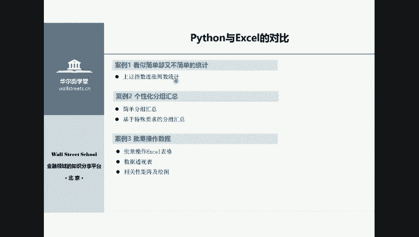
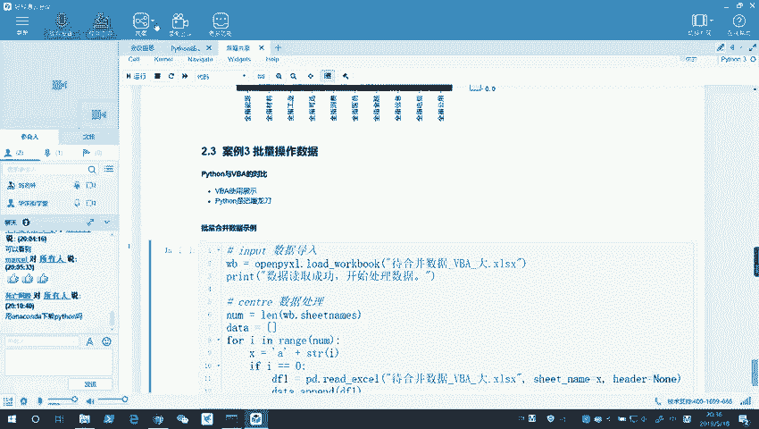
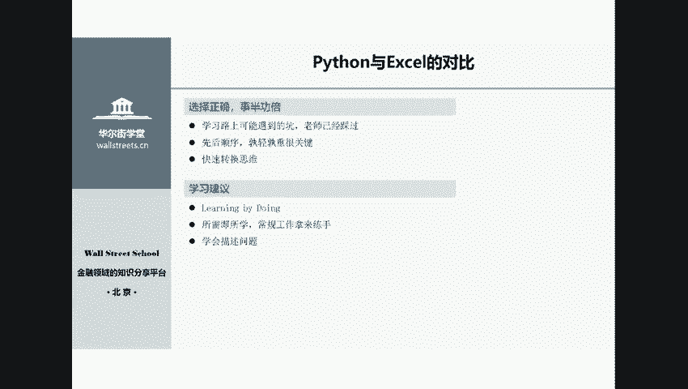
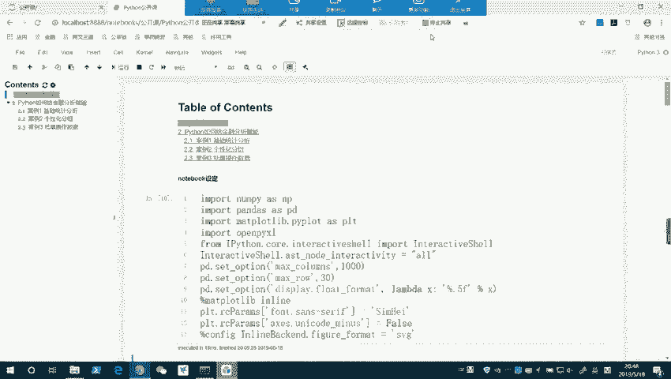

# Python金融量化入门：P1：01 Python在金融资管领域中的应用 📈


在本节课中，我们将要学习Python在金融资产管理领域的核心应用。我们将通过几个具体的案例，了解Python如何帮助金融从业者高效地处理数据、进行分析和可视化，从而解决工作中的实际问题。

## Python语言特点：简单易学 🐍



上一节我们概述了课程内容，本节中我们来看看Python语言本身的特点。

Python语言的特点可以概括为四个字：**简单易学**。它是一种可读性极强的语言，其语法非常接近日常英语。对于有一定编程基础（如MATLAB、C++、Java）的同学，入门Python可能只需一两天。对于零基础的同学，通过系统学习，通常也能在两周到一个月内掌握基础语法并入门数据分析。

## Python在金融分析中的应用案例 📊

了解了Python的特点后，我们通过几个实际案例来看看Python如何提升金融分析师的工作效率。

### 案例一：上证指数连涨周数统计

在金融分析中，我们经常需要做一些个性化的统计。例如，统计上证指数历史上连续上涨的周数分布。如果用Excel手动操作，步骤会非常繁琐。而使用Python，我们可以将整个过程简化为三个清晰的步骤：**数据输入、核心处理、结果输出**。

以下是实现该功能的核心代码框架：
```python
# 1. 数据输入 (Input)
data = read_data('shanghai_index.csv')

# 2. 核心处理 (Process)
# 计算连涨逻辑
result = calculate_consecutive_rise(data)

# 3. 结果输出 (Output)
export_to_excel(result, '连涨统计结果.xlsx')
```
通过短短二十几行代码，我们就能快速完成分析并将结果导出，整个过程可能只需几十毫秒。

### 案例二：分组统计与数据透视

金融从业者经常需要对数据进行分组统计，例如计算A股各行业每年的净利润总和。在Excel中，这可以通过数据透视表实现。但当需求变得更复杂时，例如要找出每年每个行业中净利润排名前十的公司，Excel操作就会变得异常耗时。

使用Python的`pandas`库，我们可以轻松实现复杂的个性化分组需求。核心处理部分可能只需几行代码：
```python
# 按‘年份’和‘行业’分组，并计算每个组的净利润总和
grouped_result = data.groupby(['年份', '行业'])['净利润'].sum()

# 找出每年每个行业中市值排名前十的公司
top10_companies = data.groupby(['年份', '行业']).apply(lambda x: x.nlargest(10, '总市值'))
```
编写好的程序可以重复使用，未来只需更新数据源即可快速得到新结果，极大地提升了工作效率。

### 案例三：数据可视化

数据分析的结果常常需要通过图表来直观展示。Python拥有强大的可视化库（如`matplotlib`, `seaborn`），可以绘制种类丰富的图表。

例如，我们可以计算各行业指数间的相关性矩阵，并绘制成热力图：
```python
import seaborn as sns
import matplotlib.pyplot as plt

# 计算相关性矩阵
correlation_matrix = data.corr()

# 绘制热力图
sns.heatmap(correlation_matrix, annot=True, cmap='coolwarm')
plt.title('行业指数相关性热力图')
plt.show()
```
这样一幅图能清晰展示不同行业间的关联程度，为投资组合的风险分散提供直观参考。

### 案例四：批量数据处理（与VBA对比）

在工作中，我们常需要批量处理多个文件或工作表。虽然Excel的VBA也能完成此类任务，但在处理海量数据时可能遇到性能瓶颈或需要复杂优化。



Python在处理大批量数据合并时表现稳健。例如，合并上百个工作表的数据，Python脚本可以稳定高效地完成任务。其优势在于**一次编写，长期受益**，并且能处理更大量级的数据。

## 给零基础学习者的建议 🧭

看过了Python的应用实例，你可能想知道如何开始学习。本节将为初学者提供一些实用的学习路径建议。

学习编程，顺序至关重要。以下是给金融领域初学者的具体建议：

1.  **夯实基础**：首先必须扎实掌握Python基础知识，包括：
    *   **数据类型**：整数、浮点数、字符串等。
    *   **数据结构**：列表、字典、元组等。
    *   **控制流语句**：条件判断（if-else）、循环（for, while）。

2.  **建立编程思维**：在初学时就尝试用“**输入-处理-输出**”的三段式思维来分解问题。无论任务大小，都先明确这三个部分。

3.  **以用促学，学以致用**：
    *   **Learning by Doing**：在掌握基础后，不要试图一次性学完所有内容。应根据**你想用Python做什么**来决定下一步学什么。例如，如果工作中需要处理大量Excel，就重点学习`pandas`库。
    *   **用常规工作练手**：将日常工作中重复性高、耗时的任务尝试用Python自动化。初期编码可能比手动操作更耗时，但代码一旦写成，今后便可反复调用，长期来看效率倍增。
    *   **学会描述问题**：无论是自行搜索还是向他人请教，清晰、准确地描述你遇到的问题，是快速获得帮助的关键。

## 常见问题解答 (Q&A) ❓



在课程的最后，我们整理了一些学员常见的问题进行解答。



*   **Q：Anaconda是什么？和Python什么关系？**
    A：Anaconda是一个集成了Python和众多科学计算库（如pandas, numpy）的发行版。安装Anaconda后，Python环境以及Jupyter Notebook等工具就一并准备好了，非常适合初学者。

*   **Q：金融数据从哪里获取？**
    A：有许多免费或付费的数据平台，例如Tushare（免费）、万矿（Wind旗下在线量化平台）、聚宽等。这些平台通常提供Python接口（API），学完基础后可以学习如何调用。

*   **Q：应该使用什么编程软件（IDE）？**
    A：对于数据分析初学者，推荐使用Anaconda自带的**Jupyter Notebook**。它以“单元格”和“笔记本”的形式组织代码和文档，交互性强，非常适合学习和演示。

*   **Q：学习顺序应该是怎样的？**
    A：1. **基础知识** -> 2. **根据需求选择方向**。如果你的核心需求是分析现有数据（如金融分析师），接下来重点学习**数据分析**。如果你的需求是从网上获取数据（如产品经理），则可以同步学习**爬虫**和数据分析。

*   **Q：有推荐的书籍吗？**
    A：英文书推荐《Python for Data Analysis》。中文书推荐《对比Excel，轻松学习Python数据分析》，这本书通过对比Excel操作来讲解Python，对职场人士非常友好。

## 总结 📝


本节课中我们一起学习了Python在金融资产管理领域的强大应用。我们从Python**简单易学**的特点出发，通过**连涨统计、分组分析、数据可视化、批量处理**四个案例，看到了Python如何高效解决金融分析中的实际问题。最后，我们为零基础学习者提供了**夯实基础、建立思维、以用促学**的清晰学习路径。掌握Python，就如同获得了一把处理金融数据的“屠龙刀”，能让你从繁琐重复的劳动中解放出来，将精力聚焦于更有价值的分析和决策。