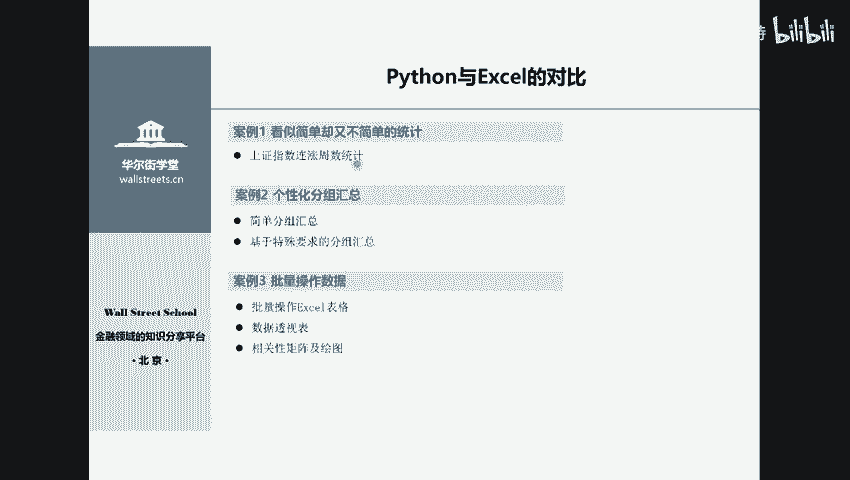
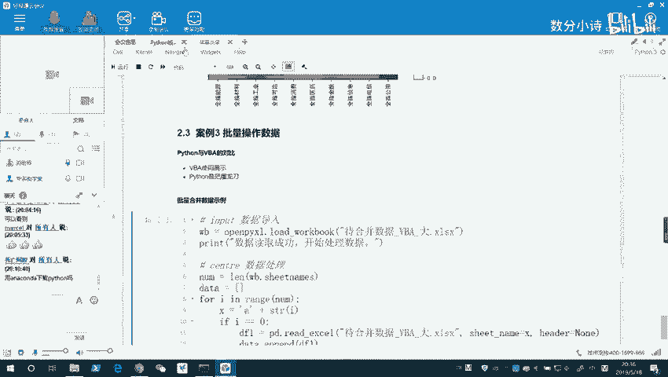
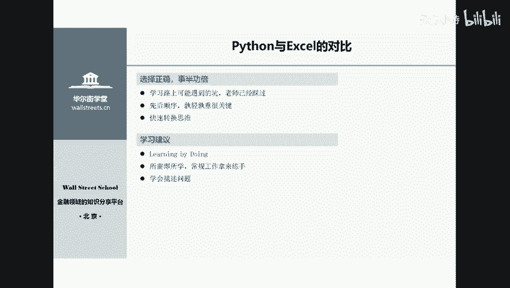
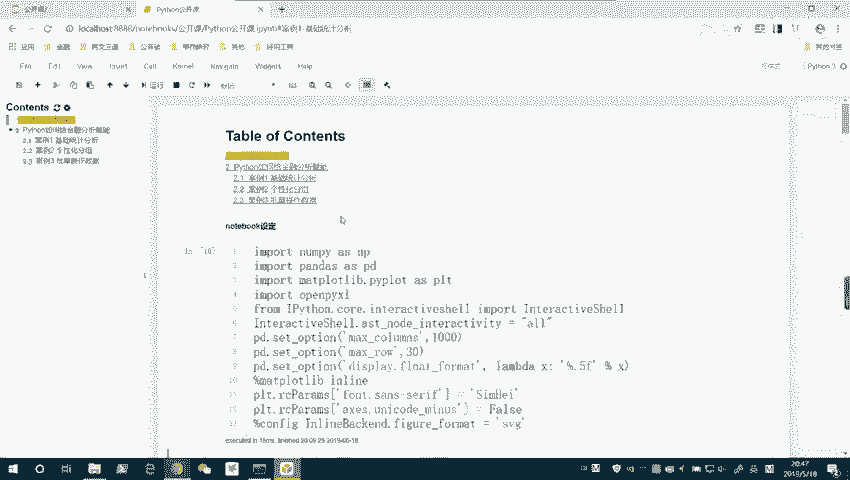
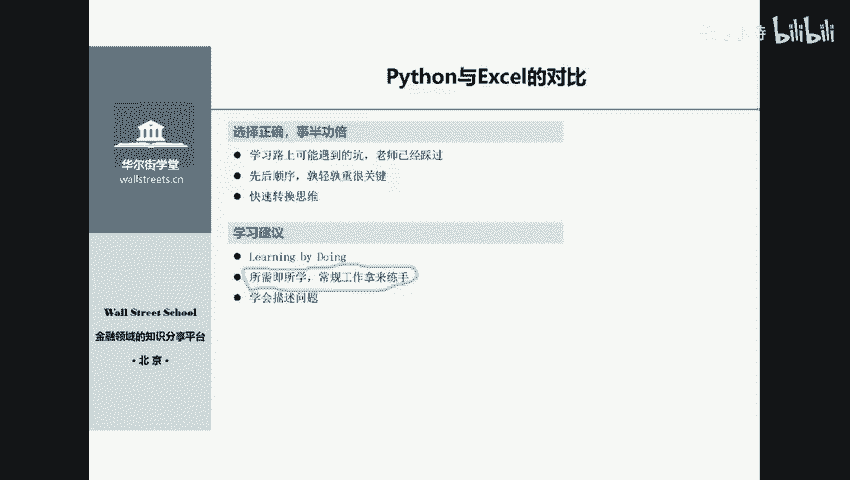

# Python金融量化分析：P1：01 Python在金融资管领域中的应用 📈


## 概述
在本节课中，我们将要学习Python在金融资产管理领域的应用。我们将了解Python语言的特点，并通过几个具体的金融数据分析案例，展示Python如何高效地解决金融从业者的实际工作痛点。最后，我们将为零基础学员提供入门Python数据分析的实用建议。



## Python语言特点：简单易学 🐍
上一节我们概述了课程内容，本节中我们来看看Python语言的核心特点。

Python语言的特点可以用四个字概括：**简单易学**。它是一种可读性极强的语言，其语法结构非常接近日常英语。学习者需要理解的是官方规定的每个关键词的固定含义和语法规则。

对于有编程基础（如MATLAB、C++、Java）的同学，Python入门可能只需一两天。对于零基础的同学，通过系统学习，通常能在两周到一个月内掌握基础语法并入门数据分析。

## Python在金融分析中的应用案例
了解了Python的基本特点后，我们通过几个案例来看看它在金融分析中的实际威力。

### 案例一：上证指数连涨周数统计
首先，我们来看一个看似简单但操作繁琐的任务：统计上证指数的历史连涨周数。传统上使用Excel处理此类问题步骤复杂，而使用Python则非常简洁。

任何程序都可以分为三个部分：
1.  **输入**：获取原始数据。
2.  **核心处理**：进行数学计算和逻辑控制。
3.  **输出**：展示或导出结果。

以下是实现该统计的核心代码逻辑示意：
```python
# 1. 输入：读取数据
data = read_csv('shanghai_index.csv')

# 2. 核心处理：计算连涨周数
# ... (使用循环和条件判断逻辑)

# 3. 输出：保存结果
result.to_excel('连涨统计结果.xlsx')
```
通过约25行代码，程序能在几十毫秒内完成计算并导出结果，高效地满足了个性化统计需求。

### 案例二：分组统计与数据透视
在金融分析中，经常需要对数据进行分组统计，例如按行业汇总上市公司净利润。

以下是使用Python进行分组聚合的示例：
```python
# 按行业和年份分组，并汇总净利润
grouped_result = data.groupby(['行业', '年份'])['净利润'].sum()
```
对于更复杂的需求，例如找出每年每个行业中市值排名前十的公司，Excel操作起来异常繁琐（需要手动筛选、排序数十次）。而在Python中，只需寥寥数行代码即可批量、自动地完成这一任务，并且代码可重复使用，未来仅需更新数据即可快速生成新报告。



### 案例三：数据可视化
Python拥有强大的数据可视化能力。例如，我们可以绘制各行业指数间的相关性热力图。

以下是计算相关性并绘图的核心步骤：
```python
# 计算行业指数间的相关系数矩阵
correlation_matrix = data.corr()

# 绘制热力图
sns.heatmap(correlation_matrix, annot=True)
plt.show()
```
一张颜色深浅代表相关性强的热力图，能够直观地展示不同行业板块间的联动关系，为投资组合的风险分散提供直接参考。

### 案例四：批量数据处理（对比VBA）
Python擅长处理大批量数据。例如，需要将Excel工作簿中上百个工作表的数据合并到一起。当数据量巨大时，VBA可能运行缓慢或需要复杂优化，而Python处理起来则更加稳健高效。



每种工具都有其适用场景。VBA在处理Excel内部、数据量适中的任务时非常快捷。而Python更像一把“屠龙刀”，在处理复杂、批量或跨平台的数据任务时，能展现出更大的优势。



## 给零基础学习者的建议 🧭
通过以上案例，我们看到了Python在金融分析中的高效性。本节将为初学者提供学习路径建议。

以下是高效学习Python数据分析的关键建议：
1.  **夯实基础，顺序正确**：必须首先扎实掌握**数据类型**（整数、浮点数、字符串）、**数据结构**（列表、字典、元组）和**控制流语句**（条件判断、循环）。这是所有高级应用的基石。
2.  **建立“输入-处理-输出”思维**：在编写任何程序前，先明确数据的来源、想要进行的处理以及最终结果的呈现形式。
3.  **以用促学，学以致用**：在掌握基础后，应立即围绕实际需求（如处理Excel报表、分析特定数据）进行学习，而不是试图一次性学完所有知识。将日常工作任务尝试用Python自动化，是绝佳的练习方式。
4.  **学会准确描述问题**：无论是自行搜索还是请教他人，清晰描述遇到的问题（包括错误信息、预期目标等）能极大提高解决效率。

关于工具，初学者推荐使用Anaconda发行版，它集成了Python和Jupyter Notebook等常用工具。Jupyter Notebook非常适合学习和演示，它以“单元格”形式组织代码和文档，交互性强。



## 总结
本节课中我们一起学习了Python在金融资产管理领域的应用价值。我们了解到Python具有**简单易学**的特点，并通过**连涨统计**、**分组分析**、**数据可视化**和**批量处理**四个案例，具体展示了Python如何提升金融数据分析的效率和深度。最后，我们为零基础学员规划了“夯实基础-建立思维-以用促学”的学习路径。掌握Python将成为金融从业者一项强大的技能，帮助大家从重复劳动中解放出来，专注于更有价值的分析和决策。