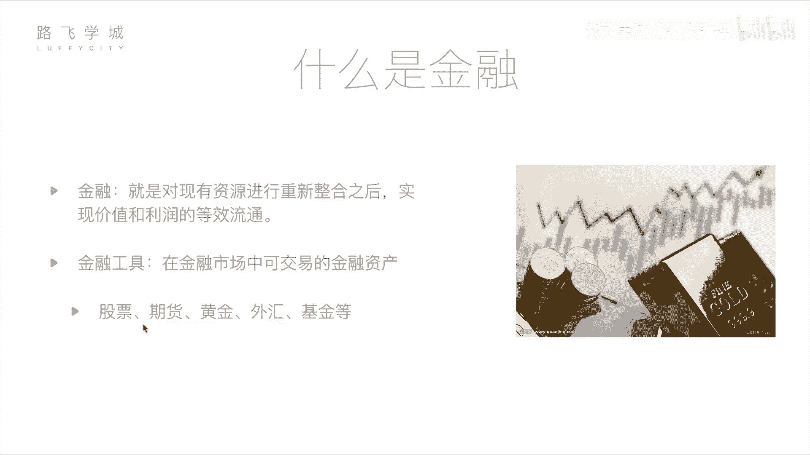

# Python金融量化分析：01：基本金融知识介绍 📈

## 概述
在本节课中，我们将学习金融与量化分析的基础知识。我们将首先了解金融的基本概念，然后介绍几种常见的金融工具，最后重点讲解股票这一核心概念。通过本节内容，你将建立起对金融量化领域的初步认识。

## 什么是金融？
从定义上讲，金融是对现有资源进行重新整合之后，实现价值和利润的等效流通。这个概念可能听起来有些抽象，但通俗地理解，金融涉及资金的流动和增值。它并非完全是不劳而获的投机行为。金融活动对整个经济体系和个人都有积极作用。

例如，一位拥有闲置资金的投资者，可以将资金投入一个有潜力的创业公司。创业者获得发展所需的资本，公司得以壮大；投资者则从公司的成功中获得回报。这是一个双赢的过程，促进了资源的有效配置和经济发展。

## 常见的金融工具
在金融市场中，可交易的金融资产被称为金融工具。以下是几种常见的金融工具：

*   **股票**：代表对一家公司的所有权份额。购买股票即成为该公司的股东。
*   **期货**：一种标准化合约，约定在未来某一特定时间和地点，以特定价格交割一定数量的某种资产。
*   **黄金**：一种传统的贵金属，常被视为保值和对冲通胀的工具。
*   **外汇**：指不同国家货币之间的兑换交易，其价格表现为汇率。
*   **基金**：由专业基金经理管理，集合众多投资者的资金，用于投资于股票、债券等多种资产。

接下来，我们将对其中几种工具进行更详细的说明。

### 期货详解
期货的风险和潜在收益通常都高于股票。其本质是关于未来商品价格的合约。

**举例说明**：
假设发电厂A预计半年后煤炭价格将从当前的10元/吨上涨，而煤矿主B预计价格会下跌。双方可以签订一份期货合约：约定半年后A以10元/吨的价格向B购买5000吨煤。
*   对A而言，如果煤价涨至15元，他以10元买入，则规避了成本上涨的风险。
*   对B而言，如果煤价跌至5元，他以10元卖出，则锁定了利润，规避了价格下跌的风险。

这份合约使双方都能管理自己对未来价格不确定性的风险。期货交易通常还涉及保证金制度，放大了收益和亏损的幅度。

### 黄金与外汇
黄金的价值相对稳定，其价格受全球供应量（如新矿发掘）、宏观经济形势和货币政策等因素影响。基本原理是：当货币供应增加或寻求保值的需求上升时，黄金价格倾向于上涨。

外汇交易涉及不同货币之间的汇率波动。汇率变动受两国经济状况、利率政策和货币政策等因素影响。例如，如果中国经济持续增长，人民币可能升值，即1美元能兑换的人民币数量减少。大型机构常利用这些波动进行套利，但对个人投资者而言，日常波动带来的收益空间通常较小。

### 基金运作
基金为个人投资者提供了参与金融市场的便捷途径。如果你对直接投资股票或期货不了解，可以将资金交给专业的基金公司。

**运作模式**：
投资者购买基金份额，将资金汇集到基金池中。基金经理利用专业知识和策略，将这些资金投资于各种金融资产（如股票、债券、黄金等）。最终的收益或亏损将按比例分摊给所有基金份额持有人。基金公司会收取一定的管理费作为报酬。
*   **优势**：分散风险，专业管理。
*   **特点**：通常，基金的风险和收益潜力介于股票和债券之间。

## 核心工具：股票
在众多金融工具中，股票是最常见、也是我们本课程后续将重点探讨的核心。它代表了你对一家上市公司的部分所有权。

购买公司股票意味着你成为了该公司的股东。如果公司经营良好，利润增长，其股票价值可能上升，你可以通过卖出股票获利；此外，一些公司还会将部分利润以**股息**的形式分给股东。

在接下来的章节中，我们将深入学习如何获取股票数据、分析其走势，并利用Python编程进行量化分析。

## 总结
本节课我们一起学习了金融的基本概念，它促进了社会资源的有效配置。我们介绍了几种主要的金融工具：高风险高收益的**期货**、用于保值的**黄金**、基于汇率波动的**外汇**、由专业人士管理的**基金**，以及代表公司所有权的**股票**。理解这些基础概念是进入金融量化分析世界的第一步。在下一节中，我们将开始学习如何获取和处理金融数据。