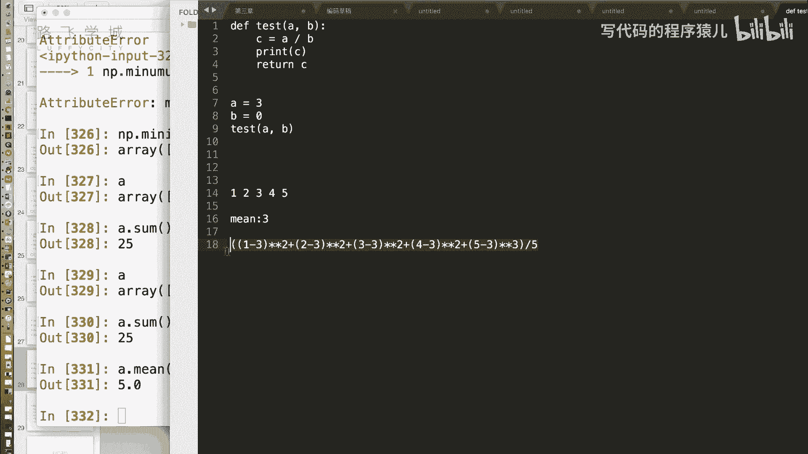
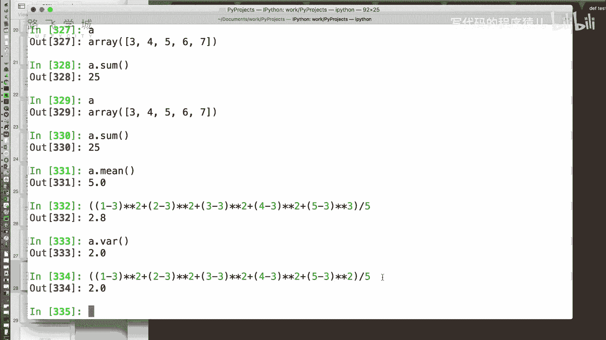
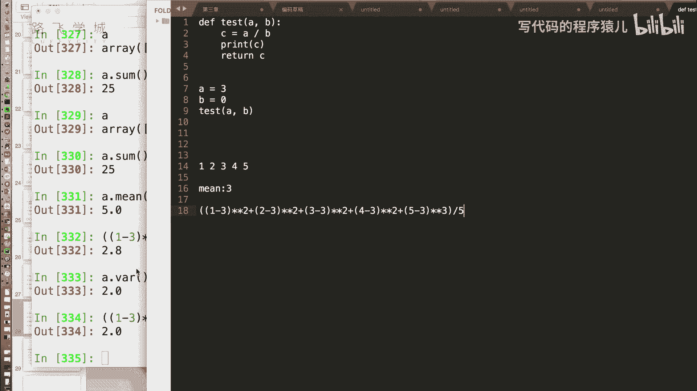
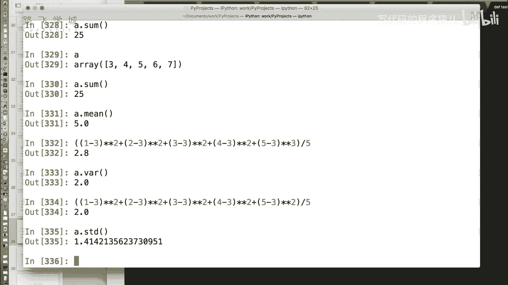
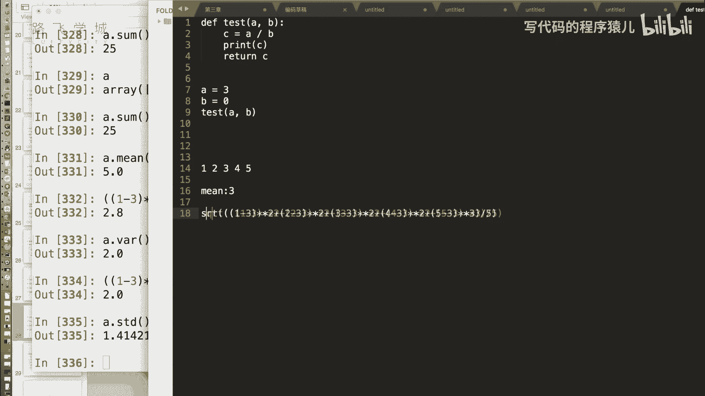
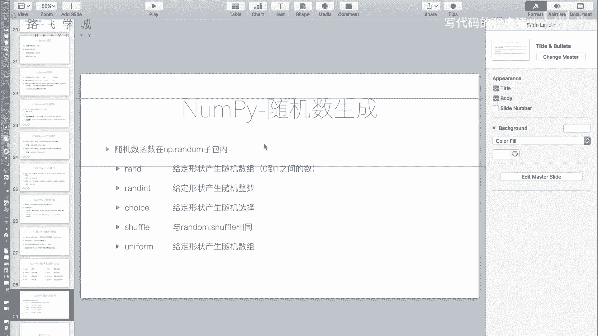

# Python金融量化：P10：NumPy统计方法与随机数生成 📊🎲

在本节课中，我们将学习NumPy模块提供的数学与统计方法，以及如何生成随机数。这些功能是进行数据分析和金融量化计算的基础。

## 概述

上一节我们介绍了NumPy数组的索引与切片操作。本节中，我们来看看NumPy提供的核心数学统计函数，以及如何高效地生成随机数数组。

## 统计方法

NumPy提供了一系列用于计算数组统计量的方法。

### 求和与平均值

以下是基础统计方法：
*   **`sum`**：对数组内所有值进行求和。其功能与Python内置的`sum`函数类似。
*   **`mean`**：计算数组所有元素的算术平均值。

### 方差与标准差

方差和标准差是衡量数据离散程度的重要指标。

**方差**的计算公式为：
`方差 = Σ(每个数据值 - 平均值)² / 数据个数`
它表示数据偏离平均值的平均平方距离。方差越大，数据波动越大。

**标准差**是方差的平方根：
`标准差 = sqrt(方差)`
标准差与原始数据单位一致，常用于估计数据的分布范围。例如，对于正态分布的数据，大约68%的数据会落在“平均值 ± 1倍标准差”的范围内。

以下是相关方法：
*   **`var`**：计算数组的方差。
*   **`std`**：计算数组的标准差。

### 最大值与最小值

以下是查找极值的方法：
*   **`max`**：返回数组中的最大值。
*   **`min`**：返回数组中的最小值。
*   **`argmax`**：返回数组中最大值所在的索引（下标）。
*   **`argmin`**：返回数组中最小值所在的索引（下标）。

## 随机数生成

NumPy的`random`子模块提供了强大的随机数生成功能，它扩展了Python内置`random`模块的能力，支持直接生成指定形状的随机数数组。

以下是`np.random`中常用的函数：

*   **`rand`**：生成一个在[0, 1)区间内均匀分布的随机浮点数。可以传入形状参数（如`(3,5)`）来生成多维数组。
*   **`randint`**：生成指定范围内的随机整数。可以传入`low`, `high`参数以及`size`参数来指定生成数组的形状。
*   **`choice`**：从给定的一维数组中随机抽取元素。可以通过`size`参数指定抽取次数，从而生成一个随机样本数组。
*   **`shuffle`**：将数组的顺序随机打乱（原地修改）。
*   **`uniform`**：生成在指定区间`[low, high)`内均匀分布的随机浮点数。同样支持`size`参数。

这些函数使得批量生成符合特定分布的随机数据变得非常便捷。

## 总结

本节课中我们一起学习了NumPy的核心统计与随机功能。我们掌握了如何使用`sum`、`mean`、`var`、`std`等函数计算数组的统计特征，并理解了方差和标准差的意义。同时，我们学习了利用`np.random`模块中的`rand`、`randint`、`choice`等函数高效生成各种随机数数组的方法。这些工具为后续的数据处理和分析奠定了坚实的数学基础。