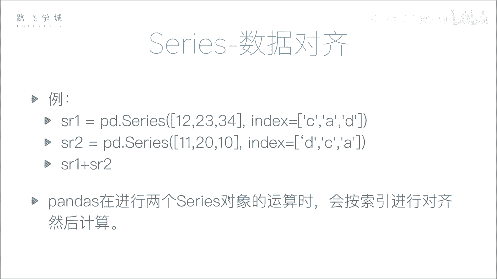
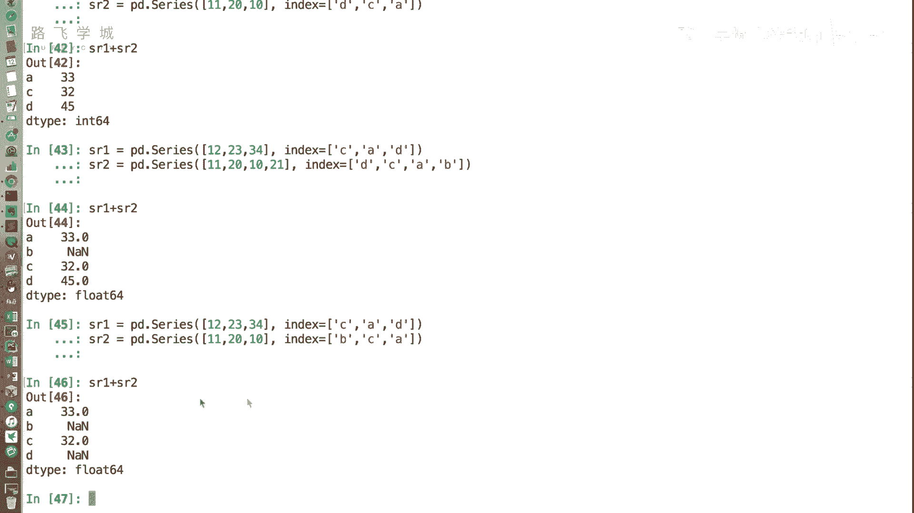
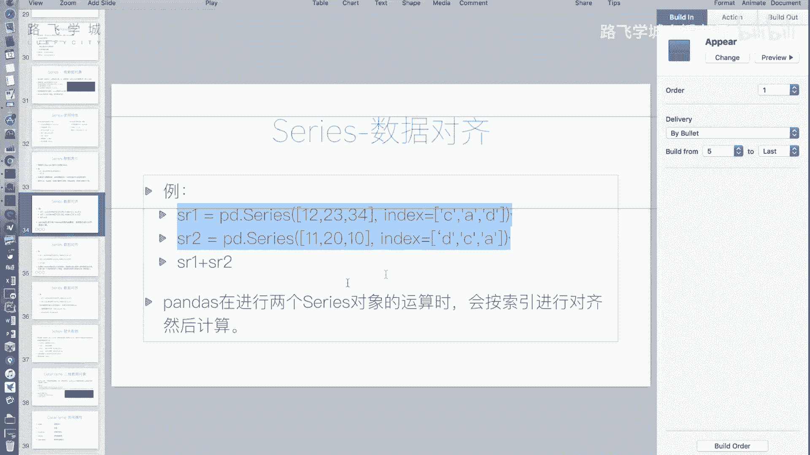
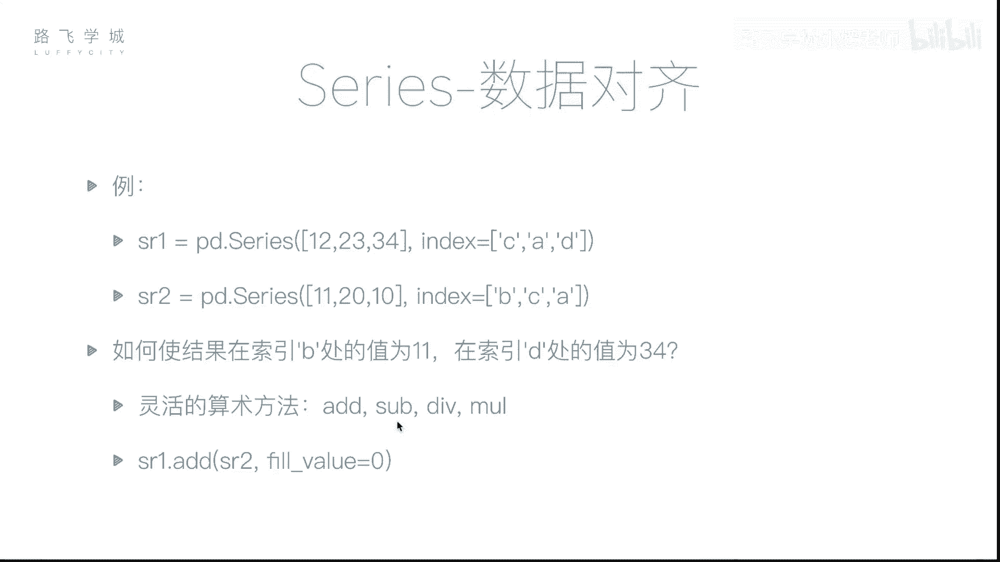
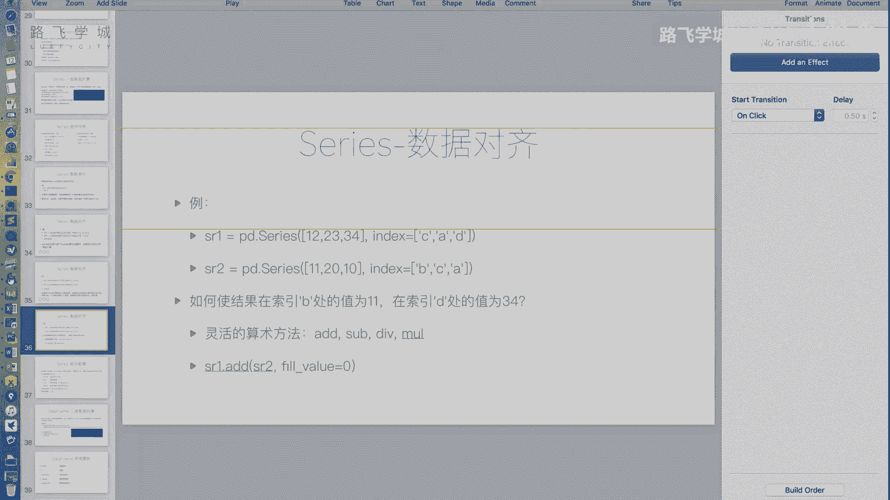
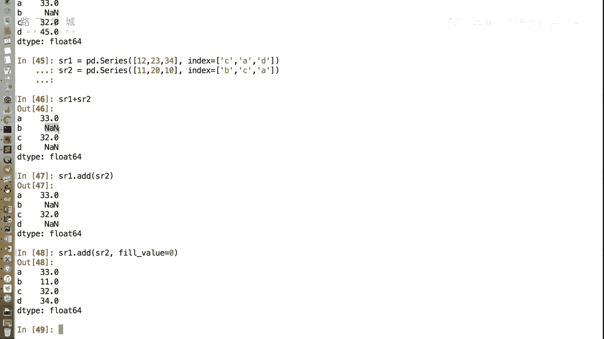

# Python金融量化：P10：Series数据对齐 📊

在本节课中，我们将要学习Pandas Series对象的一个重要特性——数据对齐。我们将了解Series在进行算术运算时，如何根据索引标签自动对齐数据，以及如何处理由此产生的缺失值问题。

## 数据对齐的概念

上一节我们介绍了Series的基本操作，本节中我们来看看Series的数据对齐特性。数据对齐是Pandas的核心功能之一，它允许我们在进行运算时，不依赖于数据的顺序，而是根据索引标签进行匹配。

在NumPy数组中，运算通常按位置（下标）进行。但在Pandas Series中，运算默认按索引标签对齐。这意味着，即使两个Series对象的顺序不同，只要它们的索引标签相同，Pandas就能正确地将对应位置的值进行运算。

## 数据对齐示例

以下是两个长度相同但索引顺序不同的Series对象：




```python
import pandas as pd

sr1 = pd.Series([12, 23, 34], index=[‘C‘, ‘A‘, ‘D‘])
sr2 = pd.Series([11, 20, 10], index=[‘D‘, ‘C‘, ‘A‘])
```

如果执行 `sr1 + sr2`，结果不是按位置相加（12+11, 23+20, 34+10），而是按索引标签对齐后相加：
*   **A**：`23` (来自sr1) + `10` (来自sr2) = `33`
*   **C**：`12` (来自sr1) + `20` (来自sr2) = `32`
*   **D**：`34` (来自sr1) + `11` (来自sr2) = `45`

这个功能非常强大，例如在合并不同年份或月份的数据时，只要日期（索引）一致，无需手动排序即可直接运算。

## 索引长度不同时的对齐

当两个Series对象的索引长度不同时，Pandas依然可以进行运算。它会先按标签对齐，对于只在其中一个Series中存在的标签，其运算结果会被标记为缺失值（NaN）。

以下是两个索引不同的Series对象：

```python
sr1 = pd.Series([12, 23, 34], index=[‘A‘, ‘C‘, ‘D‘])
sr2 = pd.Series([11, 20, 10, 5], index=[‘A‘, ‘B‘, ‘C‘, ‘D‘])
```

执行 `sr1 + sr2` 的结果是：
*   **A**：`12 + 11 = 23`
*   **B**：sr1中没有B，结果为 `NaN`
*   **C**：`23 + 10 = 33`
*   **D**：`34 + 5 = 39`

NaN（Not a Number）在Pandas中被用作缺失值的标记。

## 灵活算术方法与填充值

在某些业务场景下，我们可能不希望缺失值出现为NaN。例如，计算员工两个月的出勤总天数，第一个月有员工A、C、D，第二个月员工D离职，新来了员工B。我们希望将缺失的月份视为0天，而不是NaN。

Pandas提供了灵活的算术方法来实现这一点，它们是 `add()`, `sub()`, `mul()`, `div()`，分别对应加、减、乘、除。

这些方法可以接受一个 `fill_value` 参数，用于指定在对齐时，如果某个索引只在一个Series中存在，则用该值填充。

以下是使用 `add()` 方法并填充0的示例：

```python
# 假设sr1是第一个月出勤，sr2是第二个月出勤
sr1 = pd.Series([12, 23, 34], index=[‘A‘, ‘C‘, ‘D‘])
sr2 = pd.Series([11, 20, 10], index=[‘A‘, ‘B‘, ‘C‘])



# 使用add方法，并设置fill_value=0
total_attendance = sr1.add(sr2, fill_value=0)
```





运算逻辑变为：
*   **A**：`12 + 11 = 23`
*   **B**：sr1中没有B，用0填充，即 `0 + 20 = 20`
*   **C**：`23 + 10 = 33`
*   **D**：sr2中没有D，用0填充，即 `34 + 0 = 34`



这样，我们就得到了一个没有NaN的、符合业务预期的结果。

## 总结

本节课中我们一起学习了Pandas Series的数据对齐特性。我们了解到：
1.  Series运算默认按索引标签对齐，而非位置，这大大提升了数据处理的灵活性。
2.  当索引长度不一致时，对齐运算会产生缺失值NaN。
3.  通过 `add()`, `sub()` 等方法的 `fill_value` 参数，我们可以控制缺失值的填充方式，以适应不同的业务需求。



数据对齐是后续进行复杂数据分析和清洗的基础。下一节，我们将具体讲解如何处理这些可能出现的缺失值（NaN）。