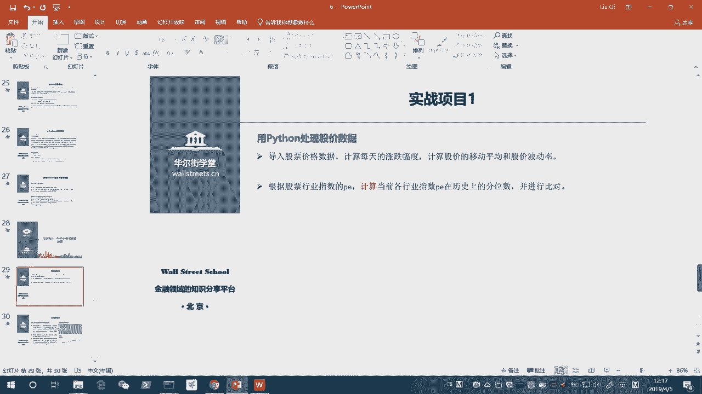
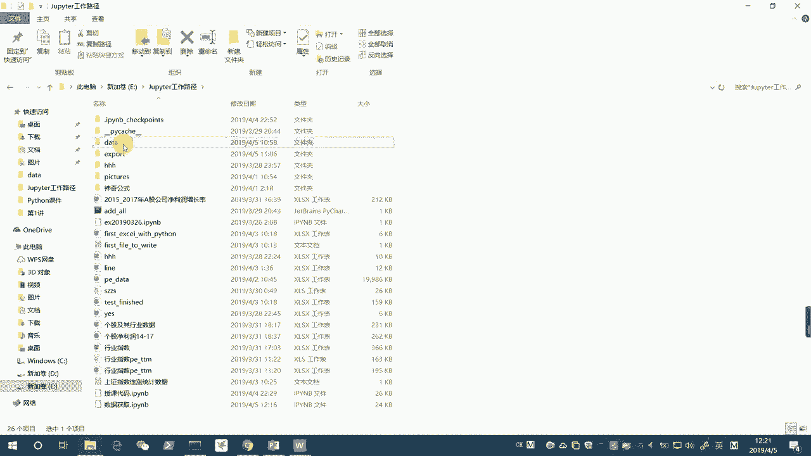
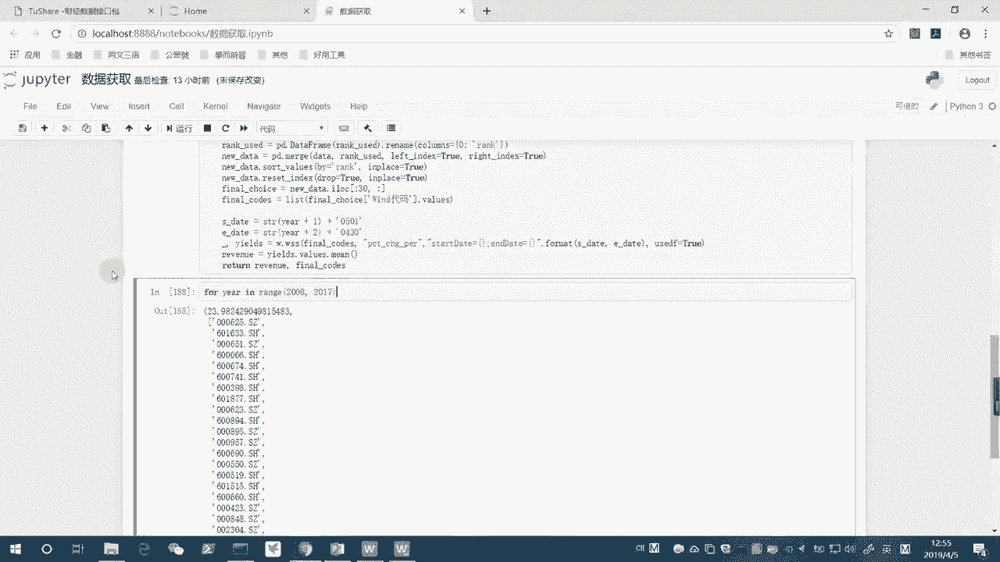
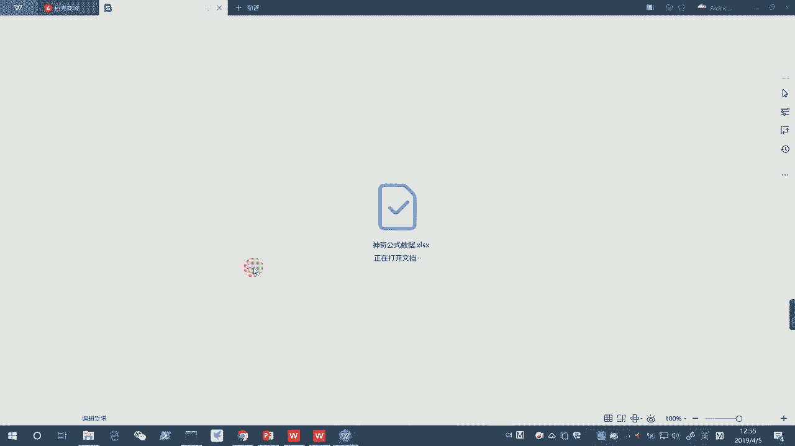
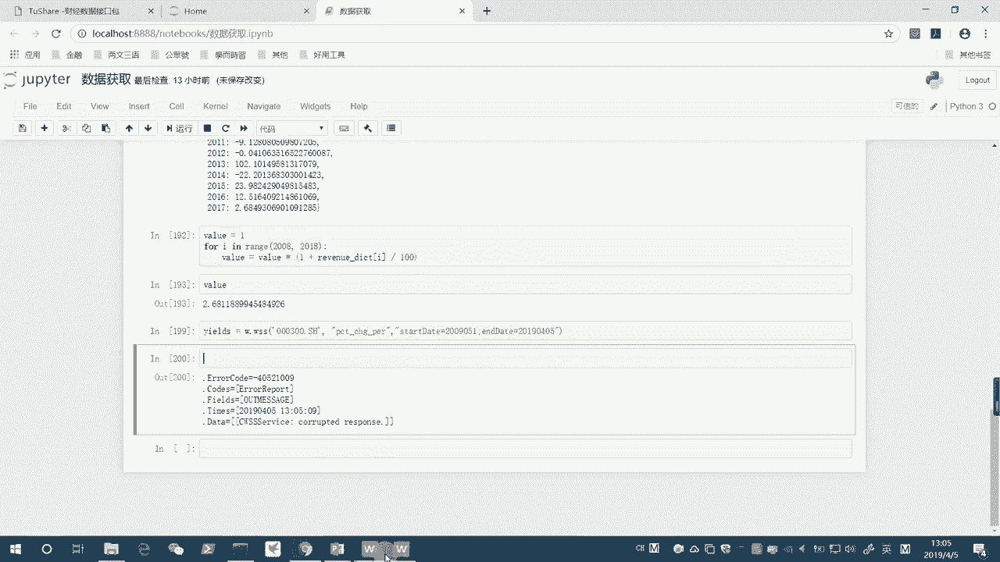
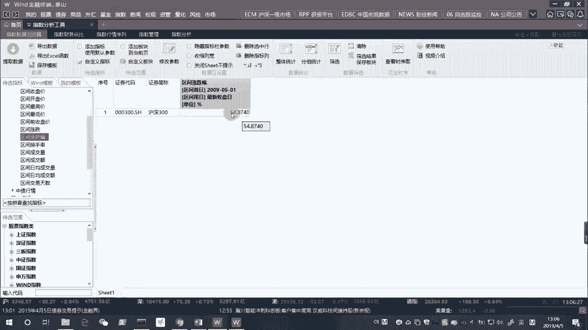
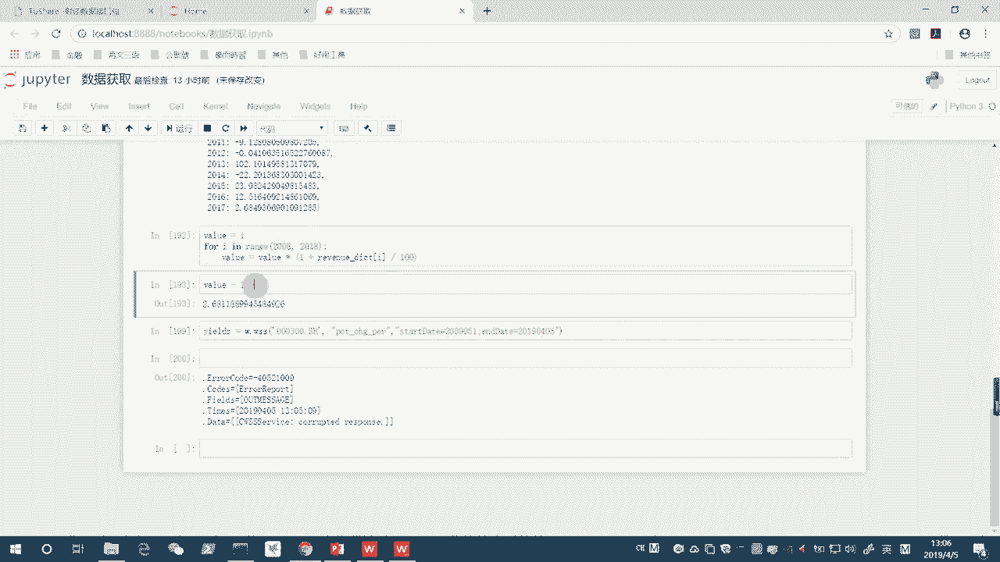
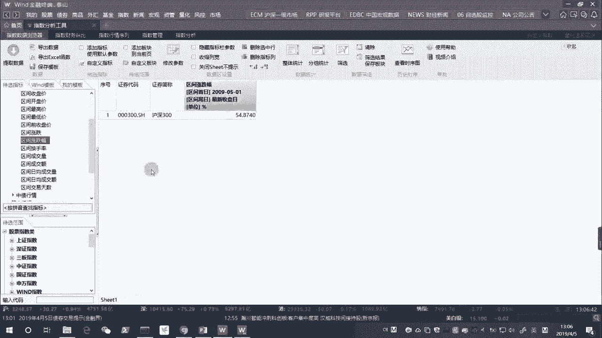
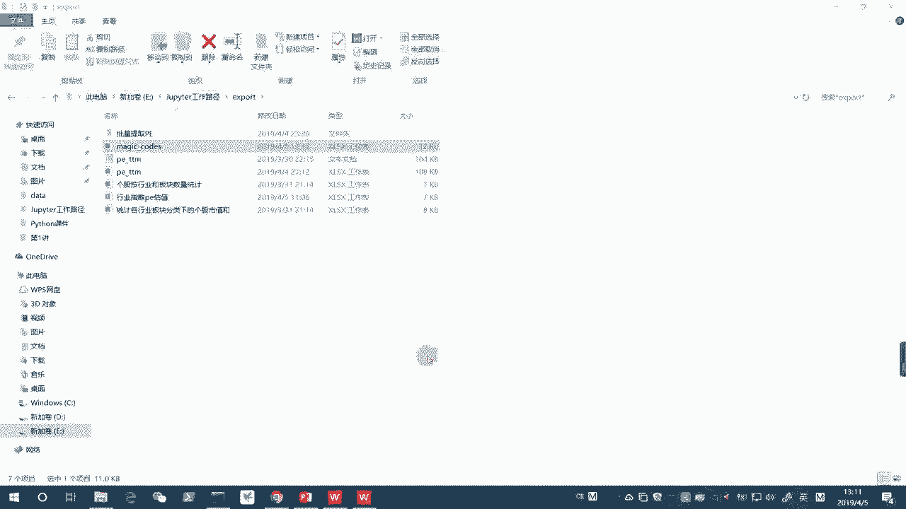

# Python金融量化实战：P11：05 实战练习：用Python实现神奇公式挑选股票 📈




在本节课中，我们将学习如何用Python实现一个著名的投资策略——“神奇公式”，并利用它来筛选股票。我们将从读取数据开始，逐步完成数据清洗、指标计算、股票排序，最终封装成一个可复用的函数，并对历史数据进行回测分析。

## 概述

神奇公式是由乔尔·格林布拉特提出的一种选股策略。其核心思想是寻找“质优价廉”的公司，即选择那些盈利能力高（高资本回报率）且估值便宜（低市盈率）的股票。在美国市场，该策略曾取得显著的超额收益。本节课，我们将用Python在A股市场复现这一策略。



## 数据准备与读取


首先，我们需要读取包含上市公司财务数据的Excel文件。这些数据已预先下载好，包含了2001年至2017年各年度的市盈率（PE）和资本回报率（ROIC）等指标。

```python
import pandas as pd

# 读取2017年的数据文件，跳过前4行无关信息
data = pd.read_excel('data/神奇公式数据.xlsx', sheet_name='2017', skiprows=4)
```

## 数据清洗与条件筛选

在应用神奇公式前，我们需要对数据进行清洗，剔除无效或异常的数据点。我们的筛选条件是：当年的市盈率（PE）、前一年的市盈率（PE_1）、前两年的市盈率（PE_2）、当年的资本回报率（ROIC）、前一年的资本回报率（ROIC_1）和前两年的资本回报率（ROIC_2）都必须大于0。这样可以确保我们分析的公司具有连续的正向盈利能力和回报。

以下是具体的筛选操作：

```python
# 使用条件索引筛选出所有关键指标均为正数的数据行
data = data[(data[‘PE’] > 0) &
            (data[‘PE_1’] > 0) &
            (data[‘PE_2’] > 0) &
            (data[‘ROIC’] > 0) &
            (data[‘ROIC_1’] > 0) &
            (data[‘ROIC_2’] > 0)]
```

## 计算排名与综合排序

神奇公式的核心步骤是对“便宜”和“质优”两个维度进行排名并加总。市盈率（PE）越低代表越便宜，排名数字越小；资本回报率（ROIC）越高代表质优，排名数字也越小。我们将两个排名相加，得到综合排名，数字最小的股票即为最优选择。

以下是计算排名的代码：

```python
# 计算市盈率排名（升序，PE越低排名越靠前）
rank_pe = data[‘PE’].rank(method=‘average’)

# 计算资本回报率排名（降序，ROIC越高排名越靠前）
rank_roic = data[‘ROIC’].rank(method=‘average’, ascending=False)

# 计算综合排名
rank_total = rank_pe + rank_roic

# 将综合排名转换为DataFrame并重命名列
rank_df = pd.DataFrame(rank_total)
rank_df = rank_df.rename(columns={0: ‘rank’})
```

## 合并数据与筛选股票

上一节我们计算出了每只股票的综合排名，本节我们将把这个排名信息合并回原始数据中，并根据排名进行排序，最终筛选出排名靠前的股票。

首先，将排名数据与原始数据合并：

```python
# 通过索引将排名数据与原始数据合并
new_data = pd.merge(data, rank_df, left_index=True, right_index=True)
```

接着，根据综合排名进行升序排序，并重置索引以便查看：

```python
# 根据综合排名进行升序排序
new_data.sort_values(by=‘rank’, inplace=True)
# 重置索引，丢弃旧的混乱索引
new_data.reset_index(drop=True, inplace=True)
```

最后，选取排名前30的股票作为我们的投资组合：

```python
# 选取前30行，即排名最靠前的30只股票
final_choice = new_data.iloc[:30, :]
# 提取这30只股票的Wind代码，并转换为列表格式
final_codes = final_choice[‘Wind代码’].values.tolist()
```

## 计算历史收益率

选股完成后，我们自然想知道这个组合在后续一段时间内的表现如何。我们将使用Wind金融数据接口，获取这30只股票在选定调仓日之后一段时间内的区间收益率，并计算其平均收益。

首先，需要启动Wind接口并获取数据：

```python
from WindPy import w
w.start()

# 定义调仓日期和计算截止日期
start_date = “2018-05-01”  # 2017年年报公布后调仓
end_date = “2019-04-05”
# 获取30只股票在指定区间的涨跌幅
data = w.wss(final_codes, “pct_chg_per”, f”startDate={start_date};endDate={end_date}”, usedf=True)
```

然后，计算这30只股票的平均收益率：

```python
# 计算平均收益率
avg_return = data[1][‘PCT_CHG_PER’].mean()
```





## 封装为函数

为了能方便地对不同年份的数据进行同样的分析，我们将上述整个流程封装成一个函数。这个函数接收年份作为参数，自动完成该年份的数据读取、选股和收益率计算，并返回选股列表和组合收益率。

以下是函数定义的框架：

```python
def magic_formula(year):
    """
    根据神奇公式筛选指定年份的股票组合。
    参数:
        year (str): 财报年份，例如 ‘2017’
    返回:
        tuple: (组合平均收益率, 选出的股票代码列表)
    """
    # 1. 读取指定年份的数据
    # 2. 数据清洗与筛选
    # 3. 计算PE和ROIC排名
    # 4. 计算综合排名并排序
    # 5. 选取前30只股票
    # 6. 计算该组合在下一年的收益率
    # 7. 返回收益率和股票代码列表
    return avg_return, selected_codes
```

## 批量回测与分析

有了封装好的函数，我们就可以轻松地对多个年份进行批量回测。通过循环调用函数，我们可以计算出神奇公式策略在历史各年度的表现，并评估其长期累计收益和相对于市场基准（如沪深300指数）的超额收益。

以下是进行批量回测的示例代码：

```python
# 初始化存储结果的字典和DataFrame
returns_dict = {}
portfolio_history = pd.DataFrame()





# 循环处理2008年至2017年的数据
for yr in range(2008, 2018):
    year_str = str(yr)
    # 调用神奇公式函数
    return_rate, codes = magic_formula(year_str)
    # 存储收益率
    returns_dict[yr] = return_rate
    # 将当年选出的股票代码存入DataFrame
    portfolio_history[year_str] = pd.Series(codes)





# 计算策略的累计净值
initial_value = 1
for yr in range(2008, 2018):
    initial_value *= (1 + returns_dict[yr] / 100)
print(f“策略累计净值: {initial_value:.3f}”)

# 将历年选股结果导出到Excel
portfolio_history.to_excel(‘export/神奇公式历年选股结果.xlsx’, index=False)
```

## 总结



本节课我们一起学习了如何用Python实现“神奇公式”选股策略。我们从数据读取和清洗开始，逐步实现了指标计算、综合排序、股票筛选和收益率计算等核心步骤。最后，我们将整个流程封装成函数，并对历史数据进行了批量回测分析。通过这个实战项目，我们不仅掌握了一个具体的量化策略，更重要的是学习了如何将复杂的分析任务模块化、自动化，这是进行金融量化分析的关键技能。