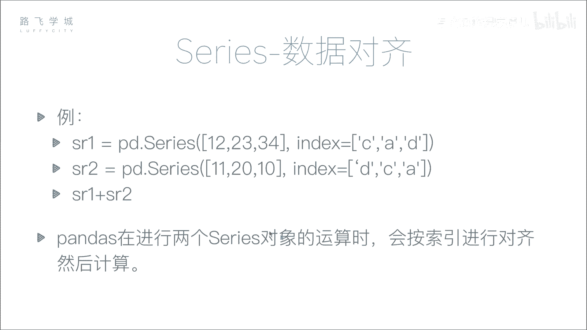
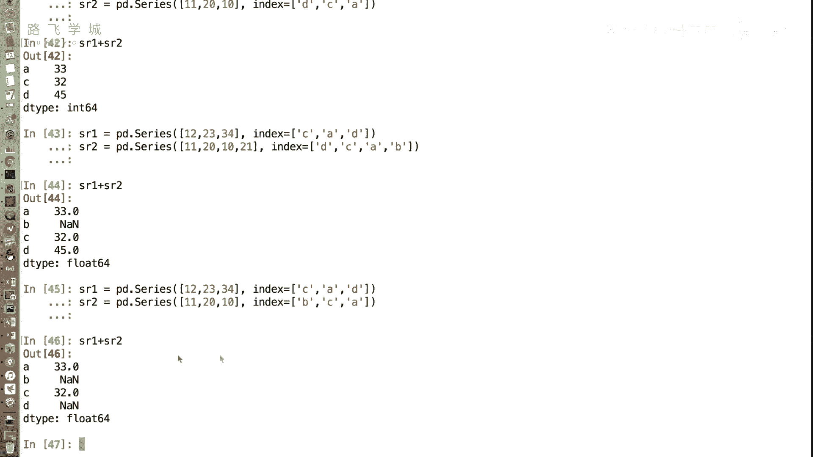
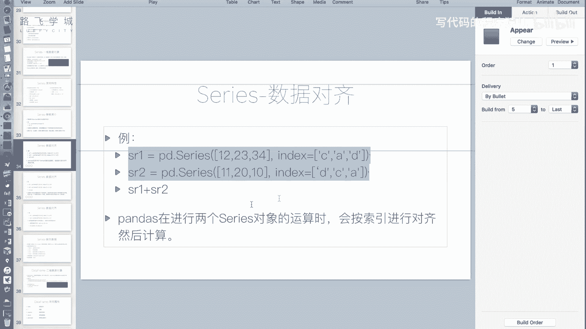
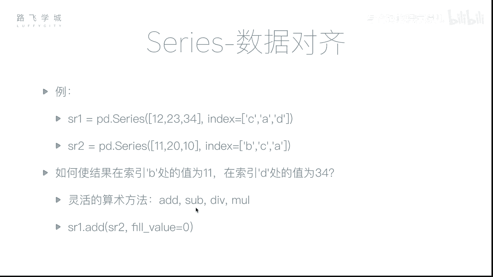
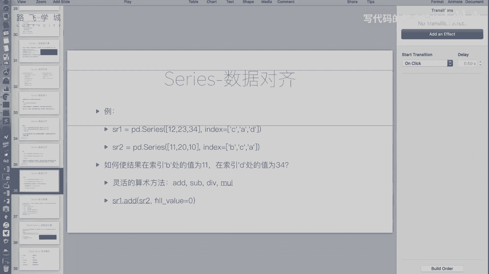
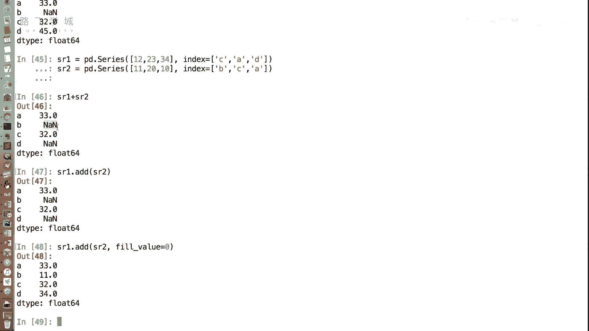

# Python金融量化：P11：Series数据对齐 📊

在本节课中，我们将要学习Pandas Series对象一个非常重要的特性：**数据对齐**。我们将了解当对两个Series进行运算时，Pandas如何根据索引标签自动对齐数据，以及如何处理由此可能产生的缺失值问题。

## 数据对齐的概念

上一节我们介绍了Series的基本操作，本节中我们来看看数据对齐。在NumPy数组中，运算通常是按位置（下标）进行的。但在Pandas的Series中，运算更倾向于按**索引标签**进行对齐。这意味着，即使两个Series的顺序不同，只要它们的索引标签匹配，Pandas就能正确地将对应项进行运算。

考虑以下两个Series对象：
```python
import pandas as pd




sr1 = pd.Series([12, 23, 34], index=[‘C‘, ‘A‘, ‘D‘])
sr2 = pd.Series([11, 20, 10], index=[‘D‘, ‘C‘, ‘A‘])
```
`s1`和`s2`的长度相同，但索引顺序不同。如果执行 `sr1 + sr2`，结果不是按位置相加（12+11, 23+20, 34+10），而是按标签对齐后相加。

## 数据对齐的运算效果

以下是数据对齐运算的具体效果。当我们执行加法时，Pandas会查找两个Series中具有相同标签的值进行运算。

```python
result = sr1 + sr2
print(result)
```
运算逻辑如下：
*   标签 `‘A‘`: `sr1[‘A‘]` (23) + `sr2[‘A‘]` (10) = 33
*   标签 `‘C‘`: `sr1[‘C‘]` (12) + `sr2[‘C‘]` (20) = 32
*   标签 `‘D‘`: `sr1[‘D‘]` (34) + `sr2[‘D‘]` (11) = 45

这个功能非常强大。例如，在金融分析中，当你需要将去年和今年的每日数据相加时，无需关心数据顺序，只要日期（索引标签）匹配，Pandas就能自动完成计算。

## 索引长度不同时的对齐

当两个Series的索引长度不同时，NumPy数组无法直接运算，但Pandas Series可以。Pandas会将两个索引的并集作为结果索引，对于只在其中一个Series中存在的标签，其运算结果会标记为缺失值。

假设有以下两个Series：
```python
sr1 = pd.Series([12, 23, 34], index=[‘A‘, ‘C‘, ‘D‘])
sr2 = pd.Series([11, 20, 10, 5], index=[‘A‘, ‘B‘, ‘C‘, ‘D‘])
```
执行 `sr1 + sr2`：
*   标签 `‘A‘`, `‘C‘`, `‘D‘` 在两个Series中都存在，正常相加。
*   标签 `‘B‘` 只存在于 `sr2` 中，在 `sr1` 中缺失。Pandas无法找到 `sr1[‘B‘]` 进行加法，因此结果中 `‘B‘` 的位置会被设置为 `NaN` (Not a Number)，在Pandas中代表缺失值。

## 灵活算术方法与缺失值填充

在某些场景下，我们可能不希望缺失值出现`NaN`。例如，计算两个月的员工出勤天数，第一个月有员工A、C、D，第二个月员工D离职，新员工B入职。在计算总出勤时，我们希望缺失的月份按0天计算，而不是`NaN`。

Pandas提供了一系列灵活的算术方法（`add`, `sub`, `mul`, `div`）来实现这个需求，它们对应加、减、乘、除。这些方法可以接受一个 `fill_value` 参数，用于指定填充缺失位置的值。

以下是使用 `add` 方法并填充0的例子：
```python
# 假设sr1是第一个月出勤，sr2是第二个月出勤
sr1 = pd.Series([12, 23, 34], index=[‘A‘, ‘C‘, ‘D‘])
sr2 = pd.Series([11, 20, 10], index=[‘A‘, ‘B‘, ‘C‘])



# 使用add方法，并设置fill_value=0
total_attendance = sr1.add(sr2, fill_value=0)
print(total_attendance)
```
运算逻辑：
*   `‘A‘`: 12 + 11 = 23
*   `‘B‘`: `sr1`中缺失，用0填充，即 0 + 20 = 20
*   `‘C‘`: 23 + 10 = 33
*   `‘D‘`: `sr2`中缺失，用0填充，即 34 + 0 = 34





这样，我们就得到了一个没有`NaN`的、符合业务逻辑的总出勤Series。



## 本节总结

本节课中我们一起学习了Pandas Series的**数据对齐**特性。我们了解到：
1.  Series间的运算基于**索引标签**对齐，而非位置，这大大提升了数据操作的灵活性和便捷性。
2.  当索引长度不同时，运算结果中不匹配的标签位置会产生**缺失值（NaN）**。
3.  通过 `add()`, `sub()` 等灵活算术方法配合 `fill_value` 参数，可以控制缺失值的填充方式，以满足不同的业务计算需求。



数据对齐是Pandas强大功能的基础，而处理对齐产生的缺失值是数据清洗中的常见任务。在接下来的课程中，我们将系统地学习如何处理这些缺失值。