# Python金融量化：P11：Series缺失值处理 📊

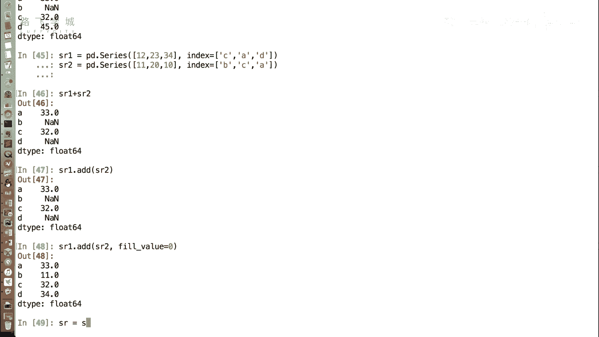

在本节课中，我们将学习如何处理Pandas Series中的缺失值。缺失值是数据分析中常见的问题，它们可能由数据未记录、采集错误等原因造成。正确处理缺失值是数据清洗的关键步骤，能确保后续分析和可视化的准确性。

上一节我们介绍了Series的基本操作，本节中我们来看看如何处理其中的缺失数据。

## 识别缺失值 🔍

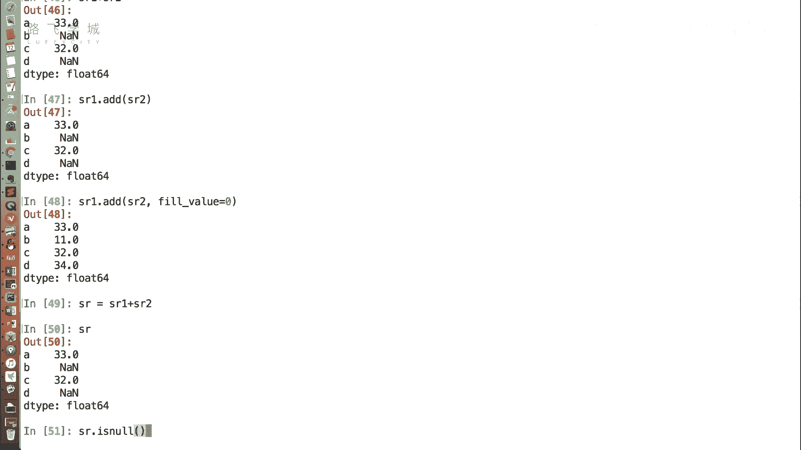

在Series中，缺失数据通常表示为`NaN`（Not a Number）。首先，我们需要能够识别出哪些位置存在缺失值。

Pandas提供了两个核心函数来判断缺失值：
*   `isnull()`: 检查每个元素是否为缺失值，是则返回`True`，否则返回`False`。
*   `notnull()`: 检查每个元素是否**不是**缺失值，不是则返回`True`，是则返回`False`。

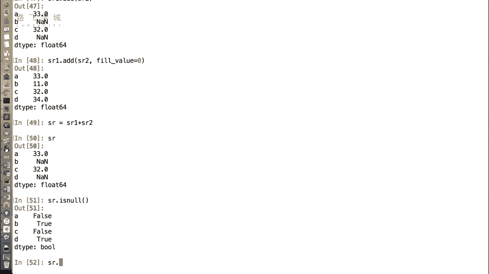

这两个函数返回的都是布尔型Series。

```python
# 假设有一个包含缺失值的Series：sr
sr_isnull = sr.isnull()  # 返回布尔Series，标记缺失值
sr_notnull = sr.notnull() # 返回布尔Series，标记非缺失值
```

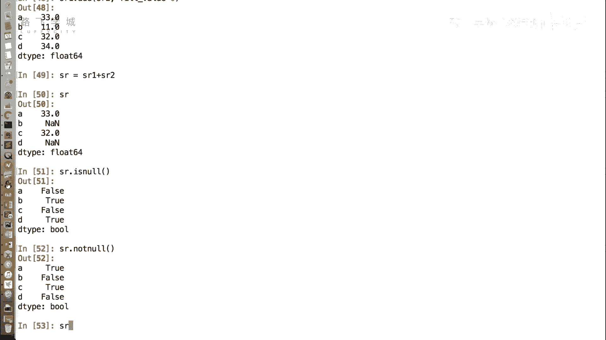

## 处理缺失值的方法 🛠️

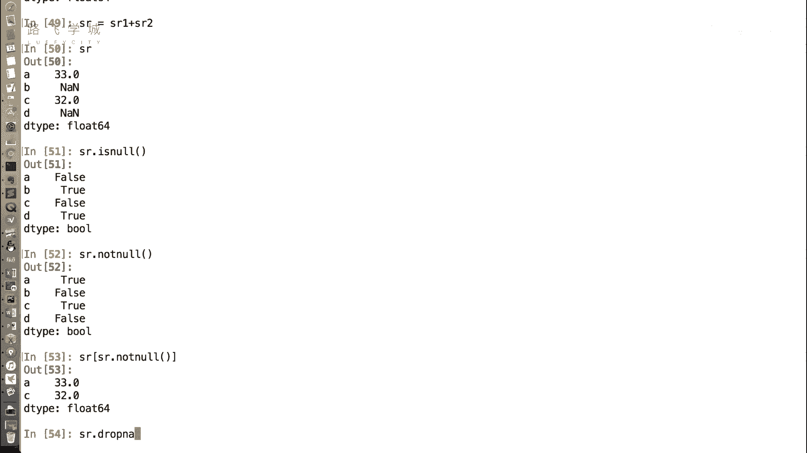

识别出缺失值后，主要有两种处理思路：删除或填充。

### 方法一：删除缺失值

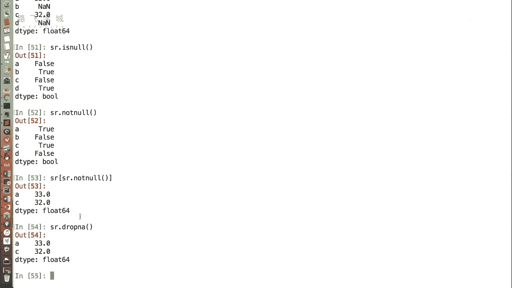

当缺失值数量较少，或删除后不影响整体分析时，可以选择直接删除包含缺失值的行。

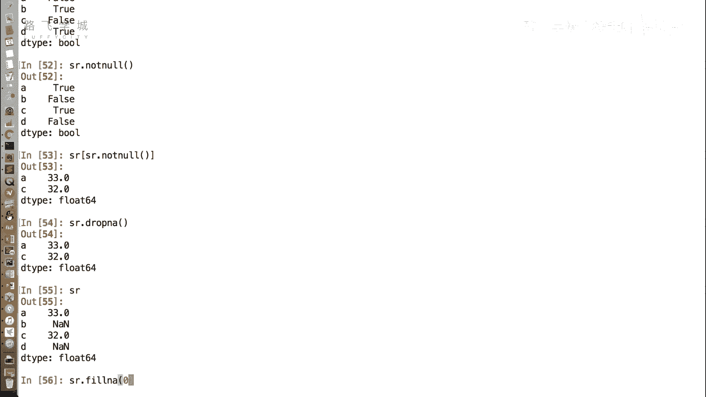

以下是删除缺失值的两种常用方式：

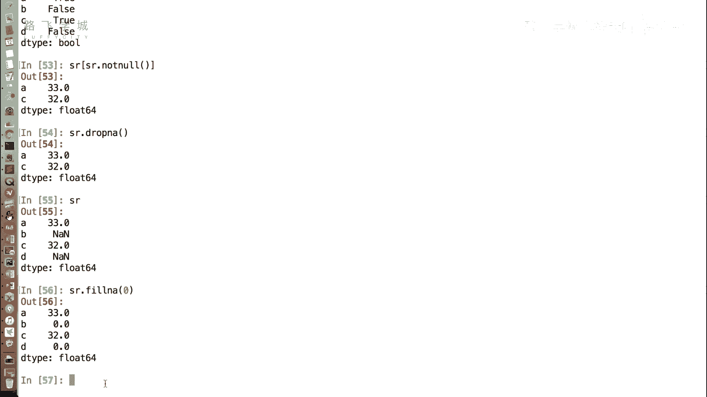

1.  **使用布尔索引过滤**：利用`notnull()`函数的结果进行索引，只保留非缺失值。
    ```python
    sr_cleaned = sr[sr.notnull()]
    ```

2.  **使用`dropna()`函数**：这是Pandas提供的专门用于删除缺失值的函数，更为直接。
    ```python
    sr_cleaned = sr.dropna()
    ```

### 方法二：填充缺失值

当数据具有连续性（如时间序列），或者删除缺失值会导致信息损失过大时，更适合用合理的值来填充缺失位置。

填充缺失值主要使用`fillna()`函数。

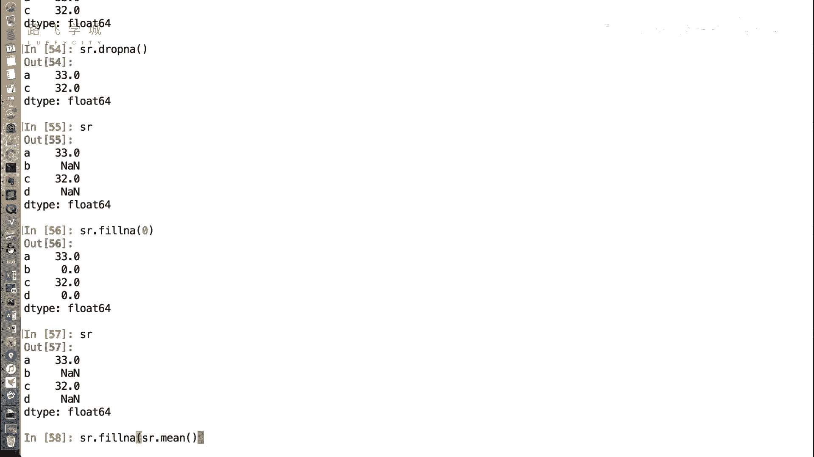

以下是几种常见的填充策略：

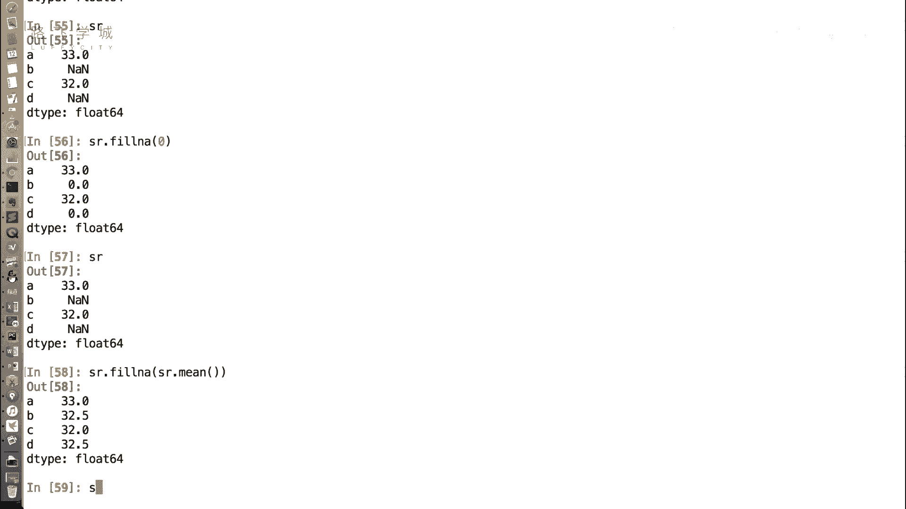

1.  **填充为固定值**：例如，将所有缺失值填充为0。
    ```python
    sr_filled = sr.fillna(0)
    ```

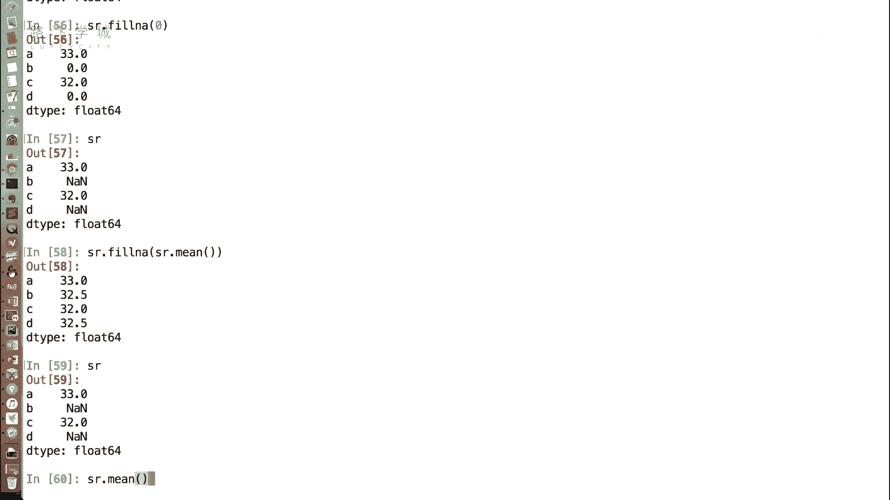

2.  **填充为统计值**：常用的是填充为该Series的平均值、中位数或众数，以保持数据的整体分布特征。Pandas在计算统计量（如`mean()`）时会自动忽略缺失值，这非常方便。
    ```python
    mean_value = sr.mean()  # 计算非缺失值的平均值
    sr_filled = sr.fillna(mean_value)  # 用平均值填充缺失值
    ```

**重要提示**：无论是`dropna()`还是`fillna()`，默认都不会修改原始Series，而是返回一个处理后的新Series。如果需要保存处理结果，必须将其赋值给一个新变量。

## 总结 📝

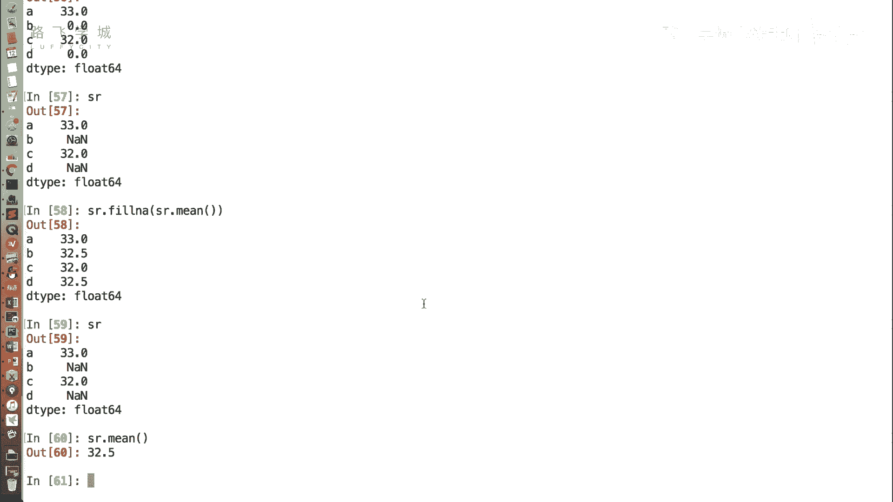

本节课中我们一起学习了如何处理Pandas Series中的缺失值。我们首先学会了使用`isnull()`和`notnull()`函数来识别缺失值。接着，我们掌握了两种核心的处理方法：一是使用`dropna()`或布尔索引**删除**缺失值所在行；二是使用`fillna()`函数，通过填充固定值（如0）或统计值（如平均值）来**填补**缺失值。理解并灵活运用这些方法，是进行数据清洗、为后续量化分析准备干净数据的关键一步。