# Python金融量化：P12：06 Matplotlib可视化：绘制2D和3D图 📊


在本节课中，我们将要学习Python中强大的数据可视化库——Matplotlib。它是继NumPy和Pandas之后，我们重点讲解的最后一个核心模块。Matplotlib主要用于将数据分析后的结果，以直观的图表形式展现出来。

本节课分为四个部分：首先介绍Matplotlib的绘图环境与基本元素；接着讲解常用的图表类型；然后学习如何结合Pandas和Seaborn进行绘图；最后通过两个实战项目巩固所学知识。


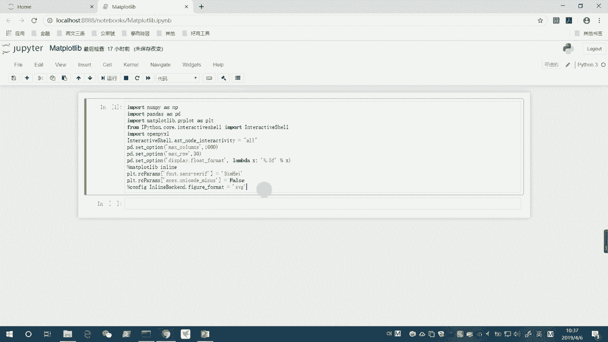

## Matplotlib绘图环境简介 🎨


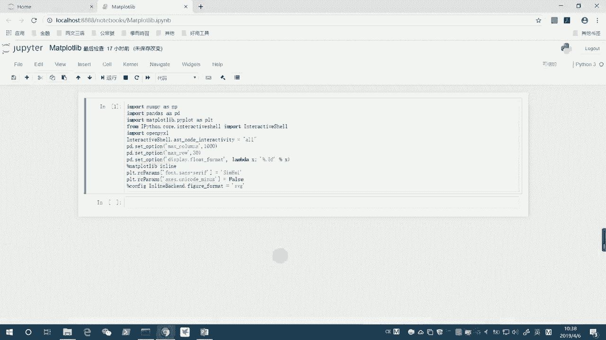

上一节我们介绍了数据分析工具，本节中我们来看看如何将分析结果可视化。首先，我们需要了解图表的基本构成元素。


想象一下，如果没有Python或Excel，我们如何手绘一张图表？我们需要一张画布（白纸），在上面绘制坐标系、坐标轴、坐标轴标签、刻度、图表标题、图例等内容。这些统称为图表的基本元素。

学习Matplotlib的过程，就是学习如何逐步构建这些元素：从创建画布开始，到绘制图形，再到添加坐标轴、标签、刻度、图例、标题、数据标签和注释等。

### 建立画布和坐标系

我们首先导入Matplotlib的核心绘图模块。

```python
import matplotlib.pyplot as plt
```

接着，进行Matplotlib的四个常用设置，以确保图表能正确显示。

```python
# 1. 在Jupyter Notebook中内嵌显示图表，无需调用plt.show()
%matplotlib inline
# 2. 设置支持中文显示（使用微软雅黑字体）
plt.rcParams['font.sans-serif'] = ['Microsoft YaHei']
# 3. 正确显示坐标轴负号
plt.rcParams['axes.unicode_minus'] = False
# 4. 设置图像为矢量图格式，保证清晰度
plt.rcParams['savefig.dpi'] = 300
plt.rcParams['figure.dpi'] = 300
```

建立画布有两种常用方法。

**方法一：** 先创建`Figure`对象，再添加子图（`Axes`对象）。

```python
# 创建画布
fig = plt.figure()
# 在画布上添加一个子图，参数‘111’表示1行1列的第1个图
ax1 = fig.add_subplot(111)
```

我们可以创建多个子图进行排列。

```python
fig = plt.figure()
# 创建2行1列的第1个子图
ax1 = fig.add_subplot(211)
# 创建2行1列的第2个子图
ax2 = fig.add_subplot(212)
```

**方法二：** 直接使用`plt.subplot()`函数，更为简洁。

```python
# 直接创建并返回当前激活的子图
plt.subplot(221) # 创建2行2列的第1个子图
```

以下是绘制子图的一个简单示例。

```python
import numpy as np

# 创建数据
x = np.arange(6)
y = np.arange(6)

# 在2x2布局的第1个位置绘制折线图
plt.subplot(221)
plt.plot(x, y)

# 在2x2布局的第4个位置绘制条形图
plt.subplot(224)
plt.bar(x, y)

plt.show()
```


通过这个例子，我们初步接触了`plot`（折线图）和`bar`（条形图）函数。


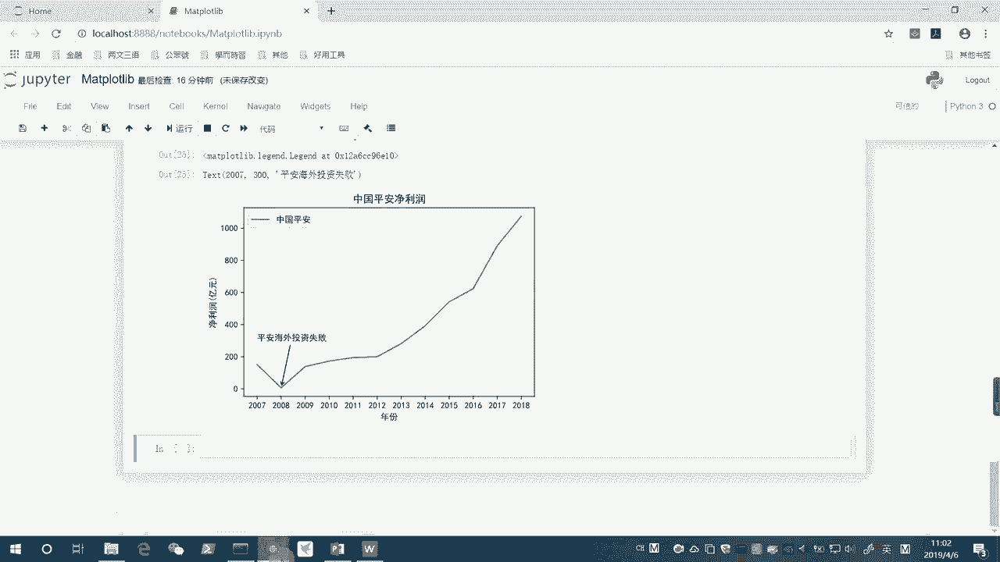

## 图表基本元素详解 📐

为了更系统地学习，我们将通过一个综合案例，一次性介绍图表的所有基本元素设置方法，而不是孤立地讲解每个元素。

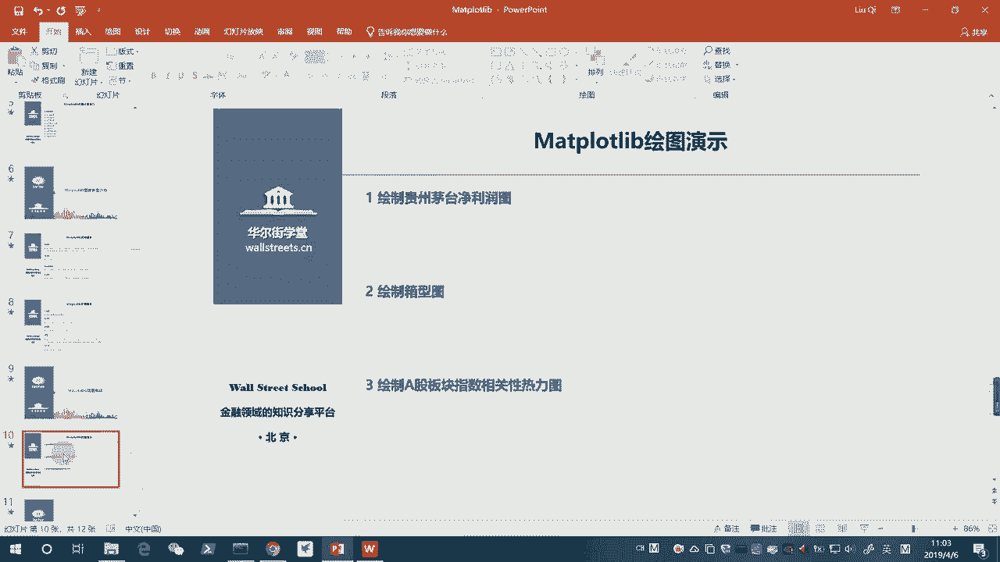

我们将以中国平安和中国人寿的净利润数据为例，绘制折线图。

```python
# 准备数据
years = np.arange(2007, 2019) # 年份：2007-2018
pingan_profit = [150.86, 6.62, 144.82, 173.11, 200.50, 282.14,
                 392.79, 479.30, 542.03, 623.94, 890.88, 1074.04] # 中国平安净利润（亿元）
chinalife_profit = [388.79, 100.68, 328.81, 336.26, 183.31, 110.61,
                    247.65, 322.11, 330.06, 191.27, 322.53, 113.95] # 中国人寿净利润（亿元）
```

### 绘制单图并添加元素

首先绘制中国平安的净利润图。

```python
# 创建画布和子图（1行1列第1个）
plt.subplot(211)

# 绘制折线图，并设置图例标签
plt.plot(years, pingan_profit, label='中国平安')

# 显示图例
plt.legend()

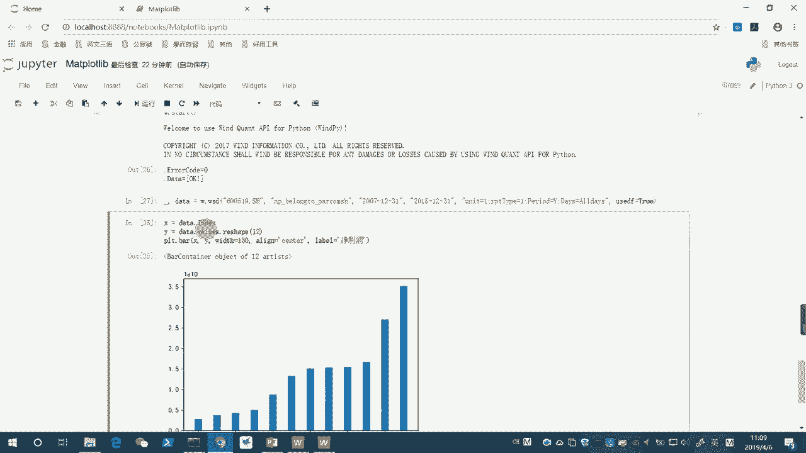


# 设置图表标题
plt.title('中国平安净利润')

# 设置坐标轴标签
plt.xlabel('年份')
plt.ylabel('净利润（亿元）')

# 设置X轴刻度，显示所有年份
plt.xticks(years, rotation=45) # rotation参数使标签旋转45度，避免重叠

plt.show()
```

### 绘制多子图与调整布局

接着，在同一画布上添加中国人寿的净利润图进行对比。

```python
# 第一幅图：中国平安
plt.subplot(211)
plt.plot(years, pingan_profit, label='中国平安')
plt.legend(loc='upper left') # 将图例位置设置在左上角
plt.title('中国平安净利润')
plt.ylabel('净利润（亿元）')

# 第二幅图：中国人寿
plt.subplot(212)
plt.plot(years, chinalife_profit, label='中国人寿', color='orange')
plt.legend(loc='upper left')
plt.title('中国人寿净利润')
plt.xlabel('年份')
plt.ylabel('净利润（亿元）')

# 调整子图之间的纵向间距，避免重叠
plt.subplots_adjust(hspace=0.75)

plt.show()
```

通过对比，可以直观看出两家公司净利润增长趋势的差异。

### 添加数据标签与注释

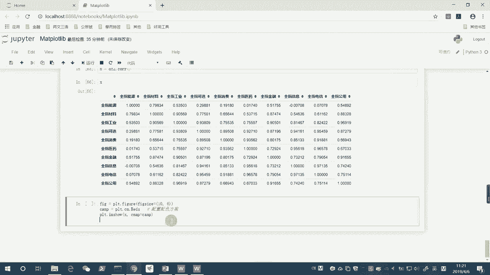

有时我们需要在图表特定位置添加说明。

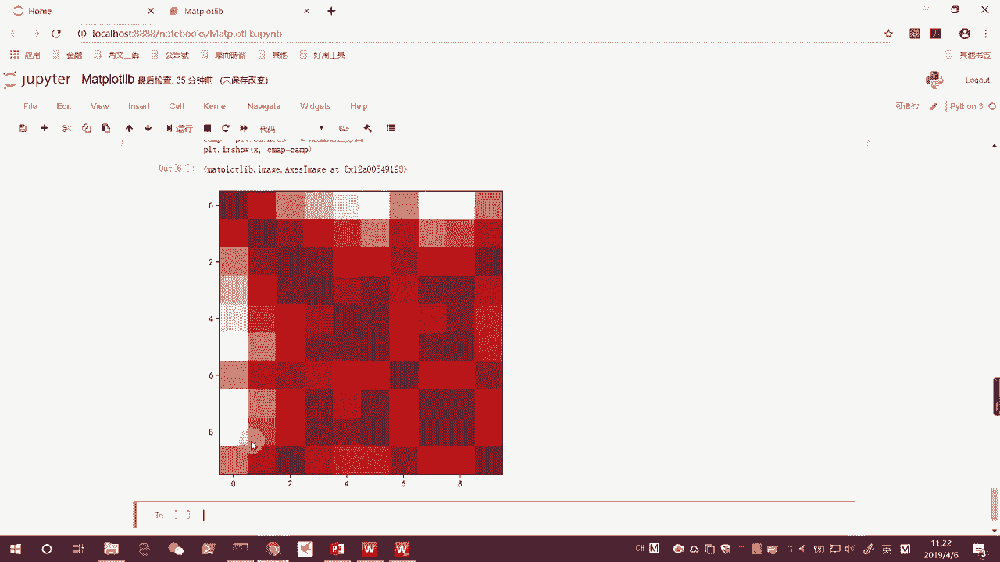

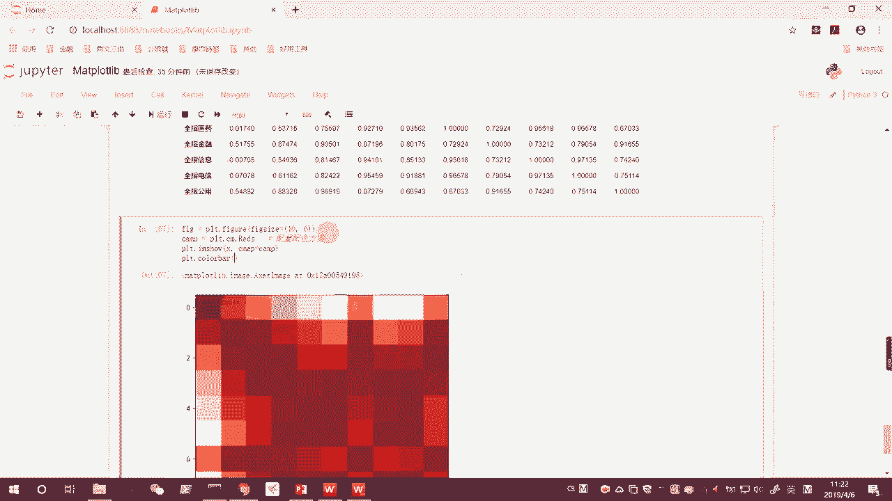

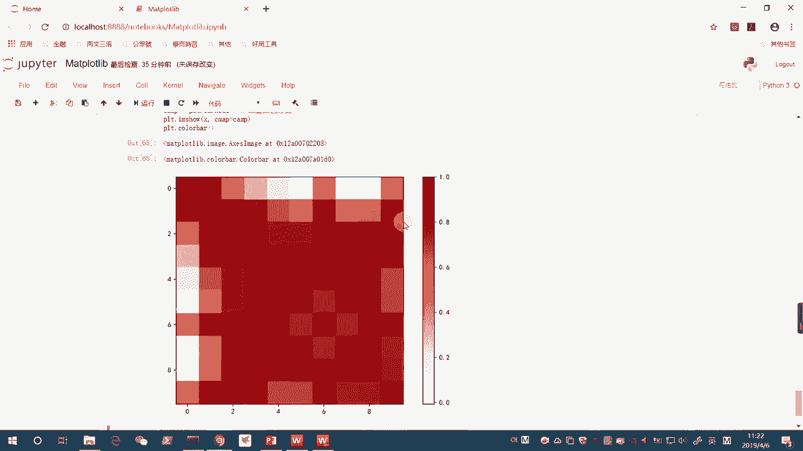

```python
# 绘制中国平安单图
plt.plot(years, pingan_profit, label='中国平安')
plt.legend()
plt.title('中国平安净利润')
plt.xlabel('年份')
plt.ylabel('净利润（亿元）')
plt.xticks(years, rotation=45)

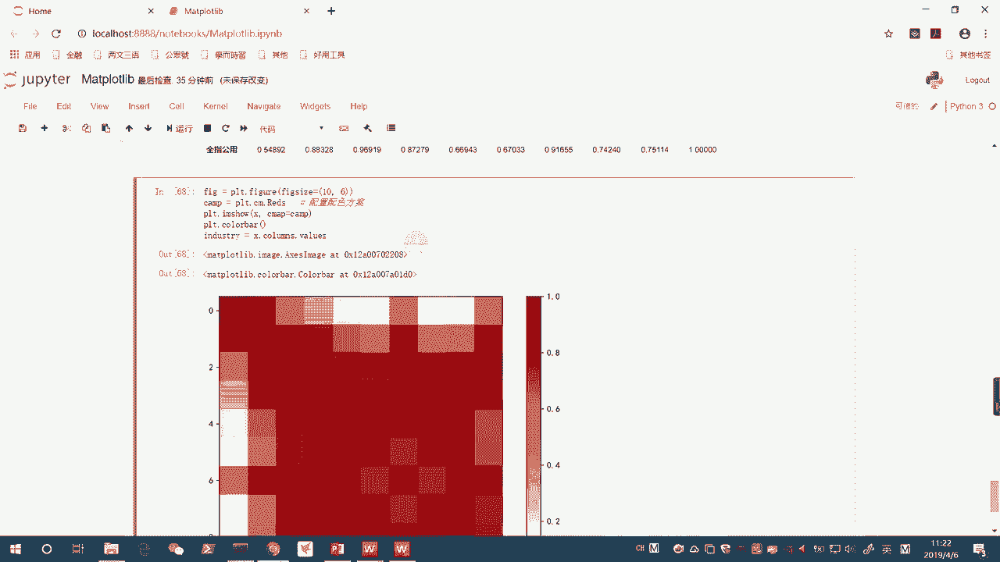

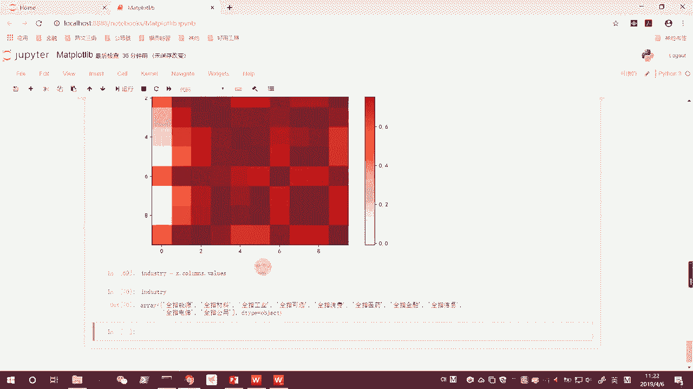

# 1. 添加数据标签：在2008年低点标注具体数值
# plt.text(x坐标, y坐标, ‘文本内容’)
plt.text(2008, 6.62, '6.62亿元', fontsize=9)

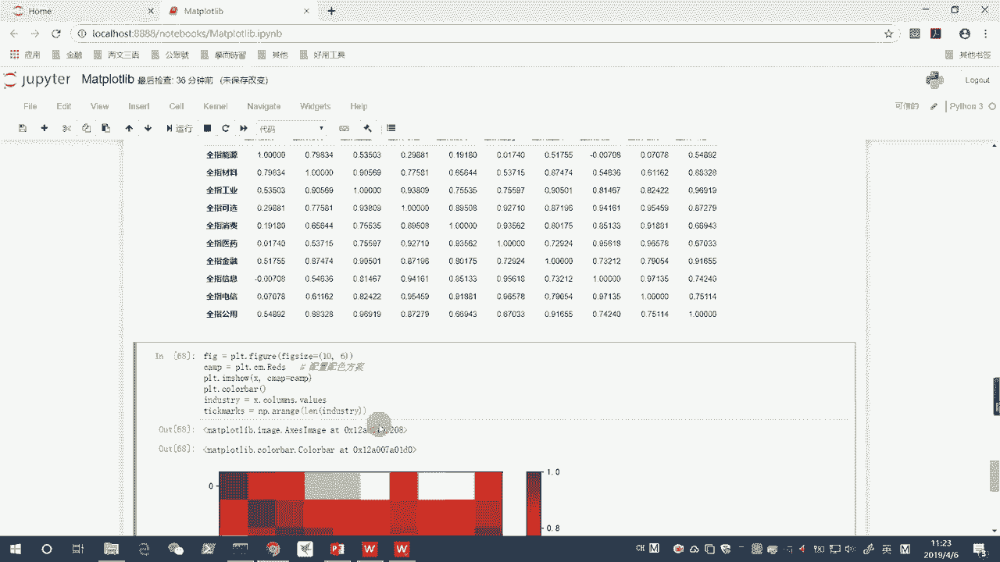

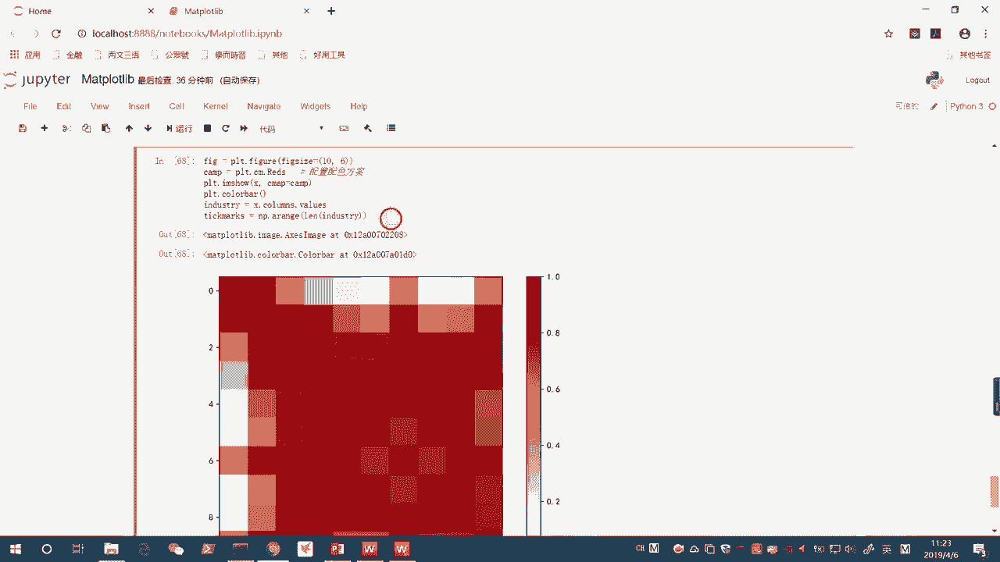

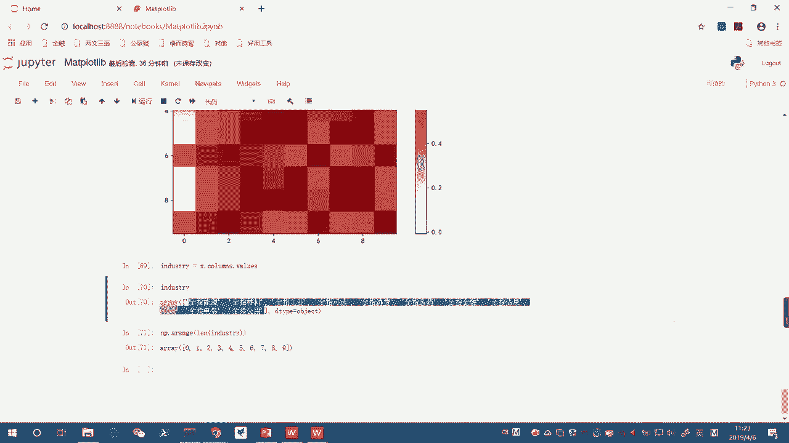

# 2. 添加带箭头的注释
# plt.annotate(‘注释文本’, xy=(箭头指向点), xytext=(文本起始点), arrowprops=箭头属性)
plt.annotate('平安海外投资失败',
             xy=(2008, 6.62),        # 箭头指向2008年的数据点
             xytext=(2007, 300),     # 注释文本放置在(2007, 300)的位置
             arrowprops=dict(facecolor='black', arrowstyle='->')) # 黑色实心箭头

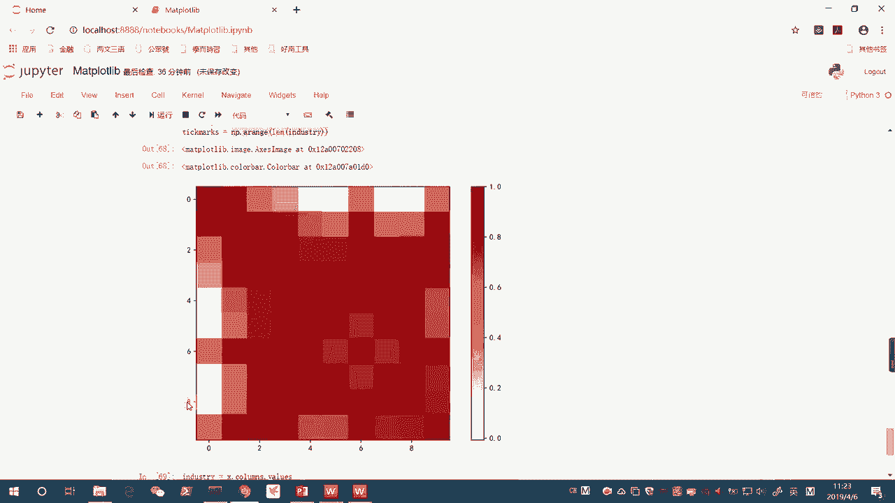

plt.show()
```

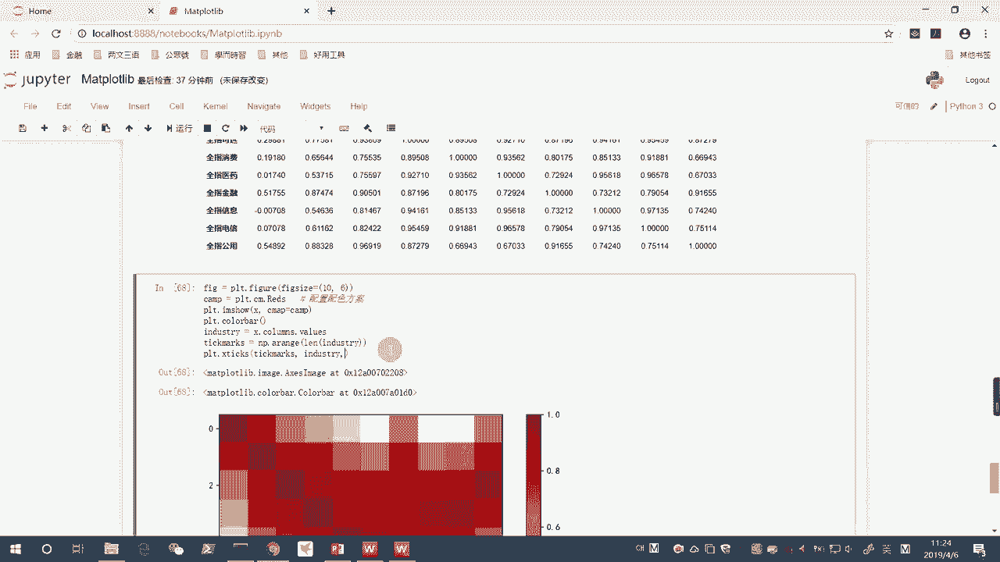

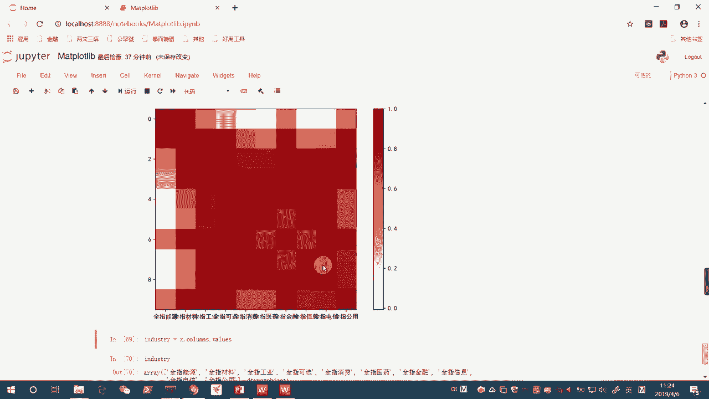

## 常用图表类型介绍 📈

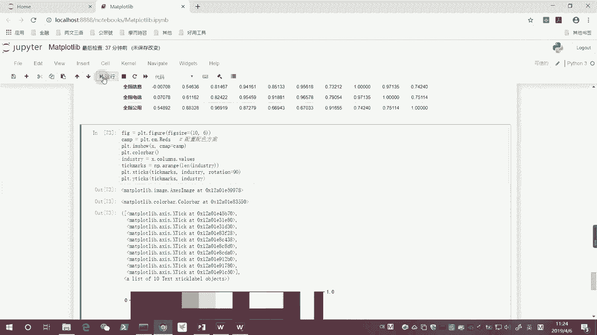

Matplotlib支持绘制多种类型的图表。以下是核心图表类型及其对应的绘图函数：

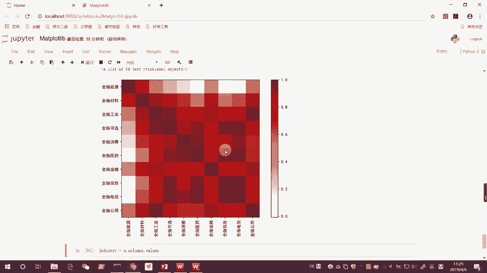

*   **折线图 (Line Plot):** `plt.plot(x, y)`
*   **柱状图 (Bar Chart):** `plt.bar(x, height)`
*   **横向条形图 (Horizontal Bar Chart):** `plt.barh(y, width)`
*   **散点图 (Scatter Plot):** `plt.scatter(x, y)`
*   **气泡图 (Bubble Chart):** `plt.scatter(x, y, s=size)` # `s`参数控制点的大小
*   **面积图 (Area Plot):** `plt.fill_between(x, y1, y2)`
*   **箱形图 (Box Plot):** `plt.boxplot(data)`
*   **饼图 (Pie Chart):** `plt.pie(sizes, labels=labels)`
*   **热力图 (Heatmap):** `plt.imshow(data)` 或 `seaborn.heatmap(data)`

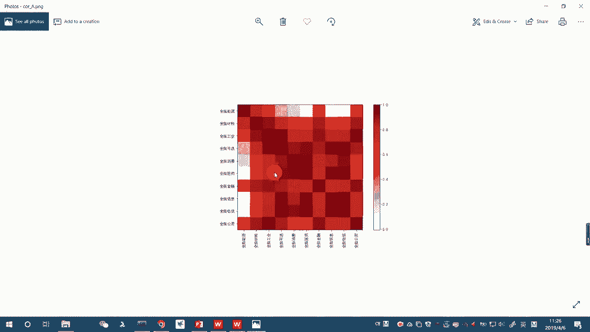

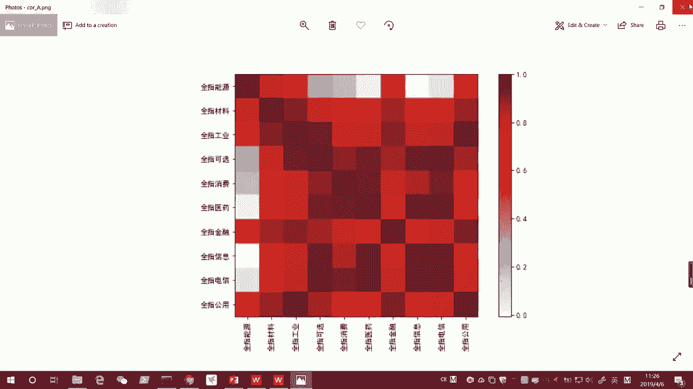

**学习建议：** 无需死记硬背所有函数的参数。在实际使用时，借助代码编辑器的提示功能，并结合查阅[官方文档](https://matplotlib.org/stable/contents.html)，边用边学是最有效的方法。

## 结合Pandas进行绘图 🔗

Pandas的DataFrame与Matplotlib集成度很高，通常能更简便地绘图。

### 案例1：绘制股票净利润柱状图

假设我们通过Wind API获取了贵州茅台的年度净利润数据。

```python
# 假设data是从Wind获取的DataFrame，包含‘净利润’列和日期索引
# data = w.edb(...) 此处为模拟数据
import pandas as pd
np.random.seed(42)
dates = pd.date_range('2008-12-31', periods=12, freq='Y')
data = pd.DataFrame({'净利润': np.random.randn(12).cumsum() + 100}, index=dates)

# 方法A：使用Matplotlib原始方式，需要手动提取数据
plt.bar(data.index, data['净利润'].values, width=250) # width调整柱宽
plt.title('贵州茅台净利润')
plt.xlabel('年份')
plt.ylabel('净利润（亿元）')
plt.show()

# 方法B：直接使用DataFrame的plot方法（更推荐！）
data.plot(kind='bar', legend=False) # kind指定图表类型
plt.title('贵州茅台净利润')
plt.xlabel('年份')
plt.ylabel('净利润（亿元）')
plt.show()
```

### 案例2：绘制股价与均线

绘制沪深300指数收盘价及其250日年线。

```python
# 假设`data`是包含‘close’列的股价DataFrame
# 计算250日移动平均线
data['close_250'] = data['close'].rolling(250).mean()

# 直接使用DataFrame绘图，会自动将列名作为图例
data[['close', 'close_250']].plot(figsize=(10, 6))
plt.title('沪深300指数收盘价与250日均线')
plt.ylabel('价格')
plt.show()
```

**核心建议：** 在绘图时，应优先考虑使用DataFrame的`.plot()`方法，它通常更加简洁高效。

## 实战项目演练 🚀

### 项目一：绘制全A股等权PE估值图

目标：计算剔除异常值后的全A股月度等权平均市盈率(PE)，并绘制其历史趋势与分位线。

```python
# 1. 加载PE数据（假设已加载为DataFrame `pe_data`，包含‘date’， ‘PE’列）
# pe_data = pd.read_csv(...)

# 2. 数据清洗：删除缺失值，剔除PE为负及极高的异常值
pe_data_clean = pe_data.dropna()
def filter_pe(group):
    """对每月的数据组进行过滤"""
    # 保留PE大于0且小于95%分位数的数据
    condition = (group[‘PE’] > 0) & (group[‘PE’] < group[‘PE’].quantile(0.95))
    return group[condition][‘PE’].mean() # 返回该月过滤后的PE均值

# 按月份分组并应用过滤函数
monthly_pe = pe_data_clean.groupby(‘date’).apply(filter_pe)
monthly_pe.name = ‘等权PE’

# 3. 计算最近10年的PE分位数（例如10%，20%，...，100%）
years_back = 10
recent_data = monthly_pe.iloc[-years_back*12:] # 获取最近10年数据
quantiles = recent_data.quantile([i/10 for i in range(11)]) # 计算10%间隔的分位数
quantile_list = quantiles.tolist()

# 4. 绘图
plt.figure(figsize=(12, 8))
monthly_pe.plot(color=‘k’, linewidth=2)
plt.title(‘全A股等权PE历史走势’, fontsize=15)
plt.xlabel(‘年份’)
plt.ylabel(‘等权PE’)
plt.grid(True, alpha=0.3)

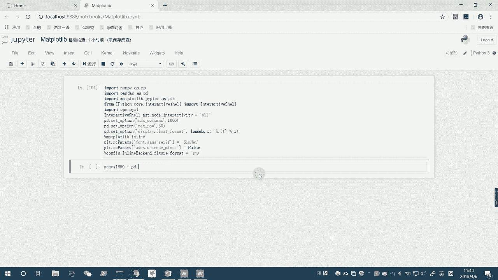


# 添加分位水平线
colors = [‘green’] * 5 + [‘red’] * 5 # 低PE区间用绿色，高PE区间用红色
for i, (q, color) in enumerate(zip(quantile_list[:-1], colors)):
    plt.axhline(y=q, color=color, linestyle=‘--’, linewidth=0.8,
                label=f‘{i*10}%-{(i+1)*10}%分位’)
plt.legend()
plt.show()
```

这幅图能清晰展示市场估值所处的历史位置，辅助投资决策。

### 项目二：美国婴儿姓名趋势分析

这是一个完整的数据分析流程案例，涉及数据聚合、分组计算和趋势可视化。

```python
# 1. 批量读取多年份数据文件
years = range(1880, 2011)
pieces = []
columns = [‘name’, ‘sex’, ‘births’]

for year in years:
    path = f‘data/baby_names/yob{year}.txt’ # 假设文件按此格式命名
    frame = pd.read_csv(path, names=columns)
    frame[‘year’] = year # 添加年份列
    pieces.append(frame)

# 合并所有年份的数据
names = pd.concat(pieces, ignore_index=True)

# 2. 按年份和性别计算总出生人数
total_births = names.pivot_table(values=‘births’, index=‘year’,
                                 columns=‘sex’, aggfunc=‘sum’)
total_births.plot(title=‘按性别和年份划分的出生人口’)
plt.ylabel(‘出生人数’)
plt.show()

# 3. 分析名字多样性的变化：计算每年每性别前1000个名字的占比
def add_prop(group):
    """为每组数据添加比例列"""
    group[‘prop’] = group[‘births’] / group[‘births’].sum()
    return group

names = names.groupby([‘year’, ‘sex’]).apply(add_prop)

# 获取每年每性别的前1000个名字
pieces = []
for (year, sex), group in names.groupby([‘year’, ‘sex’]):
    top_1000 = group.sort_values(by=‘births’, ascending=False).head(1000)
    pieces.append(top_1000)
top_1000 = pd.concat(pieces, ignore_index=True)

# 计算前1000名名字的合计占比
table = top_1000.pivot_table(values=‘prop’, index=‘year’,
                             columns=‘sex’, aggfunc=‘sum’)
table.plot(title=‘前1000名名字的出生人数占比趋势’)
plt.ylabel(‘比例’)
plt.show()
```

该分析显示，随着时间推移，热门名字的集中度在下降，意味着名字的多样性在增加。

## 总结 📝

本节课中我们一起学习了Matplotlib的核心知识。我们从建立画布和坐标系的基础讲起，详细介绍了图表的各种基本元素（标题、坐标轴、图例、标签等）的设置方法。然后，我们列举了Matplotlib支持的主要图表类型。

更重要的是，我们学习了如何将Pandas DataFrame与Matplotlib无缝结合，这是实际工作中最高效的绘图方式。最后，通过“全A股等权PE估值图”和“美国婴儿姓名分析”两个实战项目，我们完整演练了从数据处理到可视化分析的全流程。

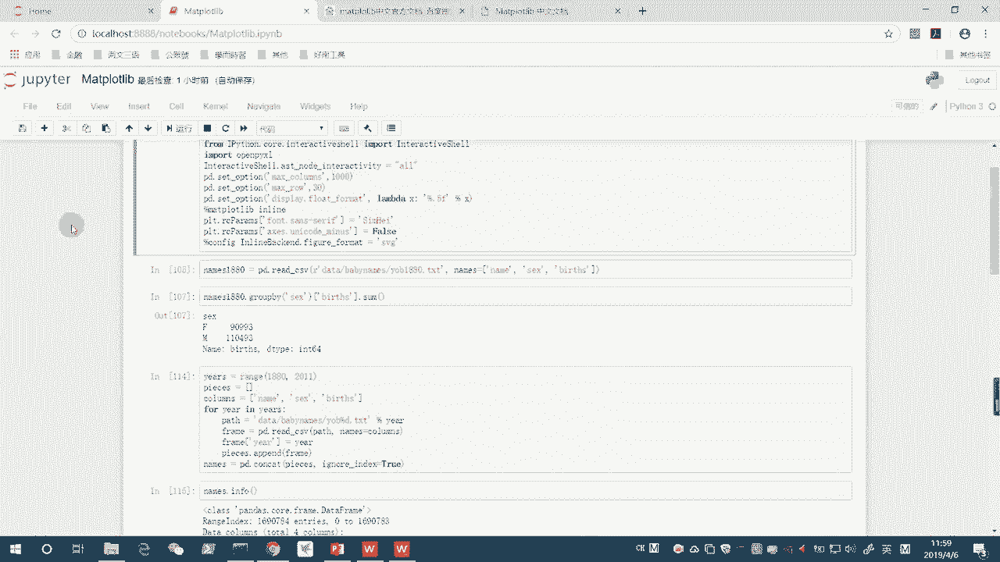

Matplotlib功能强大，建议大家在课后多阅读[官方文档](https://matplotlib.org/stable/contents.html)或其中文翻译，并结合实际项目需求“干中学”，掌握最常用的部分即可。