# Python金融量化：P12：Series缺失值处理 📊

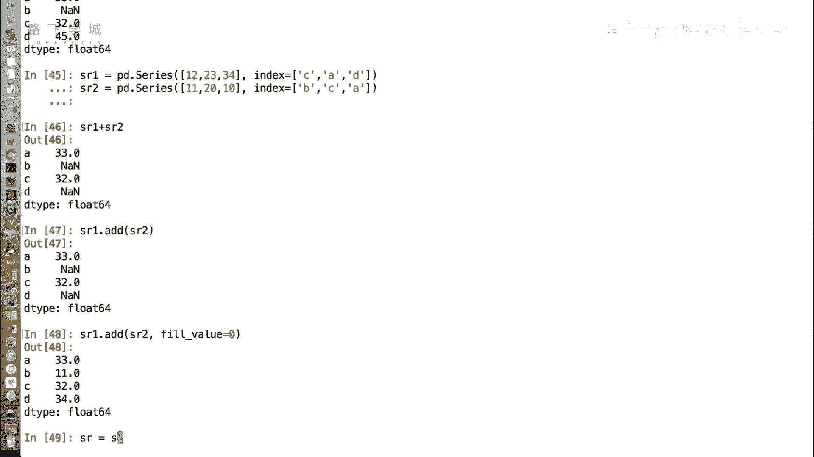

在本节课中，我们将要学习如何处理Pandas Series中的缺失值。缺失值是数据分析中常见的问题，它们可能由数据未记录、采集错误等原因造成。正确处理缺失值是保证分析结果准确性的重要步骤。

上一节我们介绍了Series的基本操作，本节中我们来看看如何处理其中的缺失数据。

## 什么是缺失值？

在Series中，缺失数据通常以`NaN`（Not a Number）值的形式出现。出现缺失数据时，有时我们可以放任不管，但有时为了进行进一步运算或生成图表，我们需要将其处理掉。

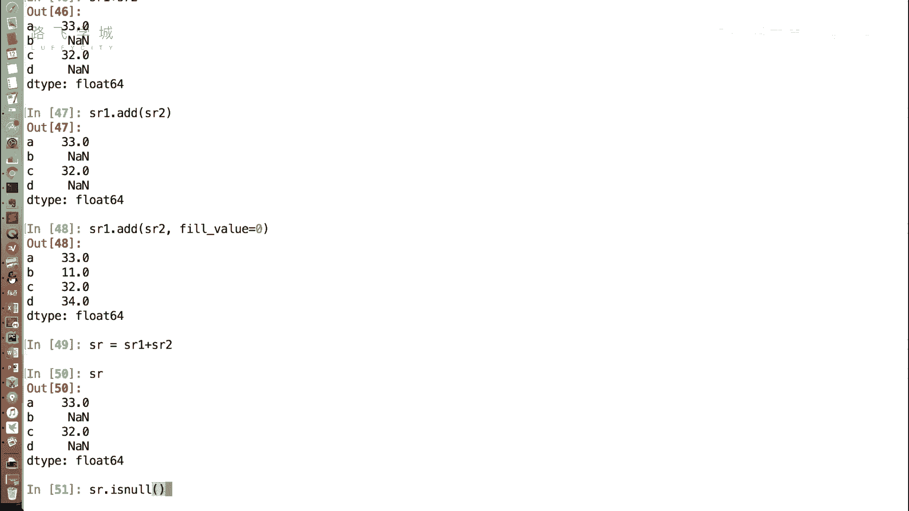

## 缺失值处理方法

处理缺失值主要有两种方法：删除缺失值或填充缺失值。

### 方法一：删除缺失值

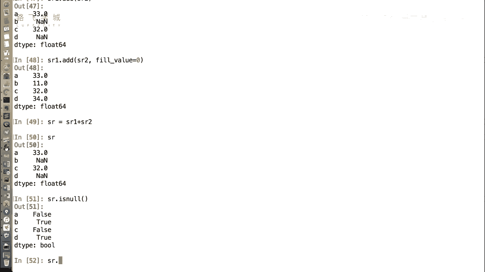

第一种方法是将包含缺失数据的行直接删除。以下是相关的操作步骤。

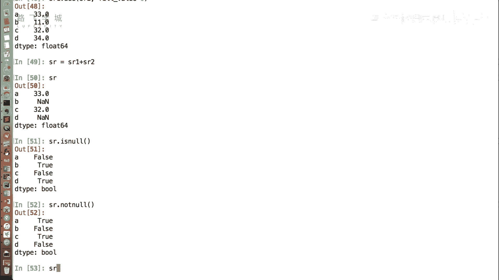

首先，我们可以使用函数来判断某一行是否为缺失数据。

**判断缺失值的函数：**
```python
SR.isnull()
```
执行这个函数会返回一个布尔型Series，其中`True`表示该位置是`NaN`（缺失值），`False`则表示不是。

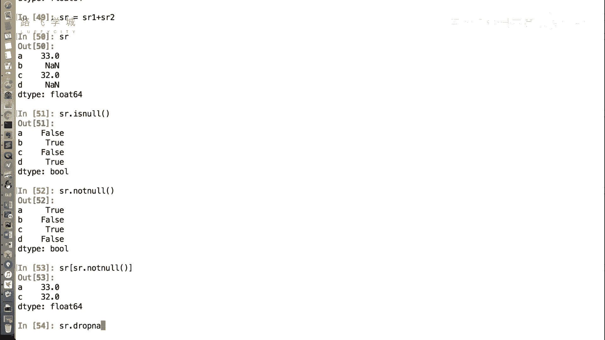

**注意：** 这个函数名是`isnull`，而不是`isnan`，但两者表示的意思相同，都是指缺失值。

与之相对的还有一个函数`notnull`，它的逻辑与`isnull`相反。

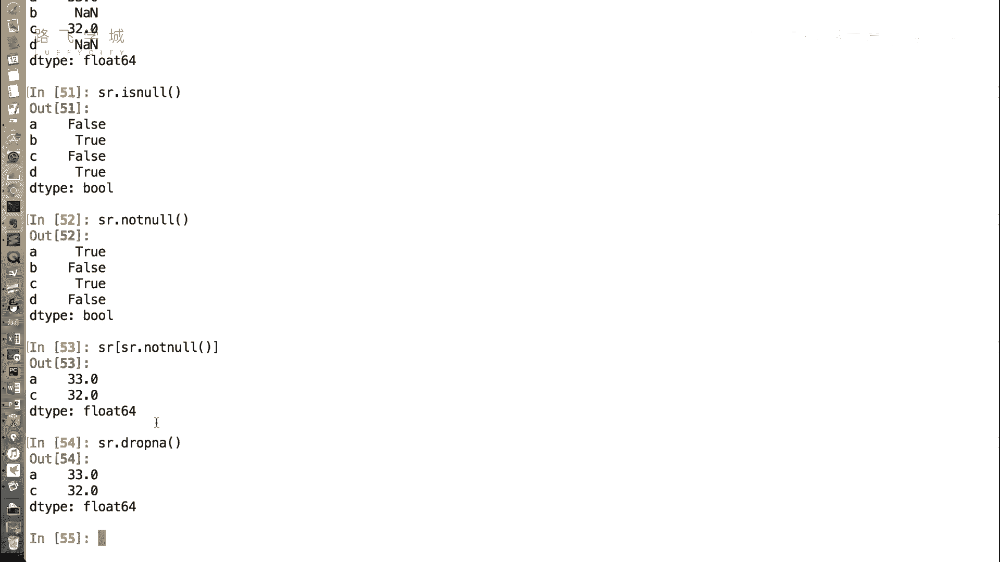

**判断非缺失值的函数：**
```python
SR.notnull()
```
这个函数在不是缺失值的地方返回`True`，是缺失值的地方返回`False`。

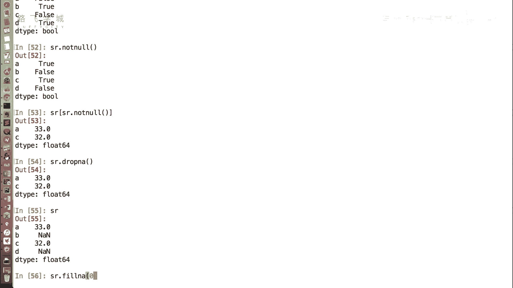

基于布尔索引的特性，我们可以过滤掉缺失值。

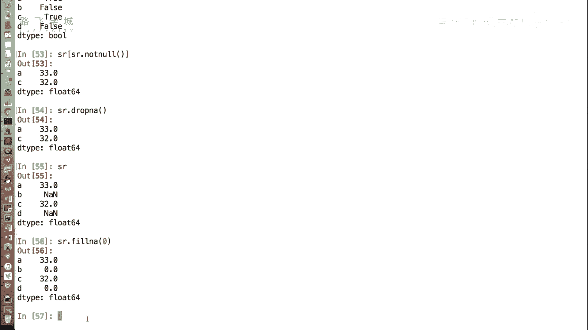

**使用布尔索引过滤缺失值：**
```python
SR[SR.notnull()]
```
此外，Pandas还提供了一个直接删除缺失值的函数`dropna`。

**直接删除缺失值的函数：**
```python
SR.dropna()
```
这个函数会直接删除所有包含缺失值的行。

### 方法二：填充缺失值

第二种方法是为缺失值赋予一个新值。如果数据缺失，我们可以用其他值来填充它。

填充缺失值的函数是`fillna`。

**填充缺失值的函数：**
```python
SR.fillna(value)
```
例如，我们可以将所有`NaN`值填充为0。

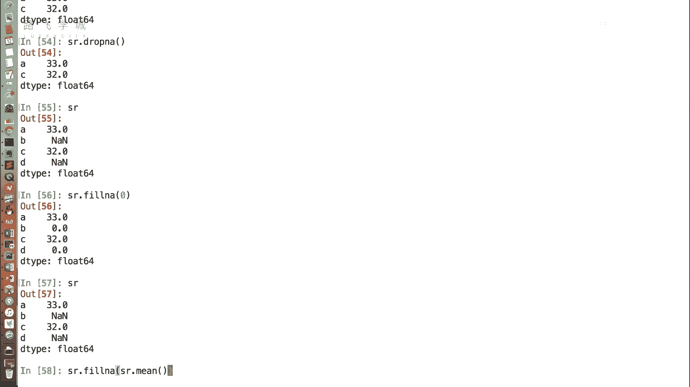

**示例：填充为0**
```python
SR.fillna(0)
```
执行后，所有`NaN`值就会变成0。

**重要提示：** 包括NumPy和Pandas在内的数据处理模块，其操作通常不会直接在原数据（如`SR`）上进行修改。如果你希望保存填充后的结果，需要将其赋值给一个新变量。

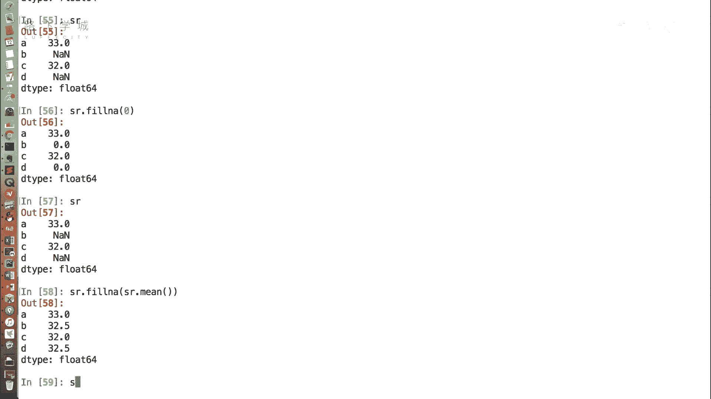

除了填充固定值，我们还可以根据实际情况选择更合理的填充方式。例如，有时缺失值表示某天或某月没有记录，填充为0可能导致数据不连续。此时，一个常用的方法是填充为该列的平均值。

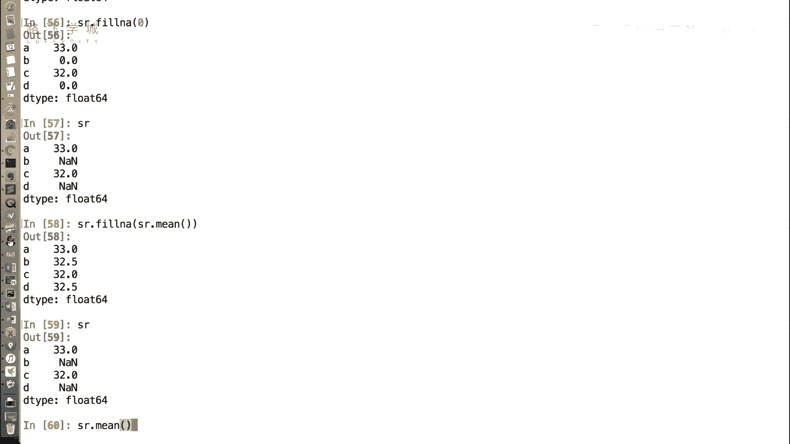

**示例：填充为平均值**
```python
SR.fillna(SR.mean())
```
这里，`SR.mean()`会计算该Series的平均值。**需要注意的是**，`mean()`函数在计算时会自动跳过`NaN`值，只对有效值进行计算，这非常方便。

如果你不使用Pandas，而是用普通的列表或字典处理包含缺失值的数据，会非常麻烦。Pandas的这些功能极大地简化了数据清洗过程。

## 总结

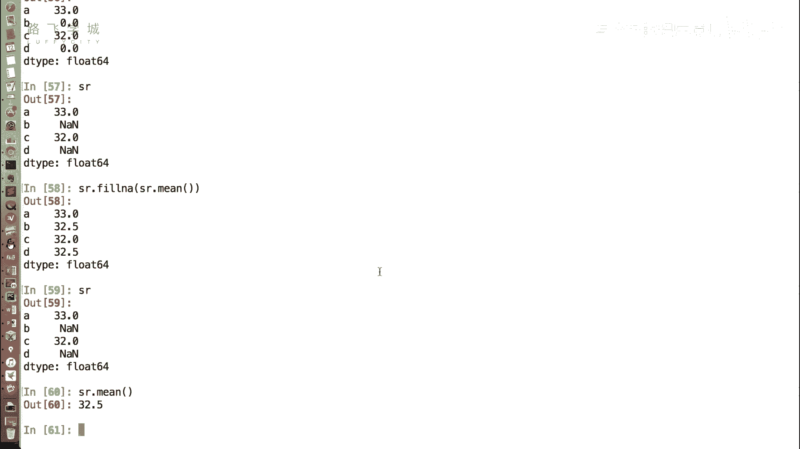

本节课中我们一起学习了如何处理Pandas Series中的缺失值。我们介绍了两种主要方法：**删除缺失值**（使用`dropna`或布尔索引）和**填充缺失值**（使用`fillna`并指定填充值，如0或平均值）。理解并掌握这些方法，是进行数据清洗和准备的关键步骤，能为后续的金融量化分析打下坚实基础。