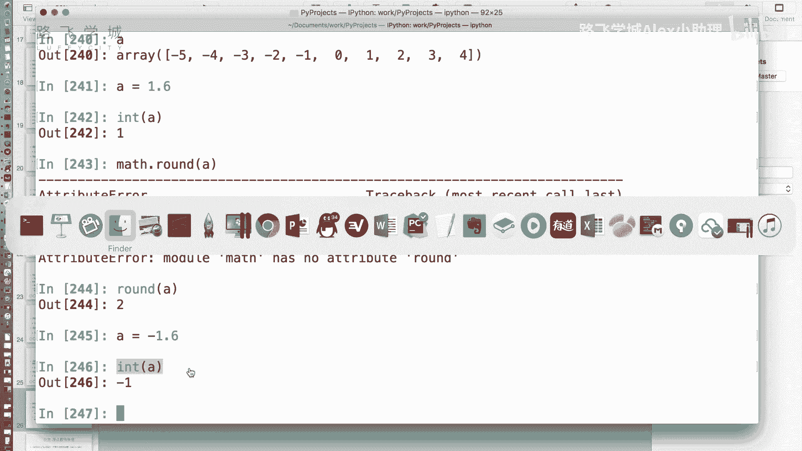
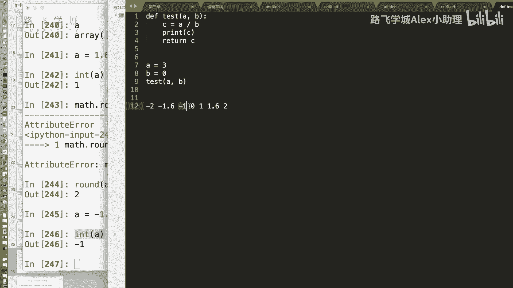
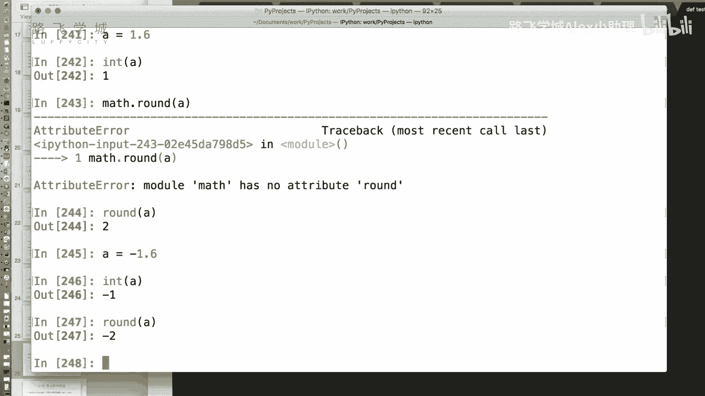
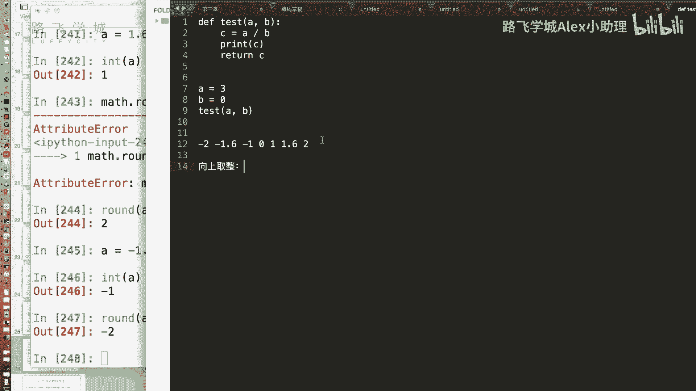
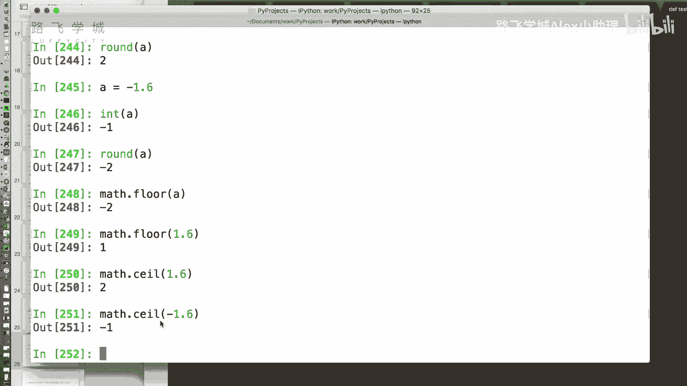
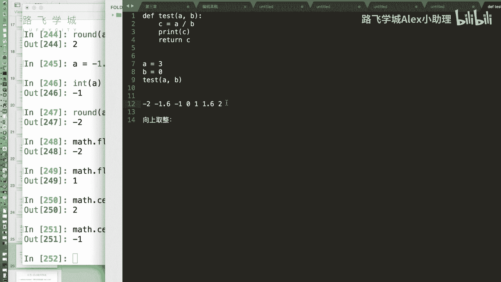

# Python金融量化：P12：15 金融量化分析-numpy-array通用函数 🧮

在本节课中，我们将要学习NumPy库中的通用函数。通用函数可以对数组中的每个元素进行快速、批量的数学运算，这是NumPy高效处理数据的基础。我们将从简单的数学运算开始，逐步介绍一些特殊的数学函数和数值处理技巧。

## 数组的通用运算

上一节我们介绍了数组对象的索引功能，本节中我们来看看NumPy还提供了哪些强大的功能。首先，NumPy提供了大量的通用函数。我们之前已经知道，数组对象可以进行加减乘除等批量运算。那么，对于一些更复杂的数学运算，我们同样希望它们能对整个数组进行批量操作。

以下是NumPy中一些常用的一元通用函数示例：

*   **绝对值**：使用 `np.abs()` 函数可以对数组中的所有元素取绝对值。
    ```python
    import numpy as np
    a = np.array([-5, -2, 0, 2, 5])
    result = np.abs(a)  # 结果为 [5 2 0 2 5]
    ```
*   **平方根**：使用 `np.sqrt()` 函数可以对数组中的所有正数元素进行开方运算。对于负数，结果将是 `nan`。
    ```python
    a = np.array([4, 9, 16])
    result = np.sqrt(a)  # 结果为 [2. 3. 4.]
    ```
*   **指数与对数**：NumPy也提供了 `np.exp()`（指数）、`np.log()`（自然对数）等数学函数。



## 四种取整方式





除了基本的数学运算，NumPy还提供了多种取整函数。在Python中，将小数转换为整数有多种方法。例如，`int()` 函数是“向零取整”，`round()` 函数是“四舍五入”。此外，还有两种重要的取整方式：“向上取整”和“向下取整”。



为了更好地理解，我们可以参考数轴。假设我们有一个数1.6和-1.6：
*   **向零取整**：朝着数轴上零的方向取整。`int(1.6)` 结果为1，`int(-1.6)` 结果为-1。
*   **四舍五入**：根据小数部分决定方向。`round(1.6)` 结果为2，`round(-1.6)` 结果为-2。
*   **向下取整**：朝着数轴负无穷方向（向左）取整。`np.floor(1.6)` 结果为1，`np.floor(-1.6)` 结果为-2。
*   **向上取整**：朝着数轴正无穷方向（向右）取整。`np.ceil(1.6)` 结果为2，`np.ceil(-1.6)` 结果为-1。

以下是NumPy中对应的取整函数：





*   **向下取整**：`np.floor()`
*   **向上取整**：`np.ceil()`
*   **四舍五入**：`np.round()` 或 `np.rint()`
*   **向零取整**：`np.trunc()`

这些函数可以一次性对整个数组进行取整操作，非常方便。

## 分离整数与小数部分

有时我们需要分别获取一个数字的整数部分和小数部分。NumPy提供了 `np.modf()` 函数来实现这个功能。

`np.modf()` 函数接收一个数组，并返回两个数组组成的元组，第一个数组是各元素的小数部分，第二个数组是各元素的整数部分。

```python
a = np.array([1.2, 2.7, -3.8])
fractional_part, integer_part = np.modf(a)
# fractional_part 为 [ 0.2  0.7 -0.8]
# integer_part 为 [ 1.  2. -3.]
```

## 特殊数值：nan与inf

在进行数组运算时，你可能会遇到两种特殊的浮点数值：`nan` 和 `inf`。

*   **nan**：代表“Not a Number”（不是一个数字）。它通常出现在未定义的数学运算中，例如 `0.0 / 0.0` 或对负数开平方根。
*   **inf**：代表“infinity”（无穷大）。它通常出现在一个非零数除以零的情况下，例如 `5.0 / 0.0`。

NumPy引入这些特殊值是为了避免在数组运算中因个别无效计算而导致整个操作失败。例如，当你用一个包含零的数组做除法时，程序不会报错，而是将 `0/0` 的结果标记为 `nan`，将 `5/0` 的结果标记为 `inf`。

处理这些特殊值时需要注意：
*   `nan` 不等于任何值，甚至不等于它自己。即 `np.nan == np.nan` 的结果是 `False`。
*   要判断数组中的元素是否为 `nan`，必须使用 `np.isnan()` 函数。
*   `inf` 等于它自己。即 `np.inf == np.inf` 的结果是 `True`。可以使用 `np.isinf()` 函数进行判断，或者直接用等号比较。

以下是如何在数组中过滤掉这些特殊值的示例：

```python
a = np.array([1, 2, 0, 4])
b = np.array([2, 0, 0, 2])
c = a / b  # 结果为 [0.5  inf  nan 2. ]

# 过滤掉 nan
filtered_nan = c[~np.isnan(c)]
# 过滤掉 inf
filtered_inf = c[c != np.inf]
# 同时过滤掉 nan 和 inf
filtered = c[np.isfinite(c)]  # np.isfinite() 会排除 nan 和 inf
```

## 二元通用函数

除了处理单个数组的一元函数，NumPy还提供了处理两个数组的二元通用函数。除了基本的加(`+`)、减(`-`)、乘(`*`)、除(`/`)，还有两个非常实用的函数：`np.maximum()` 和 `np.minimum()`。

这两个函数会逐元素地比较两个输入数组，并返回一个新的数组。

*   `np.maximum(x, y)`：返回两个数组中每个位置元素的较大值。
*   `np.minimum(x, y)`：返回两个数组中每个位置元素的较小值。

```python
x = np.array([3, 4, 2])
y = np.array([2, 5, 8])
max_result = np.maximum(x, y)  # 结果为 [3 5 8]
min_result = np.minimum(x, y)  # 结果为 [2 4 2]
```

这与数组的 `.max()` 方法（求整个数组的最大值）有本质区别。

## 总结


本节课中我们一起学习了NumPy的通用函数。我们首先了解了如何对数组进行批量数学运算，然后深入探讨了四种不同的取整方式及其应用场景。接着，我们学习了如何分离数值的整数与小数部分。之后，我们认识了在数据清洗中至关重要的两个特殊值 `nan` 和 `inf`，并掌握了如何检测和过滤它们。最后，我们介绍了用于逐元素比较的二元通用函数 `maximum` 和 `minimum`。掌握这些通用函数是进行高效数组计算和金融数据预处理的关键一步。