# Python金融量化：P12：Series小结 📊

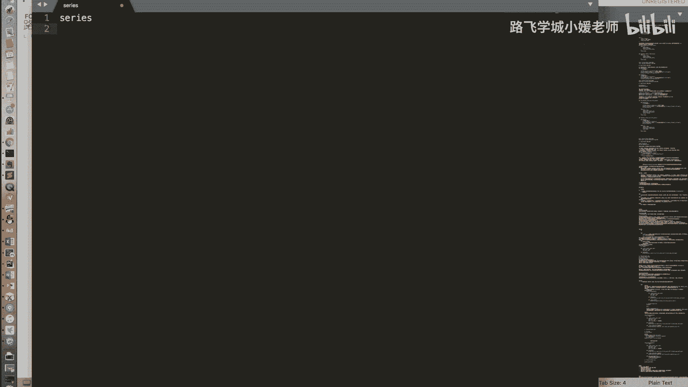

在本节课中，我们将对Pandas的第一个核心数据结构——Series进行总结。我们将回顾其核心特性、索引机制、数据对齐原则以及缺失数据处理方法。

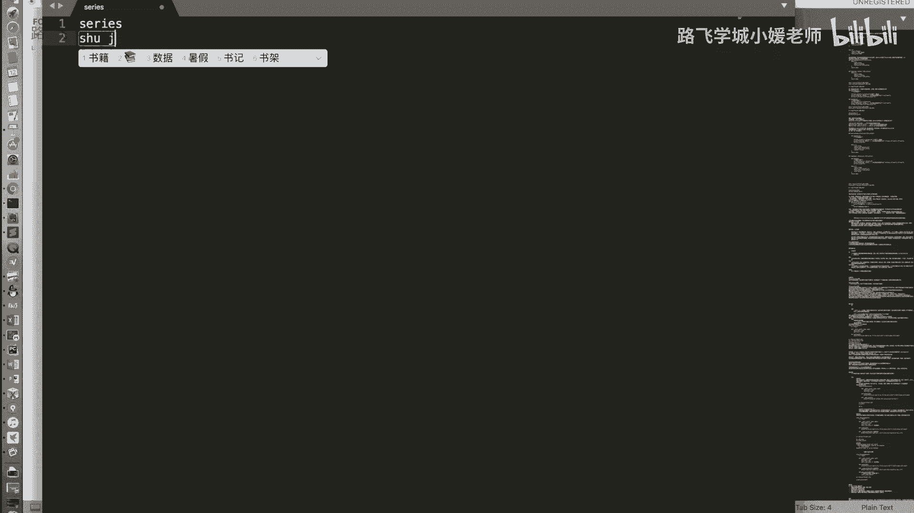

## 概述

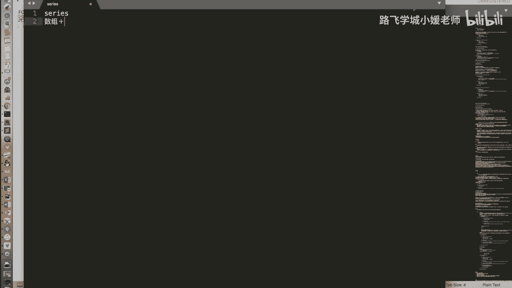

Series是Pandas库中的一维带标签数组。它结合了Python字典和NumPy数组的特性，是进行金融数据分析和处理的基础。


## Series的核心特性

上一节我们介绍了Series的基本操作，本节中我们来看看它的核心特性总结。

Series是字典与数组的集合体。它既支持像数组一样通过整数下标进行访问，也支持像字典一样通过标签进行访问。


以下是Series支持的主要操作：


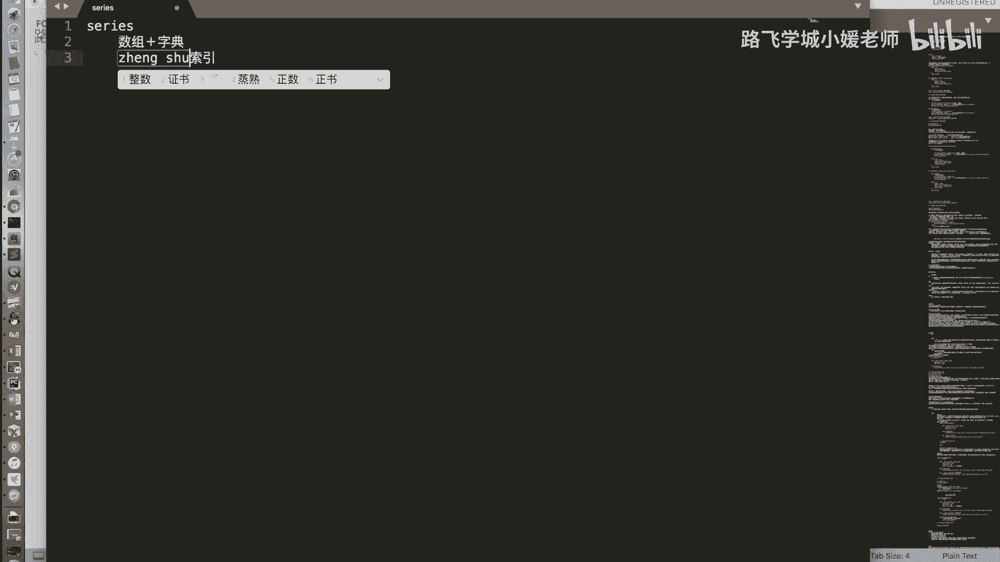

*   **数组式操作**：支持按下标索引、切片、布尔值索引。支持两个Series之间或Series与标量之间的加减乘除运算。
*   **字典式操作**：支持按标签索引，以及使用`in`操作符检查标签是否存在。

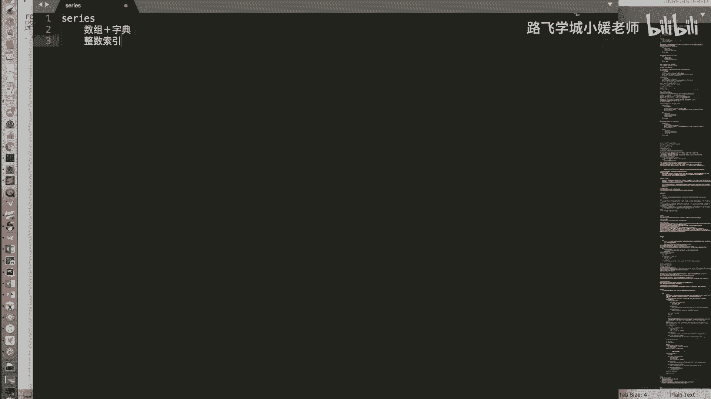

## 整数索引的歧义与解决方案

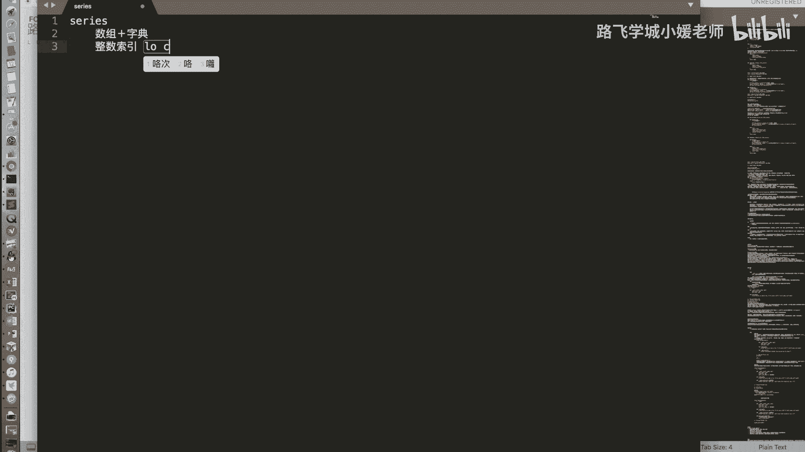

当Series的索引标签也是整数时，使用中括号`[]`进行索引可能会产生歧义，因为它可能被解释为按下标索引，也可能被解释为按标签索引。

为了解决这个问题，Pandas提供了`.iloc`和`.loc`这两个属性来明确索引方式：
*   **`.iloc`**：**纯整数位置索引**，基于元素在Series中的顺序（从0开始）。
*   **`.loc`**：**标签索引**，基于索引标签的值。

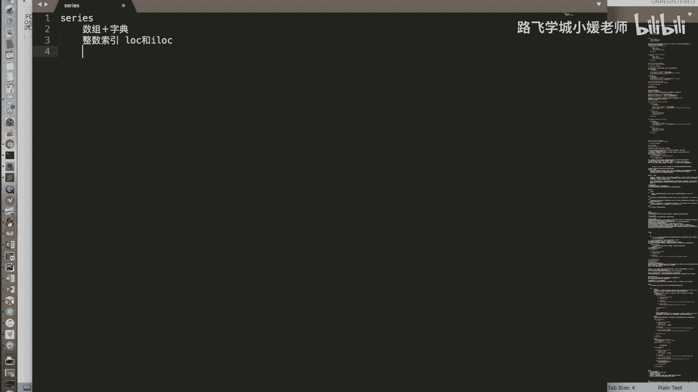

例如：
```python
# 假设有一个Series s，其索引为 [10, 11, 12]
s.iloc[0]  # 访问第一个元素（位置0），无论索引标签是什么
s.loc[10]  # 访问索引标签为10的元素
```


## 数据对齐原则

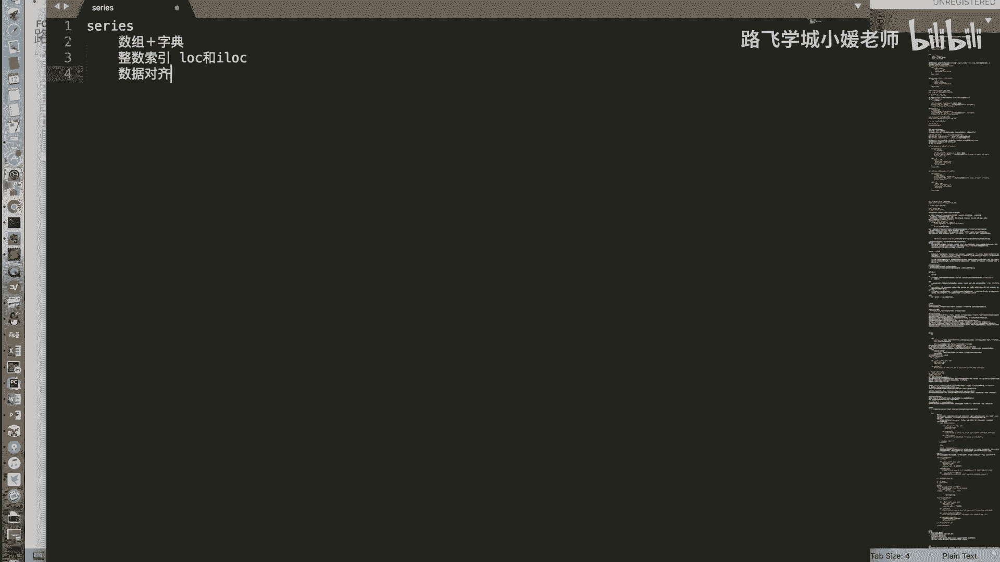

在数据处理中，经常需要对多个Series进行运算。Pandas的Series遵循**数据对齐**原则。


当两个Series进行加减乘除等运算时，它们的值会**按照索引标签自动对齐**后再进行计算。


如果某个索引标签只存在于其中一个Series中，那么在结果Series中，该标签对应的值将是缺失值（`NaN`）。

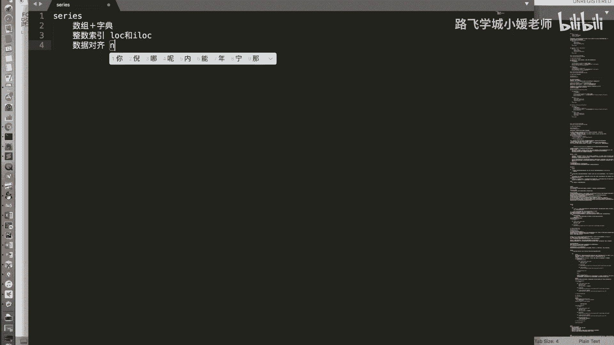

## 缺失数据处理

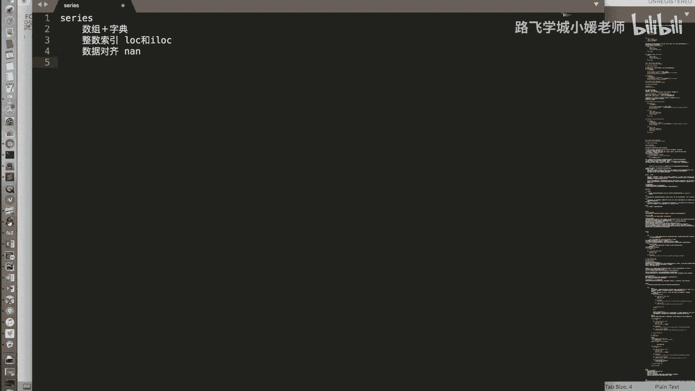

根据数据对齐原则，运算后产生缺失值（`NaN`）是常见情况。Pandas提供了处理缺失数据的方法。

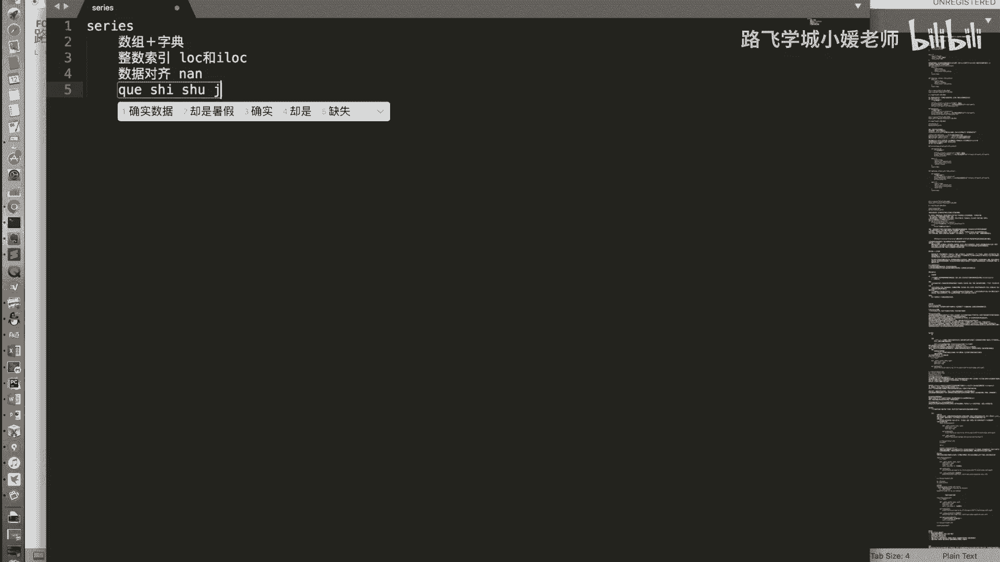

以下是两种主要的缺失数据处理方式：

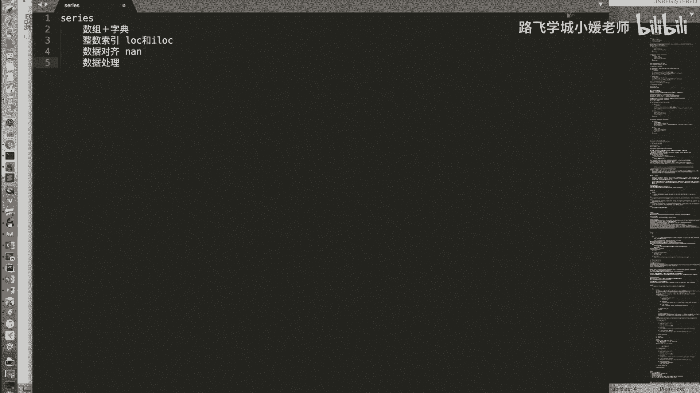

1.  **删除缺失值**：使用`.dropna()`函数直接移除所有包含`NaN`的行。
2.  **填充缺失值**：使用`.fillna(value)`函数，将所有的`NaN`替换为指定的值（例如`0`或平均值）。

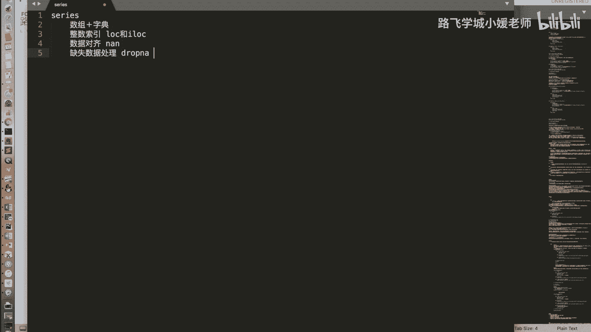

## Series的功能继承

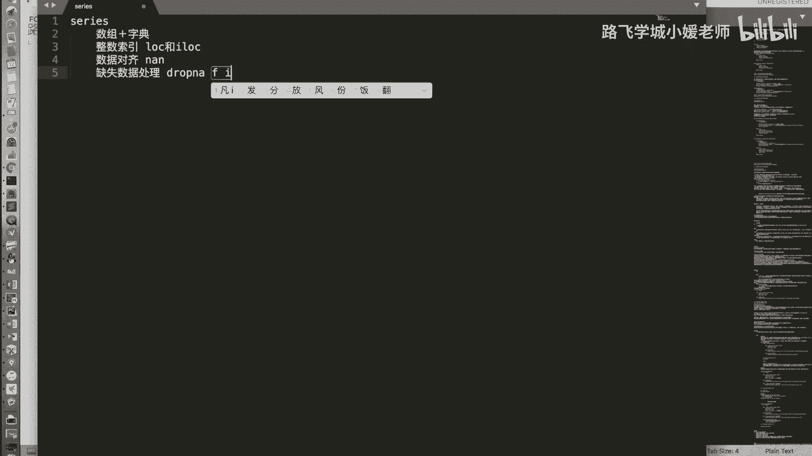

除了我们介绍的这些Pandas特有功能外，Series继承了其底层NumPy数组的绝大多数功能。

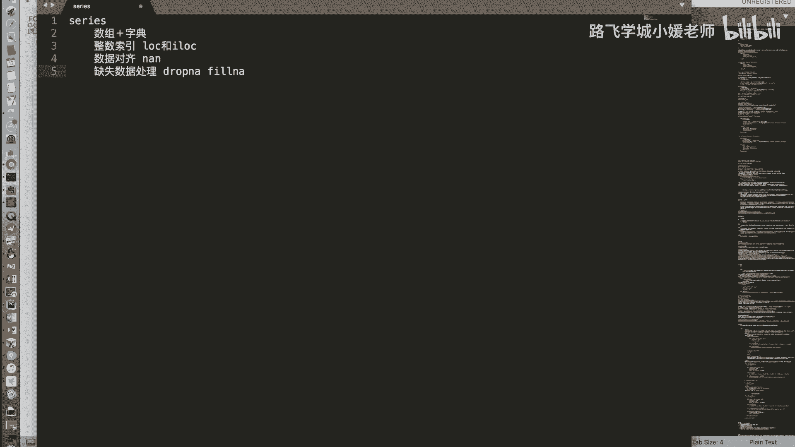

例如，布尔型索引、花式索引（Fancy Indexing）等NumPy数组的常用操作，在Series中同样适用。

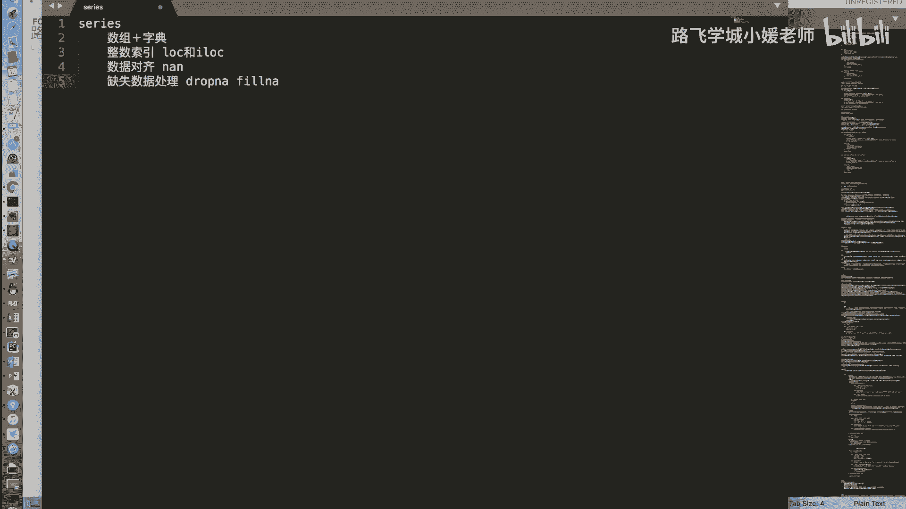

## 总结

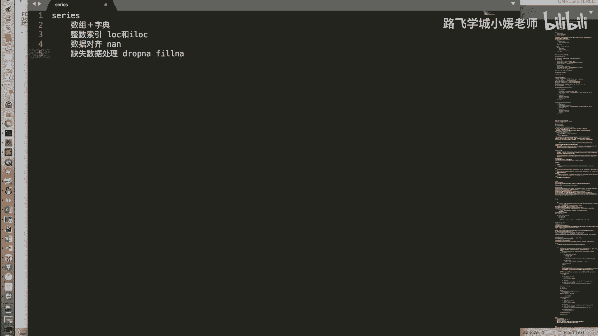

本节课中我们一起学习了Pandas Series数据结构的全面总结。我们回顾了其作为“带标签数组”的核心特性，明确了使用`.iloc`和`.loc`解决整数索引歧义的方法，理解了数据对齐在运算中的重要性，并掌握了处理缺失数据的两种基本策略。Series是构建更复杂数据分析的基础，其功能强大且灵活，为后续学习DataFrame打下了坚实的基础。