# Python金融量化：P13：01 爬虫环境配置与简单爬取程序实现 🕷️


在本节课中，我们将要学习网络爬虫的基础知识，包括环境配置和编写一个简单的爬虫程序。我们将从网络基础讲起，逐步深入到使用Python的`requests`模块进行网页爬取，并了解如何处理登录认证等复杂情况。

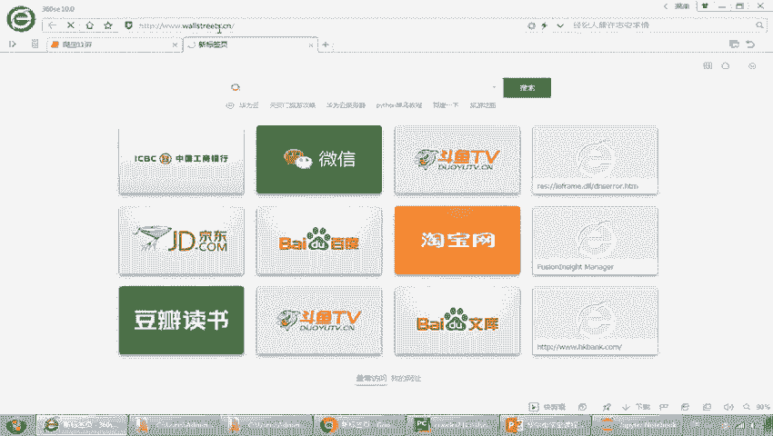

## 网络基础 🌐

上一节我们介绍了课程的整体安排，本节中我们来看看爬虫工作的网络基础。理解这些概念是编写有效爬虫的前提。

### 网址与网页

网址，通常指互联网上的网页地址，例如 `https://www.example.com`。它就像是一个门牌号，用于定位网络上的资源。网页则是展现在我们面前的页面内容，由HTML格式编写，经浏览器解析后呈现可视化效果。

URL（Uniform Resource Locator，统一资源定位符）是网址的标准格式，用于唯一标识互联网上的资源。一个完整的URL通常包含以下几个部分：

*   **协议/模式**：如 `http` 或 `https`（安全的HTTP协议）。
*   **服务器地址**：可以是域名（如 `www.example.com`）或IP地址。
*   **端口**：标识服务器上应用程序的服务端口，HTTP默认是80，HTTPS默认是443。
*   **路径**：资源在服务器上的具体位置。
*   **参数**：以 `?` 开头，用于向服务器传递额外信息，格式为 `key1=value1&key2=value2`。

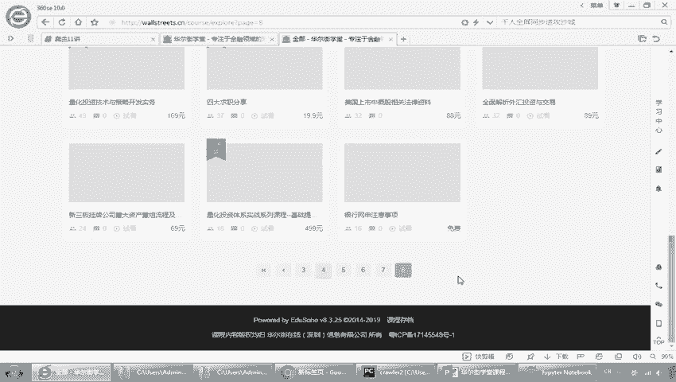

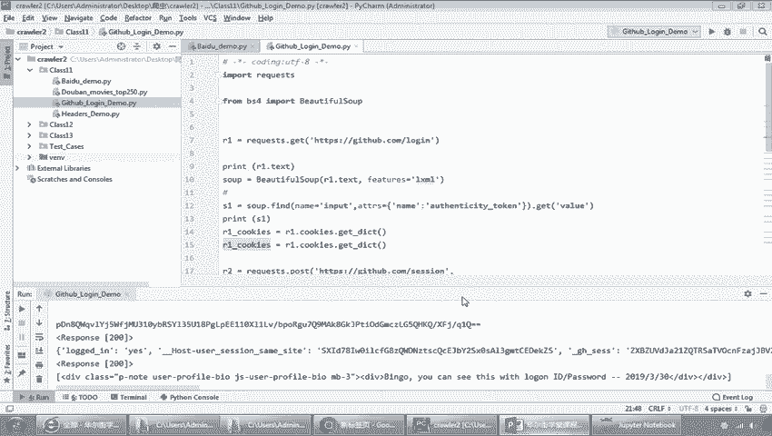

### 分页机制

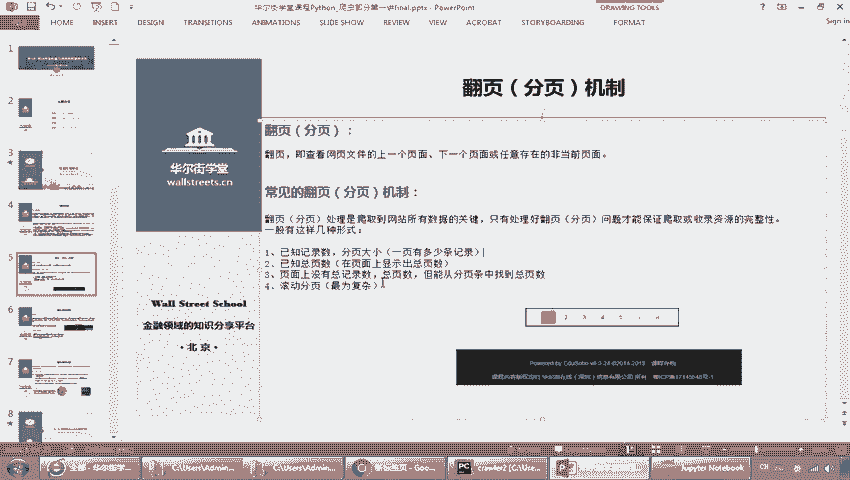

当网页内容过多时，通常会采用分页展示。爬虫需要模拟用户的翻页行为，以遍历和抓取所有页面的数据。常见的分页类型包括：

*   **已知页数分页**：总页数明确显示。
*   **动态加载分页**：通过滚动或点击“加载更多”来获取新内容。
*   **参数控制分页**：URL中的参数（如 `?page=2`）控制页码。

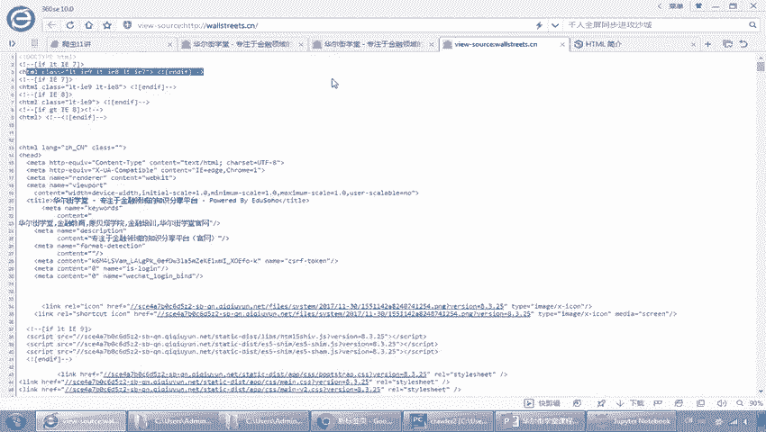

### 查看网页源码

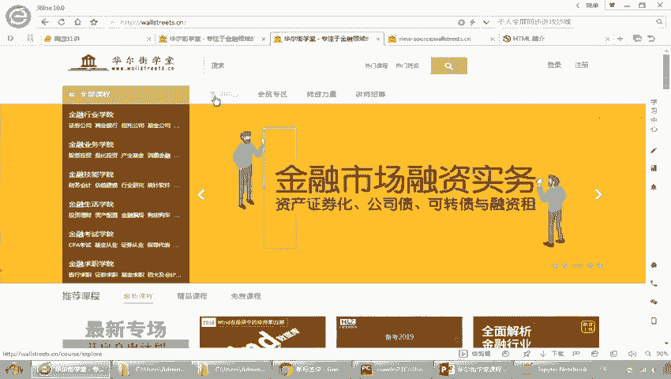

网页内容由HTML（超文本标记语言）构成。要分析网页结构，我们需要查看其源代码。

**操作**：在浏览器中打开目标网页，右键点击页面并选择“查看页面源代码”（View Page Source）。这将显示未经浏览器渲染的原始HTML代码，是分析数据位置的第一步。

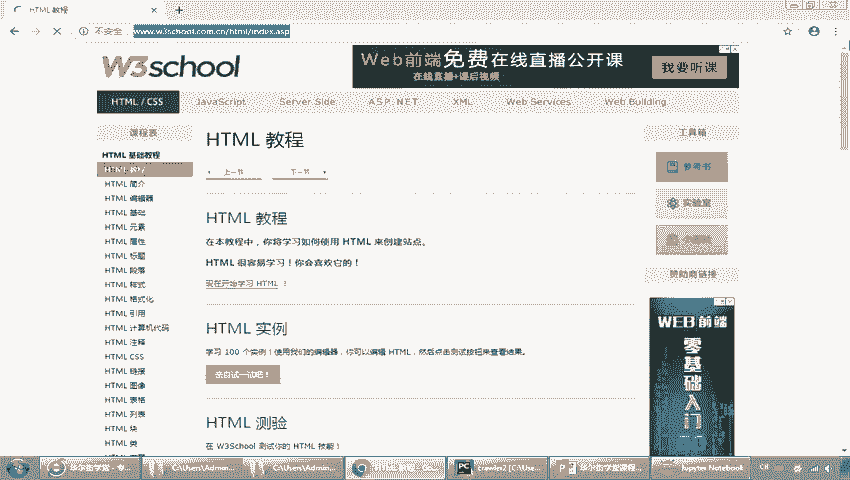

### 网页请求过程

爬虫的本质是模拟浏览器向服务器发送请求并处理响应的过程。这个过程的核心是 **HTTP请求（Request）** 和 **HTTP响应（Response）**。

1.  **发起请求**：用户在浏览器输入URL或点击链接，浏览器会向Web服务器发送一个HTTP Request。
2.  **服务器响应**：Web服务器处理请求后，返回一个HTTP Response，其中包含状态码（如200表示成功）和响应体（通常是HTML代码）。
3.  **浏览器解析**：浏览器接收Response，解析其中的HTML、CSS、JavaScript代码，并将其渲染成可视化的网页。

**核心公式**：
```
客户端（浏览器/爬虫） --[HTTP Request]--> 服务器
客户端（浏览器/爬虫） <--[HTTP Response]-- 服务器
```

理解这对“请求-响应”模型，是后续编写爬虫代码的基础。

## Requests模块介绍与安装 🛠️

上一节我们介绍了爬虫的网络基础，本节中我们来看看实现爬虫的核心工具——`requests`模块。

`requests` 是Python中一个非常流行且易用的HTTP库，专门用于发送各种HTTP请求。它比Python标准库中的 `urllib` 更简洁、更人性化。

### 环境配置

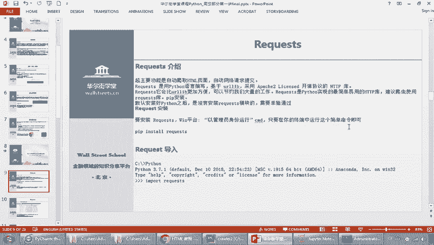


以下是配置开发环境的步骤：

1.  **安装Python**：确保已安装Python（推荐Anaconda发行版，它集成了许多科学计算和数据分析库）。
2.  **安装requests模块**：打开命令行（终端或Anaconda Prompt），执行以下命令：
    ```bash
    pip install requests
    ```
3.  **验证安装**：在Python交互环境或脚本中导入模块，若无报错则安装成功。
    ```python
    import requests
    print(requests.__version__)
    ```
4.  **选择开发工具**：
    *   **Jupyter Notebook**：适合分步调试和演示。
    *   **PyCharm**：功能强大的集成开发环境（IDE），适合项目开发。
    *   **命令行/文本编辑器**：适合运行简单脚本。

### 第一个爬虫程序：爬取百度首页

现在，我们将使用 `requests` 模块编写一个最简单的爬虫，目标是获取百度首页的HTML内容。

**思路**：
1.  导入 `requests` 模块。
2.  指定目标URL（`https://www.baidu.com`）。
3.  使用 `requests.get()` 方法发送GET请求。
4.  检查响应状态码，确认请求成功。
5.  设置正确的编码，并打印或处理响应文本内容。

**示例代码**：
```python
# -*- coding: utf-8 -*-
import requests

# 目标URL
url = ‘https://www.baidu.com‘

# 发送GET请求
response = requests.get(url)

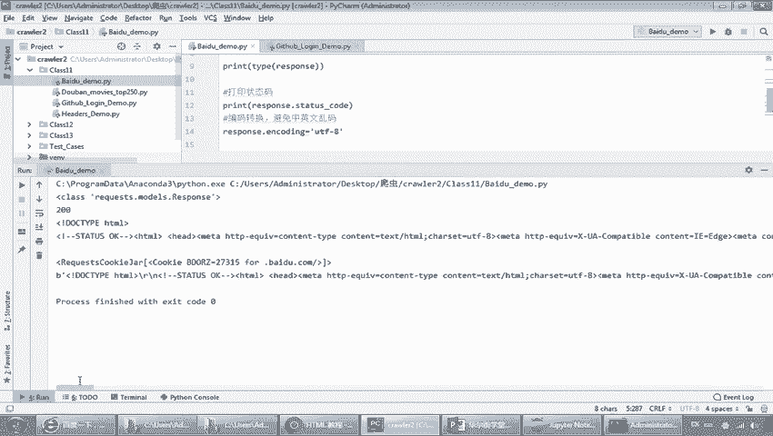

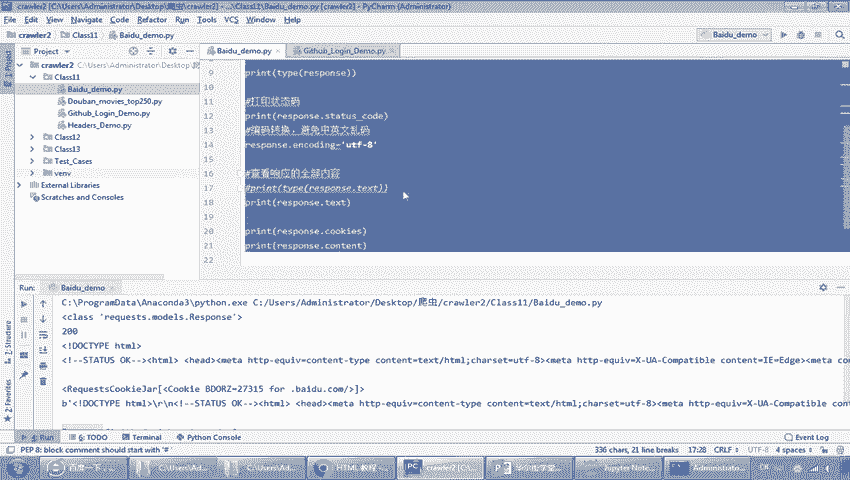

# 打印响应对象类型
print(‘响应对象类型：‘, type(response))

# 打印响应状态码，200表示成功
print(‘状态码：‘, response.status_code)

# 设置编码（防止中文乱码）
response.encoding = ‘utf-8‘

# 打印网页HTML内容的前500个字符
print(‘网页内容（前500字符）：‘, response.text[:500])
```

**代码解析**：
*   `requests.get(url)`：向 `url` 发送一个HTTP GET请求，并将服务器返回的响应保存在 `response` 对象中。
*   `response.status_code`：HTTP状态码，`200` 代表请求成功。
*   `response.encoding`：指定响应内容的编码格式，通常设为 `‘utf-8‘` 以正确显示中文。
*   `response.text`：以字符串形式返回响应体的内容（即网页HTML代码）。

运行这段代码，你将看到成功获取了百度首页的HTML源码。恭喜你，已经完成了第一个爬虫程序！

## 登录信息处理与请求头设置 🔐

上一节我们成功实现了简单的页面抓取，本节中我们来看看如何应对更复杂的场景，例如需要登录认证的网站。这涉及到对HTTP请求报文更精细的控制。

### HTTP请求报文

浏览器发送的HTTP Request并非只有URL，它是一个结构化的“报文”，主要包含：

*   **请求行**：包含请求方法（GET/POST）、URL和HTTP版本。
*   **请求头（Headers）**：包含关于客户端环境、期望的响应格式等信息（如浏览器类型、接受的语言、Cookie等）。
*   **请求体（Body）**：主要在POST请求中使用，用于提交表单数据（如用户名、密码）。

### 关键概念：Cookie, Session, Token

为了在无状态的HTTP协议中维持用户会话，网站采用了多种机制：

1.  **Cookie**：由服务器生成，发送并存储在客户端（浏览器）的一小段数据。用于标识用户身份，在后续请求中，浏览器会自动携带Cookie发送给服务器。
    *   **类比**：好比游乐场的通行手环，出示手环即可证明已购票。
2.  **Session**：会话信息存储在**服务器端**。服务器为每个用户创建一个唯一的Session ID，并将该ID通过Cookie发给客户端。客户端后续请求只需携带此Session ID，服务器通过它查找对应的会话信息。
    *   **目的**：解决Cookie存储在客户端的安全隐患（如被盗用）。
    *   **公式**：`Session数据` 存储在服务器，通过 `Session ID`（常存于Cookie）关联客户端。
3.  **Token**：一种令牌机制，常用于API认证。用户登录后，服务器生成一个签名的Token返回给客户端。客户端后续请求在请求头（如 `Authorization: Bearer <token>`）中携带此Token即可，服务器验证Token有效性而无需查询会话数据库。
    *   **目的**：减轻服务器存储压力，更适合分布式系统和移动端。

### 实践：设置请求头与模拟登录

许多网站会检查请求头，以识别是否为真实的浏览器访问。我们可以通过设置请求头来“伪装”爬虫。

**示例1：添加User-Agent请求头**
```python
import requests

url = ‘https://www.example.com‘
# 定义请求头，模拟Chrome浏览器
headers = {
    ‘User-Agent‘: ‘Mozilla/5.0 (Windows NT 10.0; Win64; x64) AppleWebKit/537.36 (KHTML, like Gecko) Chrome/91.0.4472.124 Safari/537.36‘
}

response = requests.get(url, headers=headers)
print(response.status_code)
```

**示例2：模拟登录GitHub（简化流程）**
模拟登录的关键在于分析登录表单的提交过程，并正确构造POST请求的数据和Cookie。

```python
import requests
from bs4 import BeautifulSoup

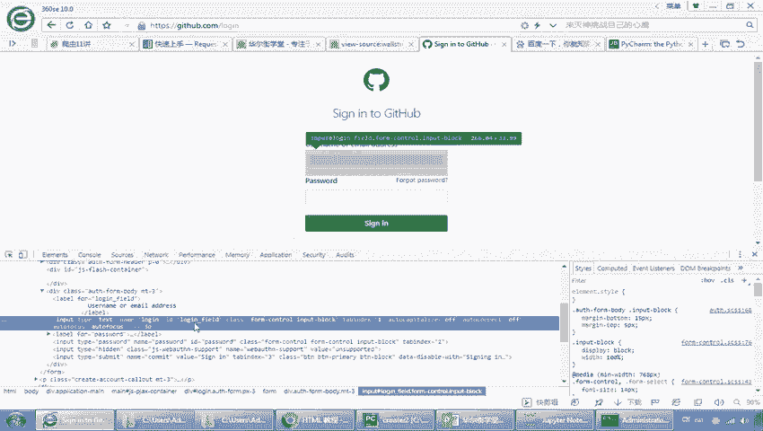

# 1. 获取登录页，提取必要的Token（如authenticity_token）
login_url = ‘https://github.com/login‘
session = requests.Session()  # 使用Session维持会话
login_page = session.get(login_url)
soup = BeautifulSoup(login_page.text, ‘html.parser‘)
# 假设token在name为‘authenticity_token‘的input标签的value属性里
token = soup.find(‘input‘, {‘name‘: ‘authenticity_token‘}).get(‘value‘)

# 2. 构造登录数据
login_data = {
    ‘commit‘: ‘Sign in‘,
    ‘utf8‘: ‘✓‘,
    ‘authenticity_token‘: token,
    ‘login‘: ‘your_username‘,  # 替换为你的用户名
    ‘password‘: ‘your_password‘  # 替换为你的密码
}

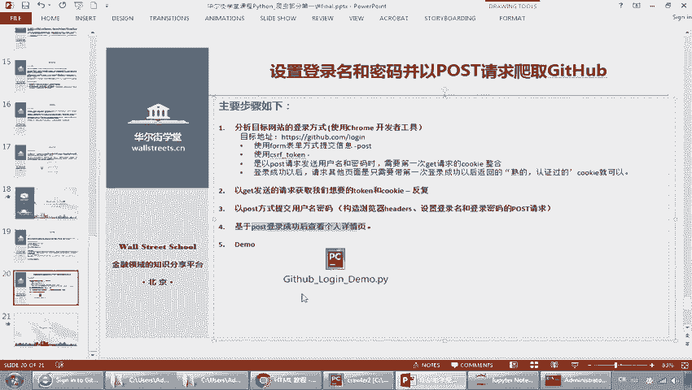

# 3. 发送POST请求进行登录
post_url = ‘https://github.com/session‘
response = session.post(post_url, data=login_data)

# 4. 检查是否登录成功（例如，访问个人主页）
profile_response = session.get(‘https://github.com/your_username‘)  # 替换为你的用户名
if ‘Your unique content‘ in profile_response.text:  # 检查个人主页特有内容
    print(‘登录成功！‘)
else:
    print(‘登录可能失败。‘)
```

**代码解析**：
*   `requests.Session()`：创建一个会话对象，它会自动处理请求间的Cookie，模拟浏览器行为。
*   `BeautifulSoup`：一个用于解析HTML/XML的库，帮助我们从登录页面中提取隐藏的表单字段（如 `authenticity_token`）。
*   登录数据 `login_data` 需要根据目标网站登录表单的实际字段来构造。使用浏览器的开发者工具（F12 -> Network -> 查看登录请求的 `Form Data`）是分析这些字段的最佳方法。

## 总结 📝

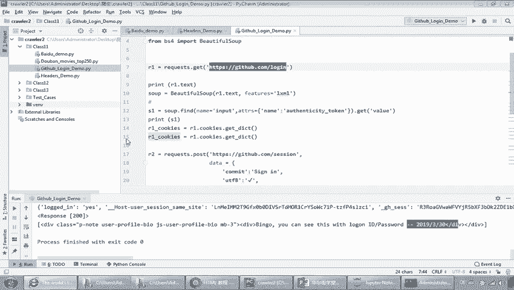

本节课中我们一起学习了网络爬虫的入门知识。

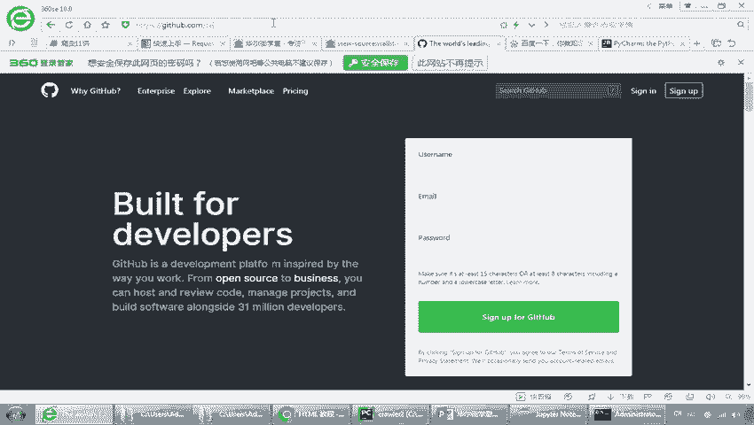

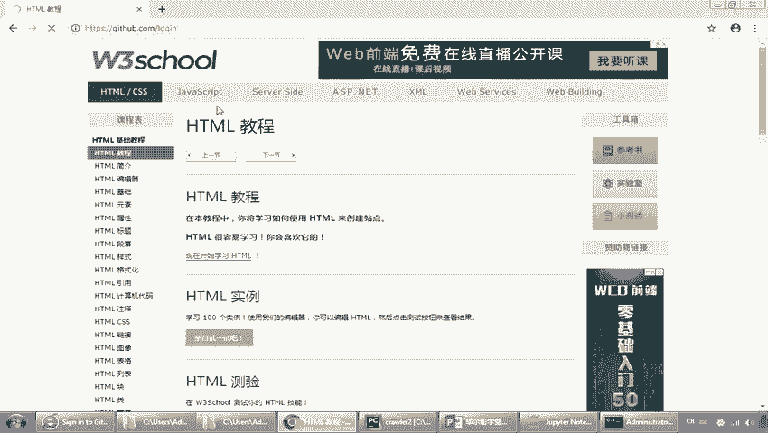

我们首先了解了**网络基础**，包括网址的构成、分页机制、如何查看网页源码以及最核心的HTTP请求-响应模型。

接着，我们介绍了强大的 **`requests`模块**，完成了环境配置，并成功编写了第一个爬取百度首页的简单爬虫程序。

最后，我们深入探讨了**登录信息处理**，理解了Cookie、Session和Token等用户认证机制的区别与用途，并实践了如何通过设置请求头和使用Session对象来模拟浏览器行为，处理需要登录的网站。

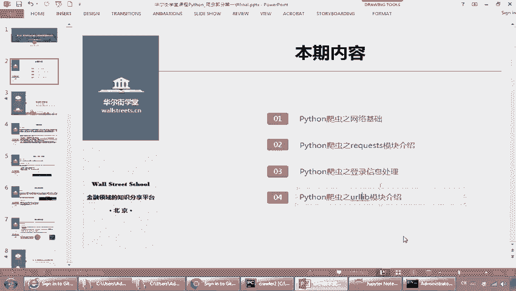

通过本节课的学习，你已经掌握了爬虫的基本工作原理和简单实现。在后续课程中，我们将学习使用 `BeautifulSoup` 解析网页数据、处理动态加载内容、应对反爬策略以及实现并发爬取等更高级的技术。