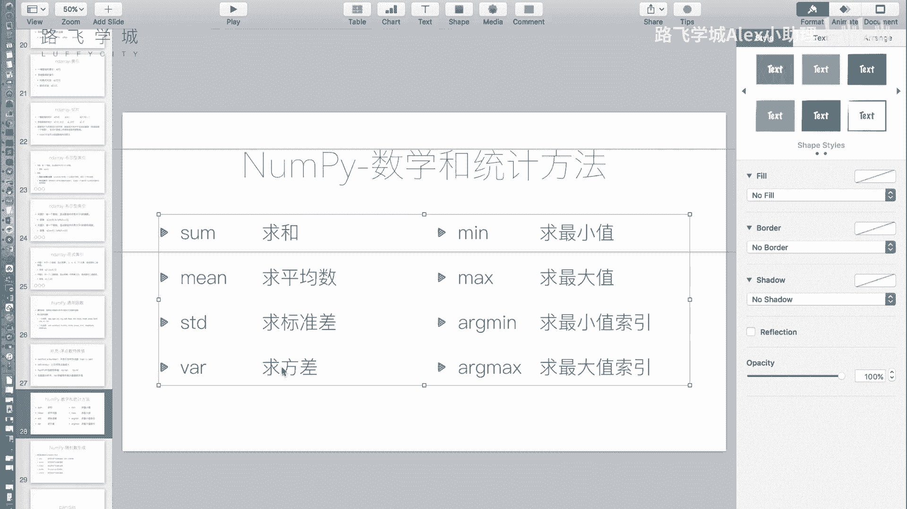
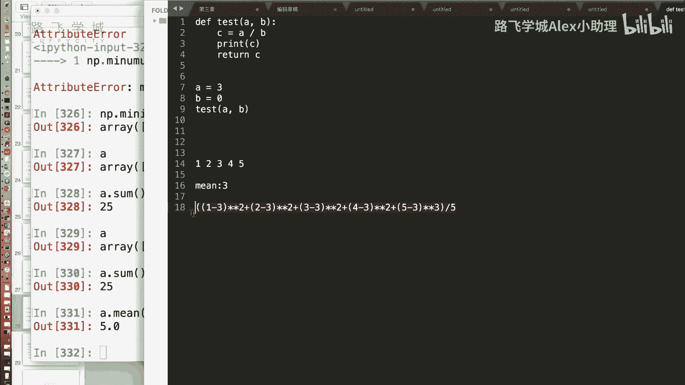
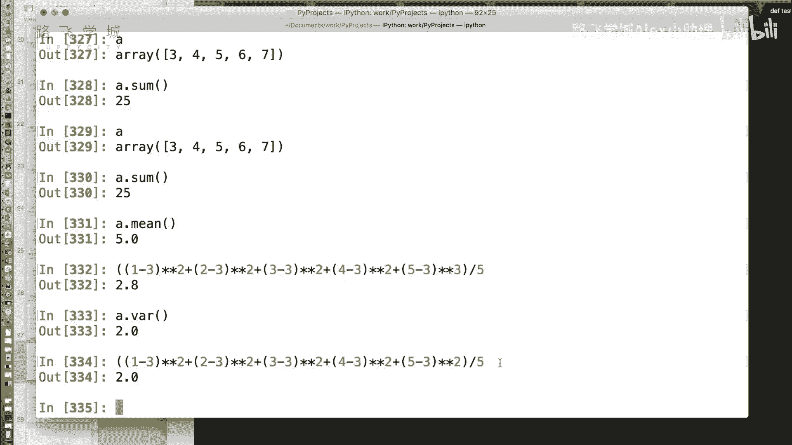
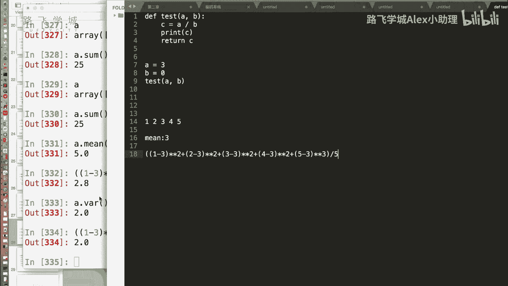
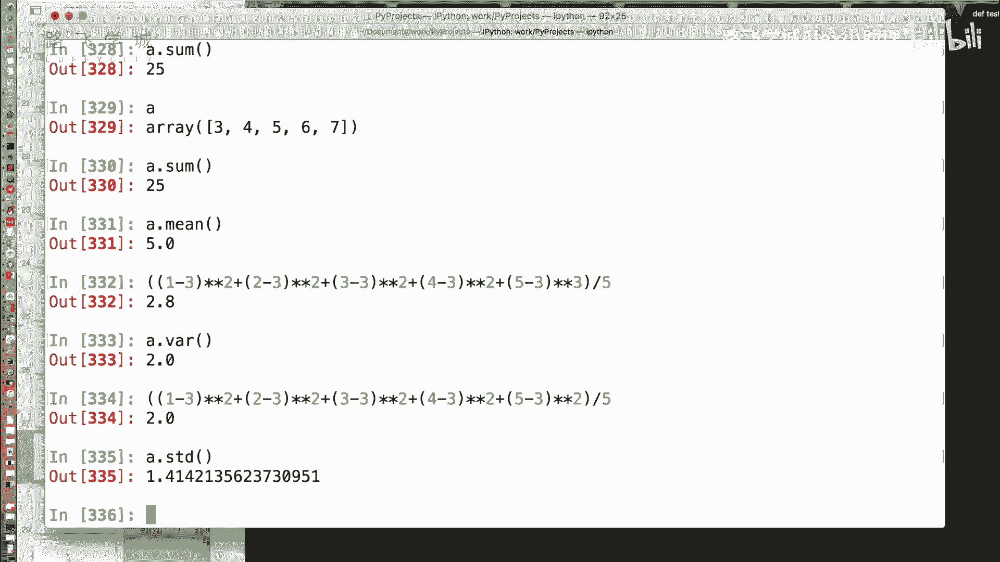
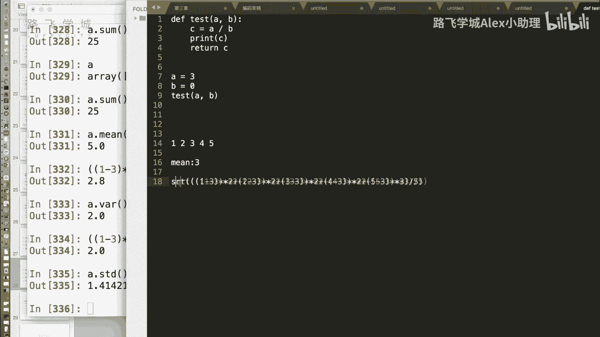
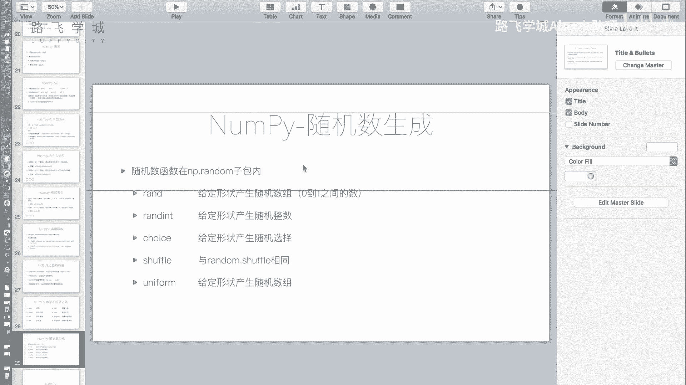

# Python金融量化分析：P13：NumPy统计方法与随机数生成 📊🎲

在本节课中，我们将学习NumPy模块提供的数学统计方法，以及如何生成随机数。这些功能是金融量化分析中进行数据处理和模拟的基础。

---

## 数学统计方法 📈

上一节我们介绍了NumPy数组的基本运算，本节中我们来看看NumPy提供的一些核心数学统计函数。

### 求和与平均值

NumPy提供了便捷的方法来计算数组的总和与平均值。

*   **`A.sum()`**：对数组`A`中的所有值进行求和。
*   **`A.mean()`**：计算数组`A`中所有值的算术平均值。

### 方差与标准差

方差和标准差是衡量数据离散程度（波动性）的重要指标，在金融中常用于评估风险。

*   **方差**：表示数据点与平均值之差的平方的平均值。方差越大，数据越分散。
    *   **公式**：`方差 = Σ(每个数据值 - 平均值)² / 数据个数`
    *   **NumPy方法**：`A.var()`
*   **标准差**：是方差的平方根。它和原始数据有相同的量纲，更直观。
    *   **公式**：`标准差 = sqrt(方差)`
    *   **NumPy方法**：`A.std()`

**示例**：对于数组 `[1, 2, 3, 4, 5]`，其平均值为3。
*   方差计算：`((1-3)² + (2-3)² + (3-3)² + (4-3)² + (5-3)²) / 5 = 2.0`
*   标准差计算：`sqrt(2.0) ≈ 1.414`

### 最大值与最小值

以下是查找数组中极值及其位置的方法。

*   **`A.max()`**：返回数组`A`中的最大值。
*   **`A.min()`**：返回数组`A`中的最小值。
*   **`A.argmax()`**：返回最大值在数组中的索引（下标）。
*   **`A.argmin()`**：返回最小值在数组中的索引（下标）。

---

## 随机数生成 🎲

在数据分析和模拟中，经常需要生成随机数据。NumPy的`random`子模块提供了强大且高效的随机数生成功能，它扩展了Python内置`random`模块的能力，支持直接生成数组。

以下是`np.random`中一些常用函数及其与内置`random`模块的对比：

*   **生成随机浮点数**：生成0到1之间的随机数。
    *   内置模块：`random.random()`
    *   NumPy：`np.random.rand(10)`  # 生成包含10个随机数的数组
*   **生成随机整数**：在给定范围内生成随机整数。
    *   内置模块：`random.randint(0, 10)`
    *   NumPy：`np.random.randint(0, 10, size=(3, 5))`  # 生成一个3行5列的随机整数数组
*   **从序列中随机选择**：从给定序列中随机抽取元素。
    *   内置模块：`random.choice([1, 3, 4, 5])`
    *   NumPy：`np.random.choice([1, 3, 4, 5], size=10)`  # 随机抽取10次，返回一个数组
*   **打乱序列顺序**：将序列的元素随机排序。
    *   内置模块：`random.shuffle(list_a)`
    *   NumPy：`np.random.shuffle(array_a)`  # 操作类似，但作用于数组
*   **生成均匀分布随机数**：在指定区间内生成均匀分布的随机浮点数。
    *   内置模块：`random.uniform(2.0, 4.0)`
    *   NumPy：`np.random.uniform(2.0, 4.0, size=10)`  # 生成10个这样的数

**核心优势**：`np.random`中的函数大多支持`size`参数，可以直接生成指定形状的随机数数组，极大提升了批量生成的效率。

---

## 总结 📝

本节课中我们一起学习了NumPy的两个重要功能领域：

1.  **统计方法**：我们掌握了如何使用`sum()`, `mean()`进行基本统计，并深入理解了衡量数据波动性的`var()`（方差）和`std()`（标准差）方法，以及`max()`, `min()`, `argmax()`, `argmin()`等极值查找函数。
2.  **随机数生成**：我们了解了`np.random`子模块，它提供了与Python内置`random`模块对应的函数（如`randint`, `choice`, `uniform`等），但其核心优势在于能通过`size`参数直接生成任意维度的随机数组，非常适合数值计算和模拟场景。

NumPy作为科学计算的基础，其数组结构、批量运算、索引切片以及本节课的统计与随机功能，共同构成了后续学习更高级数据分析库（如Pandas）的坚实基石。