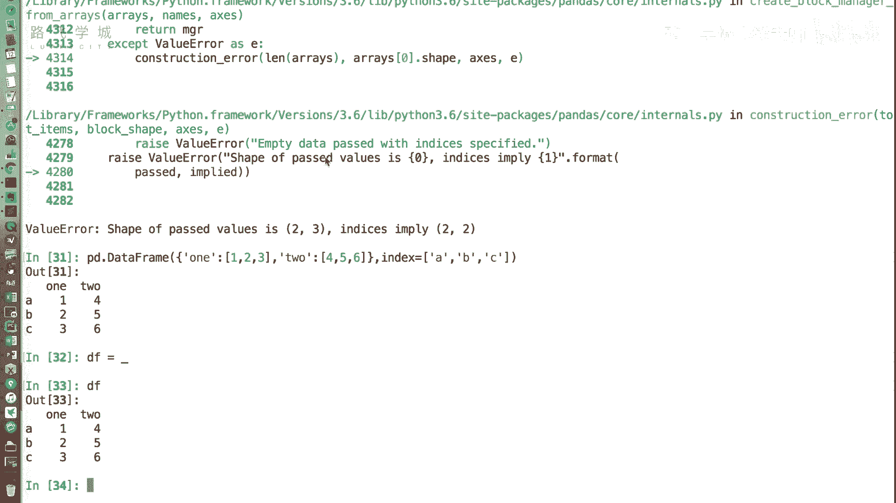
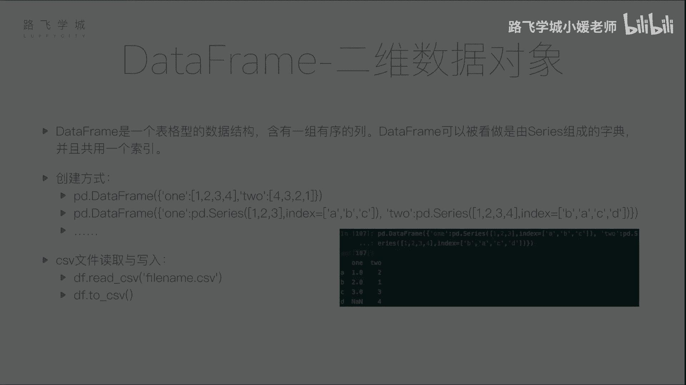

# Python金融量化：P13：DataFrame的创建 📊

在本节课中，我们将要学习Pandas中另一个核心数据结构——DataFrame。上一节我们介绍了Series，它是一个一维的数据对象。本节中我们来看看DataFrame，它是一个二维的、表格型的数据结构，类似于Excel表格，包含多列数据。

## 什么是DataFrame？

DataFrame是一个二维的表格型数据结构，包含一组有序的列。它可以看作是由多个Series组成的字典，并且这些Series共享同一个行索引。这使得DataFrame非常适合处理金融、统计等领域的表格数据。

## 创建DataFrame的方法

DataFrame有多种创建方式。以下是几种常见的方法。

### 1. 从字典创建

我们可以从一个字典来创建DataFrame。字典的键将成为列名，字典的值（列表）将成为对应列的数据。

```python
import pandas as pd

# 创建一个字典，键为列名，值为列表数据
data = {'one': [1, 2, 3], 'two': [4, 5, 6]}
df = pd.DataFrame(data)
print(df)
```



执行上述代码，将创建一个两列的DataFrame。由于没有指定行索引，Pandas会自动生成从0开始的整数索引。



如果我们想自定义行索引，可以使用`index`参数。

```python
df_custom_index = pd.DataFrame(data, index=['a', 'b', 'c'])
print(df_custom_index)
```

### 2. 从字典（值为Series）创建

另一种方式是从一个字典创建，但字典的值是Series对象。这种方式允许每列数据拥有独立的索引，Pandas会自动根据索引进行对齐。

```python
# 创建两个Series，拥有不同的索引
s1 = pd.Series([1, 2, 3], index=['a', 'b', 'c'])
s2 = pd.Series([1, 2, 3, 4], index=['b', 'a', 'c', 'd'])

# 用这两个Series作为值创建字典
data_from_series = {'col1': s1, 'col2': s2}
df_from_series = pd.DataFrame(data_from_series)
print(df_from_series)
```

在这个例子中，两个Series的索引不完全一致。Pandas会自动根据所有出现的索引（a, b, c, d）进行对齐。对于`s1`中没有的索引`d`，其对应位置会自动填充为缺失值（NaN）。这个自动对齐功能在处理不规整数据时非常有用。

### 3. 从文件读取创建

在实际应用中，我们很少手动构建大型DataFrame，更多的是从外部文件（如CSV、Excel）读取数据。Pandas提供了强大的文件读取功能。

以下是从CSV文件读取数据创建DataFrame的方法：

```python
# 假设有一个名为 ‘test.csv‘ 的文件，内容如下：
# A,B,C
# 1,2,3
# 2,4,6
# 3,6,9

df_from_csv = pd.read_csv('test.csv')
print(df_from_csv)
```

`read_csv`函数会将文件的第一行默认作为列名（header），并自动生成行索引。这个函数功能非常强大，我们将在后续课程中详细介绍它的各种参数，以应对不同的数据格式需求。

### 4. 将DataFrame保存到文件

创建或处理完DataFrame后，我们也可以将其保存回文件，例如保存为CSV格式。

```python
# 将之前创建的DataFrame保存到新文件
df.to_csv('test2.csv', index=False)  # index=False表示不将行索引写入文件
```

`to_csv`方法用于将DataFrame写入CSV文件。同样，它也有很多可选参数来控制输出格式，我们会在后面详细讲解。

除了CSV，Pandas也支持从JSON、XML、Excel等多种格式读写数据。

## 总结


本节课中我们一起学习了Pandas中DataFrame的创建。我们了解到DataFrame是一个二维表格数据结构，并掌握了其几种核心创建方法：**从字典创建**、**从字典（值为Series）创建**以及最常用的**从文件（如CSV）读取创建**。我们还简单了解了如何将DataFrame保存到文件。DataFrame是进行数据分析和金融量化的基石，在接下来的课程中，我们将深入学习如何操作和利用DataFrame进行数据分析。