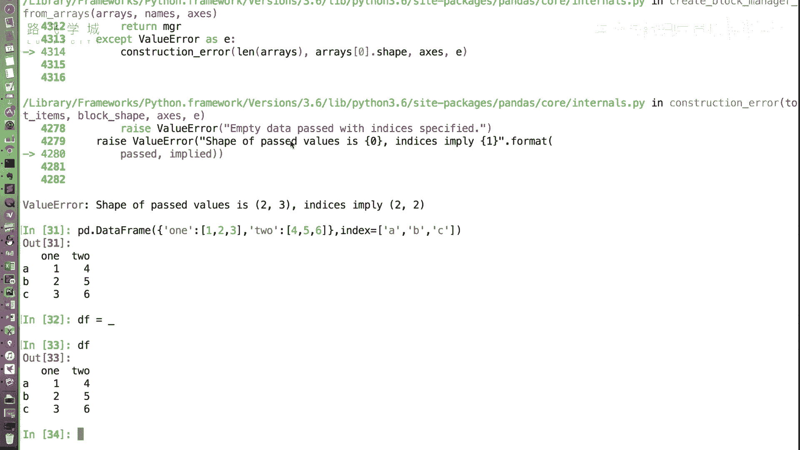
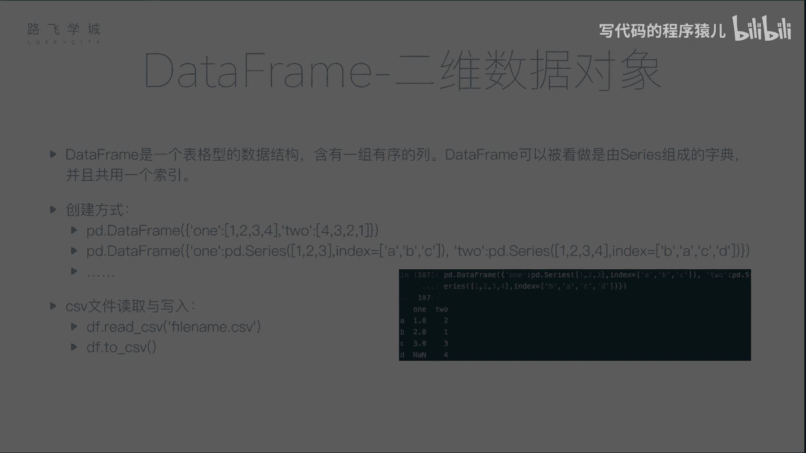
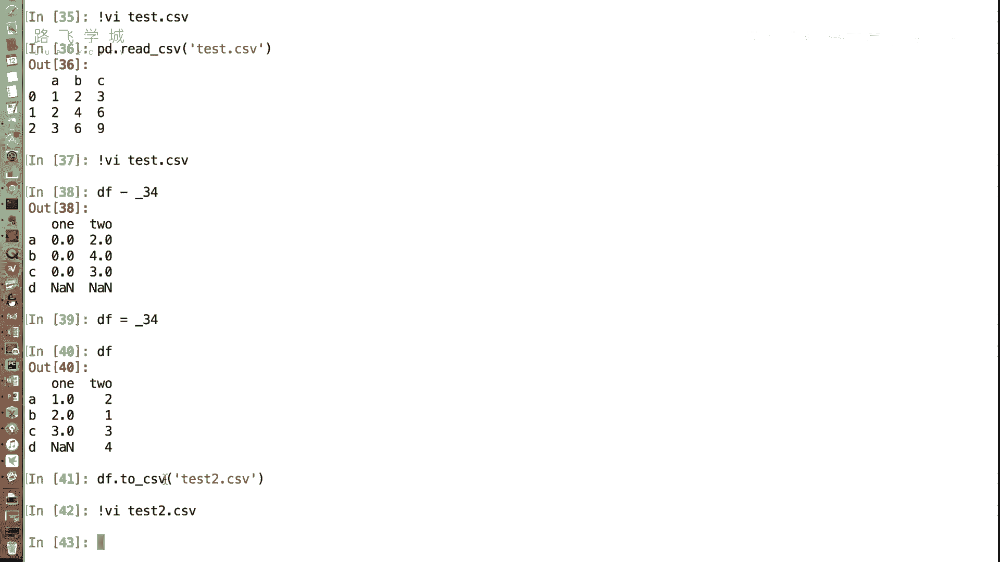

# Python金融量化：P14：DataFrame的创建 📊

在本节课中，我们将要学习Pandas中另一个核心数据结构——DataFrame。上一节我们介绍了Series，它是一个一维的数据对象。本节中我们来看看DataFrame，它是一个二维的、表格型的数据结构，类似于Excel工作表，包含多列数据。

DataFrame可以看作是由多个Series组成的字典，并且这些Series共享同一个行索引。接下来，我们将介绍几种创建DataFrame的常用方法。

## 从字典创建DataFrame

以下是第一种创建方式：通过一个字典来创建。字典的键将成为DataFrame的列名，字典的值（列表）将成为对应列的数据。

```python
import pandas as pd

# 创建一个字典，键为列名，值为列表数据
data = {
    ‘one‘: [1, 2, 3],
    ‘two‘: [4, 5, 6]
}

# 使用pd.DataFrame()函数创建DataFrame
df = pd.DataFrame(data)
print(df)
```

运行上述代码，将创建一个两列的DataFrame。由于我们没有指定行索引，Pandas会自动生成从0开始的整数索引。



如果我们想指定行索引的标签，可以使用`index`参数。



```python
df_with_index = pd.DataFrame(data, index=[‘A‘, ‘B‘, ‘C‘])
print(df_with_index)
```

## 从Series字典创建DataFrame

以下是第二种创建方式：字典的值是Series对象。这种方式允许每列数据拥有自己的索引，Pandas在创建DataFrame时会自动将它们对齐。

```python
# 创建两个具有不同索引的Series
s1 = pd.Series([1, 2, 3], index=[‘A‘, ‘B‘, ‘C‘])
s2 = pd.Series([1, 2, 3, 4], index=[‘B‘, ‘A‘, ‘C‘, ‘D‘])

# 通过Series字典创建DataFrame
df_from_series = pd.DataFrame({‘one‘: s1, ‘two‘: s2})
print(df_from_series)
```

在这个例子中，两个Series的索引不完全一致。Pandas会自动根据所有出现的索引标签（A, B, C, D）进行对齐。对于某个Series中不存在的索引位置，Pandas会填充为缺失值（NaN）。这个自动对齐功能在处理实际数据时非常有用。

## 从文件读取创建DataFrame

在实际应用中，我们很少手动编写数据来创建DataFrame，更多的是从外部文件读取。Pandas支持多种文件格式，其中最常用的是CSV文件。

CSV文件是一种纯文本格式，用逗号分隔每列的值，每行代表一条记录。以下是读取CSV文件的方法：

```python
# 从CSV文件读取数据创建DataFrame
df_from_csv = pd.read_csv(‘test.csv‘)
print(df_from_csv)
```

`pd.read_csv()`函数默认将文件的第一行作为列名（表头）。如果没有指定行索引，则会自动生成从0开始的整数索引。这个函数功能强大，包含许多可选参数用于精细控制读取过程，我们将在后续课程中详细介绍。

## 将DataFrame保存到文件

创建或处理完DataFrame后，我们经常需要将结果保存下来。将DataFrame写入CSV文件非常简单。

```python
# 将DataFrame保存为CSV文件
df.to_csv(‘test2.csv‘)
```

`to_csv()`方法会将DataFrame写入指定的文件。默认情况下，缺失值（NaN）在文件中会显示为空。写入行为也可以通过参数进行定制。

除了CSV格式，Pandas还支持将DataFrame写入JSON、Excel、XML等多种格式。



本节课中我们一起学习了DataFrame的几种创建方法：从字典创建、从Series字典创建以及从文件（特别是CSV文件）读取创建。DataFrame是Pandas进行数据分析的基石，理解其创建方式是后续所有操作的第一步。在接下来的课程中，我们将深入学习如何操作和清洗DataFrame中的数据。