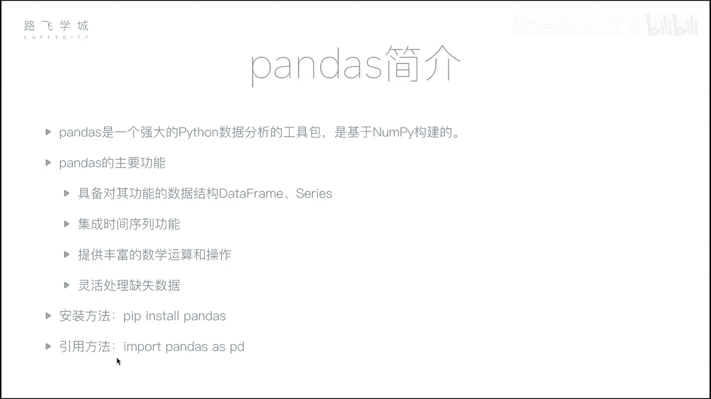
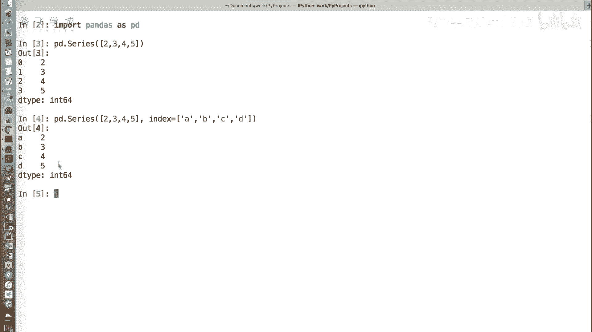
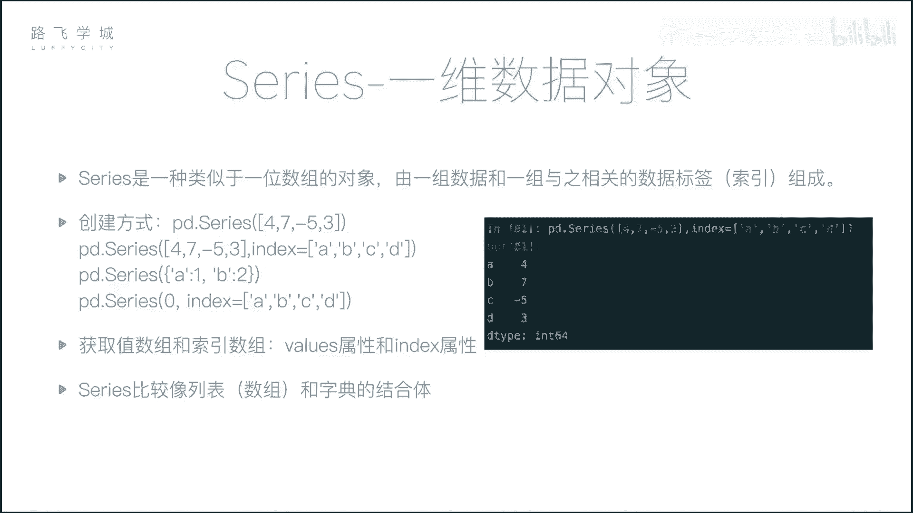
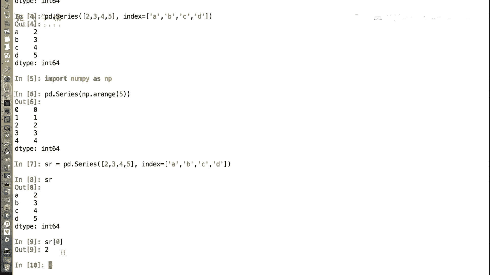
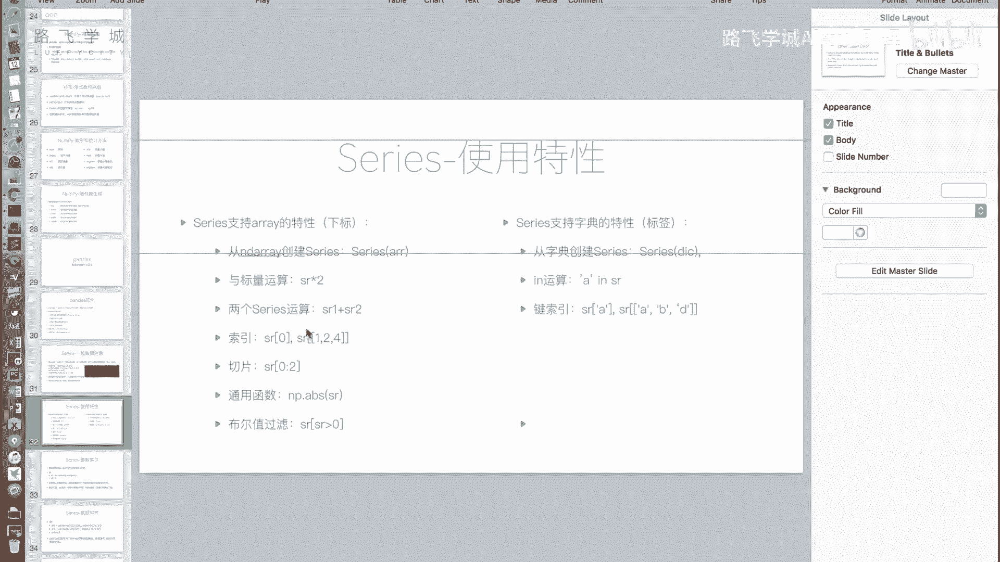
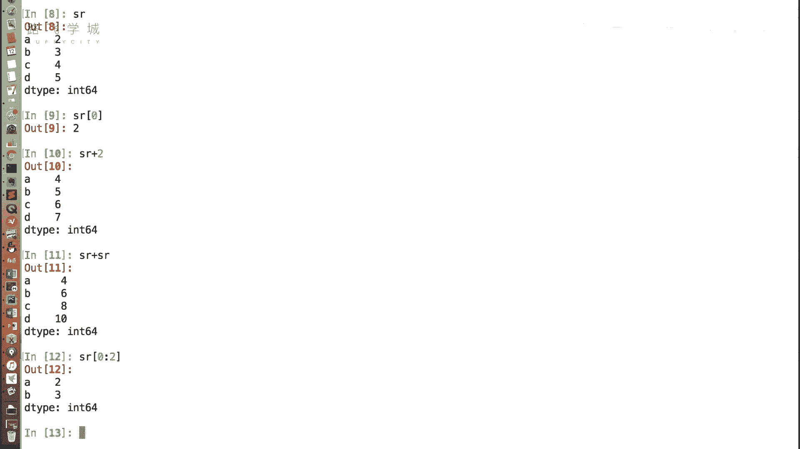
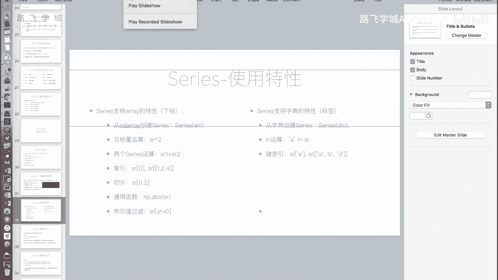
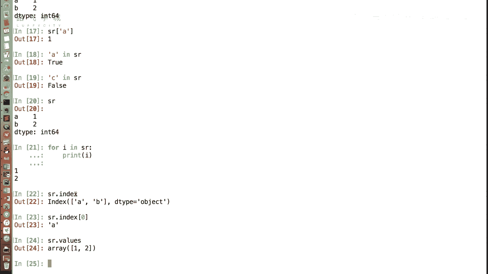
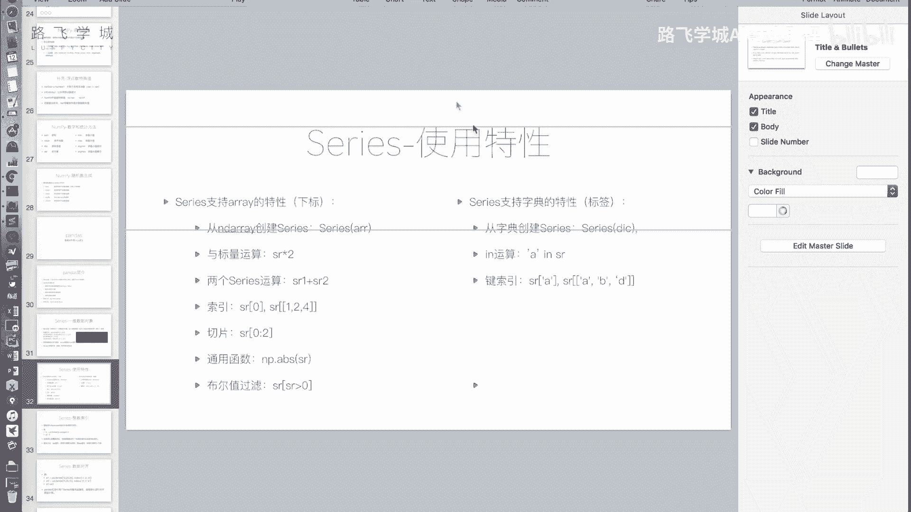
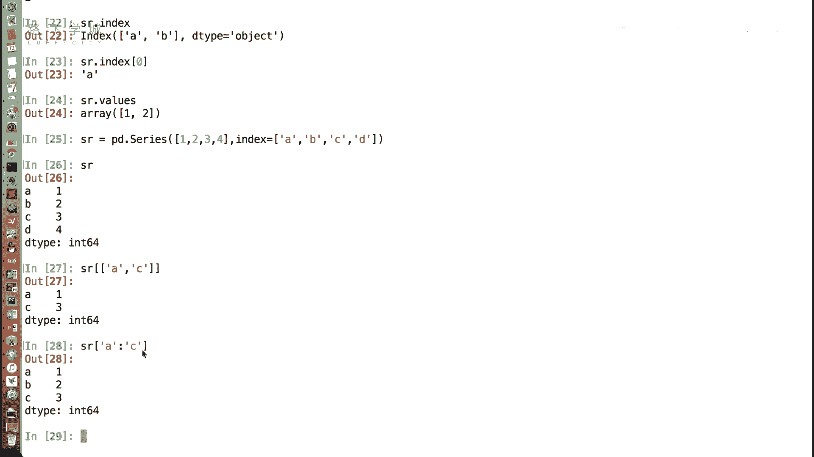

# Python金融量化：P14：Series介绍 📊

## 概述
在本节课中，我们将要学习Pandas库中的核心数据结构之一：**Series**。Series是数据分析的基础，它结合了列表（数组）和字典的特性，为处理一维数据提供了强大且灵活的工具。

---



## Series是什么？
上一节我们介绍了NumPy，本节中我们来看看Pandas。Pandas是基于NumPy构建的，在数据分析领域应用广泛。它提供了两个核心数据结构：**DataFrame**和**Series**。Series是一种类似于一维数组的对象，可以看作是数组与字典的结合体。


### 创建Series
首先，我们需要导入Pandas库。官方建议的引用方式是 `import pandas as pd`。

```python
import pandas as pd
```





创建Series的基本方法是使用 `pd.Series()`。我们可以传入一个列表。

```python
s = pd.Series([2, 3, 4, 5])
print(s)
```
输出结果左侧是默认的整数索引（0, 1, 2, 3），右侧是数据值。这看起来就像一个列表或数组。

我们还可以通过 `index` 参数自定义索引标签，使其更像一个字典。





```python
s = pd.Series([2, 3, 4, 5], index=['A', 'B', 'C', 'D'])
print(s)
```
此时，左侧的索引变成了我们指定的 `['A', 'B', 'C', 'D']`。

---

## Series的数组特性
Series继承了许多NumPy数组（或Python列表）的特性，使其能进行高效的数值运算。





以下是Series支持的数组特性列表：

1.  **从列表或数组创建**：可以从Python列表或NumPy数组创建Series对象。
2.  **通过下标访问**：即使指定了自定义索引（如'A','B'），依然可以通过整数下标（如0, 1）访问数据。
    ```python
    s = pd.Series([2, 3, 4, 5], index=['A', 'B', 'C', 'D'])
    print(s[0])  # 输出: 2
    ```
3.  **标量运算**：Series可以与一个数字进行运算，结果会应用到每个元素上。
    ```python
    print(s + 10)
    ```
4.  **Series间运算**：两个相同大小的Series可以进行逐元素的加减乘除等运算。
    ```python
    s1 = pd.Series([1, 2, 3])
    s2 = pd.Series([4, 5, 6])
    print(s1 + s2)
    ```
5.  **切片操作**：和列表一样，可以使用切片语法。
    ```python
    print(s[0:2])
    ```
6.  **支持通用函数**：支持NumPy的通用函数，如取绝对值、最大值等。
7.  **布尔型索引**：可以通过条件表达式筛选数据。
    ```python
    print(s[s > 3])
    ```

---

## Series的字典特性
除了数组特性，Series也融合了字典的一些有用功能。

以下是Series支持的字典特性列表：

1.  **从字典创建**：可以直接用一个Python字典来创建Series，字典的键（key）会成为Series的索引。
    ```python
    data = {'A': 2, 'B': 3, 'C': 4, 'D': 5}
    s = pd.Series(data)
    print(s)
    ```
2.  **通过标签访问**：可以使用自定义的索引标签来获取值。
    ```python
    print(s['A'])  # 输出: 2
    ```
3.  **`in` 操作**：可以检查某个标签是否存在于Series的索引中。
    ```python
    print('A' in s)  # 输出: True
    print('Z' in s)  # 输出: False
    ```
    *注意*：对Series使用 `for` 循环时，遍历的是**值**，而不是键（索引）。这与遍历字典不同。
4.  **花式索引与切片**：可以通过标签列表进行花式索引，也可以通过标签进行切片。**使用标签切片时，范围是前后都包含的**。
    ```python
    # 花式索引
    print(s[['A', 'C']])
    # 标签切片 (包含‘A’和‘C’)
    print(s['A':'C'])
    ```





---

## 获取索引与值
在实际操作中，我们经常需要分别获取Series的索引部分和数值部分。

以下是获取索引和值的方法：

-   **获取索引**：使用 `.index` 属性。
    ```python
    print(s.index)
    ```
-   **获取数值**：使用 `.values` 属性。返回的是一个NumPy数组。
    ```python
    print(s.values)
    ```

---



## Series的应用场景
Series结合了有序列表和键值对字典的优点，在实际工作中非常有用。例如：
-   **时间序列数据**：记录一支股票每日的收盘价。索引是日期（标签），值是价格。这样既可以通过日期（标签）快速查询某天的价格，也可以通过位置（整数索引）获取前N天的数据。
-   **配置参数**：存储一组有序的配置项，每个配置项有唯一的名称（标签）和对应的值。
-   **替代复杂结构**：无需再使用“列表内嵌元组”的方式来同时保存顺序和键值关系，Series一个结构就能完美解决。

---

## 总结
本节课我们一起学习了Pandas中的**Series**对象。我们了解到：
1.  Series是一种一维数据结构，融合了数组和字典的特性。
2.  它支持从列表、数组、字典创建，并可以通过整数下标或自定义标签进行访问和切片。
3.  Series支持丰富的数值运算和条件筛选。
4.  通过 `.index` 和 `.values` 属性可以方便地获取其索引和数值。
Series是构建更复杂数据（如DataFrame）的基础，理解它对于后续的数据分析工作至关重要。