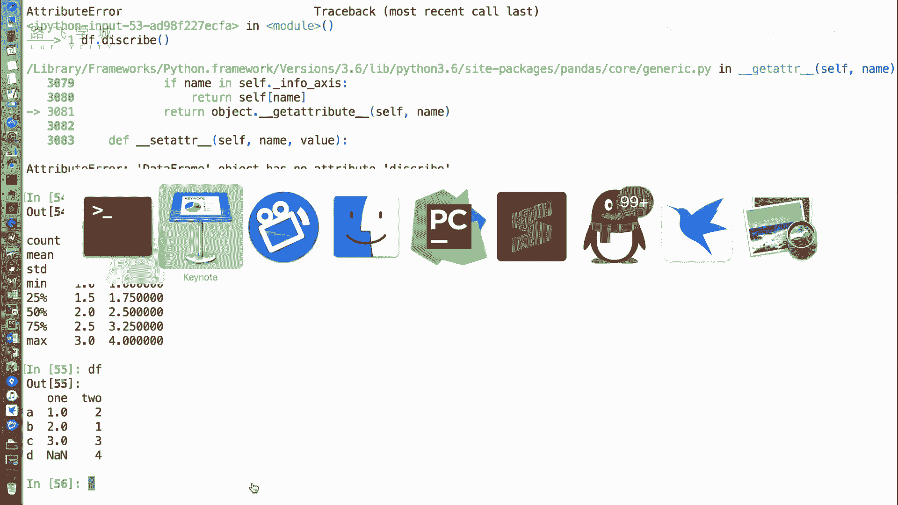
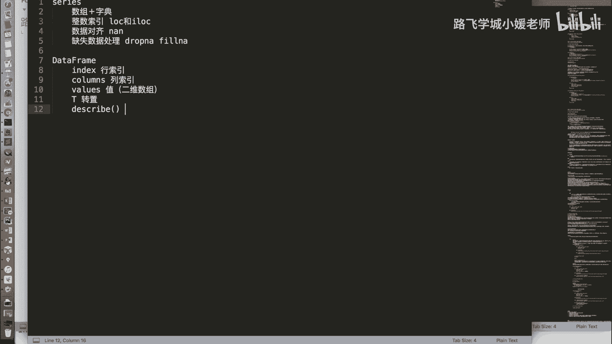
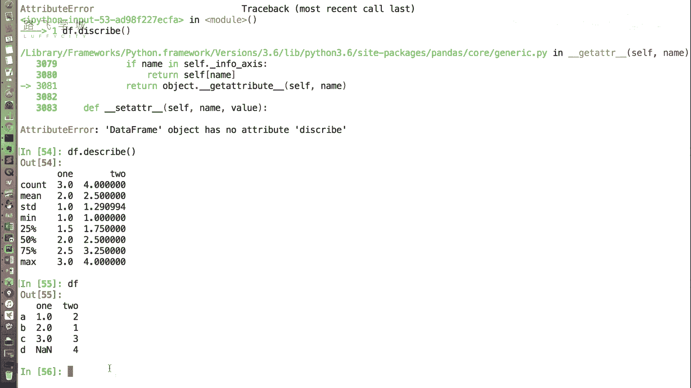

# Python金融量化：P14：DataFrame常用属性 📊

在本节课中，我们将学习Pandas中`DataFrame`对象的几个常用属性。这些属性可以帮助我们快速查看和了解数据的基本结构，例如行索引、列索引、数据值以及一些统计摘要。

上一节我们介绍了`DataFrame`对象的创建方式，本节中我们来看看它有哪些实用的属性。

## 常用属性介绍

以下是`DataFrame`对象的一些核心属性。

### 1. 行索引与列索引

`DataFrame`是一个二维表格，拥有行索引和列索引。

*   **`index`属性**：用于获取`DataFrame`的行索引。行索引是表格最左侧的标签。
*   **`columns`属性**：用于获取`DataFrame`的列索引。列索引是表格最上方的标签。

```python
import pandas as pd

# 创建一个示例DataFrame
data = {'one': [1, 2, 3, None], 'two': [4, 5, 6, 7]}
df = pd.DataFrame(data, index=['A', 'B', 'C', 'D'])

# 获取行索引
print(df.index)  # 输出: Index(['A', 'B', 'C', 'D'], dtype='object')

# 获取列索引
print(df.columns)  # 输出: Index(['one', 'two'], dtype='object')
```

### 2. 数据值

`values`属性用于获取`DataFrame`中的数据部分。与`Series`返回一维数组不同，`DataFrame`的`values`属性返回的是一个二维数组（或二维`ndarray`）。

```python
# 获取数据值
print(df.values)
# 输出:
# [[ 1.  4.]
#  [ 2.  5.]
#  [ 3.  6.]
#  [nan  7.]]
```

### 3. 转置

`T`属性用于获取`DataFrame`的转置。转置操作会将行和列互换，即原来的行索引变为列索引，原来的列索引变为行索引。

```python
# 获取转置
print(df.T)
# 输出:
#        A    B    C    D
# one  1.0  2.0  3.0  NaN
# two  4.0  5.0  6.0  7.0
```

**注意**：在转置过程中，如果某一列同时包含整数和浮点数（例如`NaN`），Pandas会将该列统一转换为浮点数类型，以确保数据类型的一致性。

### 4. 描述性统计

`describe()`是一个方法，用于快速生成`DataFrame`中数值列的描述性统计摘要。它返回一个新的`DataFrame`，包含计数、均值、标准差、最小值、最大值以及各分位数等信息。



```python
# 生成描述性统计
print(df.describe())
# 输出:
#             one       two
# count  3.000000  4.000000
# mean   2.000000  5.500000
# std    1.000000  1.290994
# min    1.000000  4.000000
# 25%    1.500000  4.750000
# 50%    2.000000  5.500000
# 75%    2.500000  6.250000
# max    3.000000  7.000000
```

**统计项说明**：
*   **count**：非空值的数量。
*   **mean**：平均值。
*   **std**：标准差，衡量数据的离散程度。
*   **min**：最小值。
*   **25%**：第一四分位数（下四分位数）。
*   **50%**：中位数。
*   **75%**：第三四分位数（上四分位数）。
*   **max**：最大值。

## 总结



本节课中我们一起学习了`DataFrame`的几个关键属性：
1.  **`index`**：获取行索引。
2.  **`columns`**：获取列索引。
3.  **`values`**：以二维数组形式获取数据值。
4.  **`T`**：获取数据的转置。
5.  **`describe()`**：生成描述性统计摘要，帮助我们快速了解数据的分布情况。



掌握这些属性是进行数据探索和分析的基础。下一节，我们将学习如何对`DataFrame`进行数据选择和切片操作。