# Python金融量化：P15：03 典型爬虫程序的实现（二） 🕷️


在本节课中，我们将继续学习典型爬虫程序的实现。我们将重点介绍一个强大的HTML/XML解析库——Beautiful Soup，学习如何处理网页分页以获取更多数据，并初步了解深度优先与广度优先这两种重要的算法思想。通过本课的学习，你将能够编写更简洁、更高效的爬虫程序。

## Beautiful Soup：强大的解析工具 🧰

上一节我们介绍了使用正则表达式解析网页内容，本节中我们来看看一个更直观、更易用的工具：Beautiful Soup。

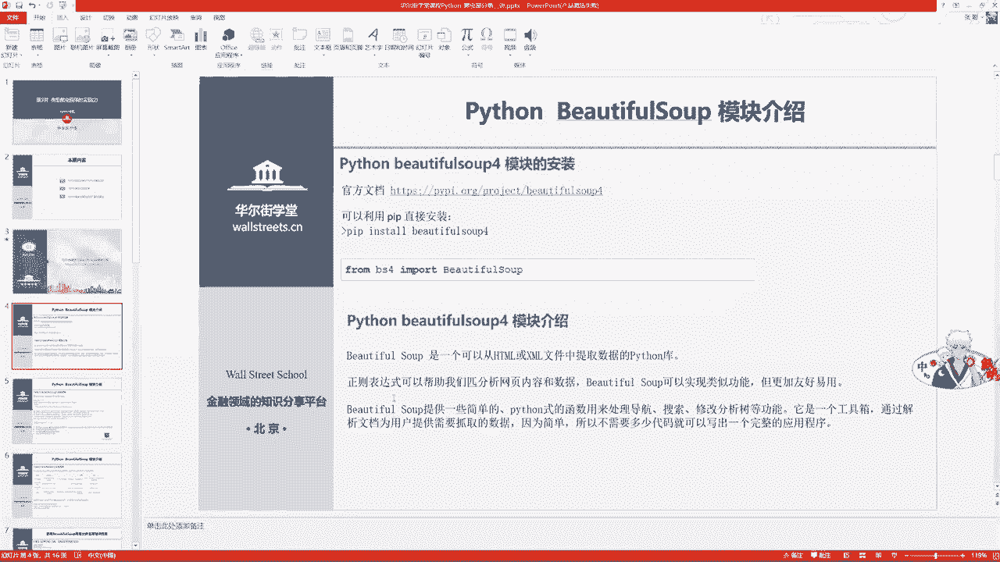

Beautiful Soup 是一个可以从HTML或XML文件中提取数据的Python库。它的安装非常简单，在命令行中使用 `pip install beautifulsoup4` 即可。安装完成后，通过 `from bs4 import BeautifulSoup` 导入使用。

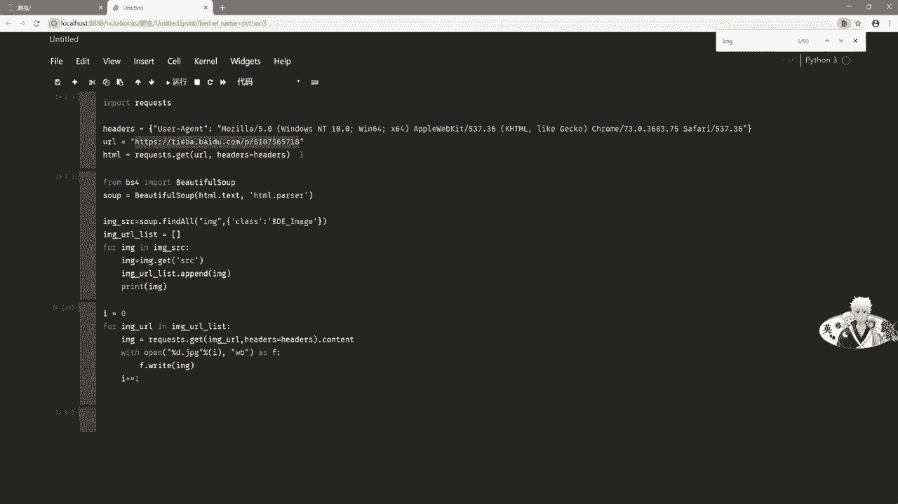

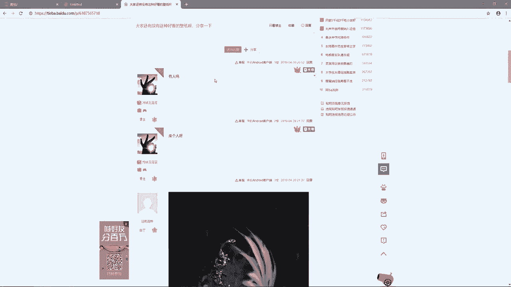

既然我们已经有了功能强大的正则表达式，为什么还需要Beautiful Soup呢？原因在于正则表达式虽然强大，但编写复杂的模式时，代码冗长且难以理解和维护。一旦模式有误，匹配结果可能完全错误。相比之下，Beautiful Soup提供了更友好、更直观的API，让我们可以像操作文档对象模型（DOM）一样轻松地提取数据。

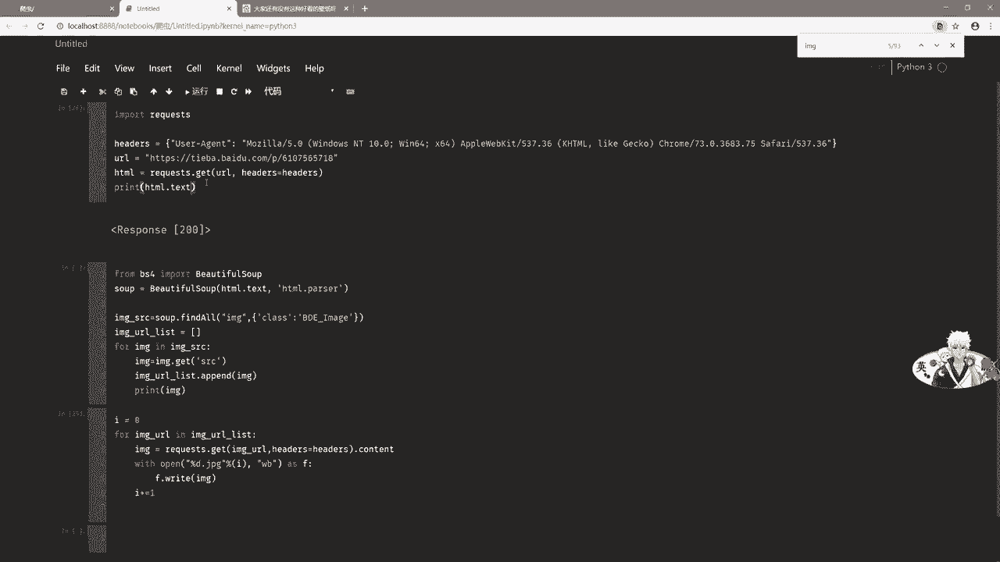

让我们通过一个简单的例子来感受它的便捷性。以下代码演示了如何使用Beautiful Soup提取百度贴吧帖子中的图片链接：

```python
from bs4 import BeautifulSoup
import requests

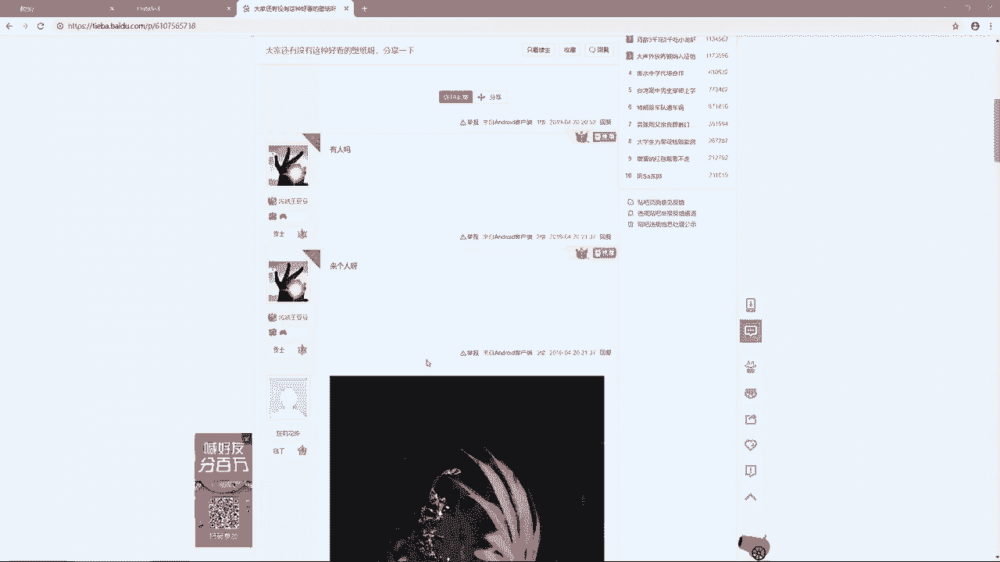

# 定义请求头
headers = {
    ‘User-Agent‘: ‘Mozilla/5.0 (Windows NT 10.0; Win64; x64) AppleWebKit/537.36‘
}
url = ‘https://tieba.baidu.com/p/xxxxxxx‘  # 替换为实际帖子链接

# 发起请求
response = requests.get(url, headers=headers)
print(response.status_code)  # 输出状态码，200表示成功

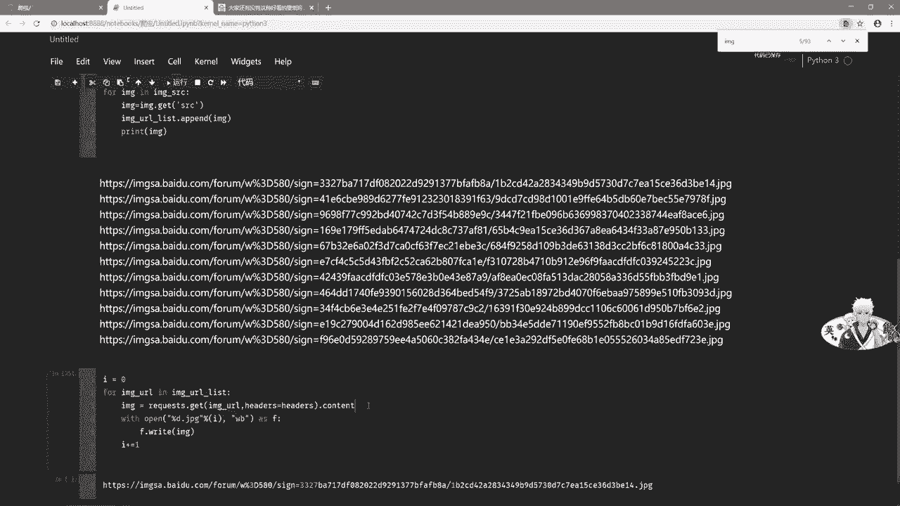

# 使用Beautiful Soup解析内容
soup = BeautifulSoup(response.text, ‘html.parser‘)
# 查找所有图片标签
img_tags = soup.find_all(‘img‘, class_=‘BDE_Image‘)

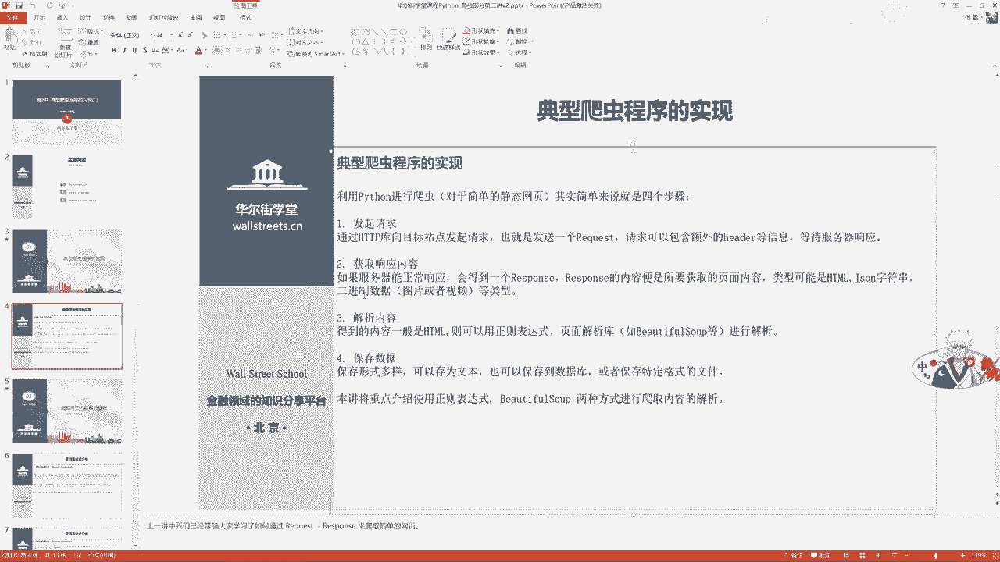

# 提取图片链接
img_urls = [img[‘src‘] for img in img_tags]
print(img_urls)

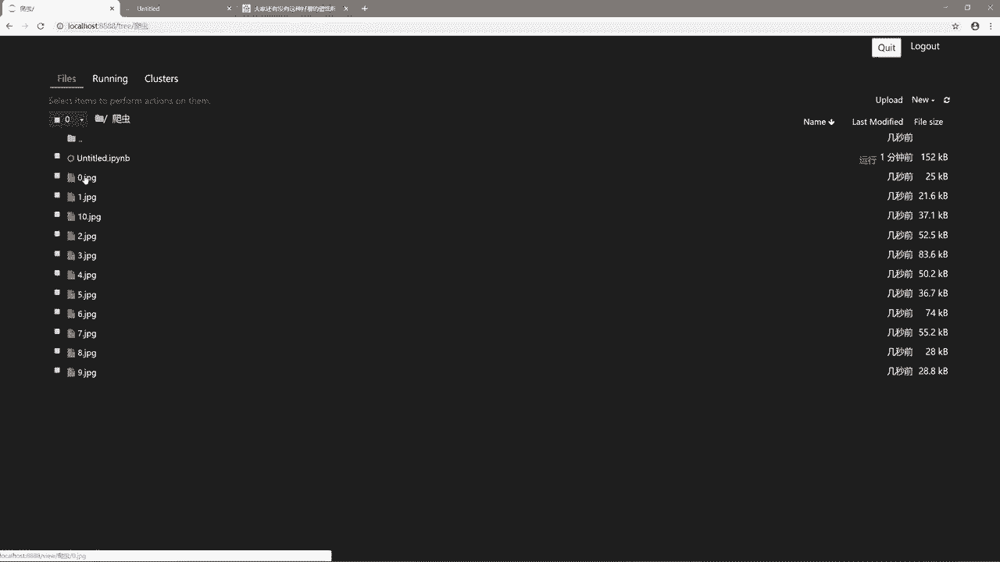

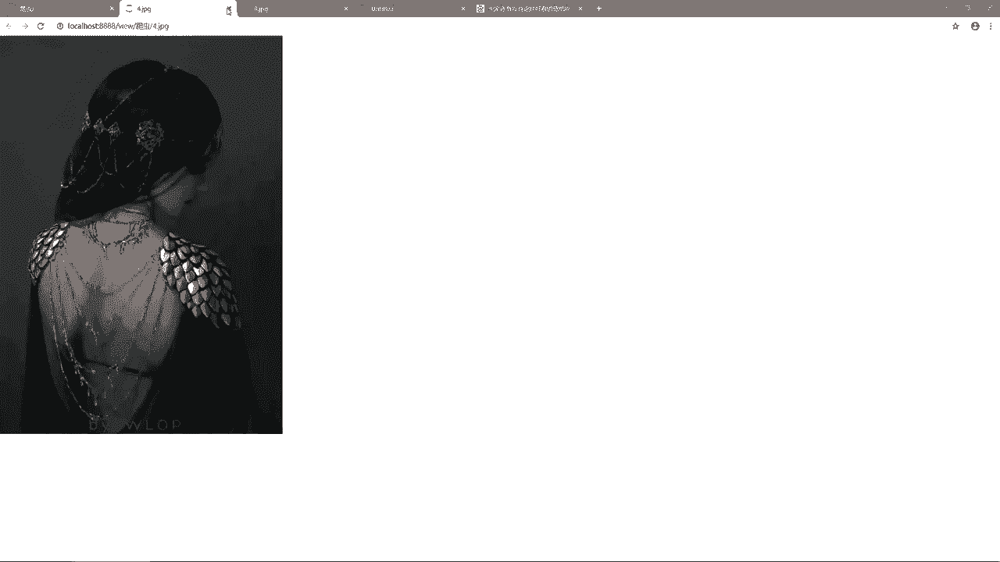

# 下载并保存图片
for index, img_url in enumerate(img_urls):
    img_data = requests.get(img_url).content  # 获取二进制图片数据
    with open(f‘{index+1}.jpg‘, ‘wb‘) as f:  # 以二进制写入模式打开文件
        f.write(img_data)
```

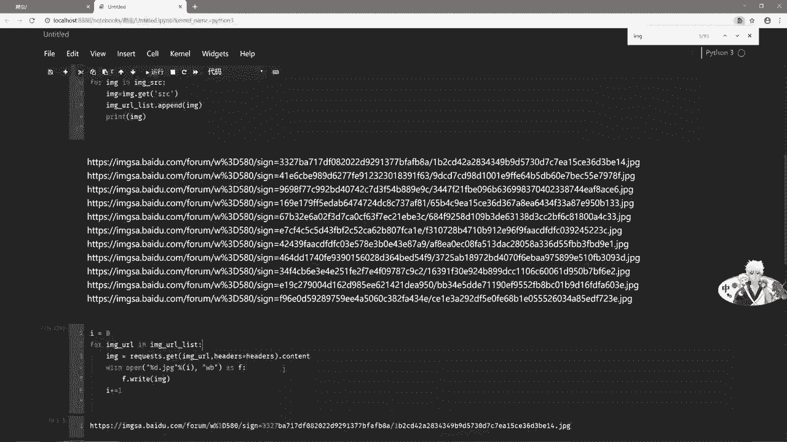

通过这段简短的代码，我们无需分析复杂的HTML结构或编写冗长的正则模式，就轻松获取并保存了图片。这充分展示了Beautiful Soup的简洁与强大。

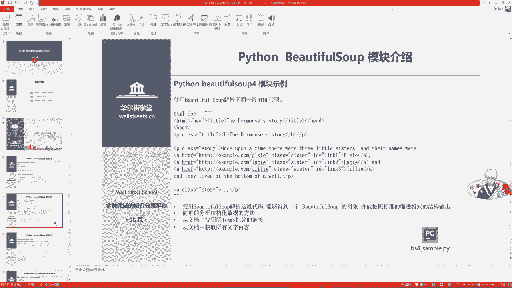

## Beautiful Soup 核心方法详解 📖

了解了Beautiful Soup的基本用途后，本节我们详细学习它提供的核心方法。我们可以将Beautiful Soup理解为一个工具箱，它提供了一系列简单易用的函数来“抓取”我们想要的数据。

以下是一些最常用的方法，我们通过一段示例HTML代码来演示：

```python
from bs4 import BeautifulSoup

html_doc = “““
<html>
<head><title>The Dormouse‘s story</title></head>
<body>
<p class=“title“><b>The Dormouse‘s story</b></p>
<p class=“story“>Once upon a time there were three little sisters; and their names were
<a href=“http://example.com/elsie“ class=“sister“ id=“link1“>Elsie</a>,
<a href=“http://example.com/lacie“ class=“sister“ id=“link2“>Lacie</a> and
<a href=“http://example.com/tillie“ class=“sister“ id=“link3“>Tillie</a>;
and they lived at the bottom of a well.</p>
<p class=“story“>...</p>
</body>
</html>
“““

soup = BeautifulSoup(html_doc, ‘html.parser‘)
```

以下是这些方法的具体应用：

*   **`soup.prettify()`**: 此方法用于将HTML代码格式化输出，使其层次分明，便于阅读。
*   **`soup.title`**: 获取文档的`<title>`标签及其内容。
*   **`soup.title.name`**: 获取`<title>`标签的名称（即字符串`‘title‘`）。
*   **`soup.title.string`**: 获取`<title>`标签内的文本字符串。
*   **`soup.title.parent.name`**: 获取`<title>`标签的父标签的名称（即`‘head‘`）。
*   **`soup.p`**: 获取文档中的第一个`<p>`标签。
*   **`soup.p[‘class‘]`**: 获取第一个`<p>`标签的`class`属性值。
*   **`soup.a`**: 获取文档中的第一个`<a>`标签。
*   **`soup.find_all(‘a‘)`**: 获取文档中所有的`<a>`标签，返回一个列表。
*   **`soup.find(id=“link3“)`**: 查找`id`属性为`“link3“`的标签。
*   **`soup.get_text()`**: 获取文档中的所有文本内容。

通过这些方法，我们可以非常直观地定位和提取HTML中的任何元素。Beautiful Soup不仅支持标准的HTML解析，还支持`lxml`和`html5lib`等解析器，只需在创建对象时指定即可，例如 `BeautifulSoup(html_doc, ‘lxml‘)`。

## 实战：爬取豆瓣电影短评 🎬

学习了Beautiful Soup的基本用法后，让我们进行一个实战：爬取豆瓣电影《红海行动》的短评数据。

首先，我们分析目标网页。短评内容通常位于特定的HTML标签内，例如`<span class=“short“>`。我们的任务是提取这些标签内的文本。

以下是实现单页短评爬取的核心代码：

```python
import requests
from bs4 import BeautifulSoup
import pandas as pd

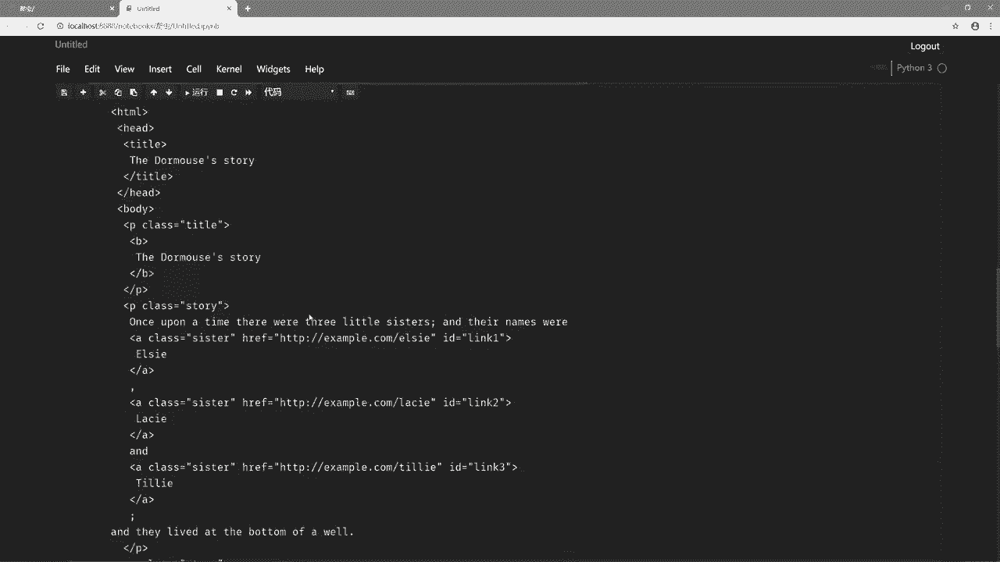

headers = {‘User-Agent‘: ‘你的浏览器User-Agent‘}
url = ‘https://movie.douban.com/subject/26861685/comments?status=P‘  # 红海行动短评页

# 发起请求
r = requests.get(url, headers=headers)
# 解析内容
soup = BeautifulSoup(r.text, ‘html.parser‘)
# 查找所有短评标签
comments = soup.find_all(‘span‘, class_=‘short‘)

# 提取文本并存储
comment_list = []
for comment in comments:
    comment_list.append(comment.get_text())

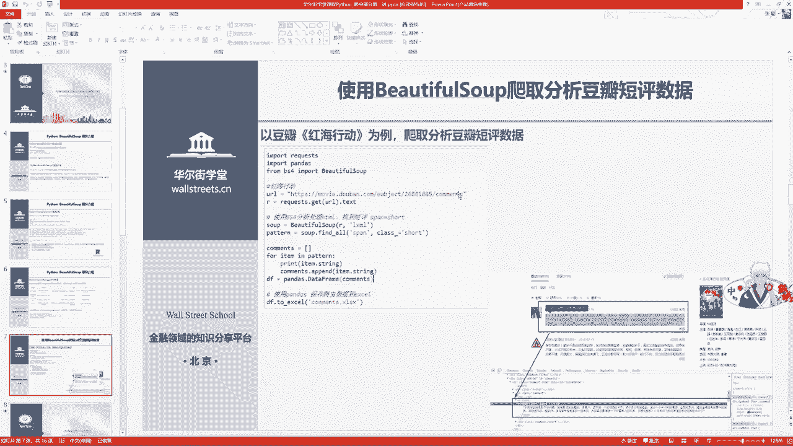

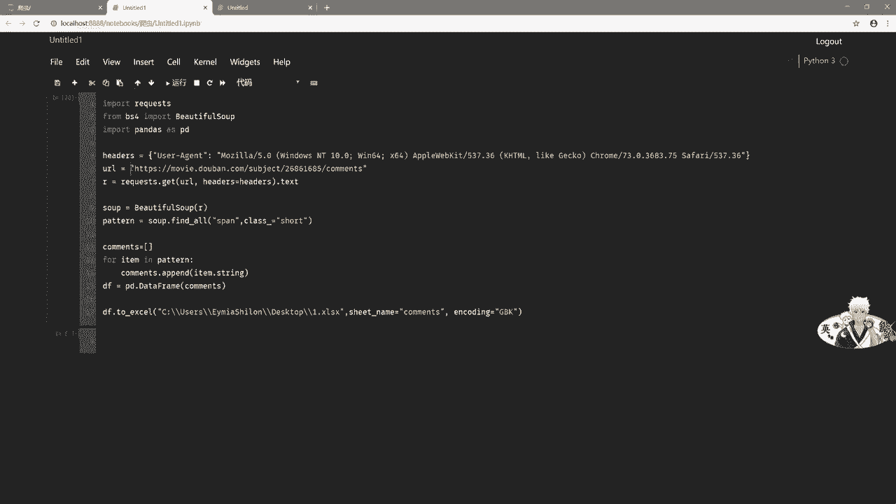

# 使用pandas保存到Excel
df = pd.DataFrame(comment_list, columns=[‘短评‘])
df.to_excel(‘红海行动短评.xlsx‘, index=False)
```

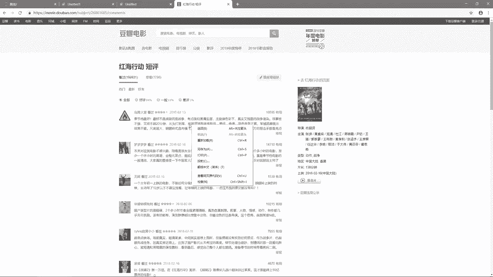

运行这段代码，即可将当前页的短评保存到Excel文件中。代码逻辑清晰：发起请求、解析HTML、定位目标标签、提取文本、保存数据。整个过程得益于Beautiful Soup，变得异常简单。

## 处理网页分页机制 🔄

上一节我们成功爬取了单页数据，但豆瓣短评通常有多页。本节中我们来看看如何让爬虫自动处理分页。

观察豆瓣短评的URL，我们发现翻页是通过URL参数控制的：
*   第一页: `...comments?start=0&limit=20&status=P...`
*   第二页: `...comments?start=20&limit=20&status=P...`
*   第三页: `...comments?start=40&limit=20&status=P...`

规律很明显：`start`参数以20为增量（即每页的评论数`limit`）递增。因此，实现自动翻页的核心就是循环生成不同`start`值的URL并发起请求。

以下是爬取前三页短评的改进代码：

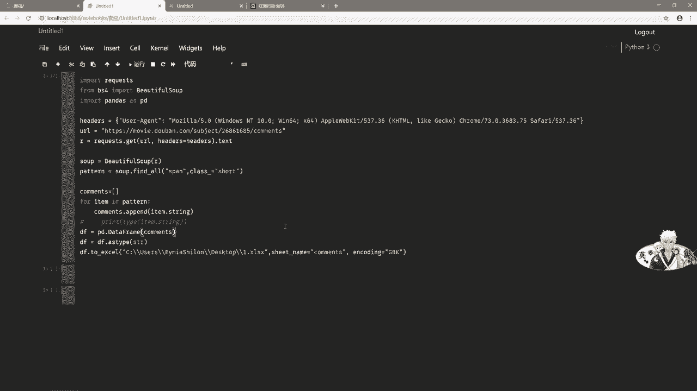

```python
import requests
from bs4 import BeautifulSoup
import pandas as pd
import time


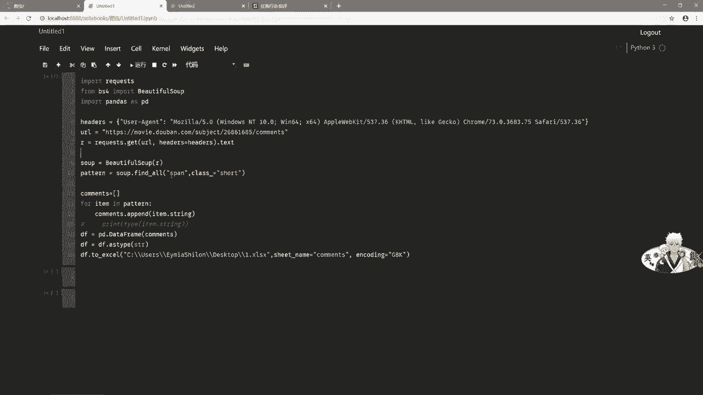

headers = {‘User-Agent‘: ‘你的浏览器User-Agent‘}
base_url = ‘https://movie.douban.com/subject/26861685/comments?start={}&limit=20&status=P‘

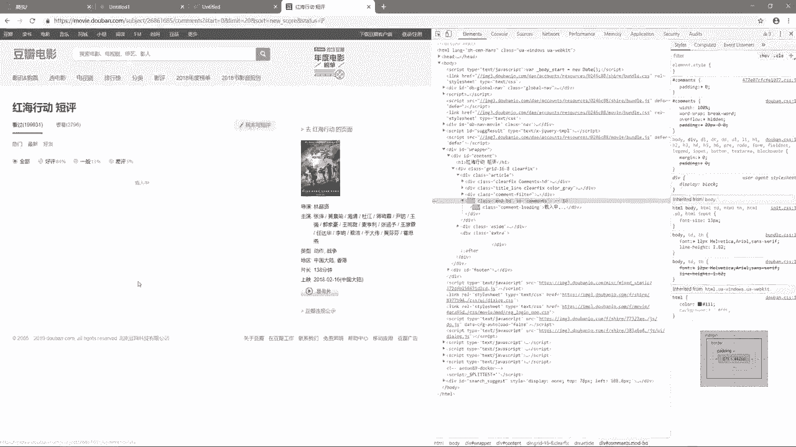

all_comments = []

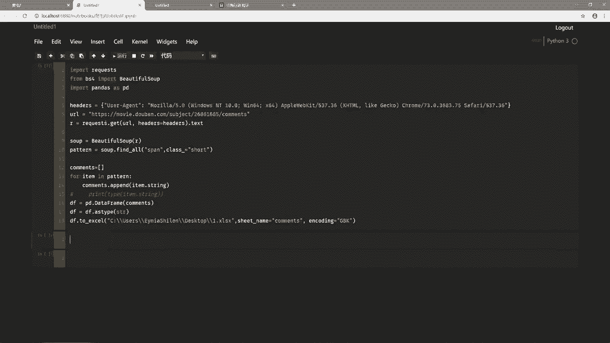

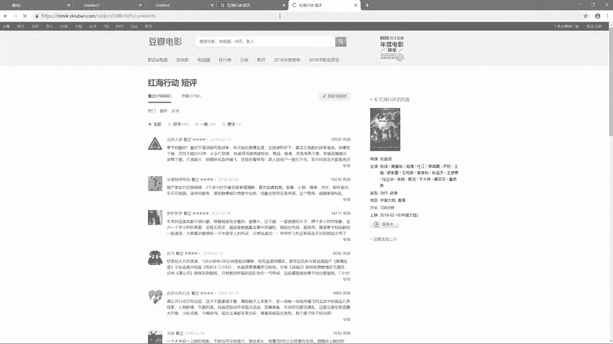

for i in range(0, 60, 20):  # 生成0, 20, 40
    url = base_url.format(i)  # 格式化URL，插入start值
    print(f‘正在爬取: {url}‘)

    r = requests.get(url, headers=headers)
    soup = BeautifulSoup(r.text, ‘html.parser‘)
    comments = soup.find_all(‘span‘, class_=‘short‘)

    for comment in comments:
        all_comments.append(comment.get_text())

    time.sleep(1)  # 礼貌性暂停，避免请求过快

# 将所有评论保存到一个文件
df = pd.DataFrame(all_comments, columns=[‘短评‘])
df.to_excel(‘红海行动短评_多页.xlsx‘, index=False)
print(‘爬取完成！‘)
```

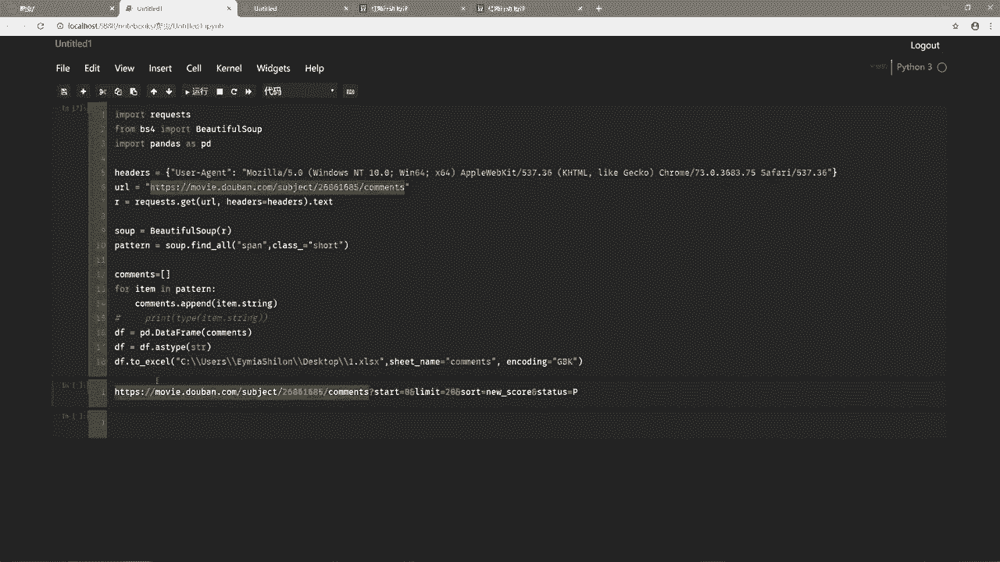

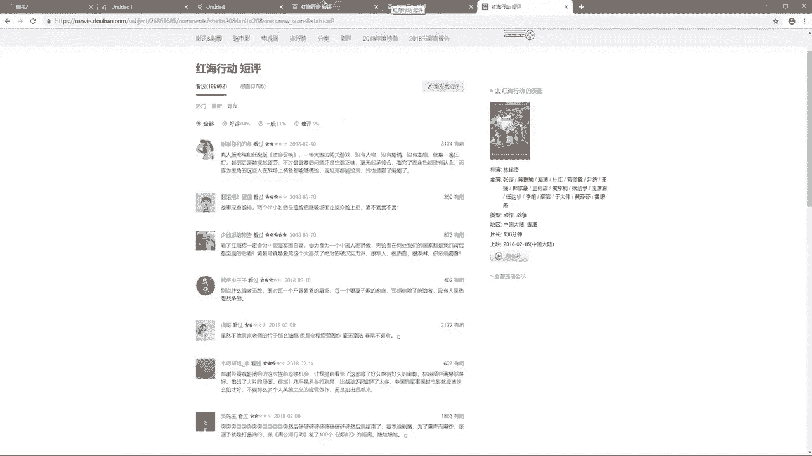

在这段代码中，我们通过一个`for`循环动态构建每一页的URL，并将所有页的评论收集到`all_comments`列表中，最后一次性保存。我们还添加了`time.sleep(1)`来在请求间加入短暂延迟，这是一种良好的爬虫礼仪，可以减轻服务器压力。

## 算法思想初探：深度优先与广度优先 🌲

在结束本节课之前，我们简要介绍两种在爬虫和更广泛计算机科学中非常重要的算法思想：深度优先搜索（DFS）和广度优先搜索（BFS）。它们定义了遍历或搜索树或图结构的不同策略。

想象一下你要探索一个迷宫（或一个网站的所有链接）：
*   **深度优先（DFS）**：选择一条路径（或一个链接）一直走到尽头（深度），直到无路可走，再回溯到上一个分岔点，选择另一条未走过的路径继续深入。这就像“一条道走到黑”。
*   **广度优先（BFS）**：从起点开始，先探索所有相邻的、直接可达的点（广度），然后再去探索这些点的下一层相邻点。这就像“一圈一圈地扩散”。

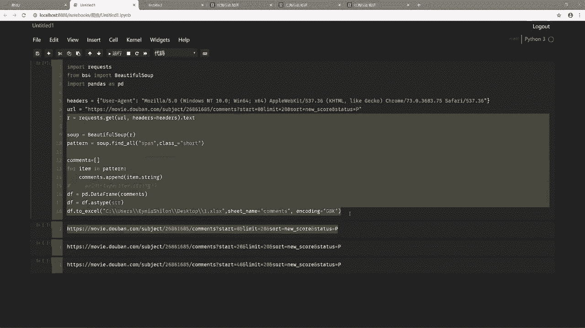

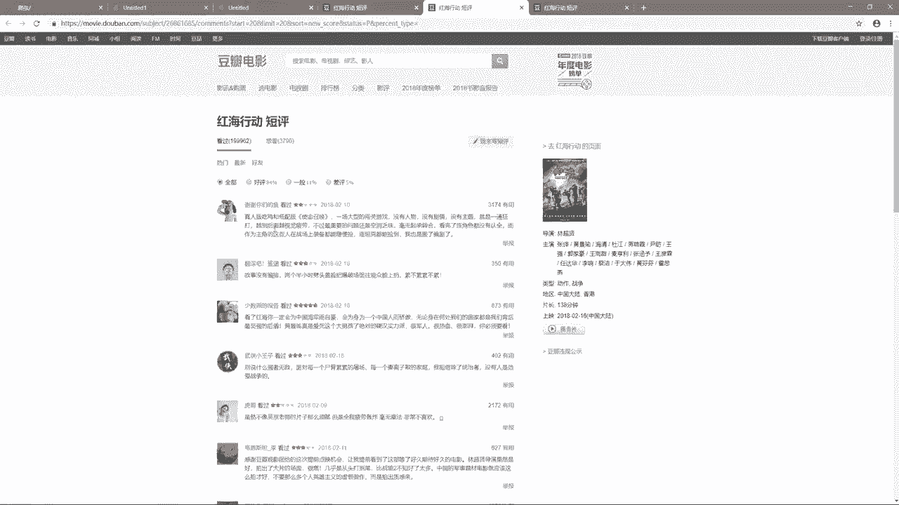

在爬虫场景中：
*   如果你想深入地抓取某个网站某个分支下的所有子页面，可能会采用DFS策略。
*   如果你想先抓取一个网站的所有主要分类页面（第一层链接），然后再抓取每个分类下的详情页（第二层链接），则更接近BFS策略。

这两种策略没有绝对的优劣，选择取决于具体的爬取需求。在后续更复杂的爬虫项目中，理解这两种思想将帮助你设计更合理的爬取逻辑。

## 总结 📝

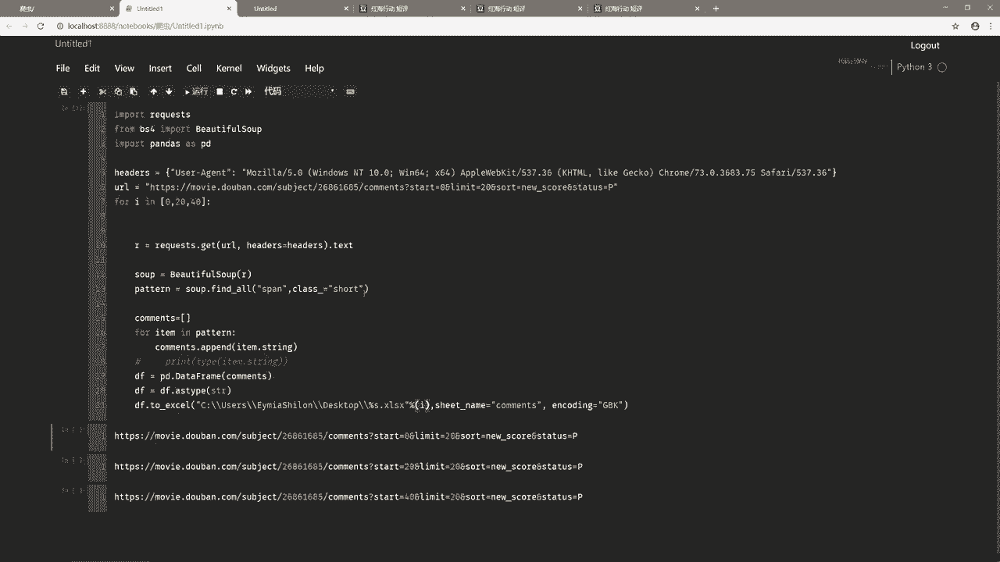

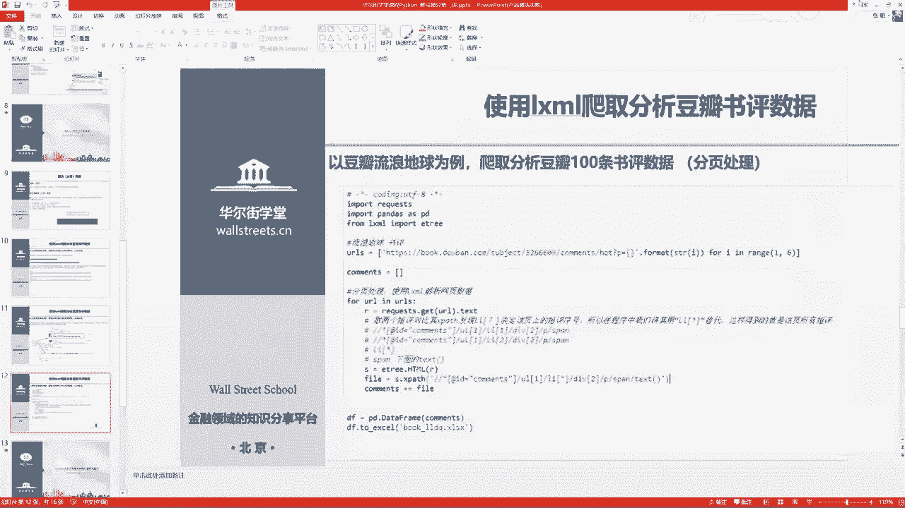

本节课中我们一起学习了典型爬虫程序实现的进阶内容。

我们首先深入学习了**Beautiful Soup**这个强大的HTML/XML解析库，它通过直观的API让我们能够轻松定位和提取网页元素，大大简化了数据解析的复杂度。

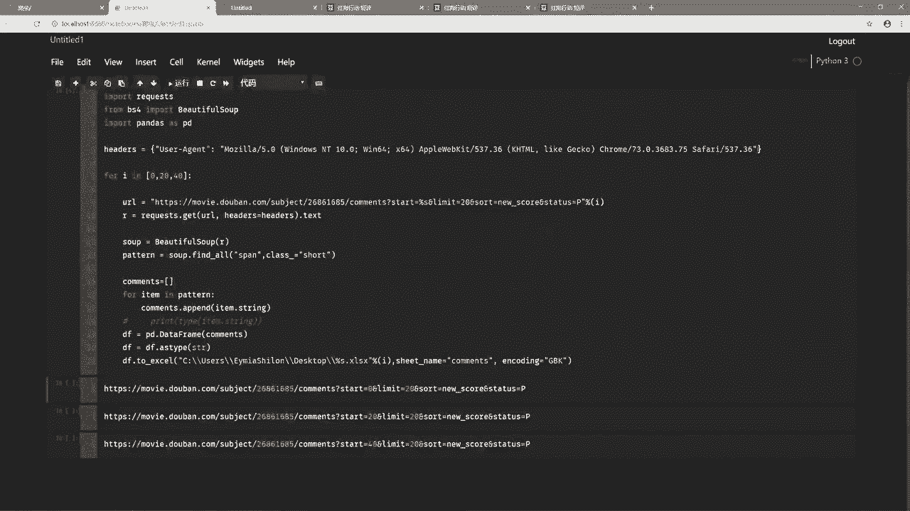

接着，我们探讨了**网页分页的处理机制**。通过分析URL的规律，我们使用循环动态构建请求地址，实现了爬虫的自动翻页功能，从而能够获取多页数据。

最后，我们初步了解了**深度优先（DFS）**和**广度优先（BFS）**这两种基本的算法遍历思想，为将来设计更复杂的爬虫抓取路径打下了基础。

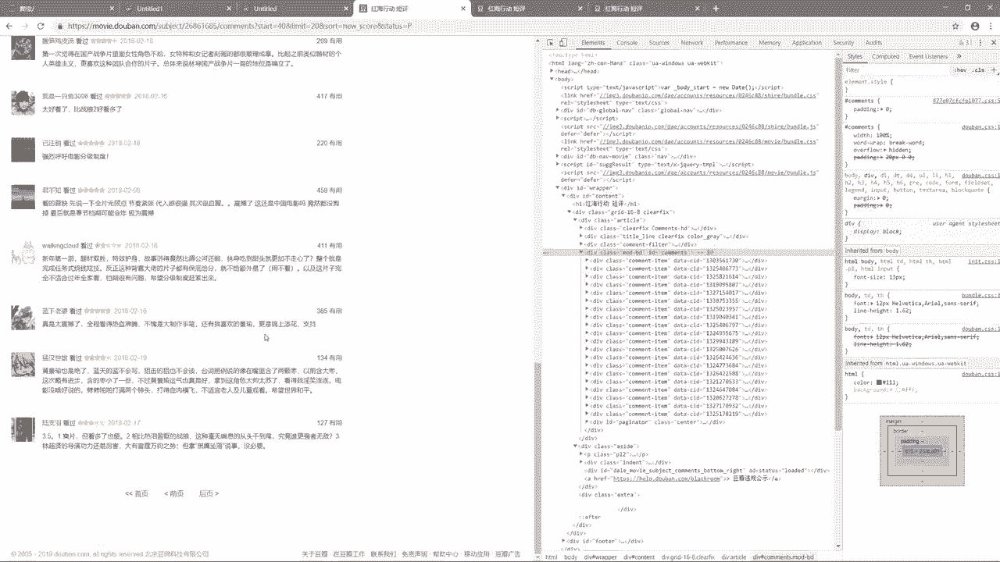

通过本课的学习，你的爬虫工具箱更加丰富了。现在，你不仅能用正则表达式进行精准的文本匹配，还能用Beautiful Soup优雅地解析文档结构，并能处理常见的多页数据抓取任务。