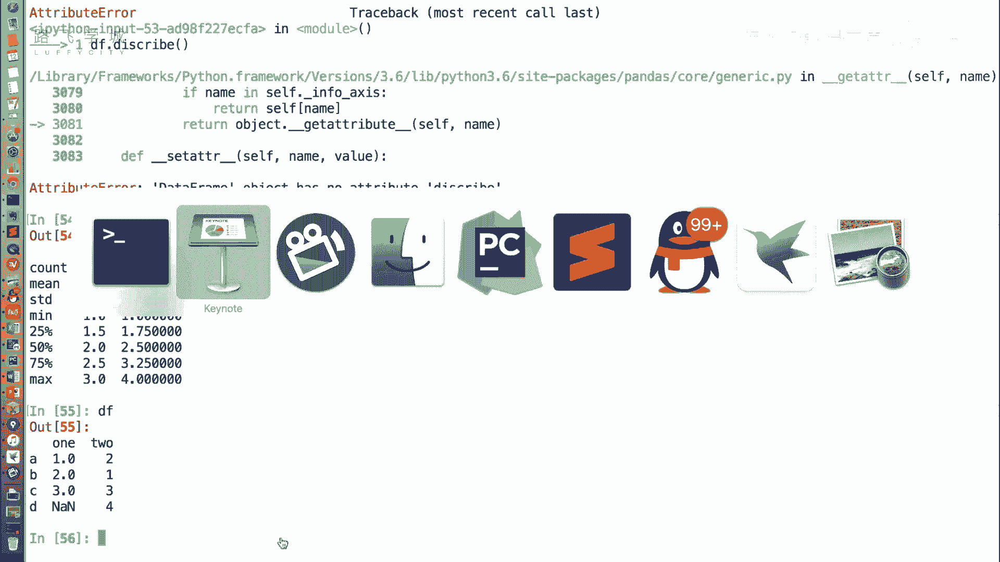
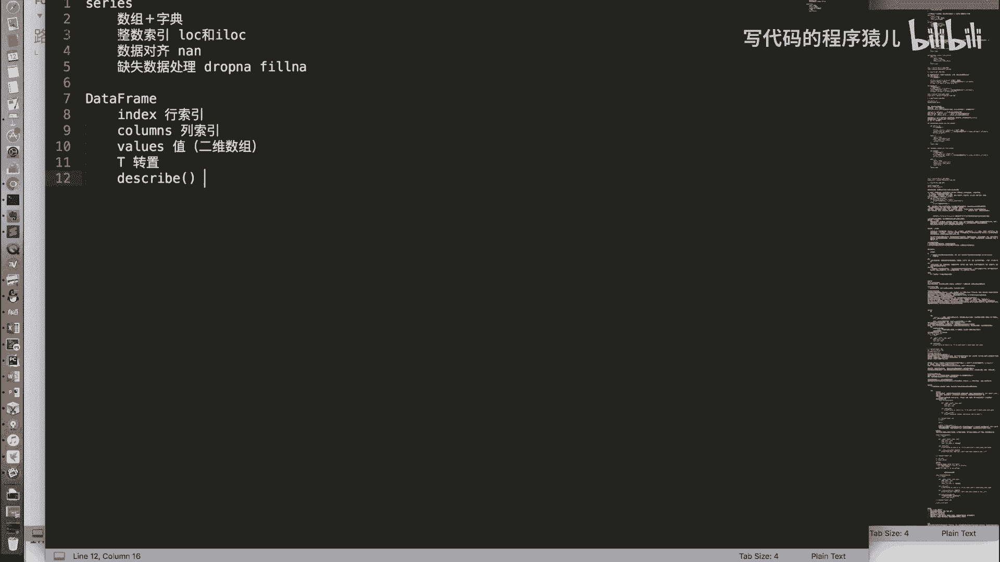
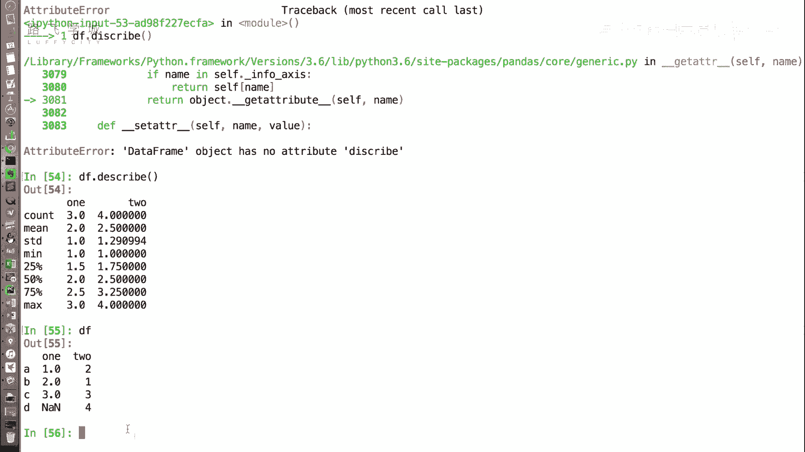

# Python金融量化：P15：DataFrame常用属性 📊

在本节课中，我们将学习Pandas中`DataFrame`对象的一些常用属性。这些属性可以帮助我们快速查看和了解数据的基本结构，例如行索引、列索引、数据值以及一些统计信息。

上一节我们介绍了`DataFrame`对象的创建方式，本节中我们来看看它有哪些常用的属性。

## 常用属性详解

与`Series`对象类似，`DataFrame`也有`index`和`values`属性，但也有一些独特的属性。

### 1. 行索引与列索引

`index`属性用于获取`DataFrame`的行索引，即数据最左侧的索引标签。`columns`属性用于获取`DataFrame`的列索引，即数据顶部的列名。

```python
import pandas as pd

# 创建一个示例DataFrame
data = {'one': [1, 2, None, 4], 'two': [5, 6, 7, 8]}
df = pd.DataFrame(data, index=['A', 'B', 'C', 'D'])

# 获取行索引
print(df.index)  # 输出: Index(['A', 'B', 'C', 'D'], dtype='object')

# 获取列索引
print(df.columns)  # 输出: Index(['one', 'two'], dtype='object')
```

### 2. 数据值

`values`属性用于获取`DataFrame`中的数据值。与`Series`返回一维数组不同，`DataFrame`的`values`属性返回的是一个二维数组（或二维`ndarray`），其中每一行是一个一维数组。

```python
# 获取数据值
print(df.values)
# 输出:
# [[ 1.  5.]
#  [ 2.  6.]
#  [nan  7.]
#  [ 4.  8.]]
```

### 3. 转置

`T`属性用于获取`DataFrame`的转置，即将行和列互换。这在处理某些数据格式或进行矩阵运算时非常有用。

```python
# 获取转置
print(df.T)
# 输出:
#        A    B    C    D
# one  1.0  2.0  NaN  4.0
# two  5.0  6.0  7.0  8.0
```

**注意**：在转置过程中，如果数据列中存在浮点数（例如`NaN`），Pandas可能会将整列数据统一转换为浮点数类型，以确保数据类型的一致性。

### 4. 数据描述

`describe()`方法用于快速生成`DataFrame`中数值列的统计摘要。它返回一个新的`DataFrame`，包含计数、均值、标准差、最小值、最大值以及各分位数等信息。

以下是`describe()`方法返回的统计信息列表：

*   **count**：非空值的数量。
*   **mean**：平均值。
*   **std**：标准差。
*   **min**：最小值。
*   **25%**：第一四分位数。
*   **50%**：中位数。
*   **75%**：第三四分位数。
*   **max**：最大值。



```python
# 获取数据描述
print(df.describe())
# 输出:
#             one       two
# count  3.000000  4.000000
# mean   2.333333  6.500000
# std    1.527525  1.290994
# min    1.000000  5.000000
# 25%    1.500000  5.750000
# 50%    2.000000  6.500000
# 75%    3.000000  7.250000
# max    4.000000  8.000000
```

## 总结

本节课中我们一起学习了`DataFrame`对象的几个核心属性：



*   **`df.index`**：获取行索引。
*   **`df.columns`**：获取列索引。
*   **`df.values`**：获取数据值（二维数组）。
*   **`df.T`**：获取数据的转置。
*   **`df.describe()`**：获取数值列的统计摘要。



掌握这些属性是进行数据探索和分析的基础，它们能帮助我们快速了解数据的整体结构和基本统计特征。