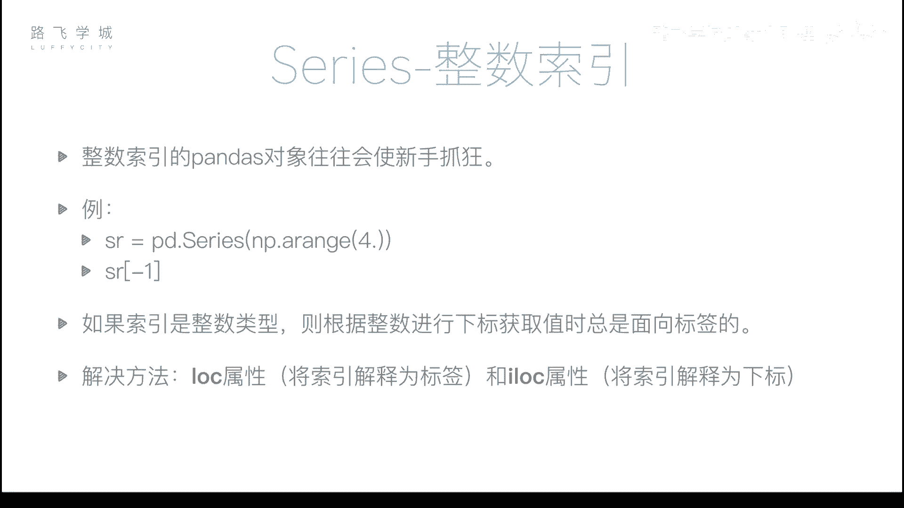
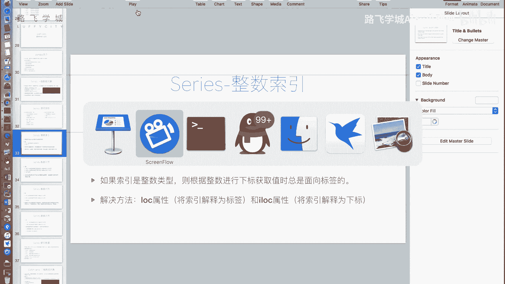
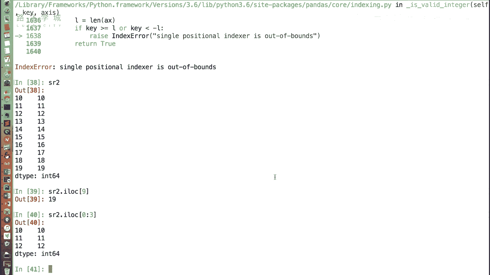
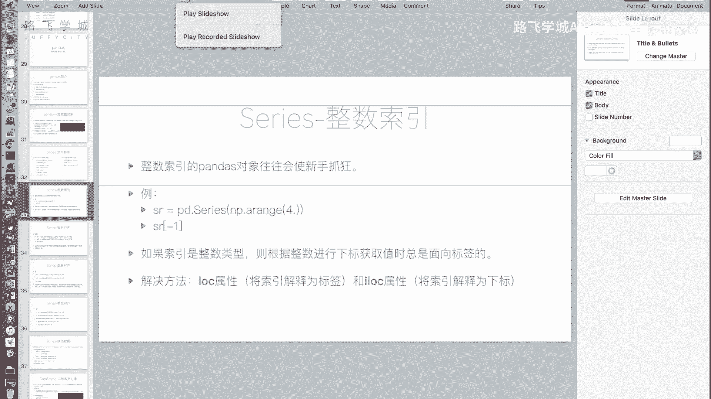

# Python金融量化：P15：Series整数索引问题

在本节课中，我们将要学习Pandas Series对象在使用整数索引时可能遇到的歧义问题，并掌握如何通过`.loc`和`.iloc`属性来明确指定索引方式，从而避免混淆。



上一节我们介绍了Series的一些基本特性，本节中我们来看看一个使用Series对象时非常重要的注意事项：当你使用整数索引的Pandas对象时，往往会让新手感到困惑。



## 整数索引的歧义问题

整数索引是指Series的索引标签是整数。例如，我们创建一个没有指定索引的Series，它会自动生成从0开始的整数索引。

```python
import pandas as pd
import numpy as np

sr = pd.Series(np.arange(20))
print(sr)
```
输出结果将是索引从0到19的Series。

如果我们通过切片创建一个新的Series对象，例如从索引10开始切片：
```python
sr2 = sr[10:].copy()
print(sr2)
```
这个新的`sr2`对象的索引是从10开始的整数，而不是从0开始。

此时，如果我们尝试通过`sr2[10]`来取值，就会产生歧义。这个`10`可能被解释为**标签**（即索引值为10的那一行），也可能被解释为**位置下标**（即从0开始的第10个位置）。Pandas规定，在这种情况下，中括号`[]`内的值**总是被解释为标签**。因此，`sr2[10]`会返回标签为10的那一行的值。

然而，如果你想通过位置下标获取最后一个值，比如`sr2[9]`，它并不会返回你期望的第9个位置（即原Series的第19个值），而是会尝试寻找标签为9的行。由于`sr2`的标签从10开始，没有标签9，所以会导致`KeyError`错误。

## 解决方案：使用.loc和.iloc属性

为了解决整数索引带来的歧义，Pandas提供了两个明确的属性：`.loc`和`.iloc`。

以下是这两个属性的核心区别：
*   **`.loc[]`**：**基于标签的索引**。中括号内的值被强制解释为索引标签。
*   **`.iloc[]`**：**基于整数位置的索引**。中括号内的值被强制解释为从0开始的位置下标。

### 使用.loc进行标签索引

使用`.loc`属性时，程序明确知道你要使用标签进行索引。

```python
# 获取标签为10的那一行的值
value_by_label = sr2.loc[10]
print(value_by_label)  # 输出: 10
```

### 使用.iloc进行位置索引

使用`.iloc`属性时，程序明确知道你要使用位置下标进行索引。

```python
# 获取位置下标为9（即第10个）的值
value_by_position = sr2.iloc[9]
print(value_by_position)  # 输出: 19
```
注意，`sr2.iloc[9]`获取的是`sr2`中从0开始数第9个位置的值。

`.loc`和`.iloc`不仅支持单个值获取，也完全支持切片、布尔索引和花式索引等操作，只是明确了索引的依据是标签还是位置。

例如，使用`.iloc`进行切片：
```python
# 获取sr2的前三行（按位置）
first_three = sr2.iloc[0:3]
print(first_three)
```



## 总结

本节课中我们一起学习了Pandas Series整数索引的潜在问题。核心在于，当索引为整数时，直接使用中括号`[]`会产生歧义，Pandas默认将其解释为标签索引。为了避免混淆，我们引入了两个关键属性：
*   **`.loc[]`** 用于**基于标签**的索引。
*   **`.iloc[]`** 用于**基于位置**的索引。



只要在涉及整数索引的场景中，明确使用`.loc`或`.iloc`，就可以清晰、无误地访问Series中的数据。