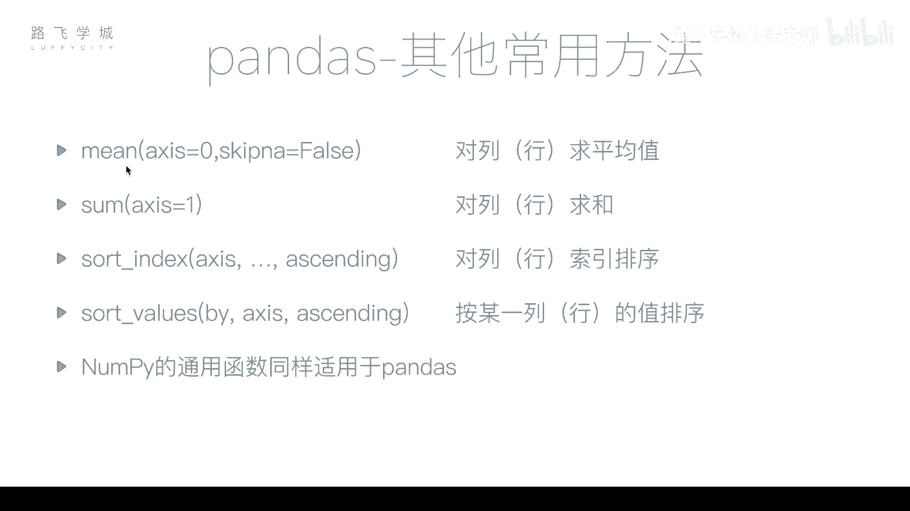
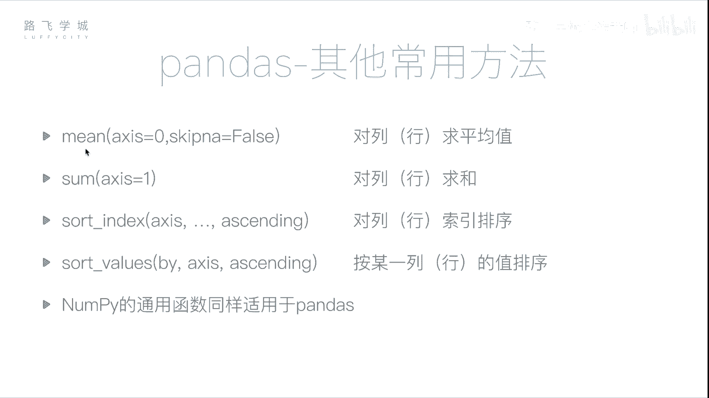

# Python金融量化：P15：pandas常用函数

在本节课中，我们将学习pandas库中一些常用的数据处理函数，包括求平均值、求和以及排序等操作。掌握这些函数能帮助我们更高效地分析和处理金融数据。



## 求平均值：mean方法

上一节我们介绍了缺失值处理，本节中我们来看看如何计算数据的平均值。pandas中的`mean`方法用于计算平均值。


在NumPy库中，`mean`函数用于计算数组的平均值。但在pandas的DataFrame对象中，`mean`方法的行为有所不同。对于一个DataFrame执行`mean`操作，默认会按列计算每一列的平均值，并返回一个Series对象。

例如，对于一个包含两列的DataFrame，`df.mean()`会返回一个长度为2的Series，其中每个元素是对应列的平均值。计算时会自动忽略缺失值（NaN）。

如果想按行计算平均值，需要设置参数`axis=1`，即`df.mean(axis=1)`。

以下是求平均值的代码示例：
```python
# 按列求平均值（默认）
column_means = df.mean()

# 按行求平均值
row_means = df.mean(axis=1)
```

## 求和：sum方法

接下来，我们学习求和函数。`sum`方法用于计算数据的总和，其使用方式与`mean`方法类似。

默认情况下，`df.sum()`会按列对每一列进行求和。如果需要按行求和，则需要传入参数`axis=1`，即`df.sum(axis=1)`。

以下是求和的代码示例：
```python
# 按列求和（默认）
column_sums = df.sum()

# 按行求和
row_sums = df.sum(axis=1)
```

## 数据排序

数据排序是数据分析中的常见操作。pandas提供了两种主要的排序方式：按值排序和按索引排序。

### 按值排序：sort_values方法

按值排序是指根据某一列或某一行具体的数值大小进行排序。使用`sort_values`方法，并通过`by`参数指定依据哪一列（或行）进行排序。

例如，`df.sort_values(by=‘two’)`表示依据名为‘two’的列进行升序排列。如果需要降序排列，可以设置参数`ascending=False`。

当排序依据的列中存在缺失值（NaN）时，所有包含NaN的行不会参与排序比较，而是统一被放置在排序结果的最后，无论是升序还是降序。

按行排序也是可行的，但较少使用。此时需要指定`axis=1`并通过`by`参数指定具体的行索引。

以下是按值排序的代码示例：
```python
# 按‘two’列升序排序
df_sorted_by_column = df.sort_values(by=‘two‘)

# 按‘two’列降序排序
df_sorted_desc = df.sort_values(by=‘two‘, ascending=False)

# 按索引为‘A’的行进行排序（按行）
df_sorted_by_row = df.sort_values(by=‘A‘, axis=1)
```

### 按索引排序：sort_index方法

按索引排序是指根据行索引或列索引的标签顺序进行排序。使用`sort_index`方法。

默认`df.sort_index()`会根据行索引（如A, B, C, D）进行升序排序。设置`ascending=False`可实现降序。

若要对列索引进行排序，需要指定参数`axis=1`，即`df.sort_index(axis=1)`。

以下是按索引排序的代码示例：
```python
# 按行索引升序排序
df_sorted_index = df.sort_index()

# 按行索引降序排序
df_sorted_index_desc = df.sort_index(ascending=False)

# 按列索引排序
df_sorted_columns = df.sort_index(axis=1)
```

## 其他通用函数

除了上述方法，之前在NumPy中学习过的许多通用函数同样适用于pandas对象。

例如，计算标准差（`std`）、方差（`var`）、最大值（`max`）、最小值（`min`）等函数，其调用方式与`mean`、`sum`类似，都可以在Series或DataFrame上直接使用，并支持通过`axis`参数指定计算方向。

---



本节课中我们一起学习了pandas的几个核心数据处理函数：用于计算平均值的`mean`方法、用于求和的`sum`方法，以及用于数据排序的`sort_values`和`sort_index`方法。理解并熟练运用这些函数，是进行高效金融数据分析的基础。