# Python金融量化：P16：04 典型爬虫程序的实现（三）


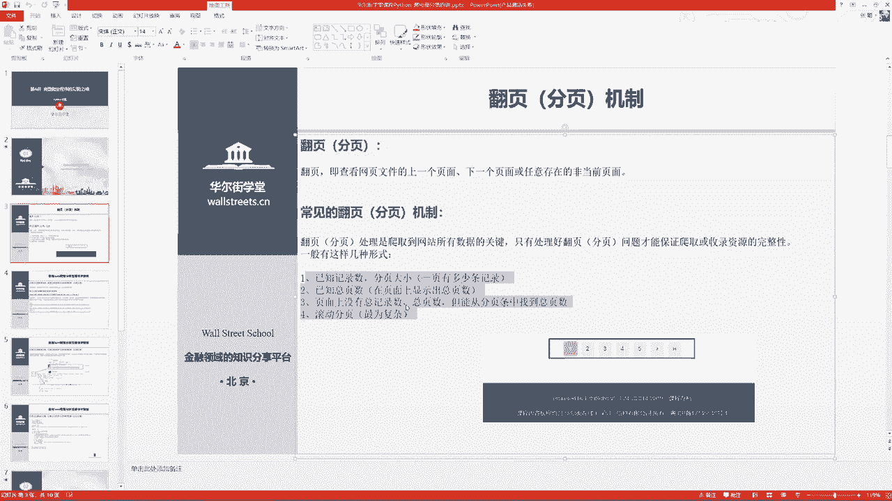

在本节课中，我们将继续学习爬虫程序的实现，重点探讨如何破解不同类型的网页分页机制，并介绍两种重要的算法思想：深度优先与广度优先。

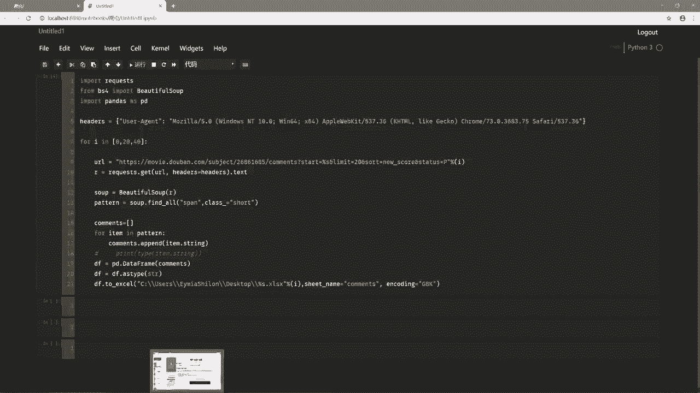

上一节我们介绍了Beautiful Soup模块的常用方法，并用它实现了一个简单的爬虫程序。本节中，我们来看看如何为爬虫程序实现更健壮、更通用的翻页功能。

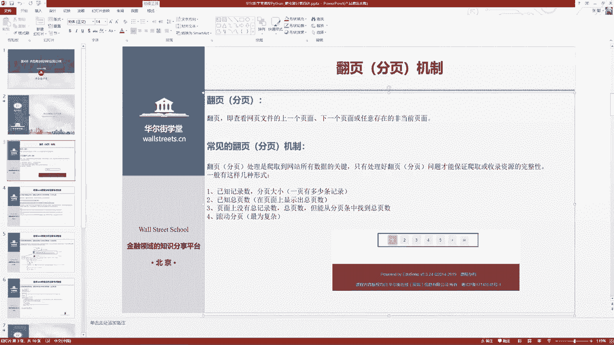

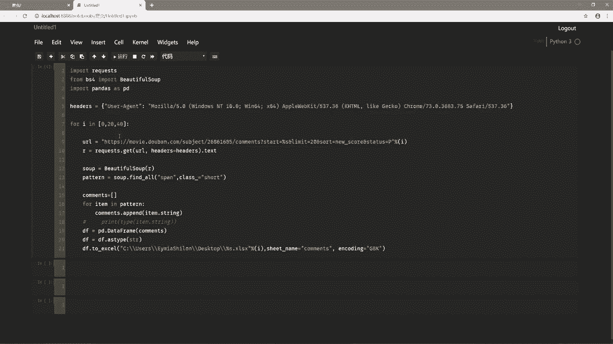

## 分页处理

在上一节的案例中，我们通过分析URL规律，使用`for`循环改变参数（如`start`）实现了翻页。这是一种常见且基础的翻页处理方式。然而，实际网页的分页机制多种多样，需要我们掌握不同的应对策略。


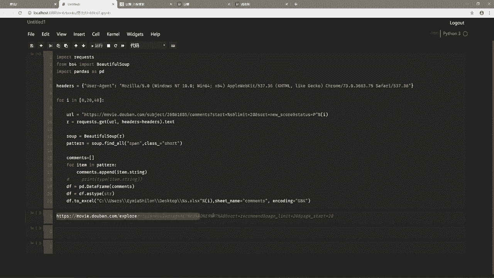

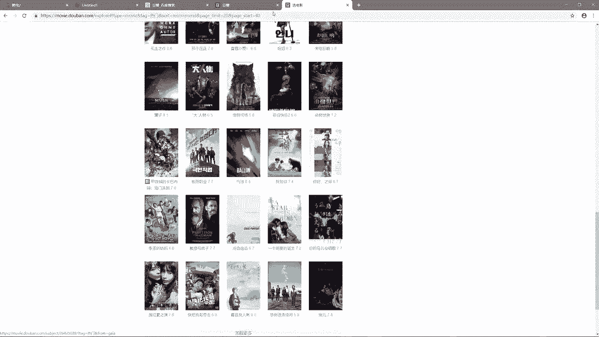

以下是几种常见的分页机制：

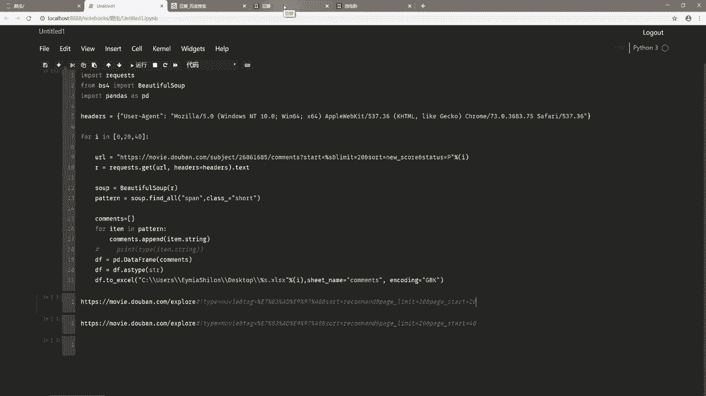

1.  **常规分页**：页面底部有明确的“上一页”、“下一页”或页码链接，URL参数有规律可循。
2.  **页码列表分页**：页面底部显示一系列页码（如1, 2, 3, ...），点击后跳转，URL同样有规律。
3.  **“加载更多”按钮**：页面底部有一个“加载更多”按钮，点击后动态加载新内容，URL可能变化或不变。
4.  **滚动翻页（无限滚动）**：页面无分页按钮，当用户滚动到页面底部时，自动加载新内容。


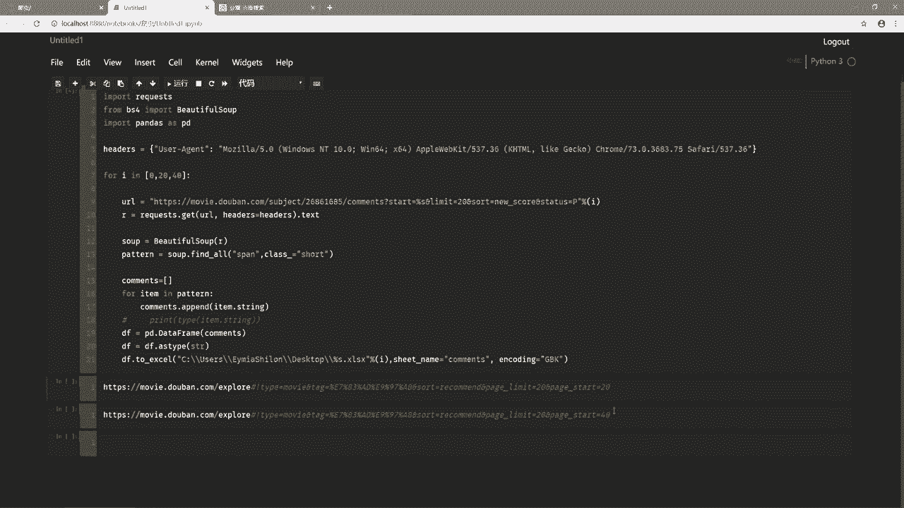

前三种机制本质上都可以通过分析并模拟URL变化规律来破解。第四种“滚动翻页”机制相对复杂，但我们可以通过分析浏览器与服务器的网络通信来找到数据源。

### 回顾：常规分页实现

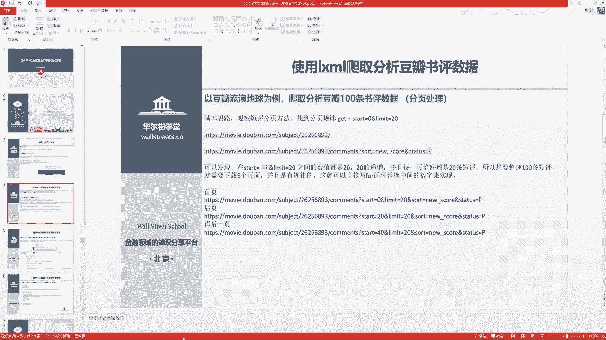

我们先通过一个简短的案例，回顾上一节基于URL规律实现的翻页。这里我们爬取豆瓣上《流浪地球》的短评。

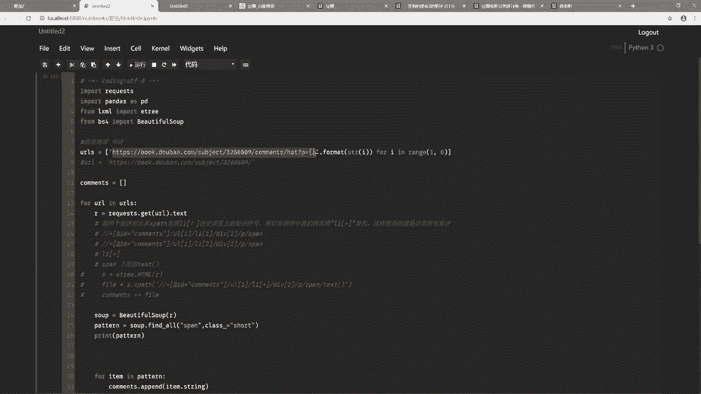

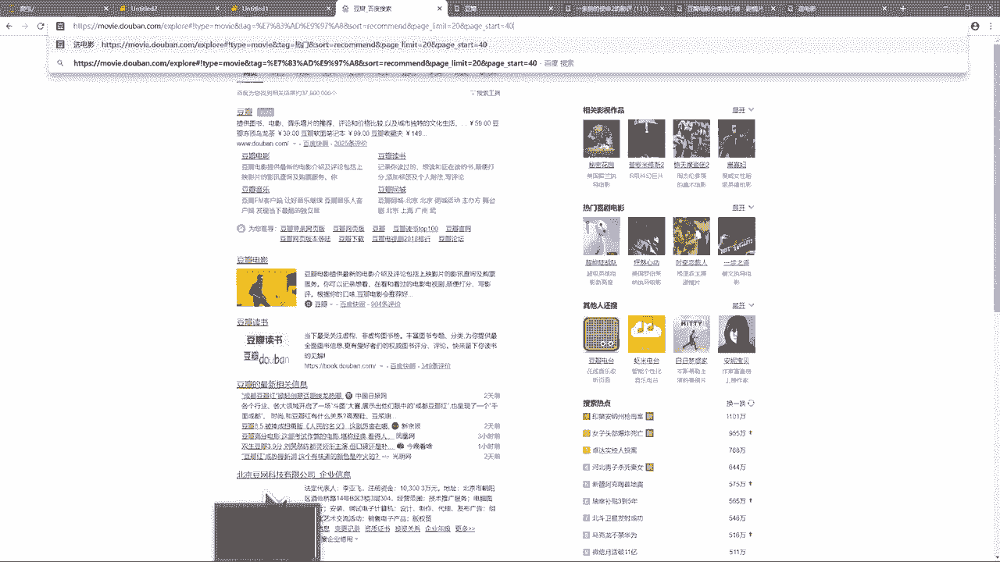

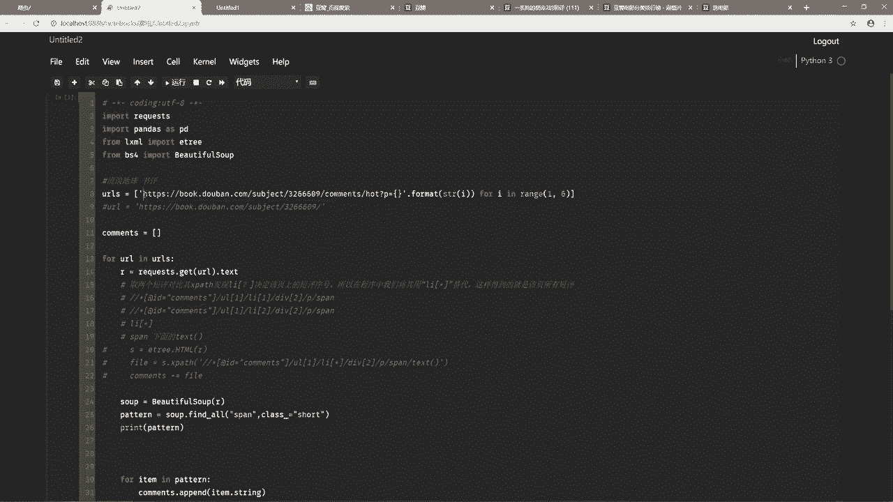

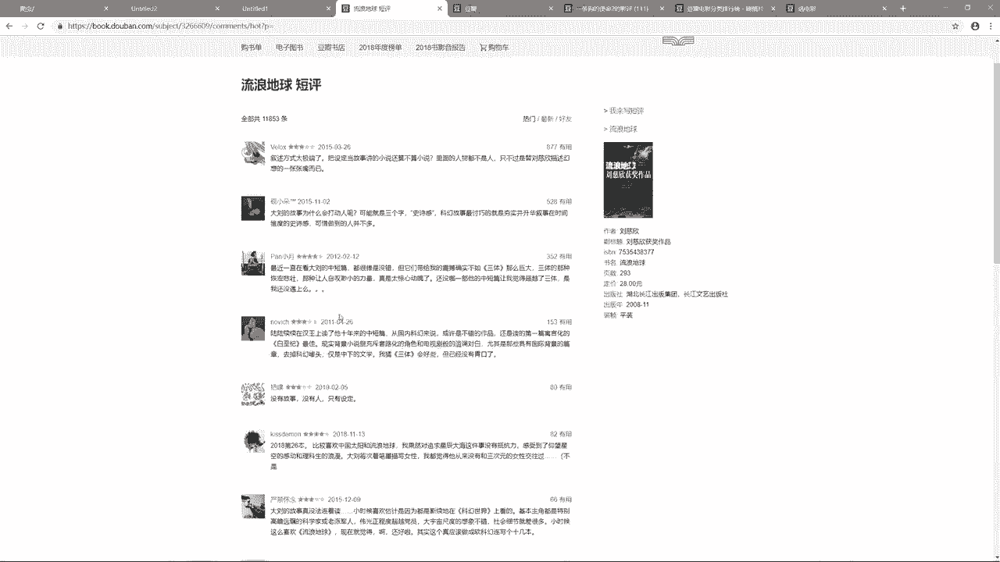

```python
import requests
from bs4 import BeautifulSoup
import pandas as pd

# 使用列表生成式构建多页URL列表
urls = [f'https://movie.douban.com/subject/26266893/comments?start={i}&limit=20&status=P&sort=new_score' for i in [0, 20, 40]]

all_comments = []

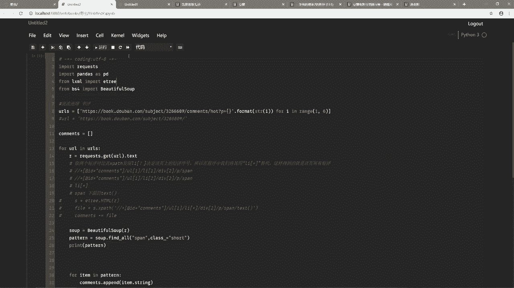


for url in urls:
    # 实际使用时请务必添加headers模拟浏览器
    # headers = {'User-Agent': '...'}
    # response = requests.get(url, headers=headers)
    response = requests.get(url)
    soup = BeautifulSoup(response.text, 'html.parser')
    
    # 查找短评内容
    comment_items = soup.find_all('span', class_='short')
    for item in comment_items:
        all_comments.append(item.text)

# 将数据保存到Excel
df = pd.DataFrame(all_comments, columns=['短评'])
df.to_excel('流浪地球短评.xlsx', index=False)
print('数据已保存')
```

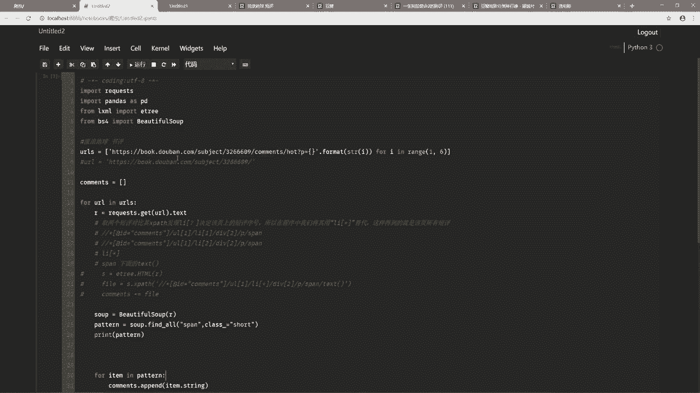

这段代码通过预定义的`start`参数列表（0, 20, 40）实现了前三页的爬取。在实际项目中，建议使用`range`函数动态生成参数，以提高代码的灵活性。

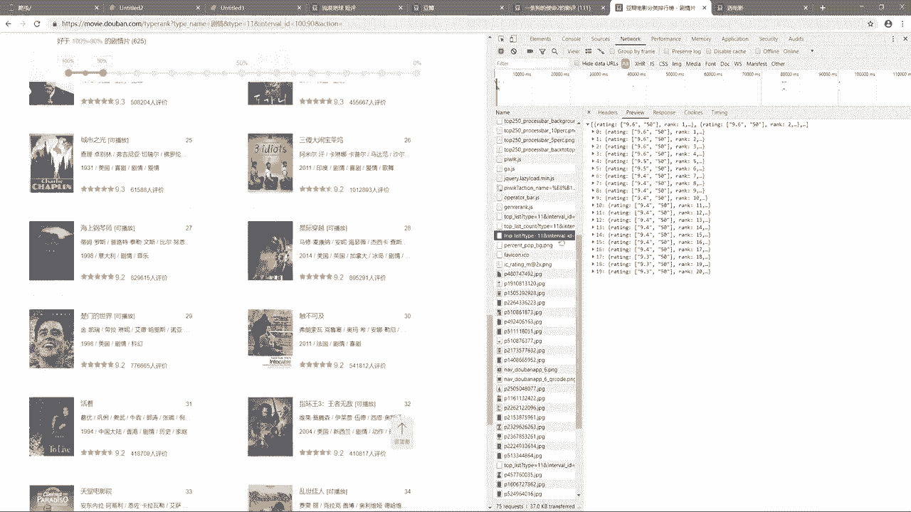

### 破解滚动翻页与“加载更多”

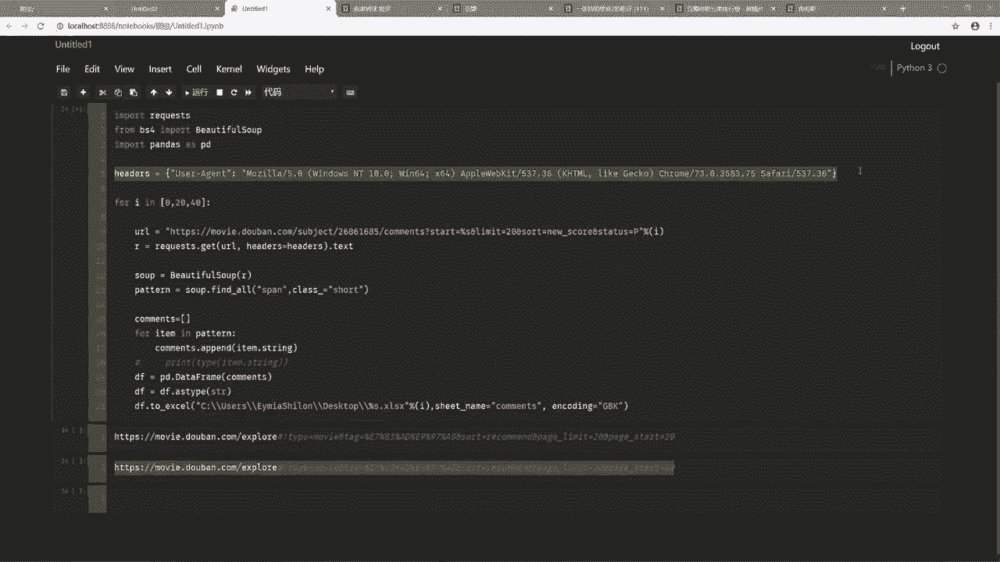

对于滚动翻页和“加载更多”这类动态加载数据的页面，直接解析HTML源码可能无法获取全部数据。此时，我们需要打开浏览器的开发者工具（按F12），切换到 **Network（网络）** 选项卡，观察页面滚动或点击“加载更多”时，浏览器向服务器发送了哪些新的请求。

通常，动态加载的数据会通过一个独立的请求（通常是XHR/Fetch类型）获取，其响应格式多为**JSON**。我们可以直接找到这个请求的URL，用爬虫模拟访问，从而拿到结构化的数据。

以下是一个破解豆瓣电影Top250列表（滚动翻页）的示例：

```python
import requests
import json
import pandas as pd

# 观察到的数据接口URL，start参数控制起始位置，limit控制每页数量
base_url = 'https://movie.douban.com/j/chart/top_list?type=5&interval_id=100%3A90&action=&start={}&limit=20'

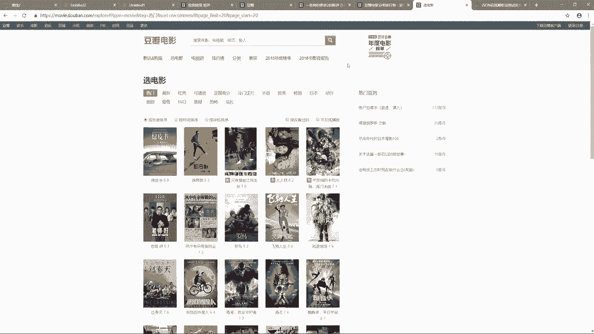

all_movies = []

# 假设爬取前3页数据
for page in range(3):
    url = base_url.format(page * 20)  # start: 0, 20, 40
    # 添加请求头
    headers = {'User-Agent': 'Mozilla/5.0 (Windows NT 10.0; Win64; x64) AppleWebKit/537.36'}
    response = requests.get(url, headers=headers)
    
    # 打印当前爬取的页数
    print(f'正在爬取第{page + 1}页数据')
    
    if response.status_code == 200:
        # 将JSON字符串转换为Python字典/列表
        movie_data = json.loads(response.text)
        all_movies.extend(movie_data)  # 将本页数据添加到总列表
    else:
        print(f'请求失败，状态码：{response.status_code}')

# 将数据转换为DataFrame并保存
df = pd.DataFrame(all_movies)
# 可以选择保存感兴趣的列，例如标题、评分、排名等
df.to_excel('豆瓣电影Top250部分数据.xlsx', index=False)
print('数据爬取完成')
```

**核心步骤解析：**
1.  **定位数据接口**：通过开发者工具，找到滚动时新发起的、返回JSON格式数据的请求URL。
2.  **分析参数规律**：分析该URL的查询参数（如`start`、`limit`），找到控制分页的规律。
3.  **模拟请求**：使用`requests`库循环构造URL并发送请求。
4.  **解析JSON数据**：使用`json.loads()`方法将响应的文本转换为Python数据结构（列表或字典），便于提取和存储。

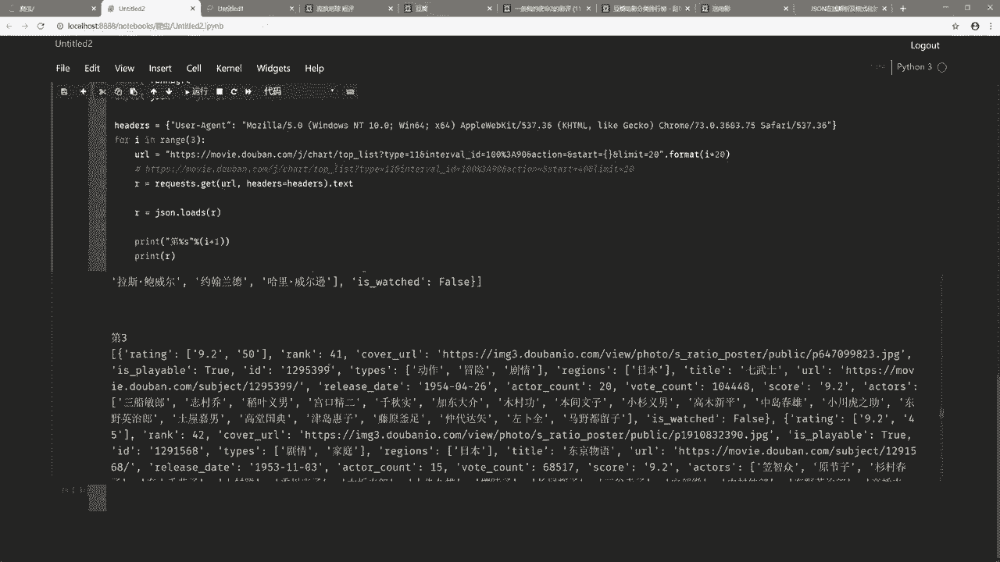

“加载更多”按钮的破解思路与此完全相同，都是找到背后加载数据的真实接口。

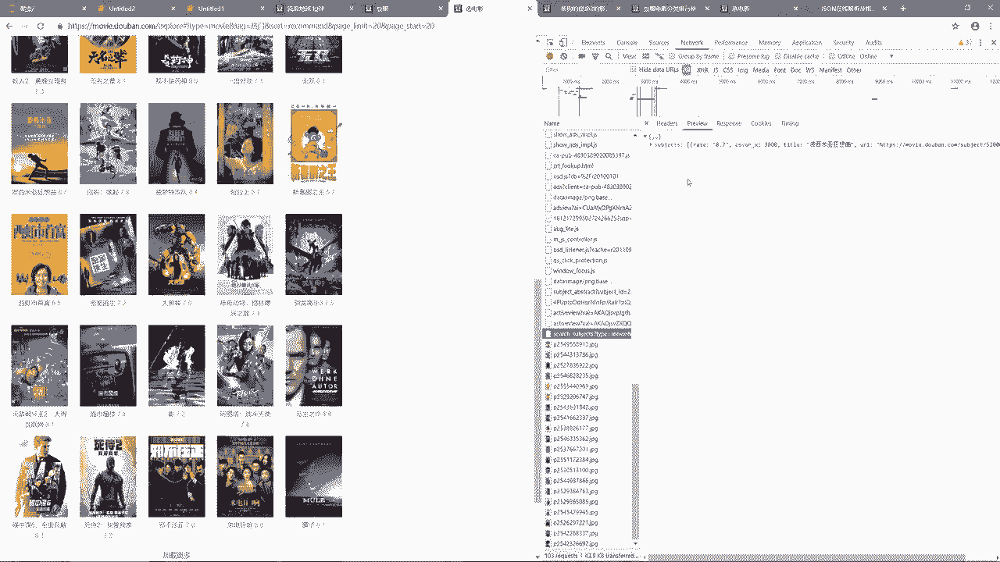

## 深度优先与广度优先算法

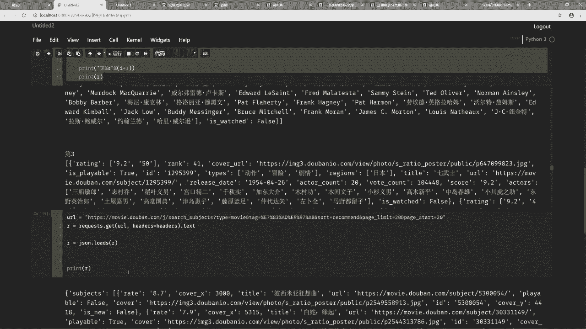

在爬虫需要遍历大量链接（例如从一个入口页面爬取全站所有页面）时，两种经典的遍历策略——深度优先搜索和广度优先搜索——就显得尤为重要。

### 深度优先搜索

深度优先搜索的策略是“一条路走到黑”。从一个起始网页开始，爬取当前页面后，选择页面中的一个链接深入下一个页面，然后在此新页面中继续选择链接深入，如此递归，直到到达某个没有新链接的页面。然后回溯到上一个页面，选择另一个未被访问的链接继续深入。

**简单理解**：纵向深入，优先探索一条分支到底。
**爬虫应用场景**：适合需要获取完整、连续信息链的场景，例如爬取一部电影的所有演员，再爬取每个演员的所有作品详情。

### 广度优先搜索

广度优先搜索的策略是“层层推进”。从一个起始网页开始，先爬取该页面的所有链接指向的页面（即下一层所有页面），然后再从这些新页面中的每一个出发，爬取它们的下一层所有页面，依次类推。

**简单理解**：横向扩展，优先探索当前层次的所有节点。
**爬虫应用场景**：适合需要快速扫描网站结构或收集同一层级信息的场景，例如先收集一个论坛所有版块的帖子列表，再逐个进入帖子收集内容。

选择哪种策略取决于具体的爬取目标。如果需要数据关联性强、结构完整，深度优先更合适；如果需要快速覆盖大面积或进行层级分析，广度优先更有效。

---

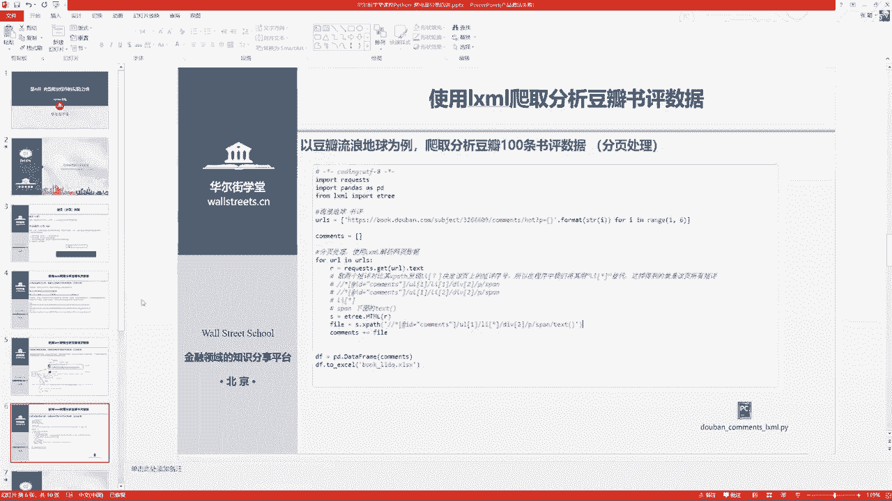

本节课中我们一起学习了如何应对常规分页、滚动翻页和“加载更多”等不同的网页分页机制，掌握了通过分析网络请求直接获取JSON数据的高效方法。同时，我们也了解了深度优先和广度优先这两种重要的爬虫遍历策略，为将来编写更复杂的爬虫程序打下了基础。