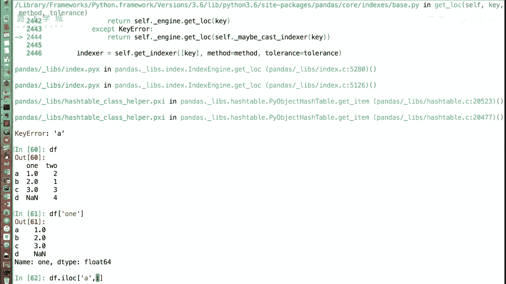
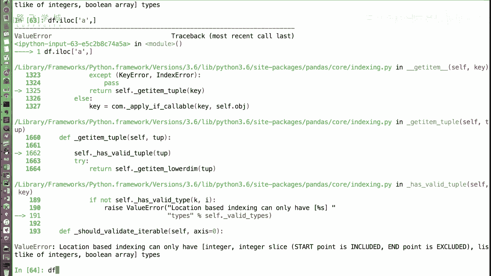
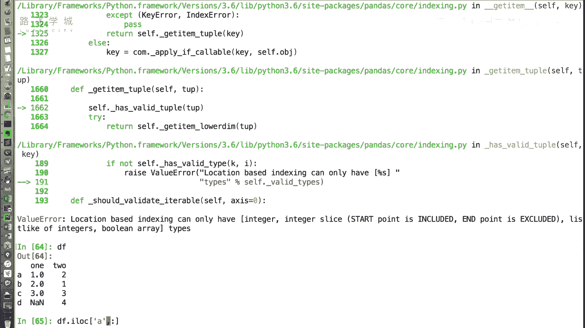
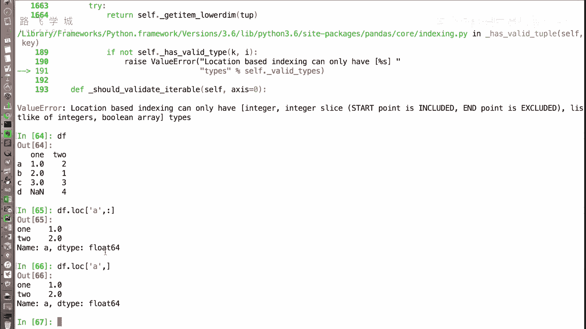
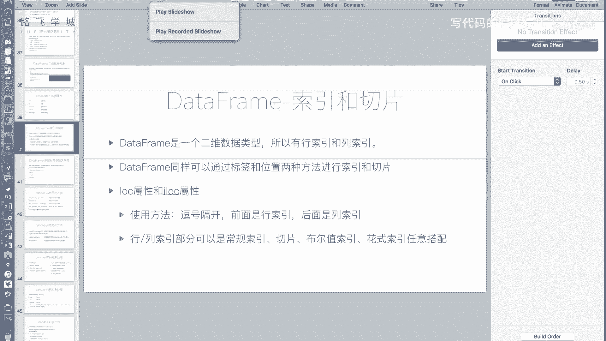
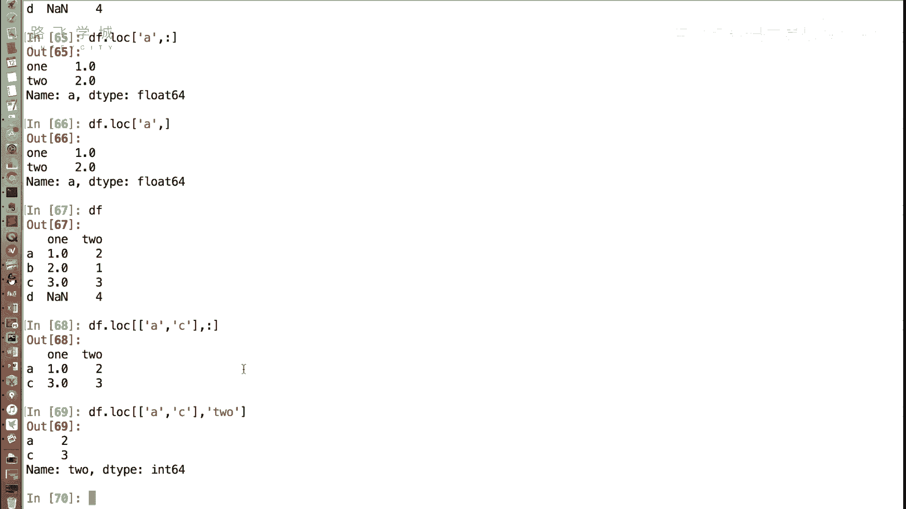
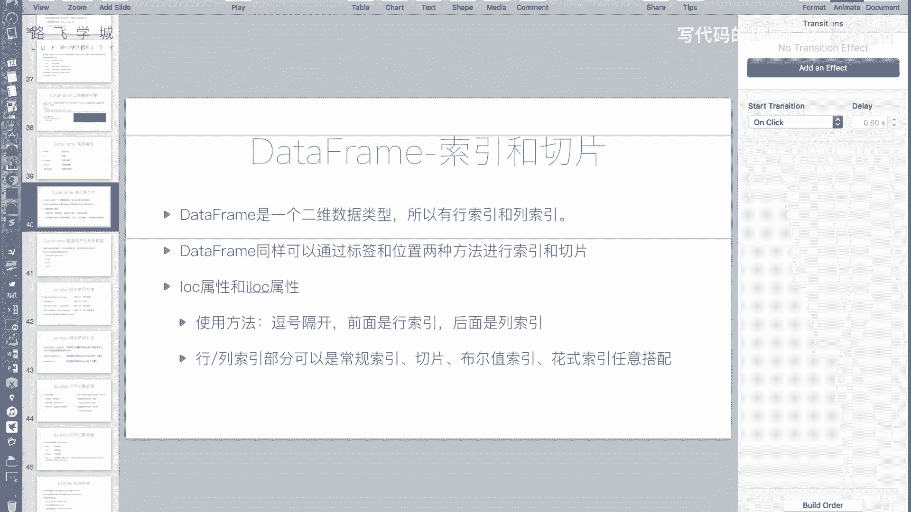

# 14天拿下Python金融量化：P16 DataFrame索引和切片 📊

在本节课中，我们将要学习如何从Pandas的DataFrame对象中获取数据。DataFrame是一个二维表格型数据结构，拥有行索引和列索引。我们将重点介绍如何通过索引和切片来精确地选取其中的数据，并学习推荐且不易出错的操作方法。

上一节我们介绍了DataFrame的一些常用属性，本节中我们来看看如何获取DataFrame中的具体数值。

## 通过中括号获取数据

和Series对象类似，我们可以使用中括号 `[]` 来获取DataFrame中的值。例如，假设我们想获取标签为 `‘A’` 的行和标签为 `‘one’` 的列交叉位置的值。

**核心概念**：在DataFrame中，如果按照标签索引，通常的语法是**先指定列，再指定行**。这与二维数组（先指定行，再指定列）的访问顺序不同，更类似于数据库查询中先选择列（`SELECT column`）的逻辑。

```python
# 假设df是一个DataFrame
value = df['one']['A']  # 先列后行
```

然而，如果行索引恰好是整数，这种方式可能会产生混淆或错误。因此，**不建议**连续使用两个中括号进行链式访问。

## 使用 `.loc` 和 `.iloc` 属性

为了避免混淆，Pandas提供了 `.loc` 和 `.iloc` 属性，用于明确地通过标签或位置（整数下标）进行访问。这是更推荐的做法。



*   **`.loc`**：基于**标签**进行索引。
*   **`.iloc`**：基于**整数位置**进行索引。

它们的通用语法是：`df.loc[行选择器, 列选择器]` 或 `df.iloc[行选择器, 列选择器]`。选择器之间用逗号隔开。





**获取单个值**：
更推荐使用 `.loc` 来获取之前例子中的值。
```python
value = df.loc['A', 'one']  # 行标签为‘A’，列标签为‘one’
```

**获取整行数据**：
如果想获取某一行的所有数据，列选择器可以留空或使用切片 `:` 表示选择所有列。
```python
row_data = df.loc['A', :]  # 获取‘A’行的所有数据
# 或者简写为
row_data = df.loc['A']
```

**获取整列数据**：
获取列数据则更为直接，使用中括号指定列名即可。
```python
column_data = df['one']  # 获取‘one’列的所有数据，返回一个Series
```





## 灵活的索引与切片组合

`.loc` 和 `.iloc` 的强大之处在于，行和列的选择器可以非常灵活地组合使用。以下是几种常见的搭配方式：


以下是几种索引与切片的组合示例：


1.  **切片**：可以按标签或位置进行切片。
    ```python
    # 使用.loc按标签切片（包含结束标签）
    slice_by_label = df.loc['A':'C', 'one':'three']

    # 使用.iloc按位置切片（不包含结束位置）
    slice_by_position = df.iloc[0:3, 0:2]
    ```

2.  **花式索引**：通过传递一个标签或位置的列表，选择指定的行或列。
    ```python
    # 选择特定的行和列
    fancy_indexing = df.loc[['A', 'C'], ['one', 'three']]
    ```

3.  **布尔索引**：通过一个布尔值数组或条件表达式来筛选数据。
    ```python
    # 选择‘one’列大于0.5的所有行
    boolean_indexing = df.loc[df['one'] > 0.5]
    ```



这些方法可以任意搭配，例如，行使用花式索引，列使用切片，从而非常灵活地获取目标数据子集。



本节课中我们一起学习了DataFrame的索引与切片操作。我们了解到，虽然可以使用中括号链式访问，但更推荐使用 `.loc`（基于标签）和 `.iloc`（基于位置）属性来明确索引意图。这两个属性支持行、列选择器的灵活组合，包括切片、花式索引和布尔索引，使得从DataFrame中提取数据变得高效且清晰。掌握这些方法是进行有效数据分析和操作的基础。