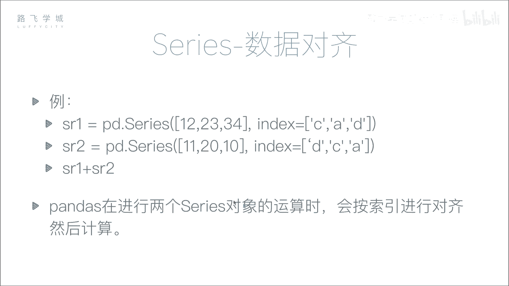
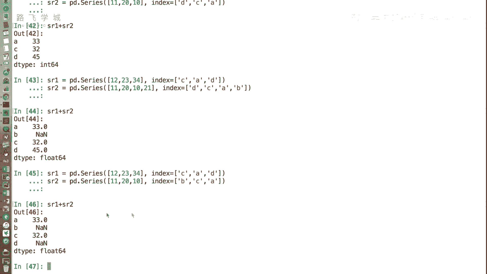
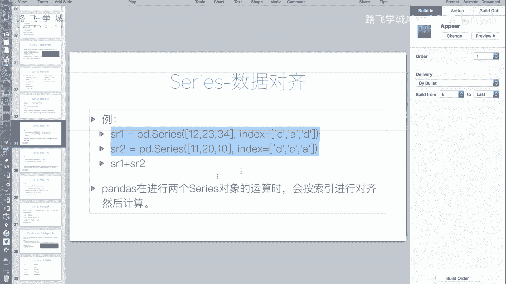
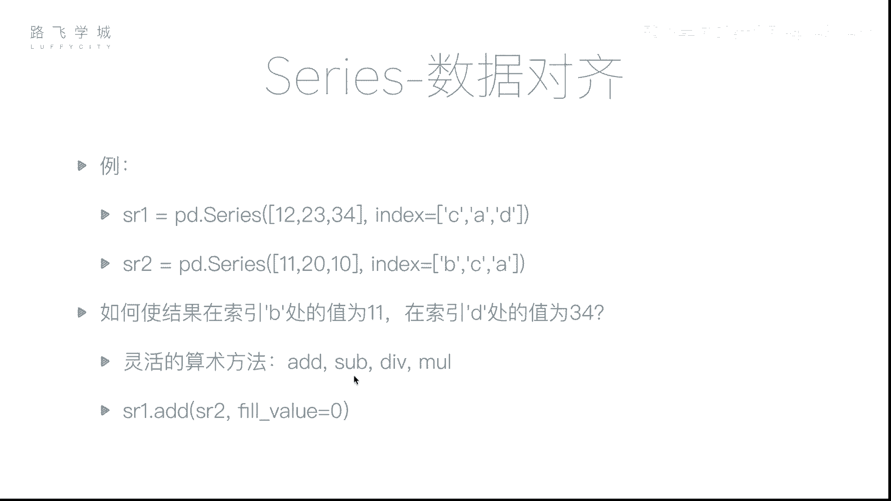
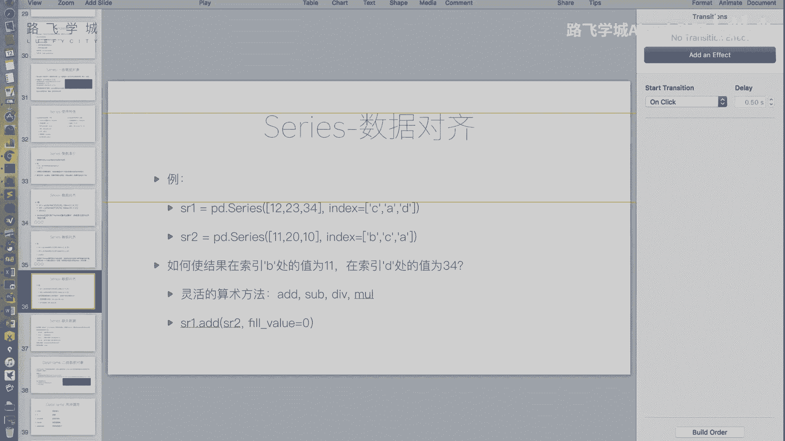
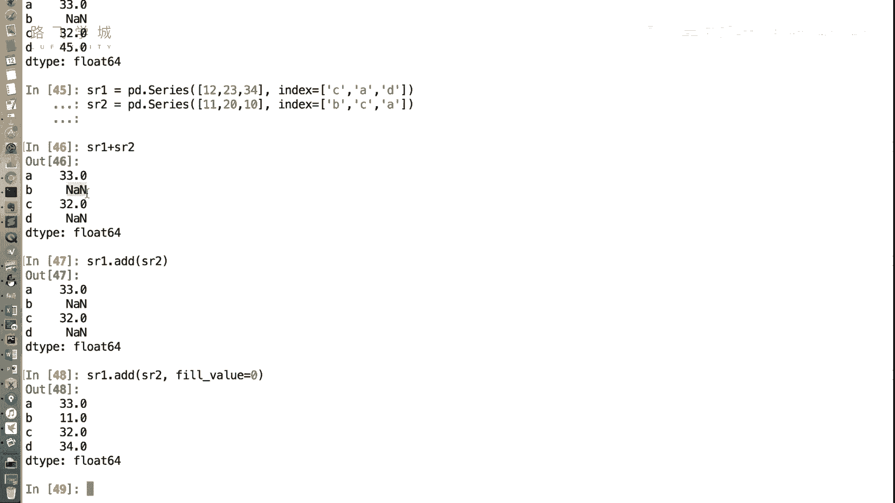

# Python金融量化：P16：Series数据对齐 📊

在本节课中，我们将要学习Pandas Series对象一个非常重要的特性：**数据对齐**。我们将了解Series在进行算术运算时，如何根据索引标签自动对齐数据，以及如何处理由此产生的缺失值问题。

---

上一节我们介绍了Series的基本操作，本节中我们来看看Series在进行运算时的一个核心机制。

在Pandas中，当两个Series对象进行算术运算（如加法）时，运算不是简单地按照它们在数组中的位置（下标）进行，而是按照它们的**索引标签**进行对齐。这意味着，只要两个Series拥有相同的索引标签，无论它们在各自对象中的顺序如何，对应的值都会被正确地组合在一起。

让我们通过一个例子来理解。假设我们有两个Series对象：



```python
import pandas as pd


sr1 = pd.Series([12, 23, 34], index=[‘C‘, ‘A‘, ‘D‘])
sr2 = pd.Series([11, 20, 10], index=[‘D‘, ‘C‘, ‘A‘])
```

如果执行 `sr1 + sr2`，结果会是什么呢？如果是普通的数组，我们会得到 `[12+11, 23+20, 34+10]`。但在Pandas中，计算过程是这样的：

*   `‘A‘` 标签：取 `sr1[‘A‘]` (23) 和 `sr2[‘A‘]` (10) 相加，得到 33。
*   `‘C‘` 标签：取 `sr1[‘C‘]` (12) 和 `sr2[‘C‘]` (20) 相加，得到 32。
*   `‘D‘` 标签：取 `sr1[‘D‘]` (34) 和 `sr2[‘D‘]` (11) 相加，得到 45。

因此，最终结果是：
```
A    33
C    32
D    45
dtype: int64
```

这个功能非常强大，它允许我们在处理类似时间序列或具有明确标识的数据时，无需预先对数据进行排序，只要标签匹配，计算就能正确进行。

---

理解了基本的数据对齐后，我们来看一个更常见的情况：当两个Series的索引不完全相同时会发生什么。

在NumPy中，两个长度不同的数组通常无法直接进行算术运算。但在Pandas中，这是允许的。Pandas会将两个Series按索引标签对齐，对于只存在于其中一个Series中的标签，其对应的结果值会被设置为 `NaN` (Not a Number)，在Pandas中这代表**缺失值**。

例如：
```python
sr1 = pd.Series([12, 23, 34], index=[‘A‘, ‘C‘, ‘D‘])
sr2 = pd.Series([11, 20, 10], index=[‘A‘, ‘B‘, ‘C‘])
result = sr1 + sr2
print(result)
```
输出将是：
```
A    23.0
B     NaN
C    43.0
D     NaN
dtype: float64
```
标签 `‘B‘` 只存在于 `sr2` 中，标签 `‘D‘` 只存在于 `sr1` 中，因此它们在结果中对应的值都是 `NaN`。

---

然而，在某些业务场景下，我们可能不希望缺失值出现为 `NaN`。例如，在计算员工两个月的累计出勤天数时，如果某员工只在一个月有记录，我们希望将缺失的月份视为0天，而不是得到一个 `NaN` 值。

Pandas提供了一系列灵活的算术方法，允许我们指定一个填充值（`fill_value`）来处理这种索引不匹配的情况。

以下是这些方法：
*   **`.add()`**： 加法，对应 `+`
*   **`.sub()`**： 减法，对应 `-`
*   **`.mul()`**： 乘法，对应 `*`
*   **`.div()`**： 除法，对应 `/`



使用这些方法，我们可以控制当索引不匹配时的行为。例如，使用 `.add()` 方法并设置 `fill_value=0`：



```python
sr1 = pd.Series([12, 23, 34], index=[‘A‘, ‘C‘, ‘D‘])
sr2 = pd.Series([11, 20, 10], index=[‘A‘, ‘B‘, ‘C‘])
result_filled = sr1.add(sr2, fill_value=0)
print(result_filled)
```
输出将是：
```
A    23.0
B    20.0
C    43.0
D    34.0
dtype: float64
```
现在，对于标签 `‘B‘`，`sr1` 中没有对应值，被视为0，所以 `0 + 20 = 20`。对于标签 `‘D‘`，`sr2` 中没有对应值，被视为0，所以 `34 + 0 = 34`。这样就避免了 `NaN` 值的产生。





---

本节课中我们一起学习了Pandas Series的**数据对齐**特性。我们了解到：

1.  Series的算术运算是基于**索引标签**对齐的，而非数据位置，这为处理无序但有关联的数据带来了极大便利。
2.  当两个Series的索引不完全匹配时，运算结果中不匹配的索引位置会产生 **`NaN`（缺失值）**。
3.  我们可以使用 `.add()`, `.sub()` 等灵活的算术方法，并通过 `fill_value` 参数指定一个值来填充缺失的部分，从而控制对齐行为。



数据对齐是Pandas强大功能的基础之一，但它也引入了缺失值的问题。在下一节，我们将学习如何处理这些缺失值，进行数据清洗。