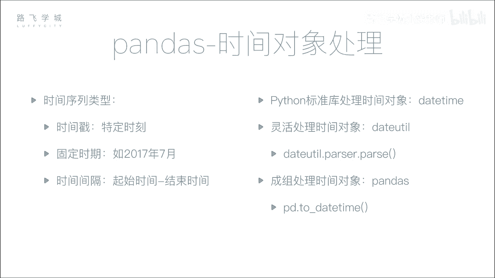
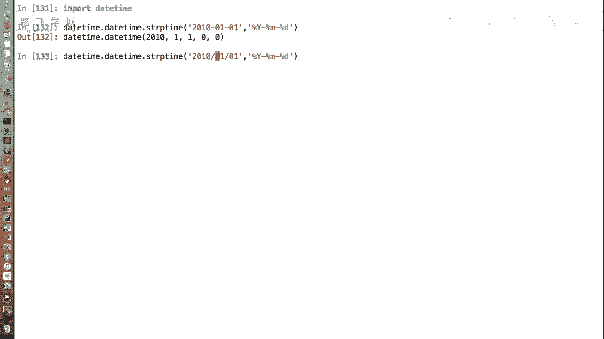
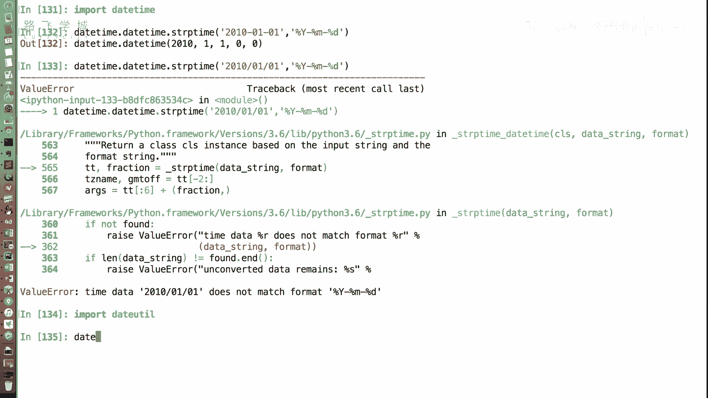
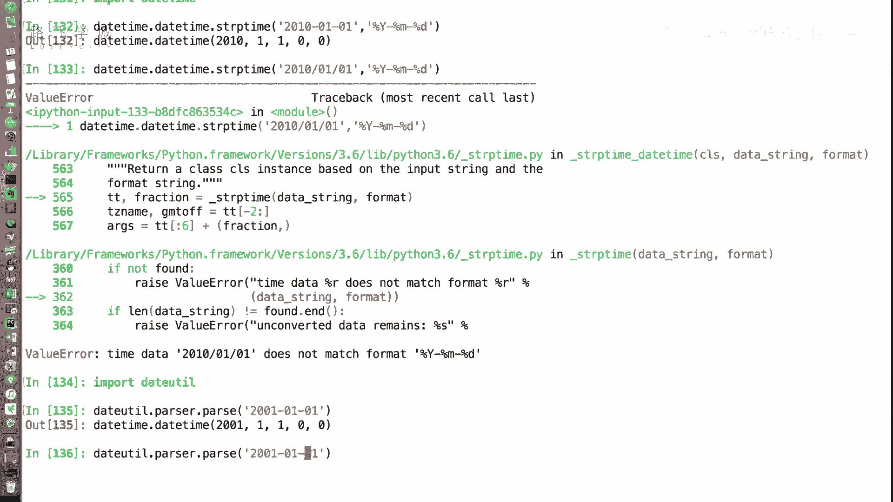
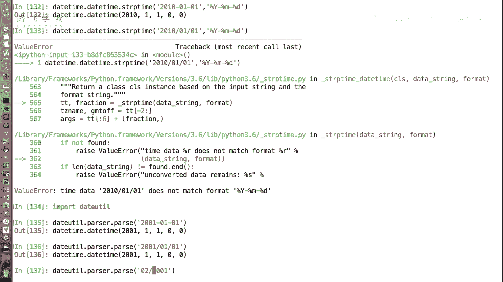
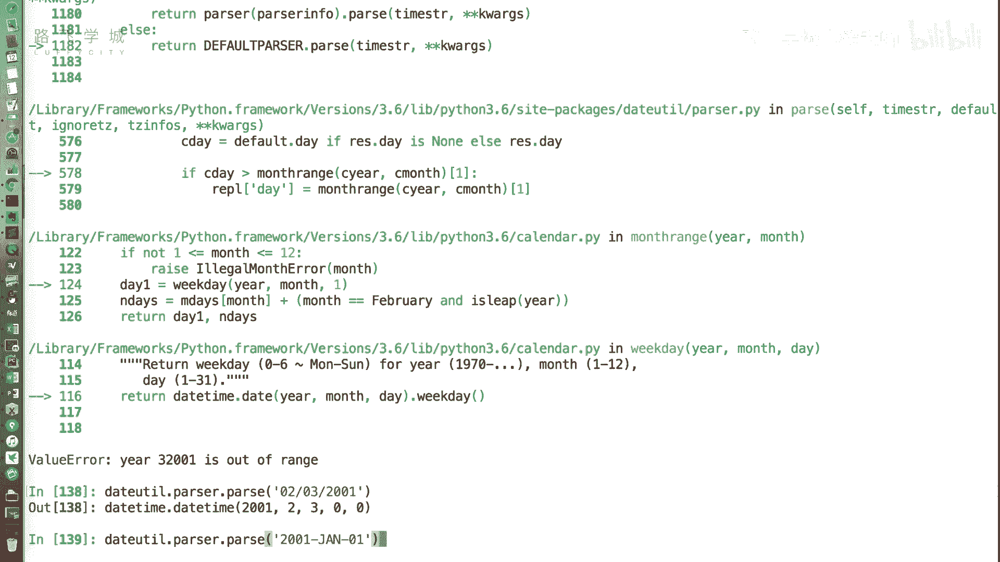
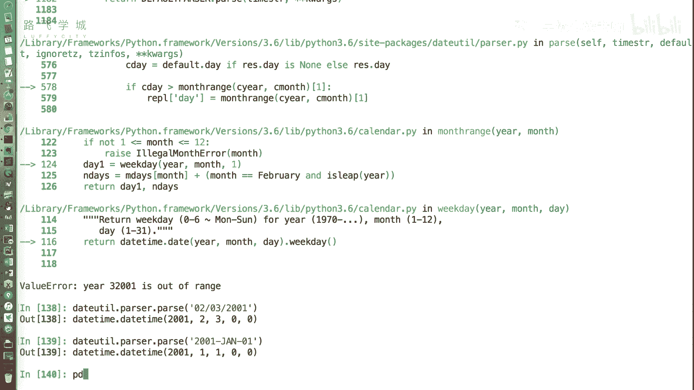
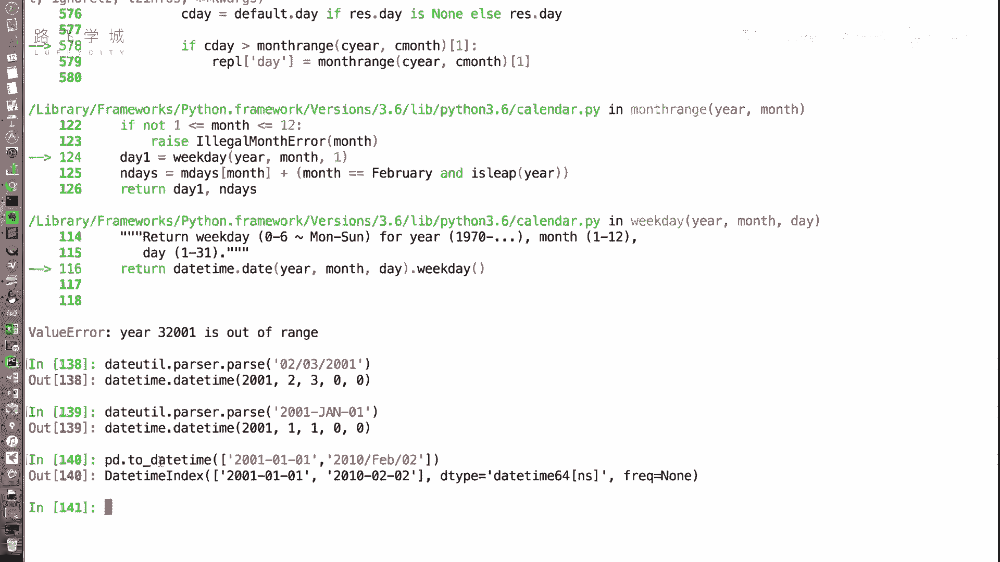

# Python金融量化：P16：时间处理对象 📅

在本节课中，我们将学习Pandas库对时间序列数据的支持。首先，我们需要了解如何将常见的日期字符串转换为Python可以识别和处理的时间对象。这是进行时间序列分析的基础步骤。



## Python标准库的时间处理

在Python基础课程中，你可能已经接触过处理时间的标准库。Python标准库中用于处理时间对象的类和方法主要来自 `datetime` 模块。

`datetime` 模块中有一个方法 `strptime`，可以将字符串解析为时间对象。它的用法是 `datetime.datetime.strptime(字符串, 格式)`。例如，格式字符串 `‘%Y-%m-%d’` 对应 “年-月-日”。

```python
from datetime import datetime
date_obj = datetime.strptime('2001-01-01', '%Y-%m-%d')
```

这种方法要求每次转换都必须提供准确的格式字符串，这在处理来源多样、格式不统一的日期数据时会非常麻烦。



## 使用dateutil进行智能解析

为了简化不同格式日期字符串的解析，我们可以使用 `dateutil` 库。安装Pandas后，该库通常已自动安装。`dateutil.parser` 模块下的 `parse` 函数可以自动检测并解析多种常见日期格式，无需手动指定格式字符串。



```python
from dateutil import parser
date_obj = parser.parse('2001-01-01')
date_obj = parser.parse('2001/01/01')
date_obj = parser.parse('Jan 1, 2001')
```



它能自动识别横杠、斜杠分隔，甚至月份缩写等格式，极大提升了处理混合格式日期数据的便利性。但请注意，它对纯中文格式（如“2001年1月1日”）的支持可能有限。



## Pandas的批量转换方法



上一节我们介绍了单个字符串的转换，但在数据分析中，我们通常需要处理大量数据。本节中我们来看看Pandas提供的批量转换方法。

Pandas提供了一个强大的函数 `pd.to_datetime()`。它可以接收一个列表、数组或Series，并自动、批量地将其中的日期字符串转换为时间对象。

```python
import pandas as pd
date_list = ['2001-01-01', '2001/01/02', 'Jan 3 2001']
date_index = pd.to_datetime(date_list)
```



该函数返回一个 `DatetimeIndex` 对象。这种索引类型是Pandas为时间序列数据专门设计的，将其作为数据的索引（行标签）后，可以解锁许多强大的时间序列操作功能，例如重采样、窗口计算等，这些内容我们将在后续课程中详细探讨。

## 总结



本节课中我们一起学习了Python中处理时间对象的几种方法。我们从需要指定格式的 `datetime.strptime` 函数开始，然后介绍了能自动解析多种格式的 `dateutil.parser.parse` 函数，最后重点学习了Pandas中用于批量转换的 `pd.to_datetime()` 函数，并了解到其返回的 `DatetimeIndex` 是进行时间序列分析的关键基础。掌握这些工具，是后续进行金融时间序列数据清洗和分析的重要第一步。