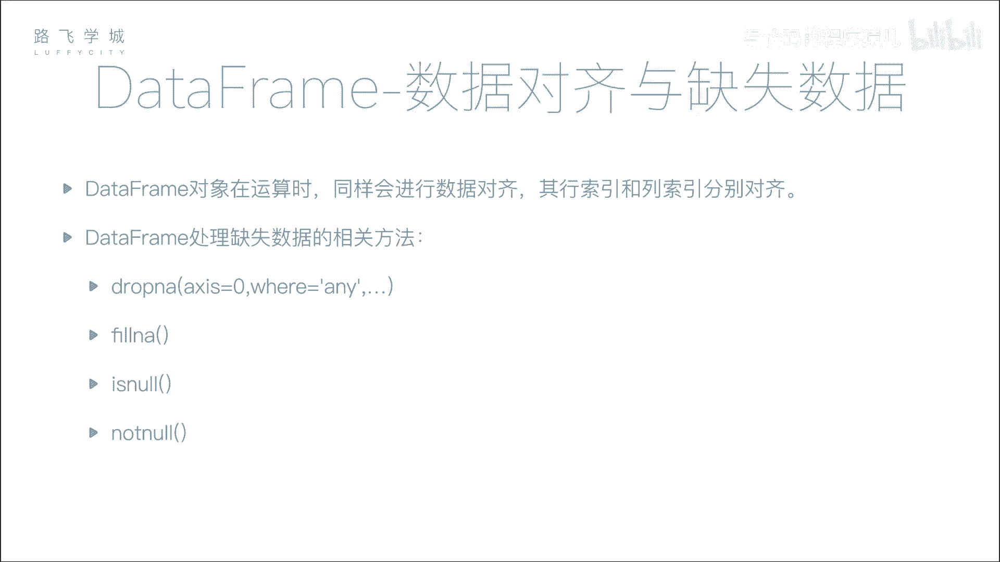
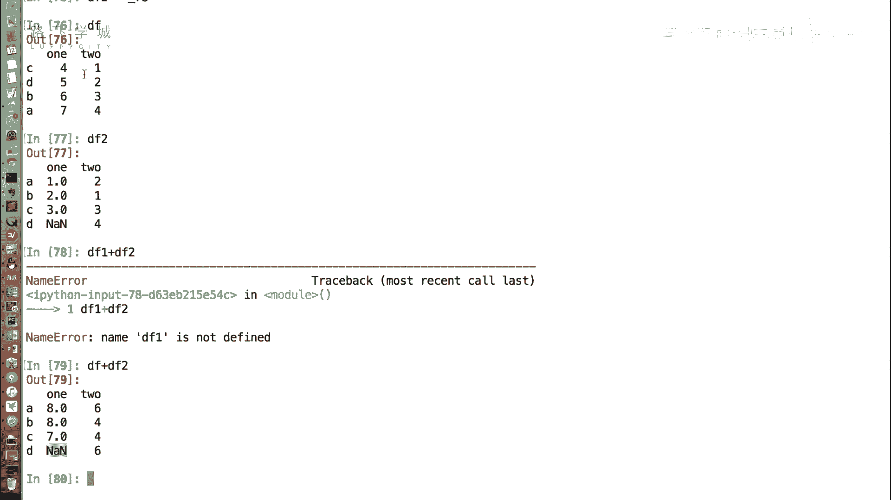
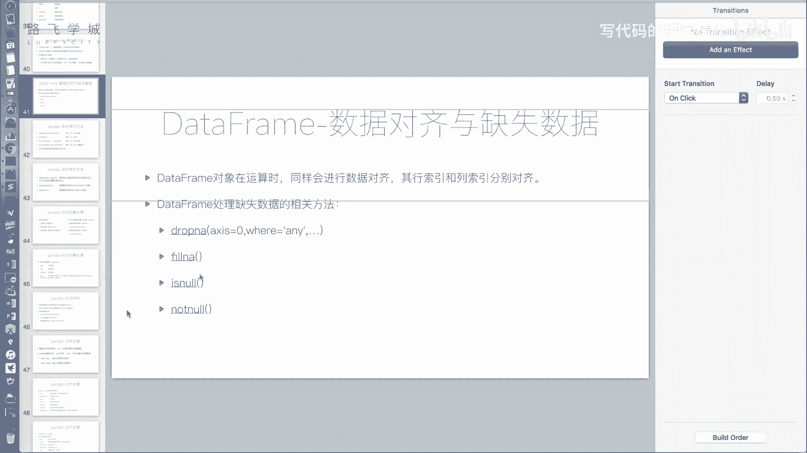
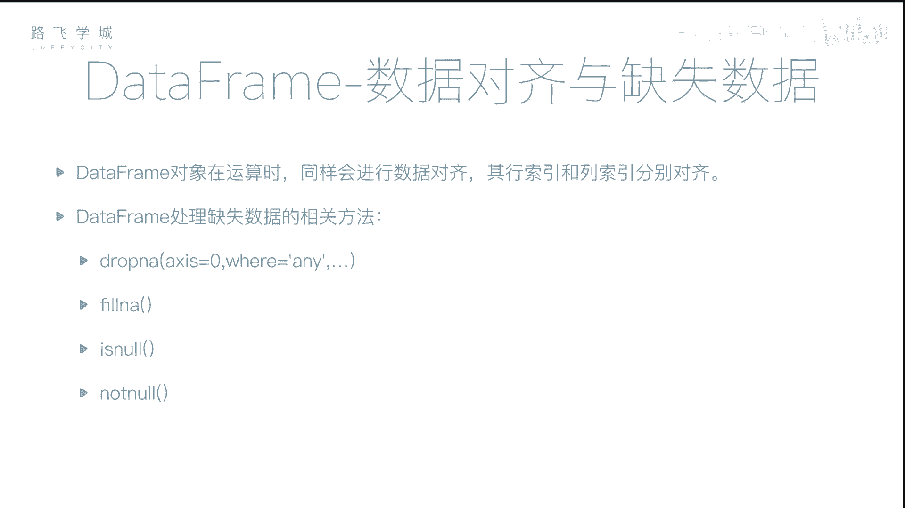
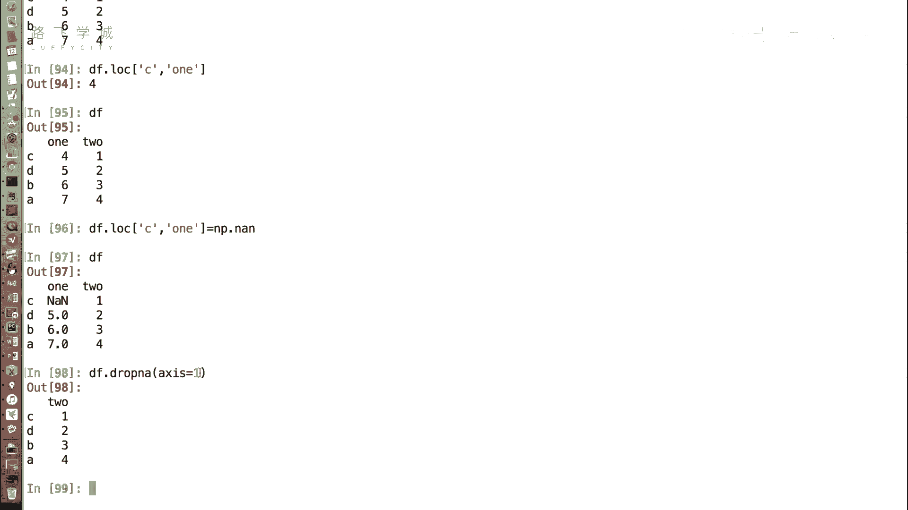
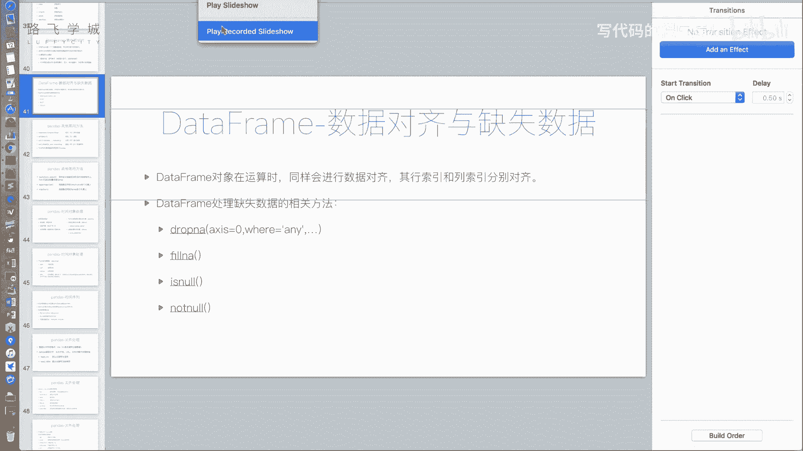
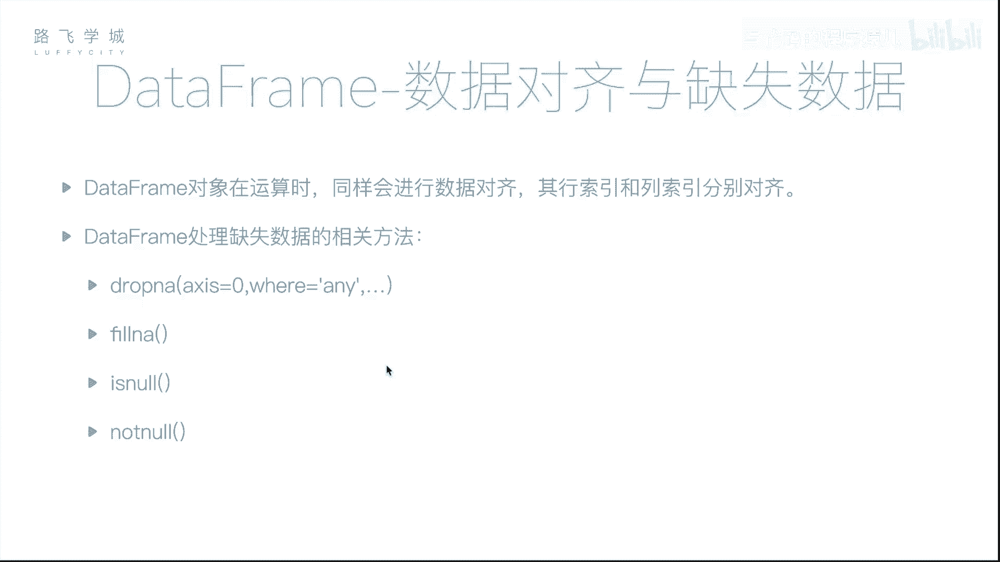

# Python金融量化：P17：DataFrame数据对齐与缺失数据处理 📊

在本节课中，我们将要学习`DataFrame`对象的数据对齐与缺失数据处理功能。与`Series`对象类似，`DataFrame`也涉及数据对齐，但由于它拥有行索引和列索引两个维度，其对齐规则更为复杂。同时，我们也将探讨如何处理`DataFrame`中的缺失数据。



## 数据对齐 🔄

上一节我们介绍了`Series`的数据对齐，本节中我们来看看`DataFrame`的数据对齐。`DataFrame`的数据对齐需要同时考虑行索引和列索引。

例如，我们有两个`DataFrame`对象`df1`和`df2`，它们的行索引顺序不同。当执行`df1 + df2`操作时，Pandas会按照行索引和列索引进行对齐计算。如果某个位置在其中一个`DataFrame`中为缺失值（NaN），那么运算结果在该位置也会是NaN。



以下是数据对齐的核心概念：
```python
# 示例：两个DataFrame相加，Pandas会自动对齐行和列索引
result = df1 + df2
```



## 缺失数据处理 🧹



`DataFrame`处理缺失数据的方法与`Series`对象大部分相似，但也存在一些关键区别。

### 填充缺失值

我们可以使用`fillna()`方法将缺失值替换为指定的值，这与`Series`的操作一致。

```python
# 将DataFrame中的所有NaN填充为0
df_filled = df2.fillna(0)
```

### 删除缺失值

`DataFrame`的`dropna()`方法默认行为与`Series`不同。默认情况下，`dropna()`会删除**任何包含缺失值的整行**。

```python
# 默认删除任何包含NaN的行
df_dropped_default = df2.dropna()
```

然而，我们有时需要更精细的控制。例如，可能只希望删除**整行所有值都是缺失值**的行，或者按列（而非按行）来删除缺失值。

以下是控制删除行为的参数：

*   **`how`参数**：控制删除行的条件。
    *   `how=‘any’`（默认）：如果行中有**任何**一个值是NaN，则删除该行。
    *   `how=‘all’`：只有当行中**所有**值都是NaN时，才删除该行。
    ```python
    # 只删除全部为NaN的行
    df_dropped_all = df2.dropna(how=‘all’)
    ```

*   **`axis`参数**：控制删除的轴向。在`DataFrame`中，许多函数都使用这个参数来指定操作方向。
    *   `axis=0` 或 `axis=‘index’`（默认）：按行操作（删除行）。
    *   `axis=1` 或 `axis=‘columns’`：按列操作（删除列）。
    ```python
    # 删除任何包含NaN的列
    df_dropped_column = df2.dropna(axis=1)
    # 等价于
    df_dropped_column = df2.dropna(axis=‘columns’)
    ```

此外，`DataFrame`也支持`isna()`和`notna()`方法来检测缺失值，其用法与`Series`完全一致。

## 总结 📝





本节课中我们一起学习了`DataFrame`的两个重要功能：数据对齐与缺失数据处理。

1.  **数据对齐**：`DataFrame`在进行运算时会自动根据行索引和列索引对齐数据，未对齐的位置会产生缺失值。
2.  **缺失数据处理**：
    *   使用`fillna()`方法可以填充缺失值。
    *   使用`dropna()`方法可以删除缺失值，并通过`how`和`axis`参数灵活控制删除条件（按行/按列，部分缺失/全部缺失）。
    *   使用`isna()`和`notna()`可以判断缺失值。



掌握这些方法，能帮助我们在金融量化分析中有效地清洗和准备数据，为后续的分析与建模打下坚实基础。