# Python金融量化：P17：Series缺失值处理 📊

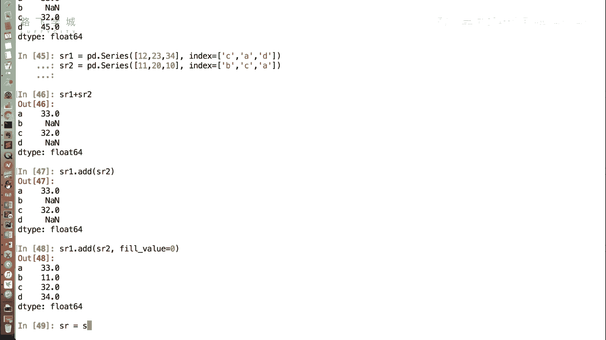

在本节课中，我们将要学习如何处理Pandas Series中的缺失数据。缺失值是数据分析中常见的问题，学会处理它们对于后续的数据清洗、运算和可视化至关重要。

上一节我们介绍了Series的基本操作，本节中我们来看看如何处理其中的缺失值。

## 什么是缺失值？

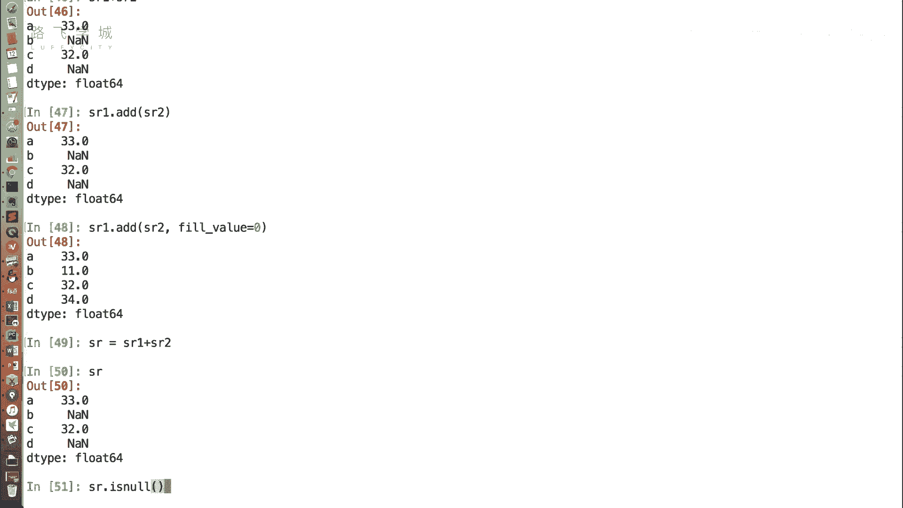

在Series中可能会出现缺失数据，即`NaN`值。有时我们可以忽略这些缺失值，但在进行进一步运算或生成图表时，它们可能会带来问题，因此需要处理。

## 缺失值处理方法

处理缺失值主要有两种思路：删除缺失值或填充缺失值。

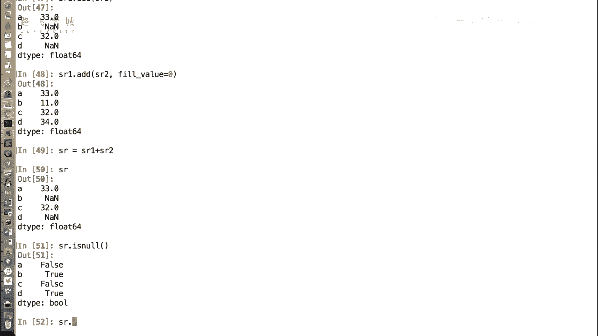

### 方法一：删除缺失值

第一种方法是直接删除包含缺失数据的行。以下是相关的操作步骤。

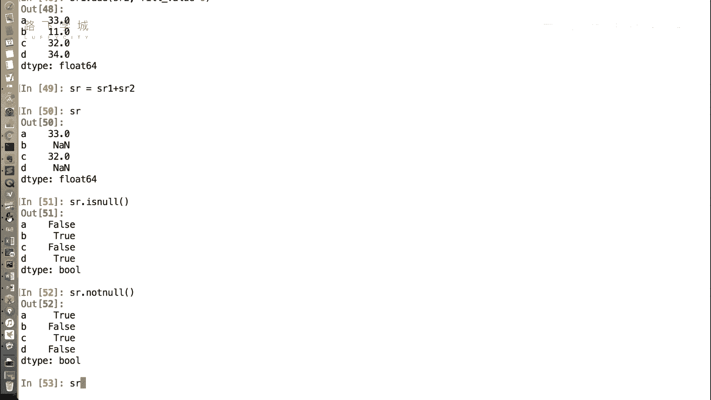

首先，我们可以使用函数来判断数据是否为缺失值。

**判断缺失值：**
*   `SR.isnull()`: 返回一个布尔型Series，是`NaN`的位置为`True`，否则为`False`。
*   `SR.notnull()`: 与`isnull()`相反，不是`NaN`的位置返回`True`。

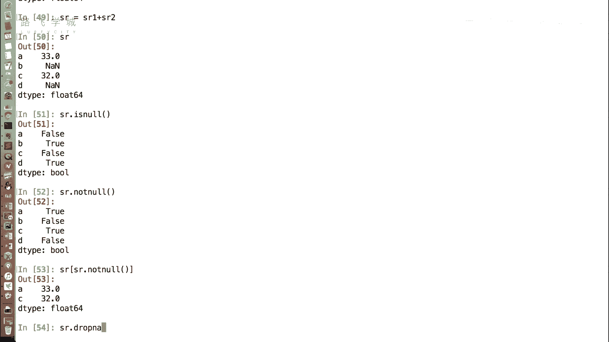

**代码示例：**
```python
# 假设 SR 是一个包含 NaN 的 Series
print(SR.isnull())
print(SR.notnull())
```

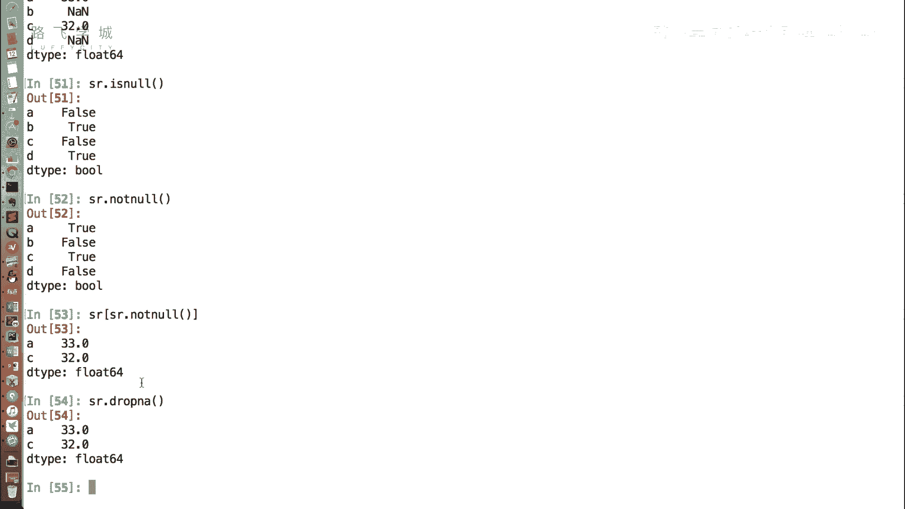

利用布尔索引，我们可以过滤掉缺失值。

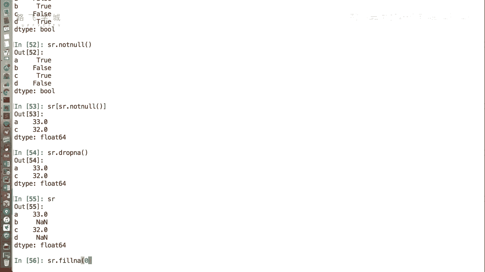

**过滤缺失值：**
```python
# 保留非空值
filtered_SR = SR[SR.notnull()]
```

此外，Pandas提供了一个更直接的方法来删除缺失值。

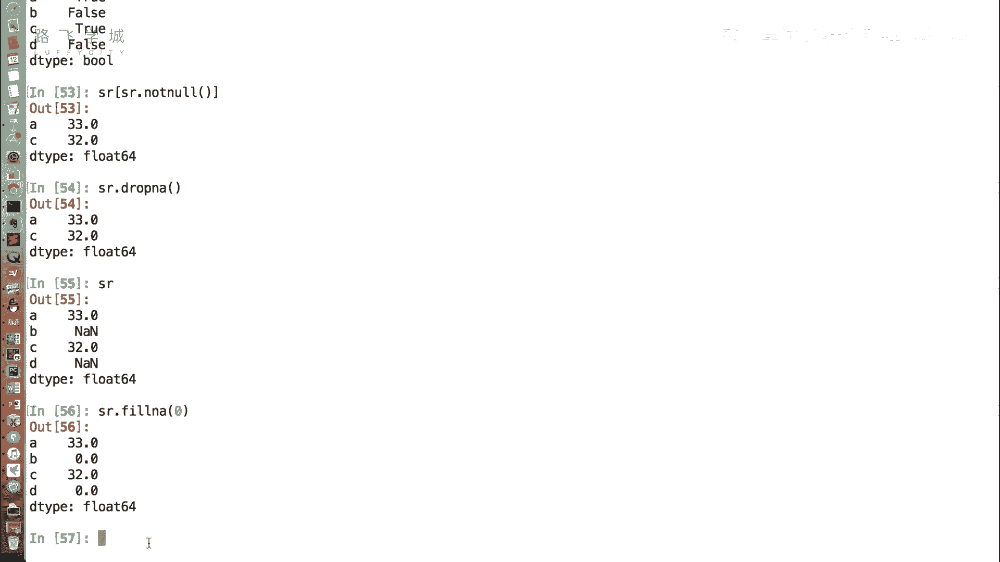

**直接删除缺失值：**
```python
# 删除所有包含 NaN 的行
cleaned_SR = SR.dropna()
```

### 方法二：填充缺失值

第二种方法是为缺失值赋予一个具体的数值。这在希望保持数据连续性时非常有用。

填充缺失值的函数是`fillna()`。

**填充为固定值：**
```python
# 将所有 NaN 填充为 0
filled_SR = SR.fillna(0)
```

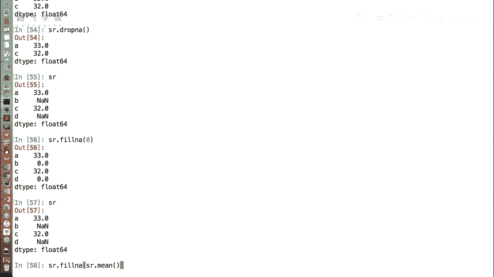

**注意：** 与NumPy和Pandas中的许多操作一样，`fillna()`方法不会直接修改原Series，而是返回一个新的Series。如果需要保存结果，必须进行赋值。

除了填充固定值，我们还可以根据数据特性进行智能填充。

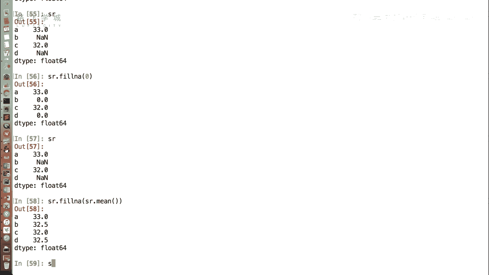

**填充为统计值（如平均值）：**
```python
# 计算非缺失值的平均值
mean_value = SR.mean()
# 用平均值填充缺失值
filled_SR_mean = SR.fillna(mean_value)
```

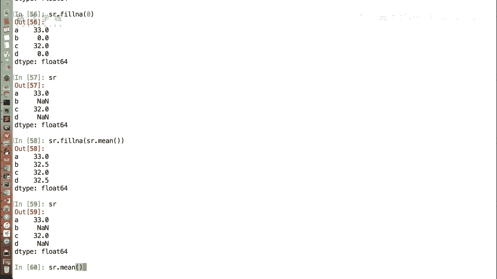

`mean()`函数在计算时会自动跳过`NaN`值，这为数据处理提供了极大的便利。相比使用原生Python列表或字典，Pandas在处理缺失值时更加高效和简洁。

## 总结

本节课中我们一起学习了处理Series缺失值的两种核心方法：
1.  **删除**：使用`dropna()`函数或结合`notnull()`进行布尔索引过滤。
2.  **填充**：使用`fillna()`函数，可以填充为固定值（如0）或统计值（如平均值`mean()`）。

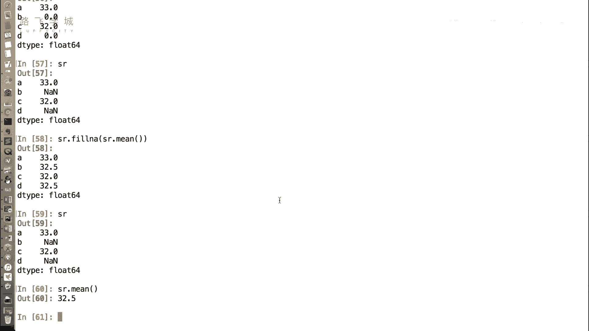

掌握这些方法，能帮助我们更好地清洗数据，为后续的金融量化分析和可视化打下坚实基础。