# Python金融量化：P18：01 金融建模 📈


在本节课中，我们将学习金融建模的基础知识，涵盖基本统计分析、数据标准化与离散化、线性与非线性问题的处理，以及线性回归模型的应用。课程内容旨在让初学者能够轻松理解并上手实践。

## 基本统计分析 📊

上一节我们介绍了课程的整体框架，本节中我们来看看如何进行基本统计分析。基本统计分析主要涉及计算数据集的求和、累积和、均值、中位数、标准差、极值、相关系数、协方差和众数等。这些计算都可以通过Python的`numpy`包轻松实现。

以下是使用`numpy`进行基本统计分析的步骤：

1.  首先，导入`numpy`包。
    ```python
    import numpy as np
    ```
2.  生成一个4行5列的随机数矩阵作为示例数据。
    ```python
    arr = np.random.randn(4, 5)
    ```
3.  计算整体均值。
    ```python
    np.mean(arr)
    ```
4.  计算每一行的均值（`axis=1`）。
    ```python
    np.mean(arr, axis=1)
    ```
5.  计算每一列的均值（`axis=0`）。
    ```python
    np.mean(arr, axis=0)
    ```
6.  其他统计量（如中位数、标准差、最大值、最小值）的计算方法类似，只需替换函数名即可，例如：
    *   中位数：`np.median(arr)`
    *   标准差：`np.std(arr)`
    *   最大值：`np.max(arr)`
    *   最小值：`np.min(arr)`
7.  计算累加和（`cumsum`）与累积乘积（`cumprod`）。
    ```python
    np.cumsum(arr, axis=0) # 按列累加
    np.cumprod(arr, axis=1) # 按行累积
    ```
8.  计算唯一值及其出现次数（需结合`pandas`）。
    ```python
    import pandas as pd
    s = pd.Series([3, 3, 1, 2, 4, 3, 6, 5, 6])
    value_counts = s.value_counts()
    ```
9.  求众数（即出现次数最多的值）。
    ```python
    mode_value = value_counts.idxmax()
    ```
10. 计算两个数组的相关系数和协方差。
    ```python
    brr = np.random.randn(4, 5)
    correlation = np.corrcoef(arr, brr)
    covariance = np.cov(arr, brr)
    ```

掌握了基本统计量的计算后，我们接下来需要了解如何处理数据，使其更适合建模。

## 数据标准化与离散化 🔧

上一节我们学习了如何描述数据，本节中我们来看看如何对数据进行预处理，即标准化和离散化。数据标准化旨在将不同特征（列）的数值范围调整到相近的尺度，以消除量纲影响，提升模型（尤其是线性模型）的精度。数据离散化则是将连续数据分段，转化为分类数据。

### 为什么需要标准化？

假设我们分析银行客户数据，特征包括年龄（16-80岁）、收入（0-20000元）和存款（0-2000万元）。这些特征的范围差异巨大，若直接用于模型，范围大的特征（如存款）可能会主导模型结果，导致预测不准确。标准化可以解决这个问题。

### 标准化的主要方法

以下是三种常见的标准化方法：

1.  **最大最小值归一化**：将数据缩放到[0, 1]区间。
    **公式**：`X_scaled = (X - X_min) / (X_max - X_min)`
    ```python
    import pandas as pd
    data = pd.DataFrame(arr)
    data_normalized = (data - np.min(data)) / (np.max(data) - np.min(data))
    ```
2.  **Z-score标准化**：使数据均值为0，标准差为1。
    **公式**：`X_scaled = (X - μ) / σ`
    ```python
    data_zscore = (data - np.mean(data)) / np.std(data)
    ```
    > **注意**：`numpy`的`std`默认计算总体标准差，而`pandas`的`std`默认计算样本标准差（无偏估计）。在统计分析中，通常使用样本标准差。
    ```python
    data_zscore_pd = (data - data.mean()) / data.std() # 使用pandas，默认为样本标准差
    ```
3.  **对数函数转换**：适用于右偏分布的数据。
    ```python
    data_log = np.log1p(np.abs(data)) / np.log(np.max(np.abs(data)))
    ```

### 什么是离散化？

离散化，也称为分箱法，是将连续数据划分为多个区间（箱），并用箱的标签代表原始值。例如，将年龄分为“青年”(16-30)、“中年”(31-45)等。

### 离散化的主要方法

以下是两种常见的离散化方法：

1.  **等宽分箱**：每个箱的宽度（取值范围）相同。
    ```python
    normal_data = np.random.randn(10)
    bins = 5
    categories = pd.cut(normal_data, bins=bins, labels=[1, 2, 3, 4, 5])
    ```
2.  **等频分箱**：每个箱内的样本数量大致相同。
    ```python
    quantiles = [0, 0.5, 1.0]
    labels = [‘bad‘, ‘good‘]
    categories_eqfreq = pd.cut(normal_data, bins=pd.qcut(normal_data, q=2).categories, labels=labels)
    ```

数据预处理完成后，我们就可以开始构建金融模型了。首先从最常见的线性问题开始。

## 金融中的线性问题 ➕

上一节我们处理了数据，本节中我们来看看金融领域常见的线性问题及其解决方法。线性问题主要包括回归分析、线性规划、整数规划和线性方程组求解。

### 1. 线性回归：资本资产定价模型

资本资产定价模型是一个典型的单因子线性回归模型，用于估计证券的预期收益率。
**公式**：`E(R_i) = R_f + β_i * [E(R_m) - R_f]`
其中，`β_i` 表示证券收益率对市场收益率的敏感程度。

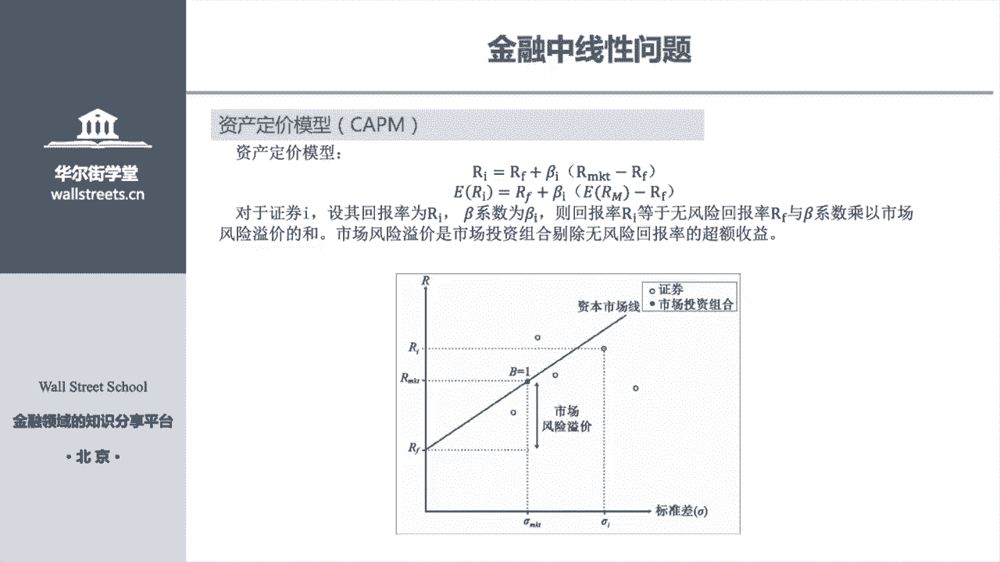

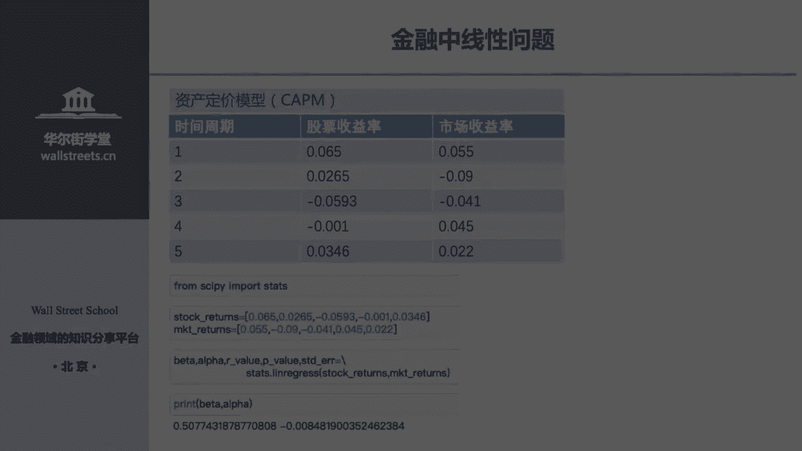

我们可以通过回归分析从历史数据中估计 `β_i`：
```python
from scipy import stats
stock_returns = [0.65, 0.265, -0.593, ...]
market_returns = [0.55, -0.09, 0.041, ...]
beta, alpha, r_value, p_value, std_err = stats.linregress(market_returns, stock_returns)
print(f“Beta系数为: {beta}“)
```

### 2. 多因子回归：套利定价理论

套利定价理论是CAPM的扩展，使用多个因子来解释证券收益。
**公式**：`R_i = α_i + β_i1*F1 + β_i2*F2 + ... + β_in*Fn + ε_i`
这本质上是一个多元线性回归问题。
```python
import statsmodels.api as sm
import numpy as np
num_periods = 9
num_factors = 7
data = np.random.randn(num_periods, num_factors + 1)
Y = data[:, 0]
X = data[:, 1:]
X = sm.add_constant(X)
model = sm.OLS(Y, X).fit()
print(model.params) # 输出截距项和各因子系数
```

### 3. 线性规划

线性规划在投资组合优化中很常见，即在给定约束条件下，求目标函数的最大值或最小值。
**示例**：求 `3x + 2y` 的最大值，约束条件为：
*   `2x + y <= 100`
*   `x + y <= 80`
*   `x <= 40`
*   `x, y >= 0`
```python
import pulp
prob = pulp.LpProblem(‘Maximize_Profit‘, pulp.LpMaximize)
x = pulp.LpVariable(‘x‘, lowBound=0)
y = pulp.LpVariable(‘y‘, lowBound=0)
prob += 3*x + 2*y
prob += 2*x + y <= 100
prob += x + y <= 80
prob += x <= 40
prob.solve()
for variable in prob.variables():
    print(f“{variable.name} = {variable.varValue}“)
```

### 4. 整数规划

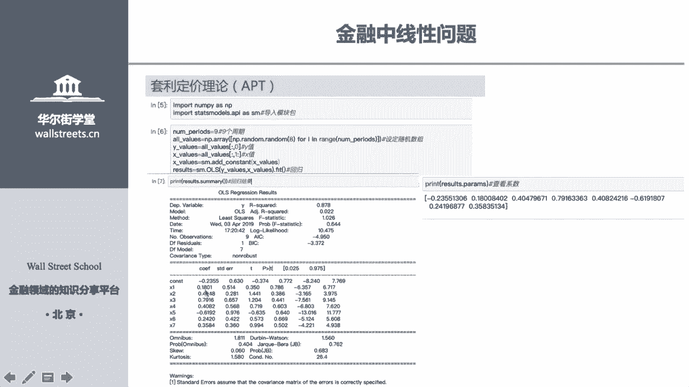

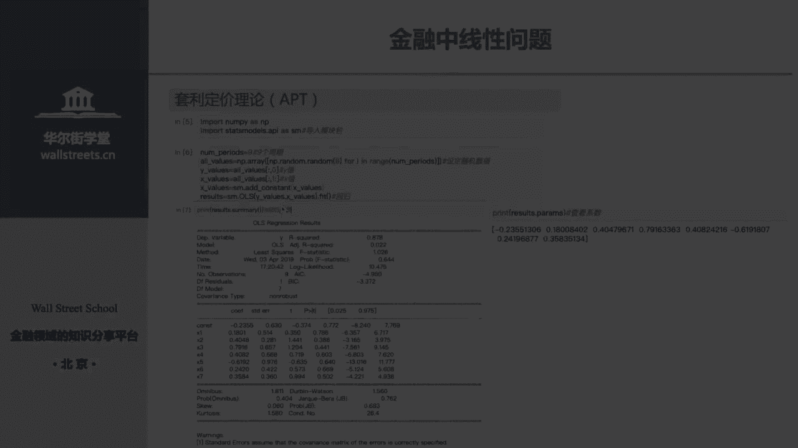

当决策变量必须为整数时（如购买股票的数量），需要使用整数规划。
**示例**：从三个经纪人处购买150份合同，每人有最低购买量和库存上限，求总成本最低的方案。
```python
import pulp
brokers = [‘X‘, ‘Y‘, ‘Z‘]
variable_costs = {‘X‘: 500, ‘Y‘: 350, ‘Z‘: 450}
fixed_costs = {‘X‘: 4000, ‘Y‘: 2000, ‘Z‘: 6000}
min_purchase = {‘X‘: 30, ‘Y‘: 30, ‘Z‘: 30}
max_purchase = {‘X‘: 100, ‘Y‘: 90, ‘Z‘: 70}
prob = pulp.LpProblem(‘Minimize_Cost‘, pulp.LpMinimize)
buy_vars = pulp.LpVariable.dicts(‘buy‘, brokers, lowBound=0, cat=‘Integer‘)
is_order_vars = pulp.LpVariable.dicts(‘order‘, brokers, cat=‘Binary‘)
prob += pulp.lpSum([variable_costs[i]*buy_vars[i] + fixed_costs[i]*is_order_vars[i] for i in brokers])
prob += pulp.lpSum([buy_vars[i] for i in brokers]) == 150
for i in brokers:
    prob += buy_vars[i] >= min_purchase[i] * is_order_vars[i]
    prob += buy_vars[i] <= max_purchase[i] * is_order_vars[i]
prob.solve()
```

### 5. 求解线性方程组

金融建模中常需求解线性方程组 `Ax = B`。
**示例**：求解方程组
*   `2a + b + c = 4`
*   `a + 3b + c = 5`
*   `a + b = 6`
```python
A = np.array([[2, 1, 1], [1, 3, 1], [1, 1, 0]])
B = np.array([4, 5, 6])
X = np.linalg.solve(A, B)
print(X) # 输出 [a, b, c] 的值
```

解决了线性问题后，金融世界中还有许多现象需要用非线性模型来描述。

## 金融中的非线性问题 🔄

上一节我们探讨了线性模型，本节中我们来看看如何处理非线性问题。金融中的非线性问题很常见，例如求解方程 `y = x^3 - 2x^2 - 5 = 0` 的根，这在计算隐含波动率、求解债券到期收益率时都会遇到。

### 非线性方程求解方法

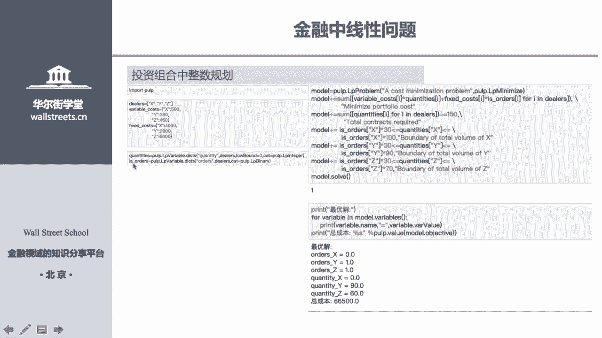

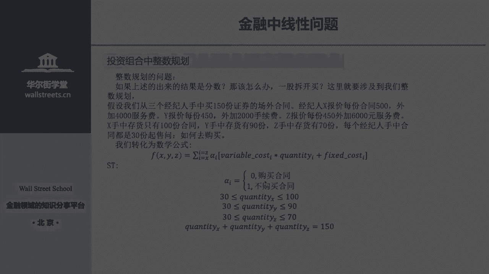

主要有四种数值方法：

1.  **增量法**：从一个起点开始，按固定步长增加，直到函数值变号，则根在最后两个点之间。
2.  **二分法**：在已知根所在区间`[a, b]`内，不断取中点并判断根位于哪一半区间，逐步缩小区间。
3.  **牛顿迭代法**：利用函数在某点的切线来逼近根，迭代公式为 `x_{n+1} = x_n - f(x_n)/f‘(x_n)`。
4.  **割线法**：牛顿迭代法的变种，用差商代替导数，无需计算导函数。

在实际应用中，我们可以直接使用`SciPy`库中的函数来求解，无需手动实现算法。
```python
from scipy import optimize
def f(x):
    return x**3 - 2*x**2 - 5
# 二分法
root_bisect = optimize.bisect(f, -5, 5)
# 牛顿迭代法 (需提供导数)
def fprime(x):
    return 3*x**2 - 4*x
root_newton = optimize.newton(f, 3, fprime=fprime)
# 割线法
root_secant = optimize.newton(f, 3)
# 混合方法（推荐）
root_root = optimize.root_scalar(f, bracket=[-5, 5], method=‘brentq‘)
print(root_root.root)
```

这些方法在效率和适用条件上有所不同。牛顿迭代法通常收敛速度最快。

## 对数据做线性回归 📉

在前面的章节中，我们已经用`statsmodels`进行过回归分析。本节中我们使用机器学习库`scikit-learn`来构建和评估线性回归模型，并拓展更先进的回归算法。

我们将使用一个经典的混凝土强度数据集进行演示。
```python
import pandas as pd
from sklearn.model_selection import train_test_split
from sklearn.linear_model import LinearRegression
from sklearn.metrics import mean_squared_error
# 1. 加载数据
data = pd.read_csv(‘concrete_data.csv‘)
# 2. 准备数据
X = data.drop(‘concrete_strength‘, axis=1)
y = data[‘concrete_strength‘]
# 3. 划分训练集和测试集
X_train, X_test, y_train, y_test = train_test_split(X, y, test_size=0.2, random_state=42)
# 4. 创建并训练线性回归模型
model = LinearRegression()
model.fit(X_train, y_train)
# 5. 预测并评估
y_pred = model.predict(X_test)
mse = mean_squared_error(y_test, y_pred)
print(f“线性回归模型均方误差: {mse}“)
print(f“模型系数: {model.coef_}“)
print(f“模型截距: {model.intercept_}“)
```

### 超越线性回归

线性回归有严格的假设（如误差独立同分布）。当数据不满足这些假设时，其预测性能可能下降。现代机器学习提供了许多更强大的回归算法：

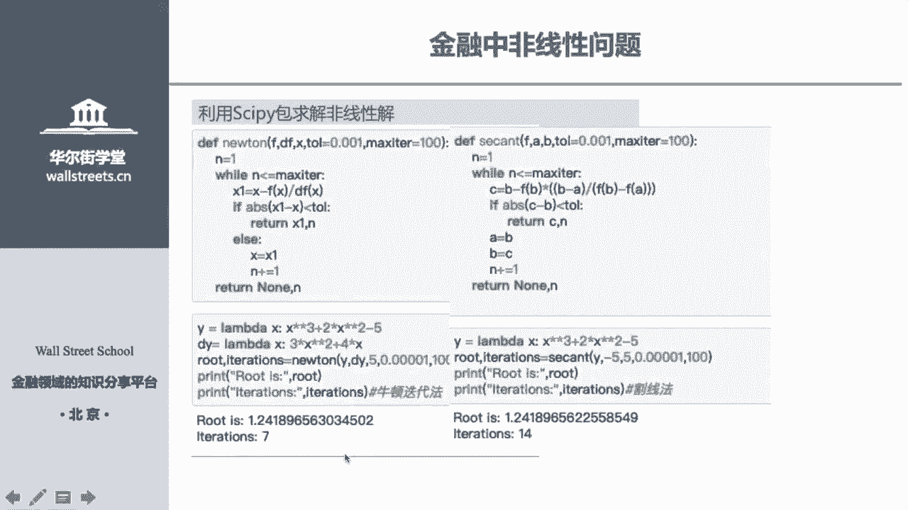

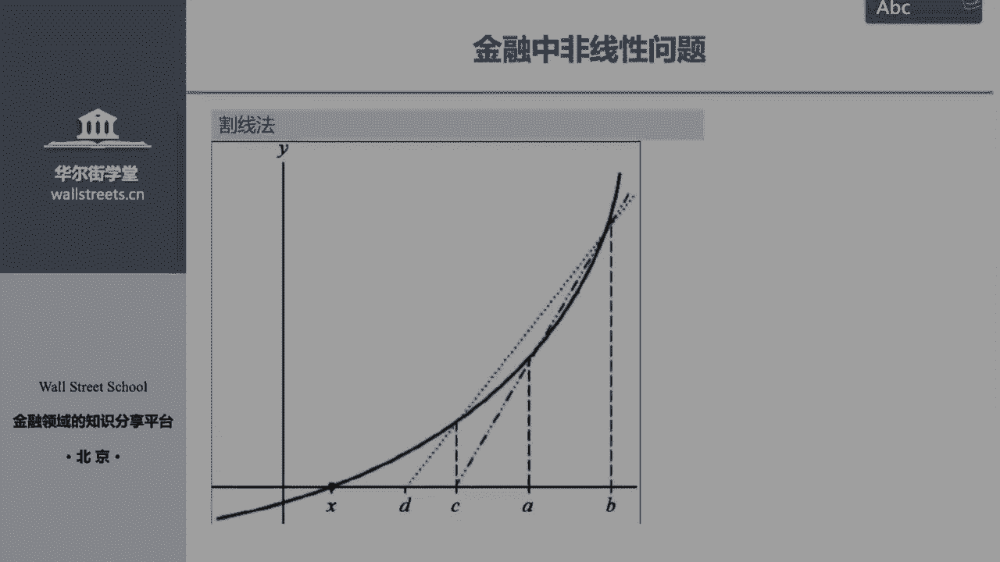

*   **决策树回归**
*   **随机森林回归**
*   **梯度提升回归（如XGBoost, LightGBM）**
*   **支持向量机回归**
*   **神经网络回归**

我们可以用同样的数据框架测试不同模型：
```python
from sklearn.ensemble import RandomForestRegressor
from sklearn.tree import DecisionTreeRegressor
# 随机森林回归
rf_model = RandomForestRegressor(n_estimators=100, random_state=42)
rf_model.fit(X_train, y_train)
y_pred_rf = rf_model.predict(X_test)
mse_rf = mean_squared_error(y_test, y_pred_rf)
print(f“随机森林回归均方误差: {mse_rf}“)
```
通常，像随机森林这样的集成学习模型能获得比简单线性回归更好的预测精度。在金融多因子模型中，完全可以尝试用这些先进的机器学习模型替代传统的线性回归，以捕捉更复杂的非线性关系。

## 总结 🎯

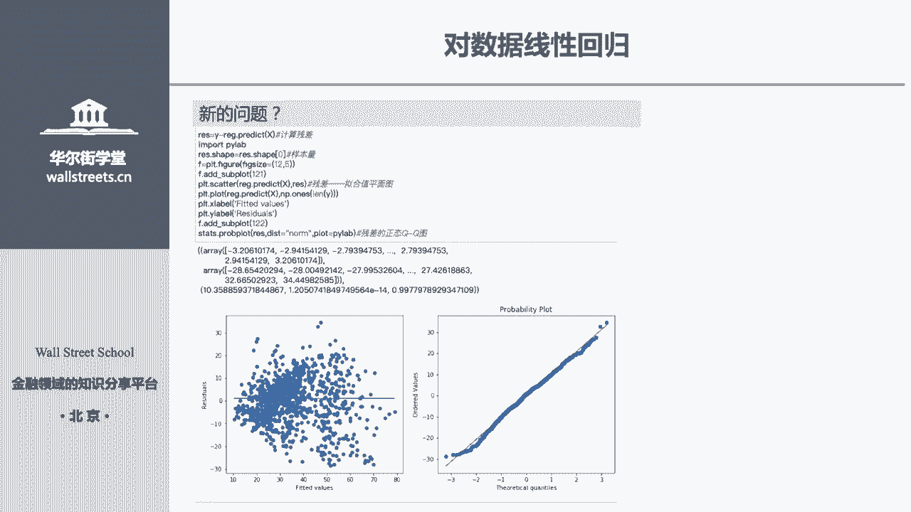

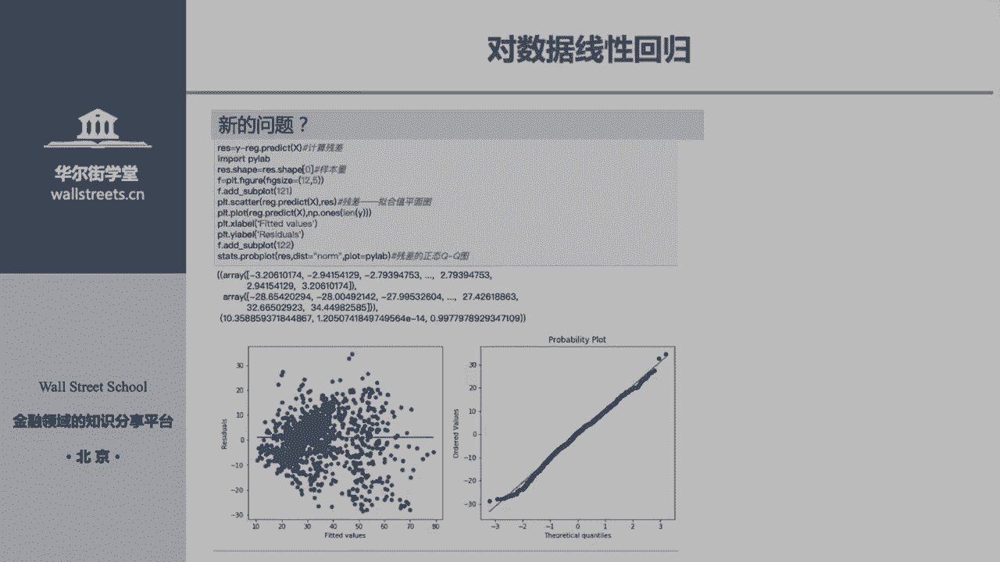

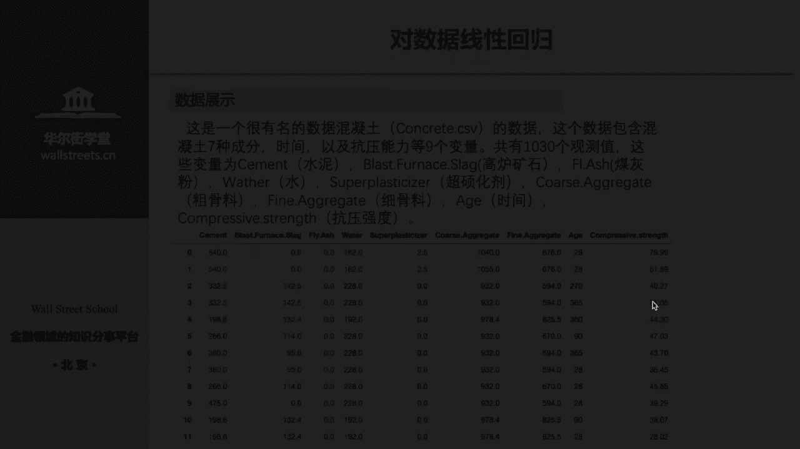

本节课中我们一起学习了金融建模的完整流程。

1.  **基本统计分析**：我们使用`numpy`和`pandas`计算了均值、中位数、标准差、相关系数等关键统计量。
2.  **数据预处理**：我们理解了数据标准化（归一化、Z-score）和离散化（等宽、等频分箱）的重要性及实现方法，以提升模型表现。
3.  **线性问题**：我们应用线性回归估计了CAPM模型的Beta系数和APT模型的多因子系数，使用线性规划和整数规划解决了资源优化问题，并求解了线性方程组。
4.  **非线性问题**：我们介绍了增量法、二分法、牛顿迭代法和割线法等数值方法，用于求解金融中的非线性方程。
5.  **回归建模实践**：我们使用`scikit-learn`建立了线性回归模型，并认识到可以探索随机森林等更先进的机器学习算法来获得可能更好的预测性能。

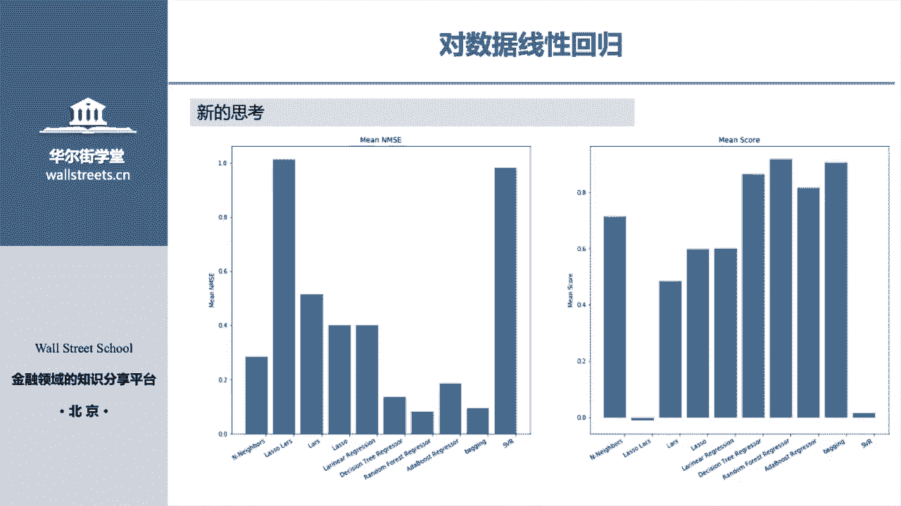

金融建模是理论知识与编程实践的结合。关键在于理解业务问题背后的数学模型，并熟练运用Python工具库将其实现。请务必动手练习课程中的每一段代码，这是掌握Python金融量化的最佳途径。