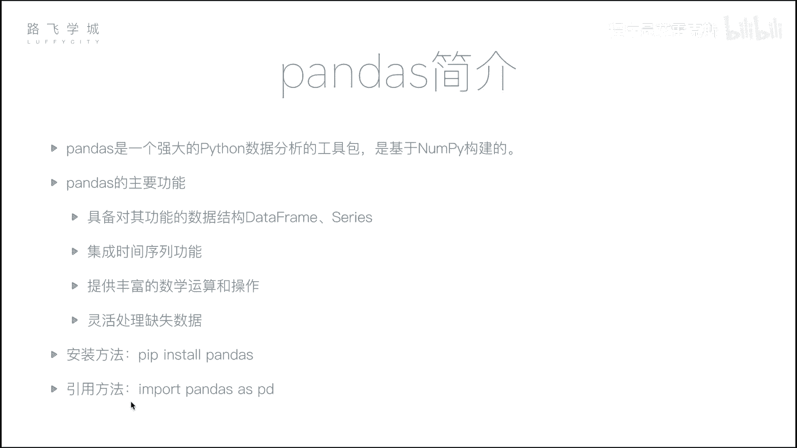
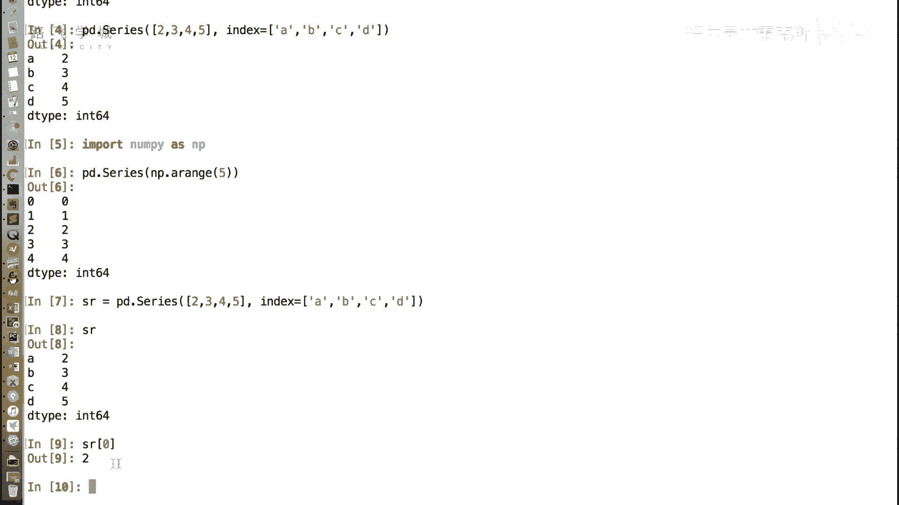
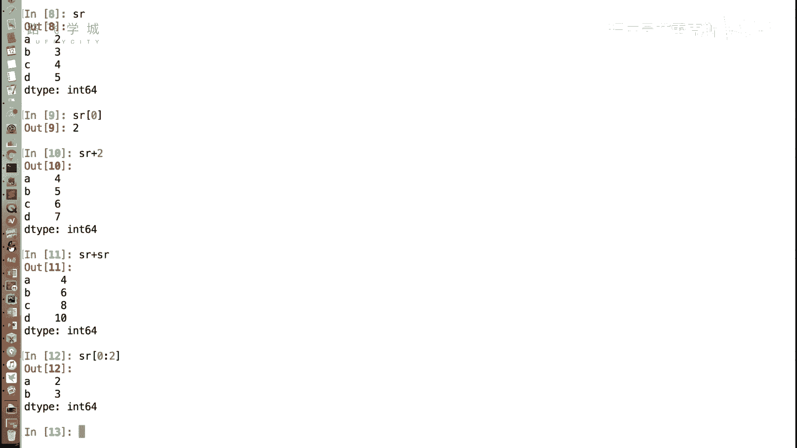
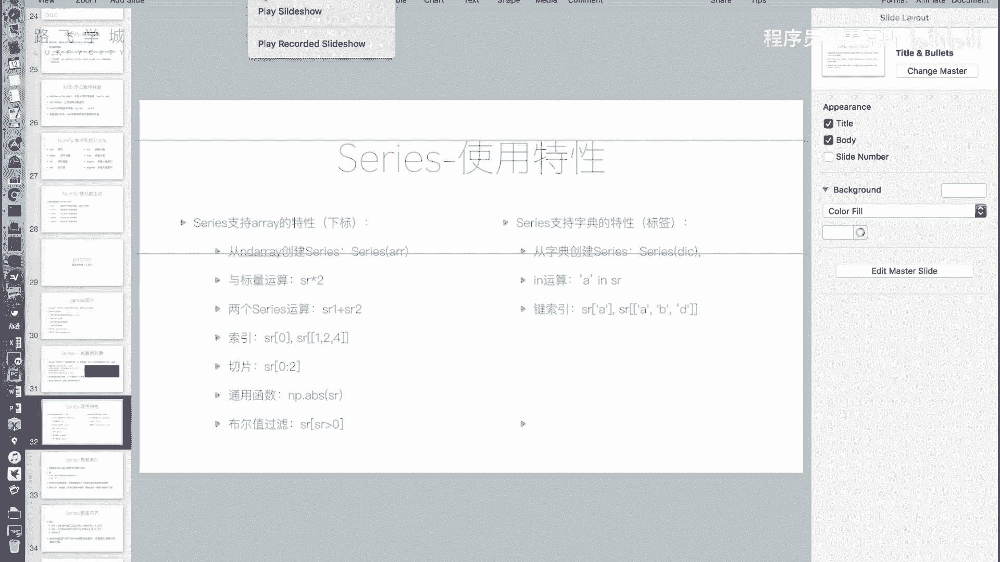
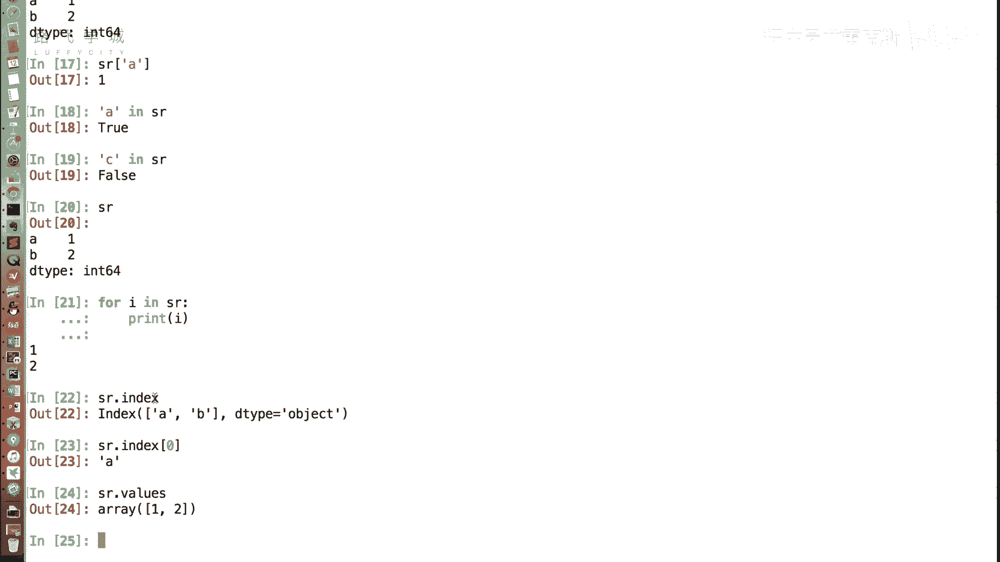
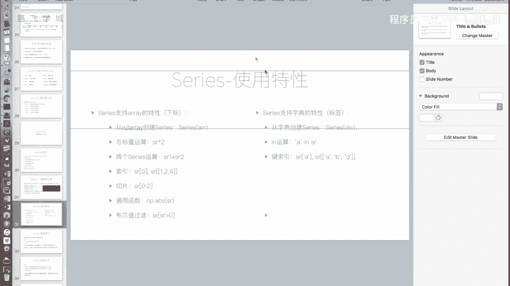
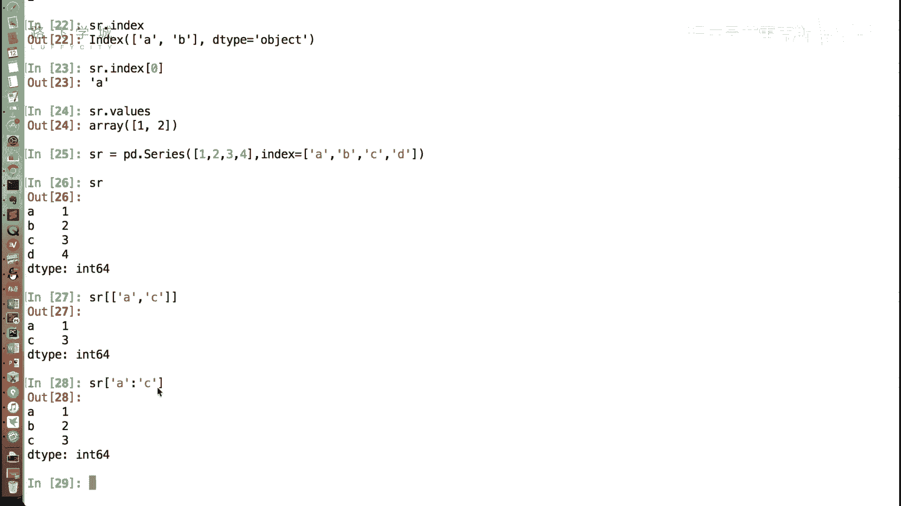

# Python金融量化投资分析：P18：Series介绍 📊

## 概述
在本节课中，我们将要学习Pandas库中的核心数据结构之一：**Series**。我们将了解它如何结合了列表（数组）和字典的特性，并掌握其基本创建、访问和操作方法。

---



## 从NumPy到Pandas
上一节我们介绍了数据分析的基础包NumPy。本节中我们来看看Pandas。Pandas是基于NumPy构建的，在数据分析领域应用广泛。它封装层级更高，是数据分析的核心工具。Pandas的主要功能包括提供两种数据结构（DataFrame和Series）、集成时间序列功能、提供丰富的数学运算以及灵活处理缺失数据。


安装Pandas的方法很简单，使用`pip`即可。官方建议的引用方式如下：

```python
import pandas as pd
```


---

## Series：一维数据对象
Series是Pandas中的一种核心数据对象，它是一种类似于一维数组的对象。Series可以看作是数组和字典的结合体。



### 创建Series
创建Series需要使用`pd.Series()`方法。


以下是创建Series的两种基本方式：

1.  **从列表创建**：默认情况下，左侧会生成从0开始的整数索引。
    ```python
    sr = pd.Series([2, 3, 4, 5])
    ```
2.  **指定索引创建**：通过`index`参数可以自定义索引标签，使其更像一个字典。
    ```python
    sr = pd.Series([2, 3, 4, 5], index=[‘A‘, ‘B‘, ‘C‘, ‘D‘])
    ```





### Series的数组（列表）特性
Series继承了许多NumPy数组或Python列表的特性。

以下是Series支持的数组类操作：

*   **从数组创建**：可以从NumPy数组创建Series。
*   **下标访问**：即使指定了自定义索引，依然可以通过整数下标（位置）访问数据，例如`s[0]`。
*   **标量运算**：Series可以与一个数字进行加减乘除等运算。
*   **相同大小Series间的运算**：两个长度相同的Series可以对位进行运算。
*   **切片操作**：可以使用整数位置进行切片，例如`s[0:2]`。
*   **通用函数**：支持NumPy的通用函数，如取绝对值、最大值等。
*   **布尔型索引**：可以通过条件表达式筛选数据，例如`s[s > 4]`。

### Series的字典特性
Series也具备类似字典的特性。

以下是Series支持的字典类操作：



*   **从字典创建**：可以直接传入一个字典来创建Series，字典的键（key）会成为Series的索引。
    ```python
    sr = pd.Series({‘A‘: 2, ‘B‘: 3})
    ```
*   **标签访问**：可以通过自定义的索引标签来访问数据，例如`s[‘A‘]`。
*   **`in`操作**：可以判断一个标签是否存在于Series的索引中，例如`‘A‘ in sr`。
*   **花式索引与切片**：可以通过标签列表进行花式索引，也可以通过标签进行切片。**注意**：使用标签切片时，范围是“前包后也包”的。



### 获取索引与值
Series有两个重要属性，用于分别获取其索引和值：

*   **`index`属性**：获取Series的索引对象。
*   **`values`属性**：获取Series的值（通常是一个NumPy数组）。

需要注意的是，当使用`for`循环遍历一个Series时，循环输出的是它的**值**，而不是索引标签。这与遍历字典的行为不同。

---

## Series的应用场景
Series结合了有序列表和键值对字典的优点，在实际工作中非常有用。例如，可以将其用于存储一支股票的历史收盘价，其中索引是日期（标签），值是价格。这样，我们既可以通过具体的日期（标签）快速查询价格，也可以通过位置（整数索引）获取前N天的数据，或者进行有序的切片分析。



---

## 总结
本节课中我们一起学习了Pandas的Series对象。我们了解了它是如何作为数组和字典的结合体，掌握了其创建方法、通过下标和标签进行数据访问、以及它支持的各种运算和操作。Series为处理一维标记数据提供了强大且灵活的容器，是构建更复杂数据分析的基础。