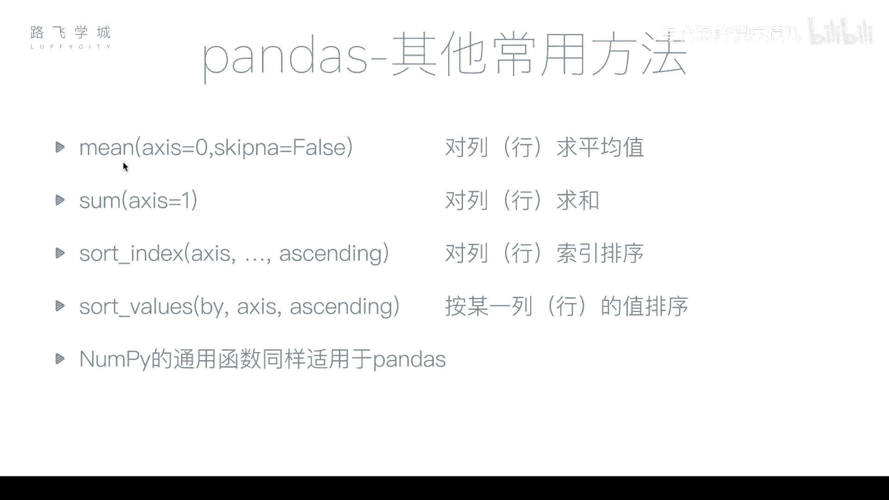
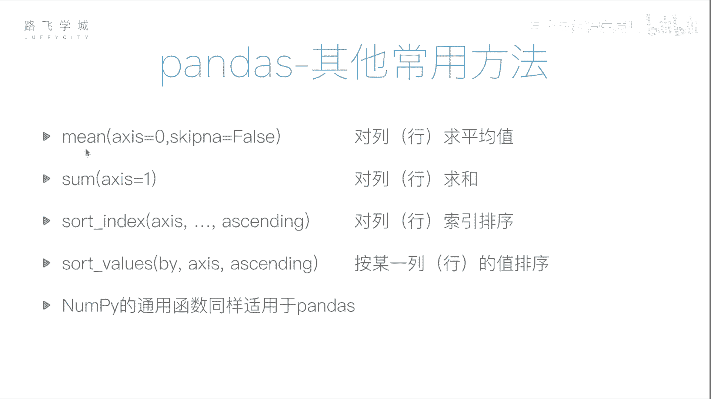

# Python金融量化：P18：pandas常用函数 📊

在本节课中，我们将学习pandas库中一些非常实用的常用函数，包括数据统计、排序等操作。掌握这些函数能帮助我们更高效地处理和分析金融数据。



上一节我们介绍了pandas的数据结构，本节中我们来看看如何对DataFrame进行统计计算和排序。


## 求平均值：mean方法

`mean`方法用于计算数据的平均值。在NumPy库中，`mean`函数作用于数组会返回一个单一的平均值。然而，在pandas的DataFrame中，情况有所不同。

对于一个DataFrame对象执行`mean`方法，它会默认对**每一列**分别计算平均值，并返回一个Series对象。这是因为DataFrame通常包含多列数据。

```python
# 假设df是一个DataFrame
df.mean()
```

例如，一个有两列的DataFrame，`mean()`会返回一个长度为2的Series，分别对应两列的平均值。计算时会自动忽略缺失值（NaN）。

如果想按照**行**的方向求平均值，则需要指定参数`axis=1`。

```python
df.mean(axis=1)
```

## 求和：sum方法

与`mean`方法类似，`sum`方法用于求和。其默认行为也是按列求和。

```python
df.sum() # 默认按列求和
```

若要按行求和，同样需要指定`axis`参数。

```python
df.sum(axis=1) # 按行求和
```

## 数据排序

pandas提供了两种主要的排序方式：按值排序和按索引排序。

### 按值排序：sort_values

`sort_values`方法根据指定列（或行）的值进行排序。核心参数是`by`，用于指定依据哪一列进行排序。

```python
# 按‘column_name’列的值升序排序
df.sort_values(by='column_name')
```

若要降序排序，需要设置参数`ascending=False`。

```python
# 按‘column_name’列的值降序排序
df.sort_values(by='column_name', ascending=False)
```

按行排序的概念与按列排序类似，但需要指定依据哪一行的值进行排序，这在实际应用中较少使用。当排序的列中存在缺失值（NaN）时，所有包含NaN的行不会参与排序比较，而是统一被放置在结果的最后。

### 按索引排序：sort_index

`sort_index`方法用于根据行索引或列索引的标签进行排序。

```python
# 按行索引标签排序（默认升序）
df.sort_index()

# 按行索引标签降序排序
df.sort_index(ascending=False)

# 按列索引标签排序
df.sort_index(axis=1)
```

## 其他通用统计函数

除了求平均值和求和外，之前在NumPy中学习过的许多通用函数同样适用于pandas对象。

以下是部分常用的统计函数：

*   `std()`: 计算标准差
*   `var()`: 计算方差
*   `max()`: 找出最大值
*   `min()`: 找出最小值
*   `median()`: 计算中位数
*   `count()`: 统计非空值数量

这些函数在DataFrame上使用时，默认都是按列进行计算，并可以通过`axis`参数改变计算方向。

---



本节课中我们一起学习了pandas库的核心统计与排序函数。我们掌握了如何使用`mean`和`sum`进行数据聚合，如何使用`sort_values`和`sort_index`对数据进行排序，并了解了其他统计函数的通用性。这些是进行数据清洗和初步分析的基础工具。