# Python金融量化：P18：Series对象核心概念总结 📊

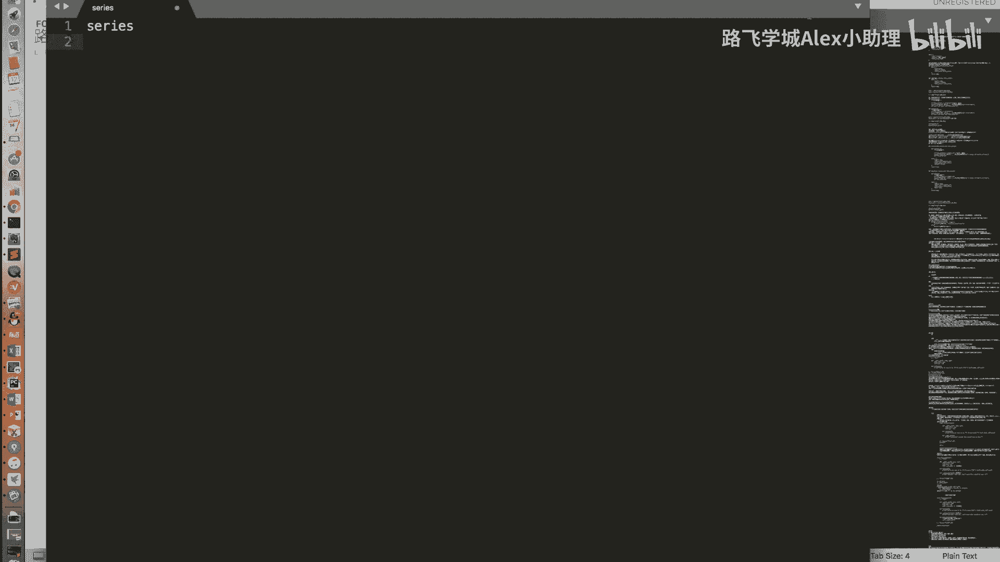

在本节课中，我们将对Pandas库中的第一个核心数据结构——Series对象进行全面的回顾与总结。我们将梳理其核心特性、操作方式以及数据处理技巧，帮助你巩固对Series的理解。

## 概述

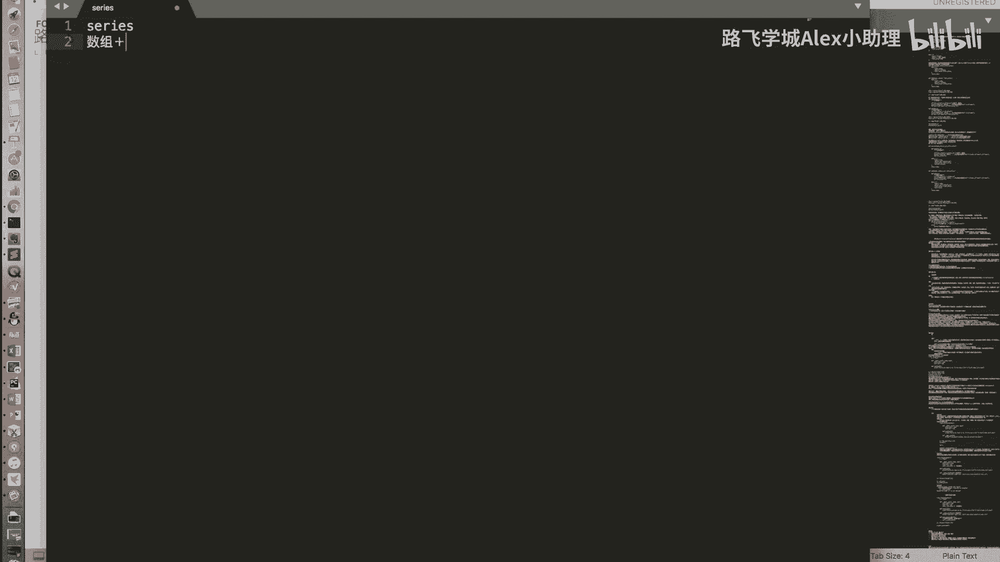

Series是Pandas库中一维的、带标签的数组。它结合了Python字典和NumPy数组的优点，是进行数据分析和处理的基础。

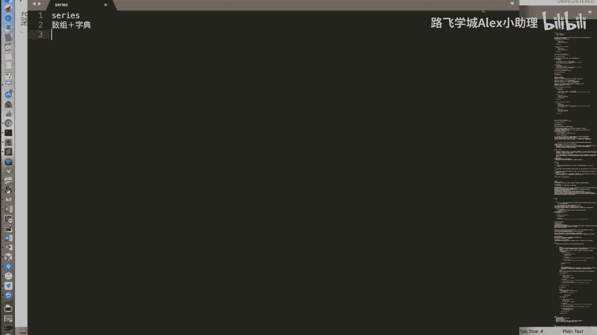

## Series的本质：字典与数组的集合体

上一节我们介绍了Series的基本操作，本节中我们来看看其核心设计理念。Series本质上是一个**字典**与**数组**的集合体。

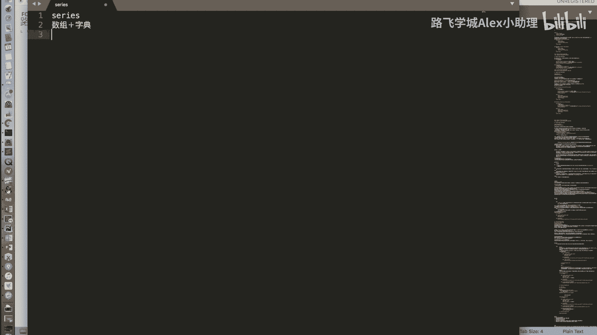

以下是其核心特性的具体体现：

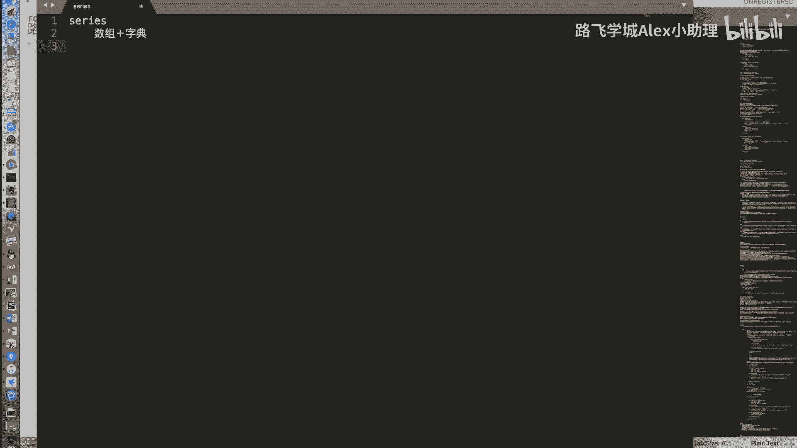

*   **类似数组的操作**：Series支持通过整数位置（下标）进行访问和切片，也支持布尔索引。它还可以与其他Series或标量进行算术运算。
    *   **代码示例**：`series[0]`, `series[1:4]`, `series[series > 2]`, `series1 + series2`
*   **类似字典的操作**：Series支持通过自定义的标签（索引）进行访问和判断成员是否存在。
    *   **代码示例**：`series[‘a’]`, `‘b’ in series`

## 整数索引的歧义与解决方案

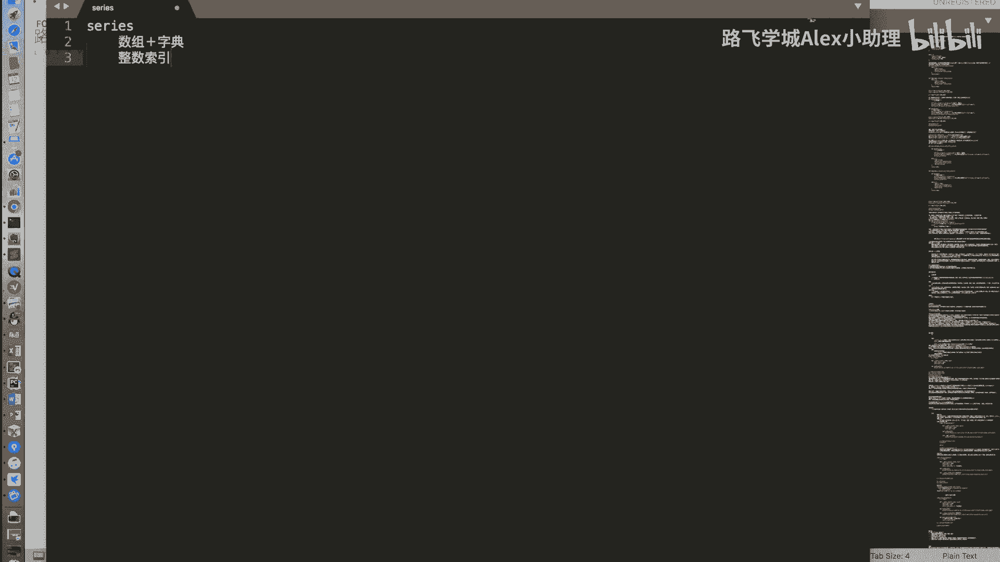

当Series的索引包含整数时，使用中括号`[]`进行访问可能会产生歧义：它可能被解释为按位置（下标）索引，也可能被解释为按标签索引。

为了解决这个问题，我们引入了两个非常重要的属性：`.iloc`和`.loc`。

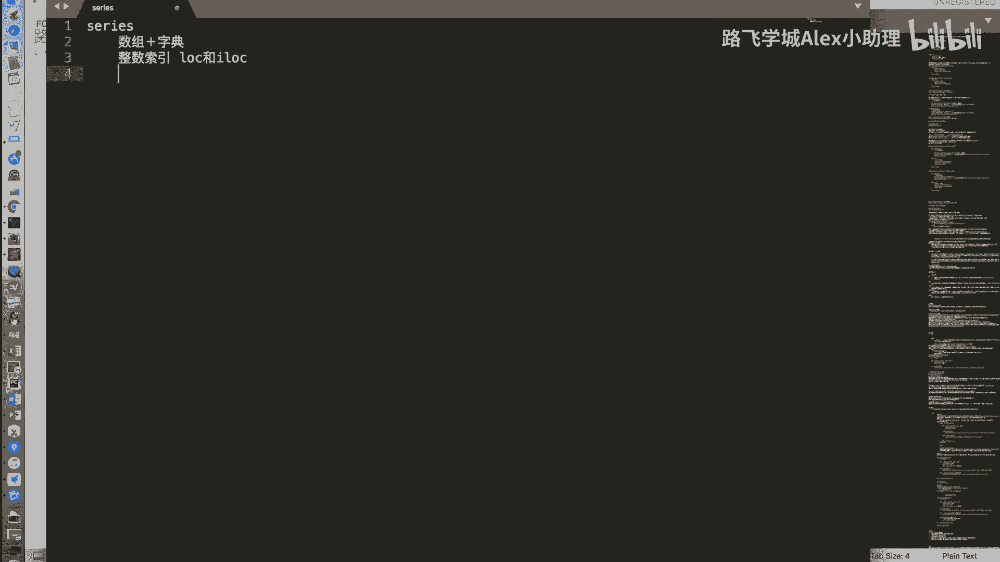

*   **`.iloc`**：明确指定为基于整数位置的索引。
    *   **公式/代码**：`series.iloc[0]` 获取第一个位置的元素。
*   **`.loc`**：明确指定为基于标签的索引。
    *   **公式/代码**：`series.loc[‘label’]` 获取标签为’label’的元素。

## Series的数据类型与数据对齐

Series中的元素具有统一的数据类型（dtype），这保证了运算的高效性。在进行两个Series之间的运算（如加减乘除）时，Pandas会执行一个关键操作：**数据对齐**。

数据对齐是指运算会按照**标签**自动匹配对应的值。如果某个标签只存在于其中一个Series中，则运算结果在该位置会产生一个缺失值。

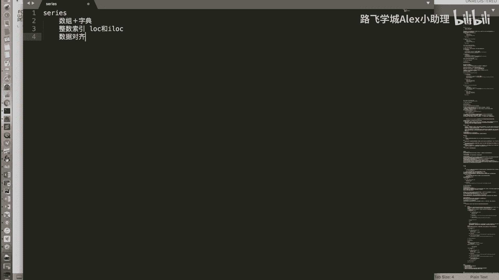

*   **公式/概念**：`series_a + series_b` 的结果中，每个标签对应的值是 `series_a[标签] + series_b[标签]`。若某标签仅在一方存在，则结果为`NaN`。

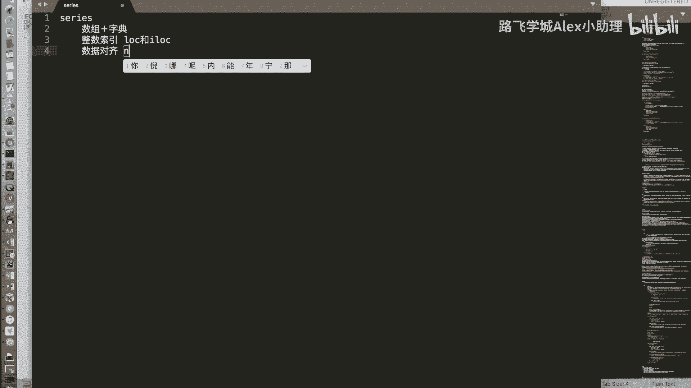

## 缺失数据处理

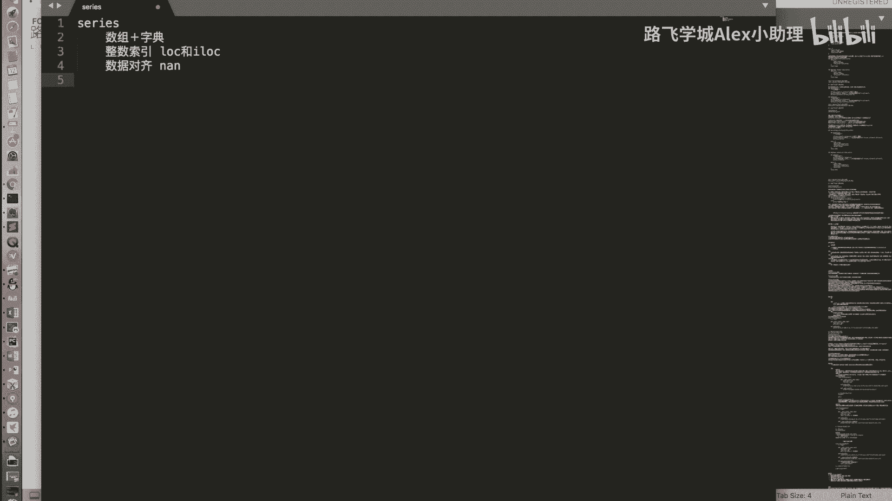

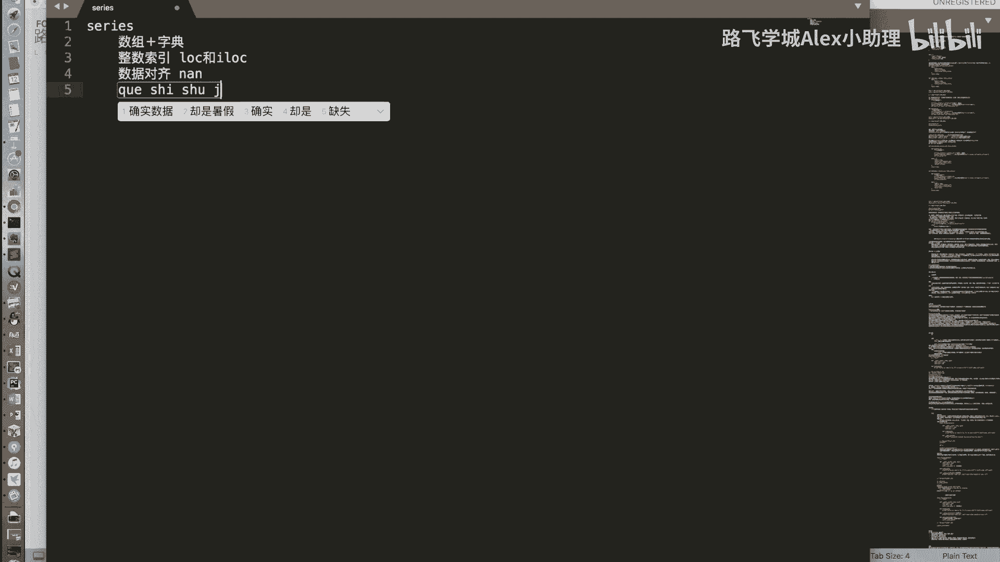

在数据对齐过程中，经常会产生缺失值，在Pandas中用`NaN`表示。处理缺失数据是数据分析的常见任务，主要有两种方法：

以下是两种核心的处理策略：

1.  **删除缺失值**：使用`.dropna()`函数直接移除包含`NaN`的行。
    *   **代码示例**：`series.dropna()`
2.  **填充缺失值**：使用`.fillna()`函数为`NaN`位置填充一个指定的值（如0、平均值等）。
    *   **代码示例**：`series.fillna(0)`

## Series的功能继承

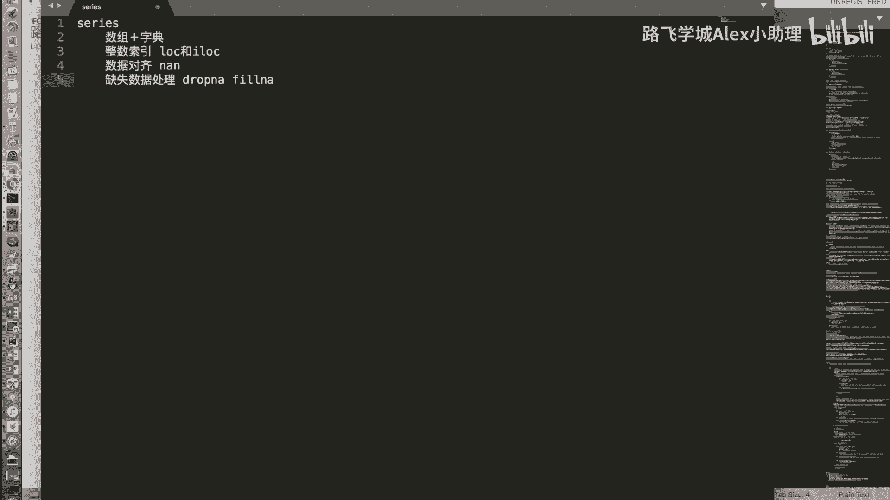

除了我们介绍的这些Pandas特有功能外，Series对象继承了其底层基础——NumPy数组的绝大多数功能。

例如，布尔型索引、花式索引（Fancy Indexing）等NumPy数组的常用操作，在Series中同样适用。这意味着如果你熟悉NumPy，将能更快地上手Series的许多高级操作。

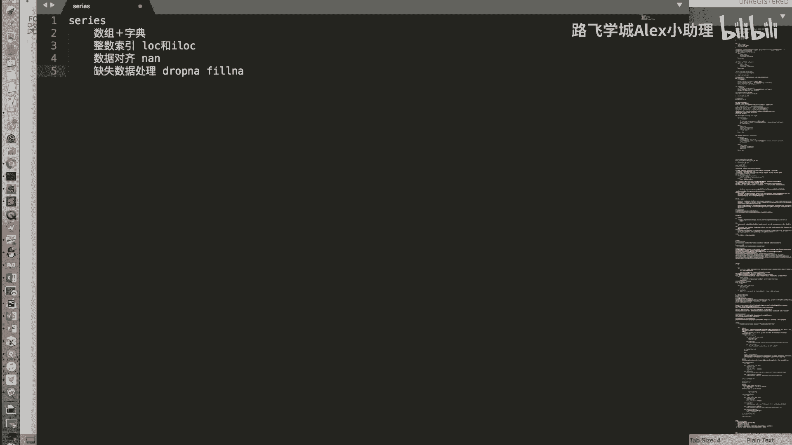

## 总结

本节课中我们一起学习了Pandas Series对象的全貌。我们明确了它是结合了字典和数组特性的强大一维数据结构，掌握了如何使用`.iloc`和`.loc`清晰地进行索引，理解了**数据对齐**这一核心运算机制，并学会了处理由此产生的缺失数据。最后，我们了解到Series的强大功能很大程度上源于其对NumPy的继承。牢固掌握Series是学习更复杂的DataFrame对象乃至进行高效数据分析的基石。