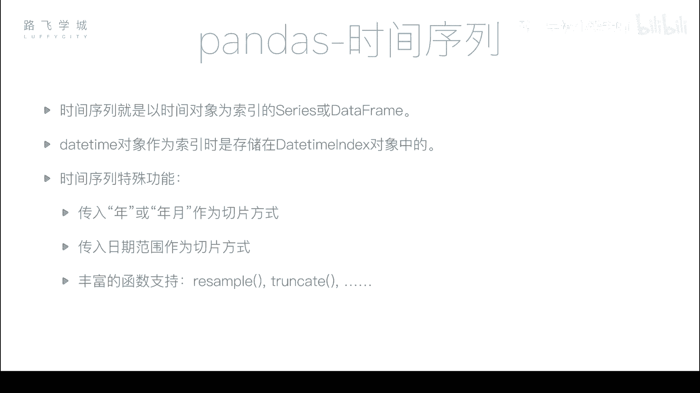
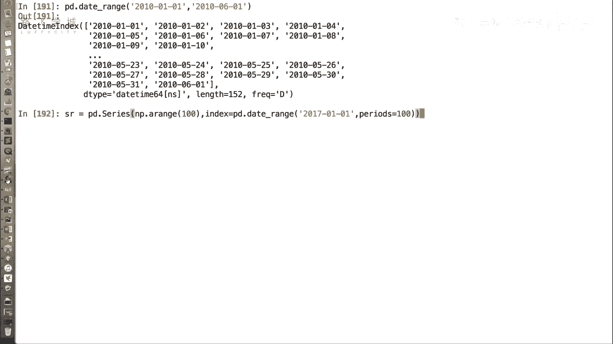
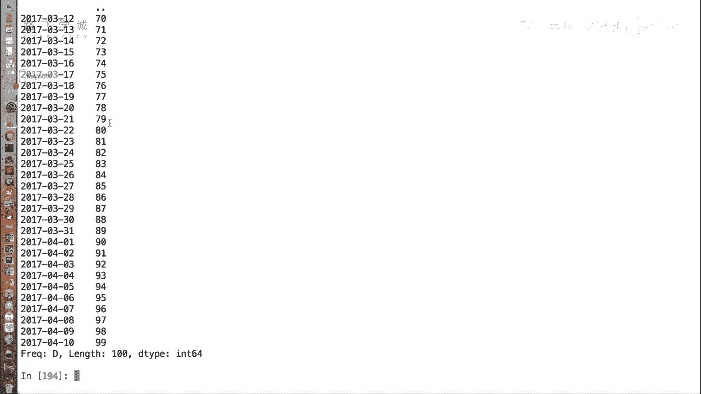
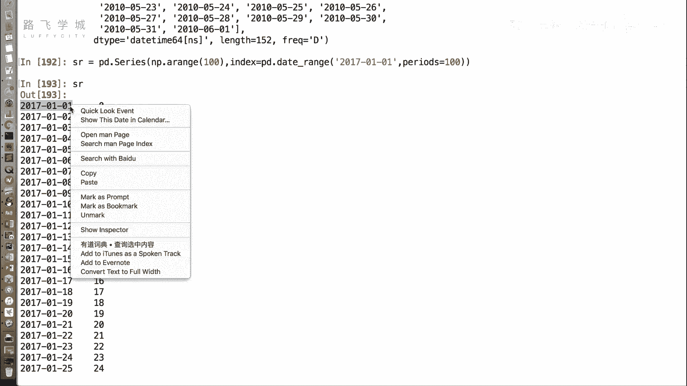
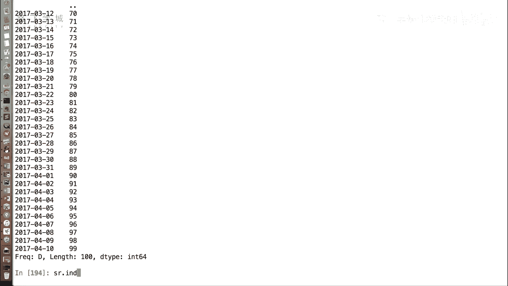
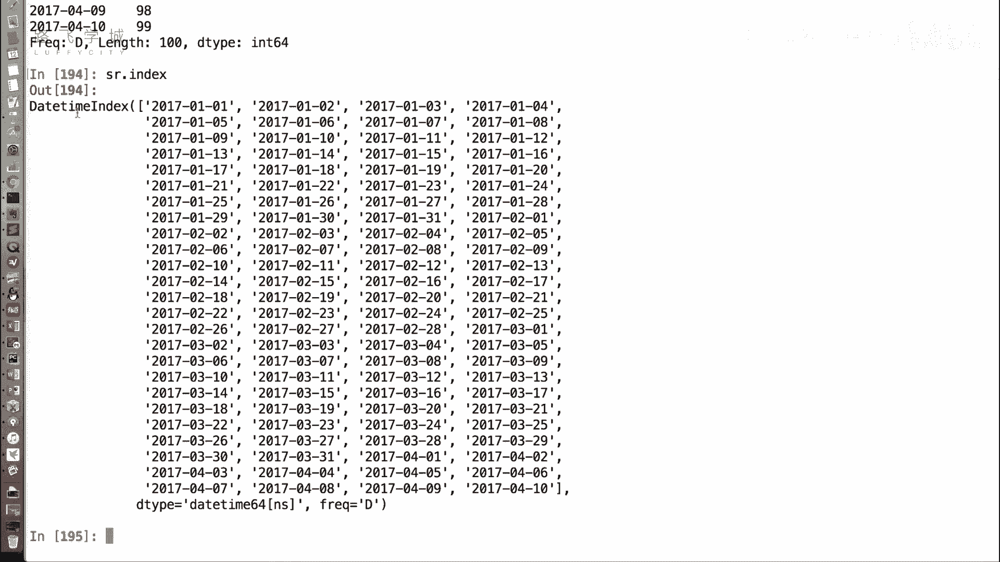
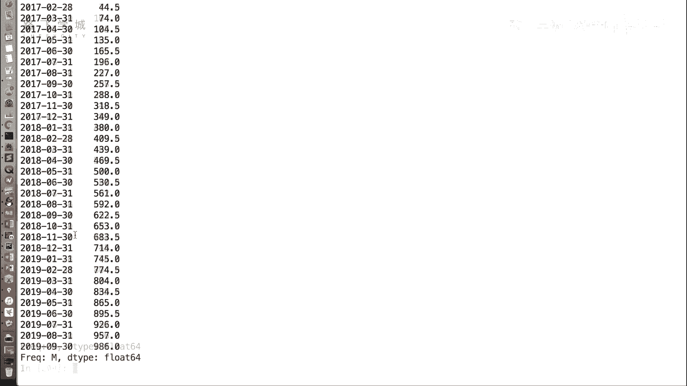
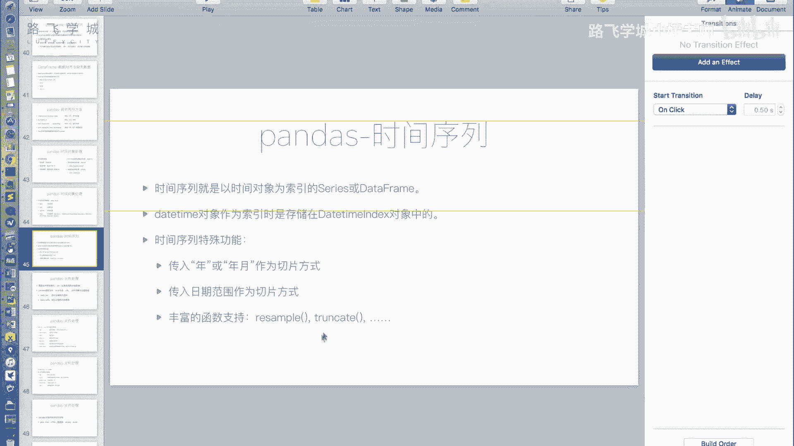
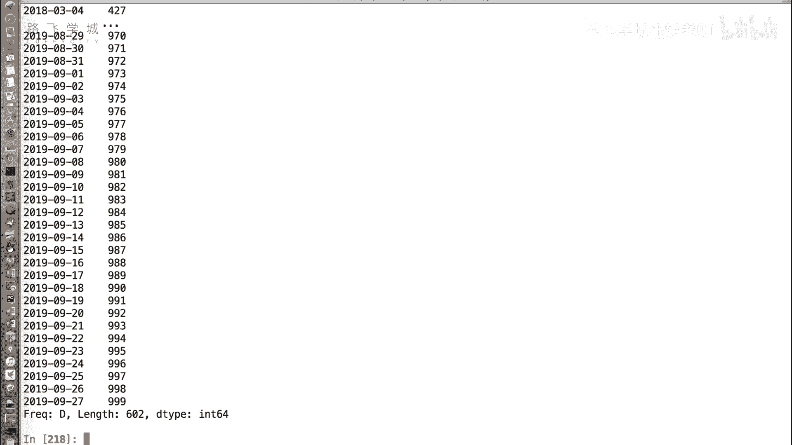

# Python金融量化：P18：时间序列



在本节课中，我们将学习如何利用Pandas创建和使用时间序列。时间序列是以时间对象作为索引的Series或DataFrame，它在金融数据分析中至关重要，能帮助我们轻松地进行时间维度的数据切片、重采样等操作。

## 创建时间序列

上一节我们介绍了Pandas中生成时间对象的函数。本节中我们来看看如何用它们来构建一个时间序列。

我们可以使用`pd.date_range`函数生成一个`DatetimeIndex`，并将其作为Series或DataFrame的索引。

```python
import pandas as pd
import numpy as np





# 创建一个以日期为索引的Series
sr = pd.Series(
    np.arange(100),  # 生成100个值作为数据
    index=pd.date_range('2017-01-01', periods=100)  # 生成100个连续的日期作为索引
)
print(sr.index)  # 输出：DatetimeIndex
```



运行上述代码，你会看到索引显示为日期字符串，但其本质是`DatetimeIndex`对象。这样，我们就创建了一个基础的时间序列。



## 时间序列的切片操作



成为时间序列后，一个直观的好处是我们可以方便地按时间范围选取数据。

以下是几种常见的切片方式：

*   **按年月切片**：你可以使用不完整的日期字符串进行切片。
    ```python
    # 选取2017年3月所有数据
    sr['2017-03']
    # 选取2017年所有数据
    sr['2017']
    ```

*   **按日期范围切片**：你也可以指定一个精确的起止日期范围。
    ```python
    # 选取从2017年12月25日到2018年2月1日的数据
    sr['2017-12-25':'2018-02-01']
    ```

这些操作使得按时间筛选数据变得异常简单和直观。

## 时间序列的重采样

除了切片，时间序列还支持强大的重采样功能。`resample`函数可以将数据按照新的时间频率（如将日数据聚合为周数据）进行聚合分析。

以下是`resample`函数的基本用法：

*   **按周求和**：将数据按周分组，并计算每周的和。
    ```python
    # ‘W’表示按周重采样，sum()表示求和
    sr.resample('W').sum()
    ```

*   **按月求平均值**：将数据按月分组，并计算每月的平均值。
    ```python
    # ‘M’表示按月重采样，mean()表示求平均值
    sr.resample('M').mean()
    ```

这个功能对于分析不同时间周期的数据趋势（如周销售额、月平均温度）非常有用。



## 其他辅助函数

Pandas时间序列还提供了一些其他函数，例如`truncate`。它可以截取指定日期之前或之后的数据。



以下是`truncate`函数的示例：

```python
# 截取2018年2月3日之后的数据
sr.truncate(before='2018-02-03')
# 截取2018年2月3日之前的数据
sr.truncate(after='2018-02-03')
```

不过，由于切片操作通常更灵活直观，`truncate`函数的使用场景相对较少。



---


本节课中我们一起学习了Pandas时间序列的核心概念和操作。我们掌握了如何创建时间序列，如何使用灵活的时间切片来选取数据，以及如何利用`resample`函数进行数据重采样。这些功能是进行金融时间序列分析的基础，能极大地提升数据处理的效率。