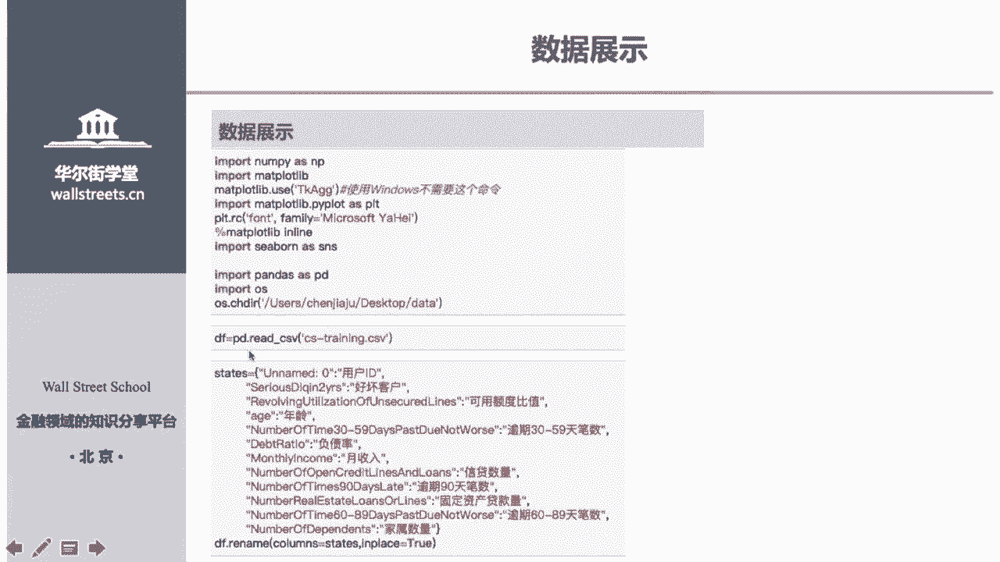
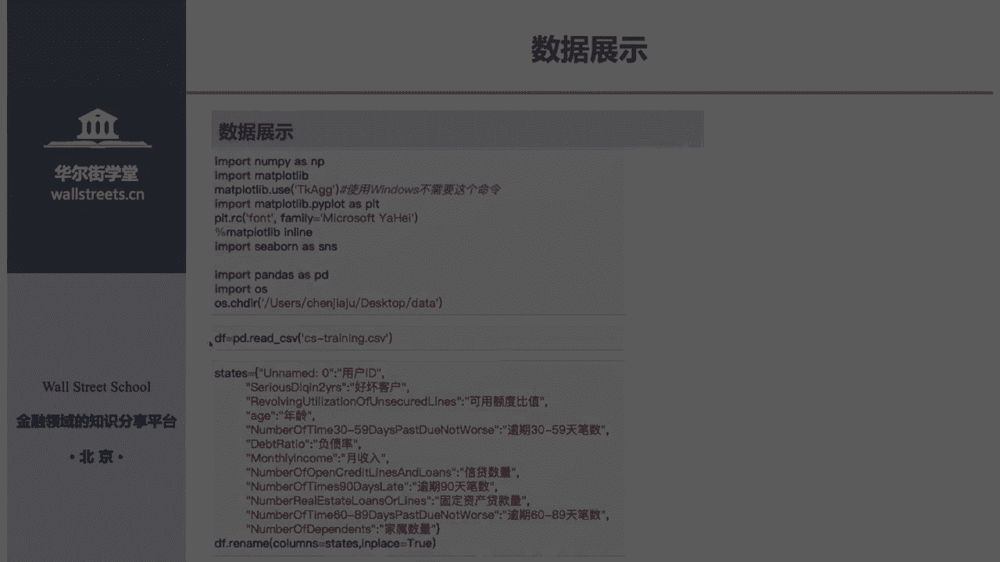
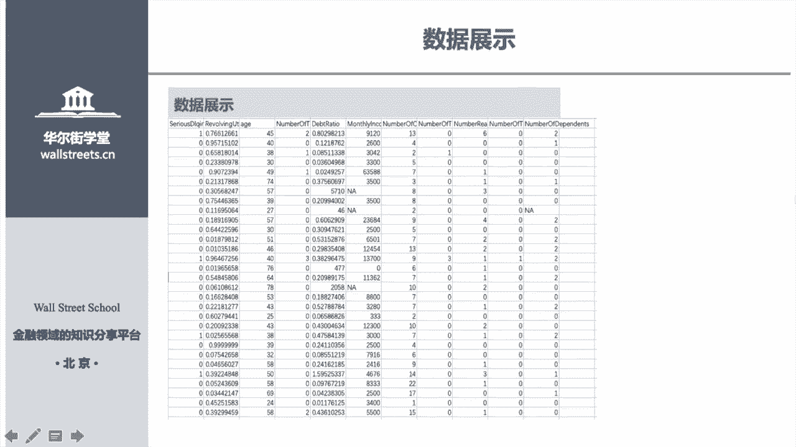
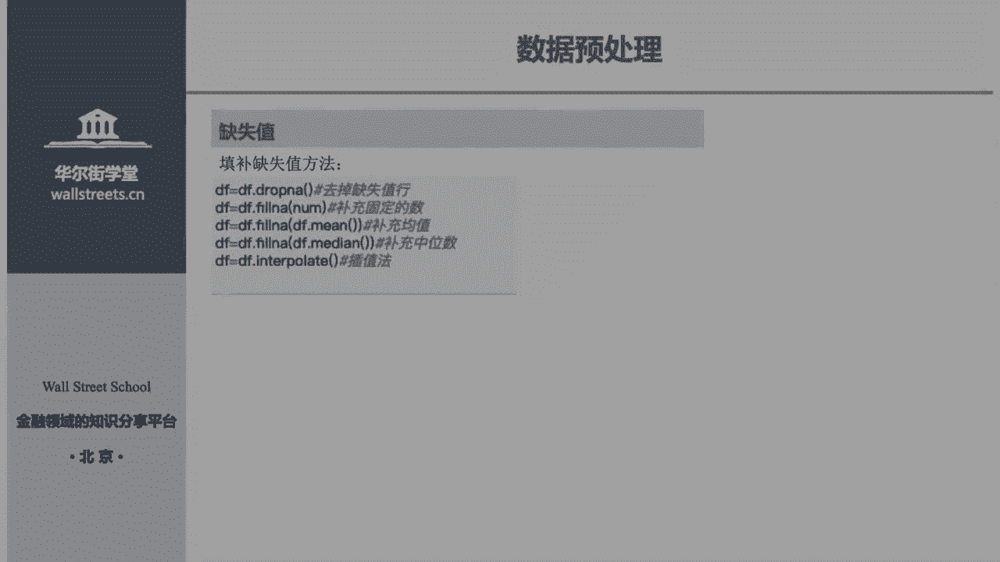
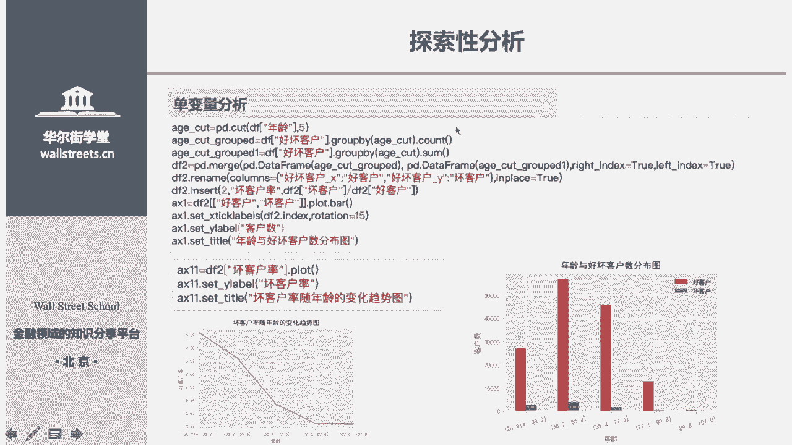
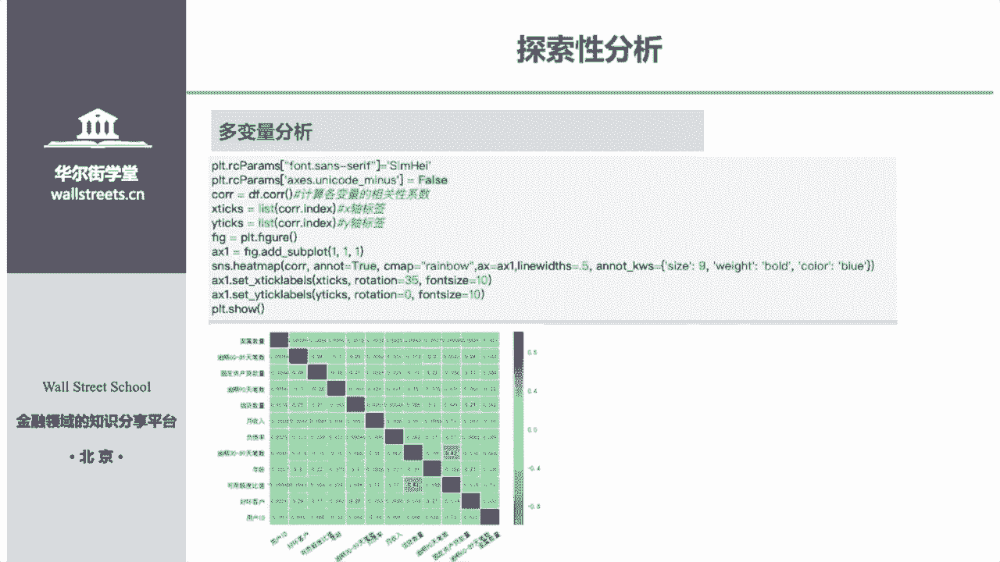
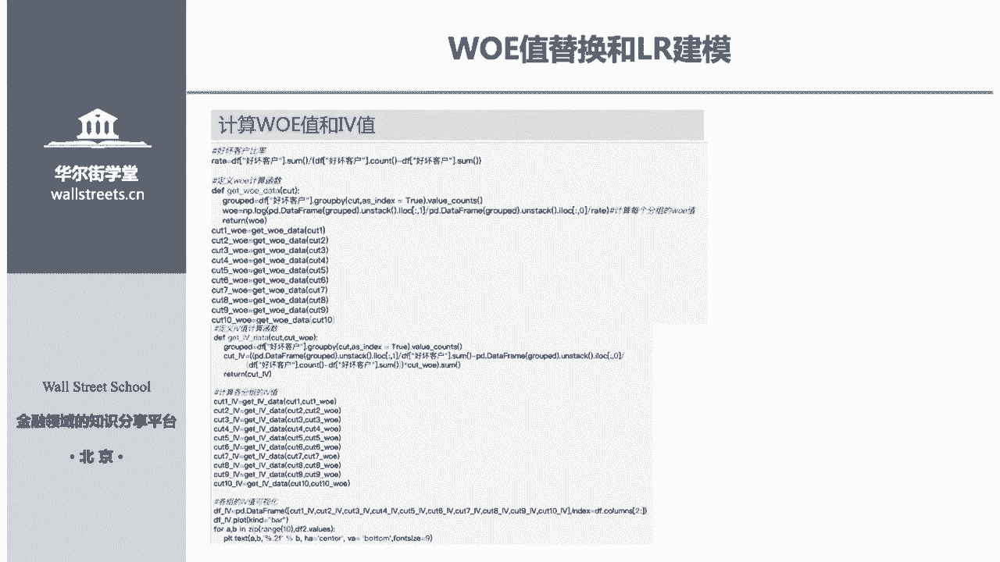
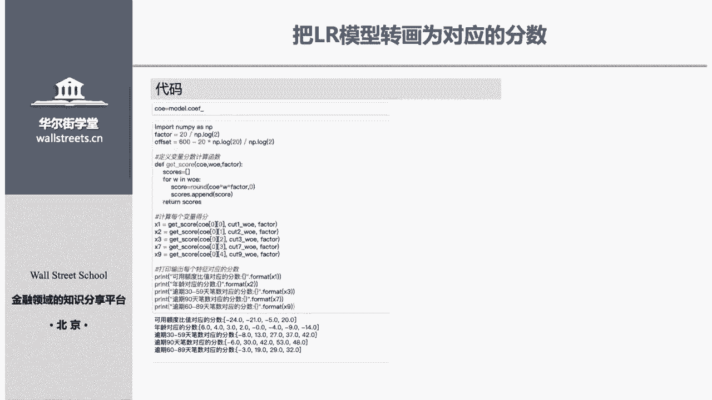
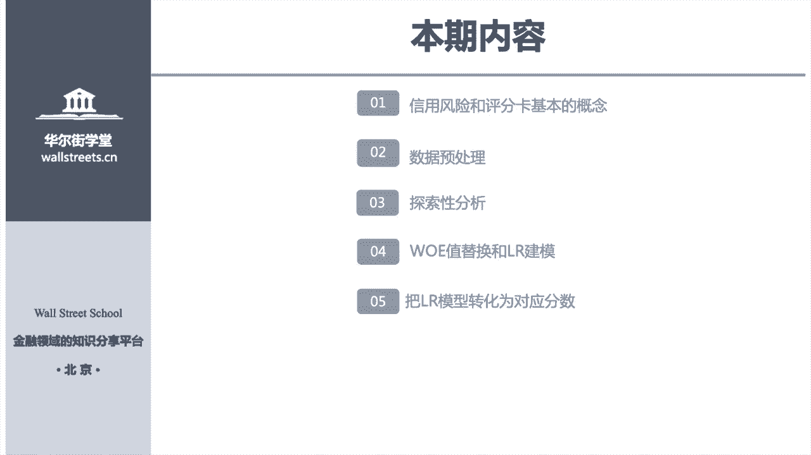

# Python金融量化：P19：02 信用评分卡教程

在本节课中，我们将学习如何使用Python构建一个信用评分卡模型。我们将从理解信用风险与评分卡的基本概念开始，逐步完成数据预处理、探索性分析、WOE/IV值计算、逻辑回归建模，最终将模型结果转化为可用的信用评分。整个过程旨在让初学者理解信用评分卡的核心构建思路。

## 信用风险与信用评分卡概念

信用风险，简单来说，就是借款人违约的风险。信用评分卡，则是银行等金融机构用于量化评估客户信用风险的工具。例如，申请信用卡时填写的表格，其中的问题（如年龄、收入）和选项分值，并非随意设定，而是通过数据建模得出的科学结果。

上一节我们介绍了基本概念，本节中我们来看看数据预处理。

## 数据预处理

建模的第一步是处理原始数据，确保数据质量。数据预处理主要包括数据展示、缺失值处理和异常值处理。

### 数据展示与理解

我们使用的数据来自Kaggle平台，包含11个特征（变量）。目标变量是预测客户是否为“好客户”（0表示好客户，1表示坏客户）。这是一个典型的二分类问题。

```python
import pandas as pd
import numpy as np
import matplotlib.pyplot as plt
# 如果是苹果电脑，可能需要添加以下代码
# %matplotlib osx
# Windows系统则不需要

# 导入数据
df = pd.read_csv('credit_data.csv')
# 将列名改为中文以便理解
df.columns = ['用户ID', '年龄', '负债率', '月收入', '家属数量', ... , '目标变量']
```

### 缺失值处理

模型无法处理缺失值，因此需要先进行填补或删除。以下是识别和处理缺失值的几种方法。

首先，识别哪些特征存在缺失值：

```python
# 方法一：使用info()方法快速查看
df.info()





# 方法二：自定义函数计算缺失比例
def missing_values_table(df):
    mis_val = df.isnull().sum()
    mis_val_percent = 100 * df.isnull().sum() / len(df)
    mis_val_table = pd.concat([mis_val, mis_val_percent], axis=1)
    mis_val_table_ren_columns = mis_val_table.rename(
        columns = {0 : '缺失值数量', 1 : '缺失值比例(%)'})
    return mis_val_table_ren_columns

missing_values_table(df)
```

识别出缺失值后，有以下几种处理方法：





1.  **删除含有缺失值的行**：直接丢弃信息不完整的客户记录。
    ```python
    df_dropped = df.dropna()
    ```
2.  **填充固定值**：例如，将缺失的收入填为0。
    ```python
    df_filled_zero = df.fillna(0)
    ```
3.  **填充统计值**：常用中位数填充，因为它对极端值不敏感，比均值更稳健。
    ```python
    df_filled_median = df.fillna(df.median())
    ```
4.  **插值法**：使用前后数据点进行插值。
    ```python
    df_interpolated = df.interpolate()
    ```

在实际工作中，常用中位数填充法。更高级的方法（如使用随机森林预测缺失值）也常被使用，但本课程以基础方法为主。

### 异常值处理

异常值是指与大部分数据差异极大的极端值（如年龄为200岁）。处理异常值有助于提升模型稳定性。

一种常见的方法是“盖帽法”，即将数据两端超出特定分位数的值替换为该分位数值。

```python
def cap_outliers(series):
    # 定义1%和99%分位数作为边界
    floor, cap = series.quantile(0.01), series.quantile(0.99)
    # 将小于floor的值替换为floor，大于cap的值替换为cap
    return series.clip(floor, cap)

df['年龄'] = cap_outliers(df['年龄'])
```

另一种更重要的方法是**分箱法**，它不仅能平滑异常值，也是构建评分卡的关键步骤。例如，将年龄0-20岁分为一组，那么即使有人填了0岁或100岁，也会被归入“青年组”或“老年组”，从而消除了极端值的影响。这正是信用评分卡中年龄段划分的原理。

讲完了数据清洗，接下来我们进入探索性分析阶段，以深入了解数据特征。

## 探索性分析

探索性分析旨在帮助我们熟悉数据，判断哪些特征对预测目标变量（是否违约）更重要。这属于“特征工程”的范畴，是数据挖掘中至关重要的一环。

### 单变量分析

单变量分析主要观察单个特征与目标变量之间的关系。

以下是分析“年龄”与“客户好坏”关系的示例代码：




```python
# 将年龄等频分为5组
df['年龄分组'] = pd.qcut(df['年龄'], q=5, duplicates='drop')
# 计算各年龄分组中好客户与坏客户的比例
age_bad_rate = df.groupby('年龄分组')['目标变量'].mean()
# 绘制坏客户率随年龄变化的趋势图
age_bad_rate.plot(kind='bar')
plt.title('不同年龄段的坏客户率')
plt.ylabel('坏客户率')
plt.show()
```

通过图表，我们可以直观看出“坏客户率是否随年龄增长呈现单调变化趋势”，这有助于判断该特征是否有效。

### 多变量分析



多变量分析主要检查特征之间的相关性。对于逻辑回归等线性模型，特征间的高相关性可能会影响模型精度。


以下是绘制特征间相关性热力图的方法：

```python
import seaborn as sns
# 计算相关系数矩阵
corr_matrix = df.corr()
# 绘制热力图
plt.figure(figsize=(12, 10))
sns.heatmap(corr_matrix, annot=True, cmap='coolwarm', center=0)
plt.title('特征相关性热力图')
plt.show()
```

通过热力图，我们可以发现高度相关的特征对，并考虑剔除其中一个，以避免多重共线性问题。同时，也可以观察哪些特征与目标变量相关性较强。

理解了数据特征后，我们进入信用评分卡建模的核心环节：WOE转换与IV值计算。

## WOE转换与IV值计算

### 概念介绍

*   **WOE**：证据权重，用于对分箱后的特征进行编码。其计算公式为：
    `WOE = ln((坏客户在本箱的占比) / (好客户在本箱的占比))`
    其中，“占比”是指该箱中坏（好）客户数占全体坏（好）客户数的比例。
*   **IV**：信息价值，用于衡量一个特征对目标变量的预测能力。其计算公式为：
    `IV = Σ ((坏客户占比 - 好客户占比) * WOE)`
    一个特征的IV值越高，说明它包含的信息量越大，对模型越重要。

### 分箱与计算

首先，需要对连续变量进行分箱。分箱方法有很多（如等频、等宽、卡方分箱、决策树分箱），其核心要求之一是分箱后，该特征的WOE值尽量呈单调趋势（递增或递减），这符合业务逻辑（如年龄越大，违约风险应单调变化）。

```python
# 示例：对‘年龄’进行自定义分箱，并加入正负无穷大以处理异常值
age_bins = [-np.inf, 30, 45, 60, np.inf]
df['年龄分箱'] = pd.cut(df['年龄'], bins=age_bins)
```

然后，计算每个分箱的WOE值和整个特征的IV值：

```python
def calculate_woe_iv(df, feature, target):
    # 计算每个分箱中好、坏客户的数量
    grouped = df.groupby(feature)[target].agg(['count', 'sum'])
    grouped.columns = ['总数', '坏客户数']
    grouped['好客户数'] = grouped['总数'] - grouped['坏客户数']

    # 计算好/坏客户的总数
    total_good = grouped['好客户数'].sum()
    total_bad = grouped['坏客户数'].sum()

    # 计算每个分箱的好/坏客户占比
    grouped['好客户占比'] = grouped['好客户数'] / total_good
    grouped['坏客户占比'] = grouped['坏客户数'] / total_bad

    # 计算WOE和IV
    grouped['WOE'] = np.log(grouped['坏客户占比'] / grouped['好客户占比'])
    grouped['IV'] = (grouped['坏客户占比'] - grouped['好客户占比']) * grouped['WOE']

    iv_total = grouped['IV'].sum()
    return grouped, iv_total




woe_iv_table, age_iv = calculate_woe_iv(df, '年龄分箱', '目标变量')
```

计算出所有特征的IV值后，可以绘制柱状图，并**剔除IV值过低的特征**（如IV<0.02），因为它们信息量少，可能干扰模型。这正是信用评分卡中问题筛选的数据依据。

完成特征筛选和WOE转换后，就可以用转换后的数据来训练模型了。

## 逻辑回归建模

逻辑回归是信用评分卡领域最经典的模型。它在线性回归的基础上，通过一个“Sigmoid”连接函数，将线性输出映射到(0,1)区间，用于预测概率。

### 模型训练与评估

我们使用`sklearn`库进行逻辑回归建模。为防止过拟合（模型在训练集上表现好，在新数据上表现差），需要将数据分为训练集和测试集。

```python
from sklearn.model_selection import train_test_split
from sklearn.linear_model import LogisticRegression
from sklearn.metrics import roc_auc_score

# 1. 准备数据：X是特征（已进行WOE转换），y是目标变量
X = df[['特征1_WOE', '特征2_WOE', ...]]
y = df['目标变量']

# 2. 划分训练集和测试集
X_train, X_test, y_train, y_test = train_test_split(X, y, test_size=0.3, random_state=42)

# 3. 创建并训练逻辑回归模型
model = LogisticRegression()
model.fit(X_train, y_train)

# 4. 在测试集上进行预测并评估
y_pred_proba = model.predict_proba(X_test)[:, 1] # 预测为坏客户的概率
auc_score = roc_auc_score(y_test, y_pred_proba)
print(f'模型AUC分数为：{auc_score:.3f}')
```
AUC分数越接近1，说明模型区分好坏客户的能力越强。

模型训练好后，我们需要将其输出转化为直观的分数。

## 模型分数转换

信用评分卡最终需要输出一个总分，分数越高代表信用越好（或违约风险越低）。转换公式基于逻辑回归的系数和WOE值。

分数转换的基本公式如下：
`分值 = 基准分 - 因子 * (回归系数 * WOE)`

其中：
*   `基准分`：设定的起始分数（如600分）。
*   `因子`：刻度因子，代表好坏比翻倍时所增加的分数（如20分）。
*   `回归系数`：逻辑回归模型得出的每个特征的系数。
*   `WOE`：该客户所在分箱的WOE值。

```python
# 假设参数
base_score = 600
factor = 20 / np.log(2) # PDO（Points to Double the Odds）设为20分
# 获取模型截距和系数
intercept = model.intercept_[0]
coef = model.coef_[0]

# 计算每个特征每个分箱的得分
# 例如，对于‘年龄’特征的第一箱（WOE已知为woe_age_1）
score_age_bin1 = base_score - factor * (coef_age * woe_age_1 + intercept / X.shape[1])
# 将所有特征的得分相加，即得到客户的总分
```

通过计算每个特征每个分箱对应的分数，就可以制作出一张清晰的评分卡表。申请信用卡时，系统会根据你填写的选项（对应到某个分箱）累加这些分数，得到最终信用分。




## 总结

本节课中我们一起学习了构建信用评分卡的完整流程：

1.  **理解概念**：明确了信用风险与信用评分卡的作用。
2.  **数据预处理**：处理了缺失值（删除、填充中位数）和异常值（盖帽法、分箱法）。
3.  **探索性分析**：通过单变量与多变量分析，初步筛选重要特征。
4.  **WOE/IV计算与分箱**：核心步骤，将连续特征离散化，计算WOE并替换，利用IV值进行特征筛选。
5.  **逻辑回归建模**：使用`sklearn`训练模型，并用AUC评估模型性能。
6.  **分数转换**：将模型输出的概率转换为直观的信用分数，形成评分卡。



需要强调的是，本教程重点在于梳理**构建思路**。实际应用中，**特征工程**（尤其是分箱技巧）和**尝试更复杂的机器学习模型**（如随机森林、XGBoost）是提升评分卡效果的关键方向，值得进一步深入学习。