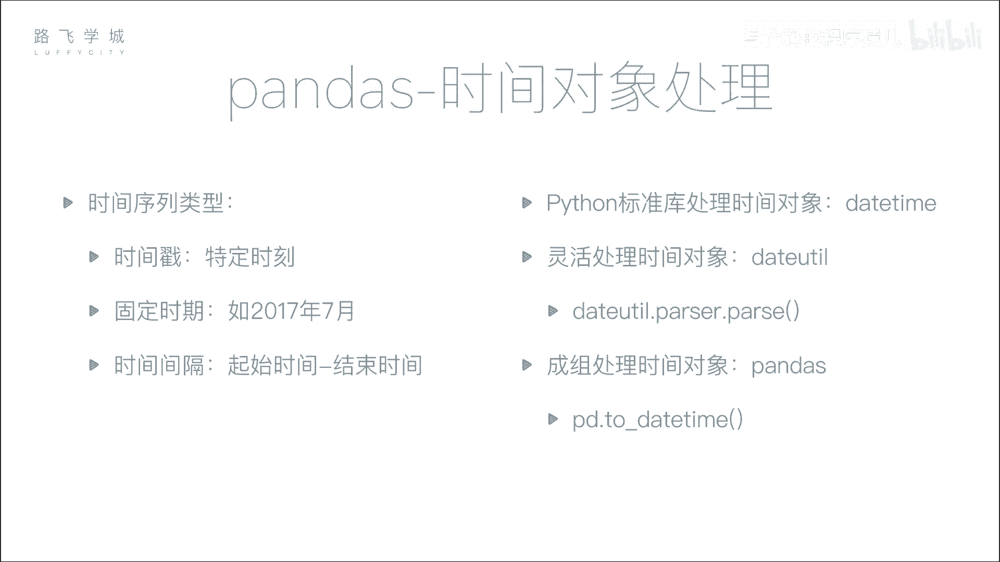
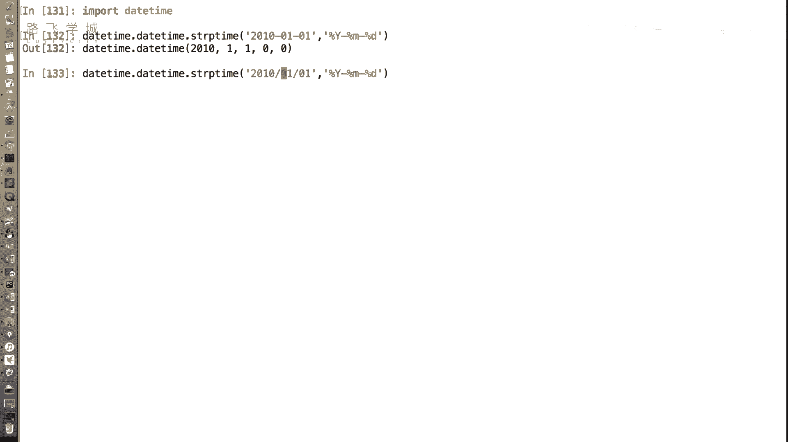
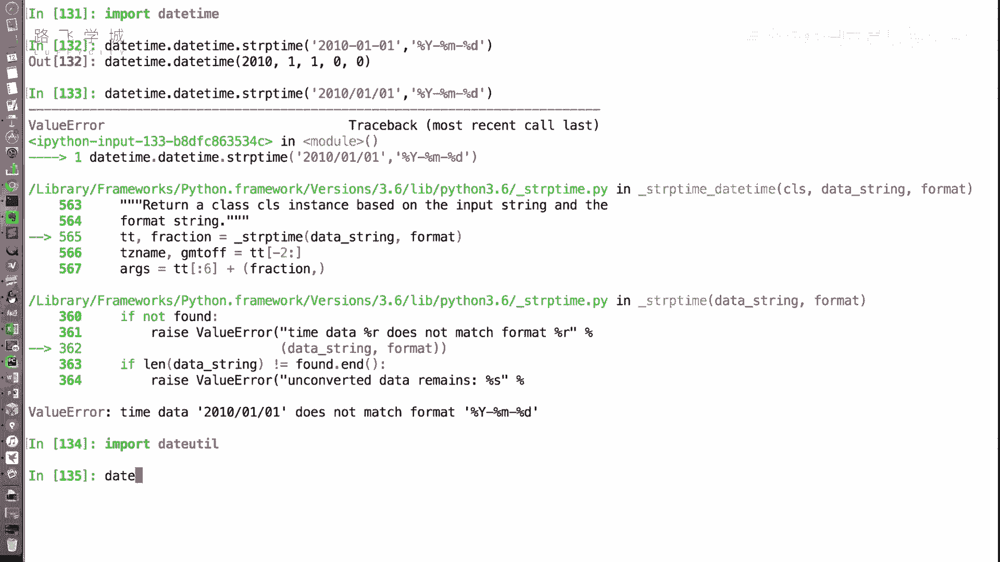
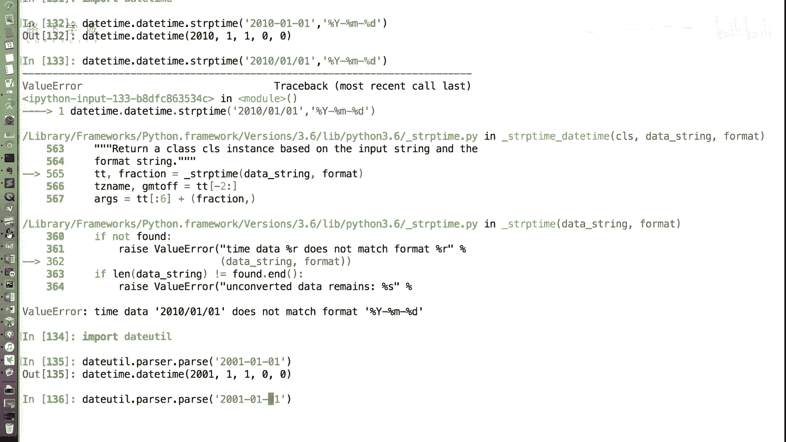
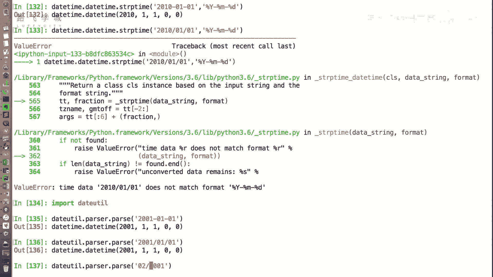
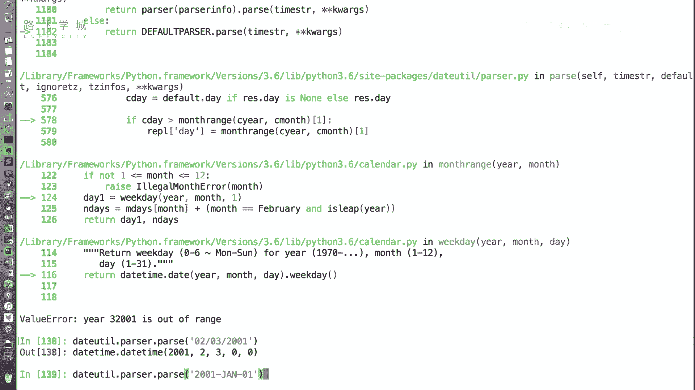
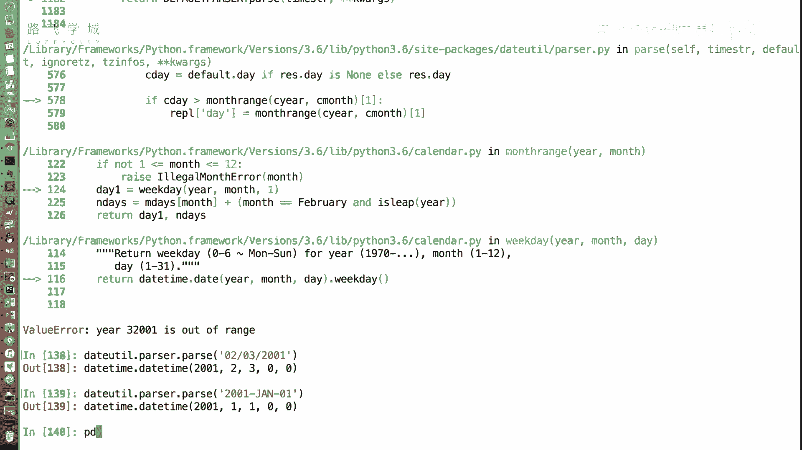
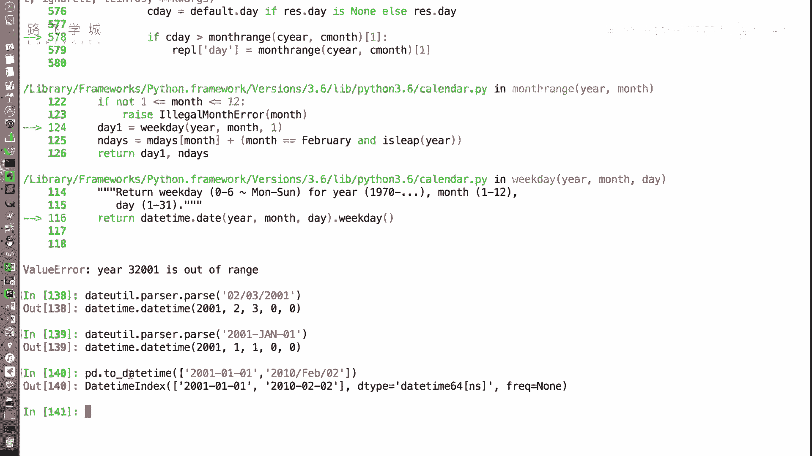

# Python金融量化：P19：时间处理对象 📅

在本节课中，我们将学习如何使用Python处理时间数据。时间数据在金融量化分析中至关重要，例如股票价格的时间序列分析。我们将重点介绍`pandas`库中处理时间序列的强大功能，特别是如何将各种格式的字符串高效地转换为时间对象。



## 时间对象基础

上一节我们介绍了金融数据的基本结构，本节中我们来看看如何处理其中的时间信息。在Python标准库中，处理时间对象的主要模块是`datetime`。

`datetime`模块中的`datetime.strptime`方法可以将字符串解析为时间对象。这个方法需要指定一个格式字符串来匹配输入字符串的格式。

**代码示例：**
```python
from datetime import datetime
date_str = "2023-01-01"
date_obj = datetime.strptime(date_str, "%Y-%m-%d")
```

然而，这种方法要求我们预先知道字符串的确切格式。在实际数据中，日期格式可能多种多样，例如“2023/01/01”、“01-01-2023”或“Jan 1, 2023”。手动为每种格式编写解析规则非常繁琐。

## 自动解析时间字符串



为了解决格式多样性的问题，我们可以使用`dateutil`库。这个库通常随`pandas`一起安装，它能够自动检测并解析大多数常见格式的日期字符串。

**代码示例：**
```python
from dateutil import parser
date_obj1 = parser.parse("2023-01-01")
date_obj2 = parser.parse("2023/01/01")
date_obj3 = parser.parse("Jan 1, 2023")
```



`dateutil.parser.parse`函数非常智能，可以处理横杠、斜杠分隔的日期，甚至包含月份缩写的英文日期，大大简化了时间数据的预处理工作。



## 使用Pandas进行批量转换



在数据分析中，我们通常需要处理大量数据。`pandas`库提供了`to_datetime`函数，可以高效地将整个序列（如列表、数组或Series）中的字符串批量转换为时间对象。



以下是`pd.to_datetime`函数的使用方法：

**代码示例：**
```python
import pandas as pd
date_strings = ["2023-01-01", "2023/02/01", "Mar 1 2023"]
date_index = pd.to_datetime(date_strings)
print(date_index)
# 输出：DatetimeIndex(['2023-01-01', '2023-02-01', '2023-03-01'], dtype='datetime64[ns]', freq=None)
```



该函数返回一个`DatetimeIndex`对象。这是一个专门为时间序列数据设计的索引类型，是后续进行时间序列分析和操作（如重采样、滑动窗口计算）的理想基础。我们将在后续课程中详细探讨其用途。

将时间数据转换为统一的`DatetimeIndex`对象有诸多好处：
*   **一致性**：确保所有时间数据具有相同的类型和格式。
*   **高效索引**：为基于时间的快速数据检索和切片提供支持。
*   **高级操作**：方便进行时间偏移、频率转换和日期范围生成等操作。

## 总结



本节课中我们一起学习了Python中处理时间对象的核心方法。我们首先回顾了标准库`datetime`的基础解析功能，然后介绍了能自动解析多种格式的`dateutil.parser`工具。最后，我们重点掌握了`pandas`中`pd.to_datetime`函数的强大之处，它能够批量、智能地将字符串数据转换为专为时间序列分析设计的`DatetimeIndex`对象，为后续的金融时间序列分析奠定了坚实的数据基础。