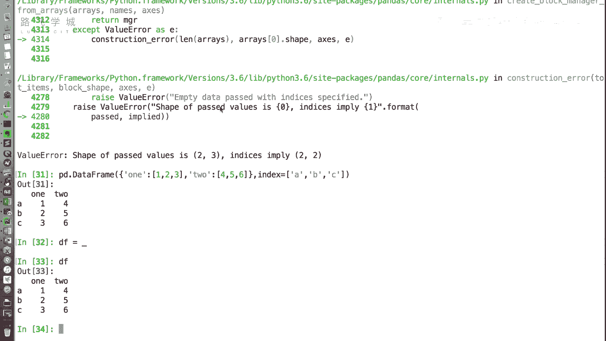
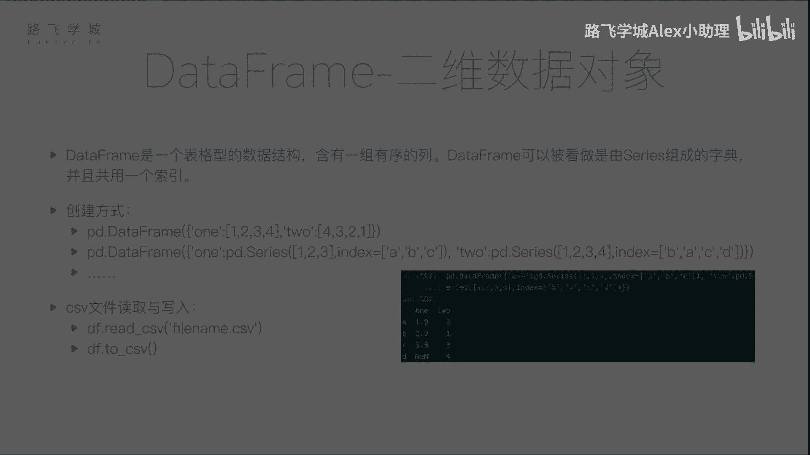

# Python金融量化：P19：DataFrame的创建 📊

在本节课中，我们将要学习Pandas中另一个核心数据结构——DataFrame。上一节我们介绍了Series，它是一个一维的数据对象。本节中我们来看看DataFrame，它是一个二维的、表格型的数据结构，类似于Excel工作表，包含一组有序的列，每列可以是不同的值类型。

DataFrame可以看作是由多个Series组成的字典，并且这些Series共享同一个行索引。接下来，我们将学习几种创建DataFrame的方法。

## 从字典创建DataFrame

DataFrame可以通过多种方式创建。以下是第一种常见方法：从一个字典创建。字典的键将成为列名，字典的值（列表）将成为对应列的数据。

```python
import pandas as pd

# 创建一个字典，键为列名，值为列数据（列表）
data = {'one': [1, 2, 3], 'two': [4, 5, 6]}
df = pd.DataFrame(data)
print(df)
```
执行上述代码，将创建一个两列的DataFrame。列“one”的值为[1, 2, 3]，列“two”的值为[4, 5, 6]。由于没有指定行索引，Pandas会自动生成整数索引0, 1, 2。

我们也可以使用`index`参数来指定自定义的行索引标签。



```python
df = pd.DataFrame(data, index=['a', 'b', 'c'])
print(df)
```



## 从Series字典创建DataFrame

第二种创建方式是从一个字典创建，但字典的值是Series对象。这种方式允许每列数据拥有自己的索引，Pandas在组合时会自动根据索引进行对齐。

```python
# 创建两个Series，拥有不同的索引
s1 = pd.Series([1, 2, 3], index=['a', 'b', 'c'])
s2 = pd.Series([1, 2, 3, 4], index=['b', 'a', 'c', 'd'])

# 从Series字典创建DataFrame
data2 = {'one': s1, 'two': s2}
df2 = pd.DataFrame(data2)
print(df2)
```
在这个例子中，两个Series的索引不完全一致。Pandas会自动将它们按行索引标签对齐。对于`s1`中没有的索引`‘d’`，在`‘one’`列中会自动填充为缺失值（NaN）。这个自动对齐功能在处理实际数据时非常有用。

## 从文件读取创建DataFrame

在实际应用中，我们很少手动构建字典来创建DataFrame。更常见的做法是从外部文件（如CSV、Excel）中读取数据。Pandas提供了强大的文件读取函数。

以下是从CSV文件读取数据创建DataFrame的方法。CSV文件是一种用逗号分隔值的纯文本格式。

假设我们有一个名为`test.csv`的文件，内容如下：
```
A,B,C
1,2,3
2,4,6
3,6,9
```

我们可以使用`pd.read_csv()`函数来读取它：

```python
df_from_file = pd.read_csv('test.csv')
print(df_from_file)
```
该函数会将文件的第一行（A, B, C）识别为列名，并自动生成行索引。这个函数功能强大，我们将在后续课程中详细介绍其各种参数，以应对不同的数据格式需求。

## 将DataFrame保存到文件

创建或处理完DataFrame后，我们经常需要将数据保存下来。Pandas提供了方便的`to_csv()`方法。

```python
# 将之前创建的DataFrame保存为CSV文件
df.to_csv('test2.csv', index=False)  # index=False表示不将行索引写入文件
```
执行后，会在当前目录生成一个`test2.csv`文件。同样，`to_csv()`方法也有许多参数可以控制输出格式，我们会在后面详细讲解。

除了CSV格式，Pandas也支持从JSON、Excel、XML等多种格式读写数据。

---


本节课中我们一起学习了DataFrame的创建。我们掌握了三种主要方式：**从列表字典创建**、**从Series字典创建**以及最常用的**从文件（如CSV）读取创建**。我们还简单了解了如何将DataFrame保存回文件。DataFrame是进行数据分析和处理的核心工具，理解其创建方式是后续所有操作的基础。在下一节，我们将深入学习如何查看和选取DataFrame中的数据。