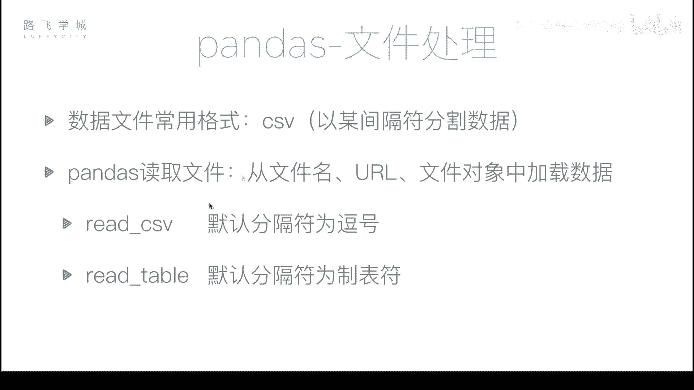
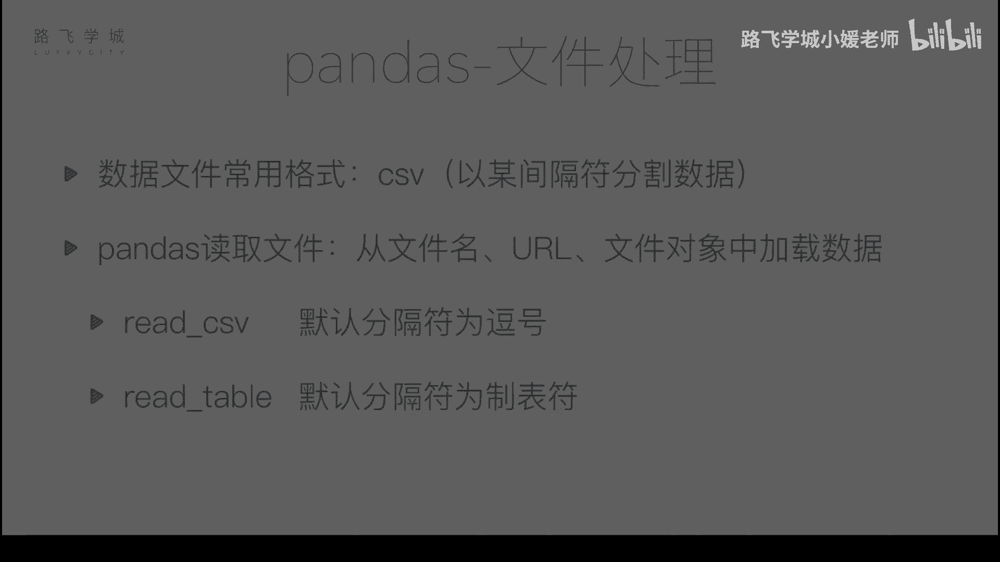
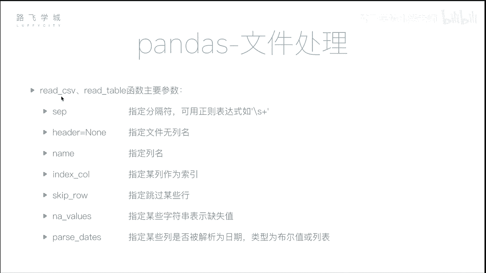

# Python金融量化：P19：文件读取 📁

在本节课中，我们将学习如何使用Pandas库读取外部数据文件。这是数据分析中至关重要的一步，因为真实世界的数据通常存储在文件中，而非手动输入。

## 概述

到目前为止，我们已经学习了Pandas的许多功能，包括灵活的数据操作、数据对齐、缺失数据处理和时间序列等。最后一部分是文件处理。在日常编程中，我们通常不会手动输入数据来创建DataFrame对象，真实数据一般存储在文件中。因此，我们需要学习如何从文件读取数据以及如何将数据写入文件。



## CSV文件格式



最常用的数据文件格式是CSV。CSV文件本质上是一个文本文件，其中每一行由逗号分隔。每个逗号之间的部分相当于Excel表格中的一个单元格。

`read_csv`函数可以将CSV文件的内容读取到Pandas中。

```python
import pandas as pd
df = pd.read_csv('filename.csv')
```

## 读取股票数据文件

我们来看一个具体的例子。这里有一个文件，记录了某只股票从2007年3月1日到2017年11月10日左右的所有行情数据。它的列包括：序号、时间、开盘价、收盘价、最高价、最低价、成交量和股票代码。

使用`read_csv`函数读取这个文件：

```python
df = pd.read_csv('stock_data.csv')
```

读取后，大部分数据都成功加载。但存在几个问题需要处理。

## 设置行索引

读取后，Pandas自动创建了一个从0开始的数字索引（0, 1, 2, ...）。同时，文件中原有的序号列（0, 1, 2, ...）也被当作一列数据读入，并且因为该列的第一个单元格是空的，Pandas为其分配了列名“Unnamed: 0”。

如果我们希望指定某一列作为行索引，可以使用`index_col`参数。

*   **`index_col=0`**：将第0列（即最左边那一列）作为索引。
*   **`index_col=‘date’`**：将名为“date”的列作为索引。这通常更有意义，尤其是对于时间序列数据。

```python
df = pd.read_csv('stock_data.csv', index_col='date')
```

## 解析时间序列

上一节我们介绍了如何设置行索引。当我们把“date”列设为索引后，虽然它看起来是日期，但Pandas默认将其解释为字符串。我们可以通过检查索引类型来确认：

```python
print(type(df.index[0]))  # 输出可能是 <class 'str'>
```

为了进行时间序列分析，我们需要将其转换为真正的日期时间对象。这需要使用`parse_dates`参数。

`parse_dates`参数有两种使用方式：
1.  **传递布尔值**：`parse_dates=True`。Pandas会尝试将文件中所有可以解释为日期的列都进行转换。
2.  **传递列表**：`parse_dates=[‘date’]`。指定只转换列表中列名对应的列。

```python
# 方法一：转换所有可能的日期列
df = pd.read_csv('stock_data.csv', index_col='date', parse_dates=True)

# 方法二：仅转换指定的‘date’列
df = pd.read_csv('stock_data.csv', index_col='date', parse_dates=['date'])

print(type(df.index))  # 输出应该是 <class 'pandas.core.indexes.datetimes.DatetimeIndex'>
```

## 处理无列名的文件

如果CSV文件的第一行就是数据，没有列名，直接读取会出现问题。因为Pandas默认将第一行解释为列名。

这时，我们需要使用`header`参数。

*   **`header=None`**：Pandas不会将第一行作为列名，并会自动生成数字列名（0, 1, 2, …）。
*   **`names=[...]`**：我们可以通过`names`参数传入一个列表，手动指定列名。

```python
# 文件没有列名，自动生成数字列名
df = pd.read_csv('data_without_header.csv', header=None)

# 文件没有列名，手动指定列名
column_names = ['A', 'B', 'C', 'D', 'E', 'F', 'G', 'H']
df = pd.read_csv('data_without_header.csv', header=None, names=column_names)
```

## read_csv 与 read_table

除了`read_csv`，Pandas还有一个`read_table`函数。两者的主要区别在于默认的分隔符：
*   `read_csv`默认分隔符是逗号（`,`）。
*   `read_table`默认分隔符是制表符（`\t`）。

在实际使用中，我们可以通过`sep`参数来指定任何分隔符，因此这两个函数的功能基本可以互换。

```python
# 使用read_csv读取以制表符分隔的文件
df = pd.read_csv('data.tsv', sep='\t')

# 使用read_table读取以逗号分隔的文件
df = pd.read_table('data.csv', sep=',')
```

## 其他常用参数

上一节我们介绍了文件读取的基本函数。本节中，我们来看看`read_csv`/`read_table`函数其他一些有用的参数，它们能帮助我们更灵活地处理各种格式的数据文件。

以下是几个关键参数：

*   **`sep`**：指定分隔符。默认是逗号。可以是任何字符，甚至是一个正则表达式。例如，`sep=‘\s+’`可以匹配任意长度的空白字符（空格、制表符等）。
*   **`skiprows`**：指定要跳过的行号（从0开始）。例如，`skiprows=[1, 2, 3]`会跳过原文件的第2、3、4行。
*   **`na_values`**：指定哪些字符串应被解释为缺失值（NaN）。数据来源多样，缺失值的表示可能不同（如“N/A”, “null”, “-”）。这个参数接受一个列表，列表中的字符串都会被当作NaN处理。
    ```python
    # 将“NA”和“missing”都识别为缺失值
    df = pd.read_csv('data.csv', na_values=['NA', 'missing'])
    ```
*   **`parse_dates`**：如前所述，将指定列解析为日期时间对象。

## 总结



本节课中，我们一起学习了如何使用Pandas读取外部文件，重点是`read_csv`函数。我们掌握了如何处理行索引（`index_col`）、解析日期（`parse_dates`）、处理无列名文件（`header`, `names`）以及识别自定义缺失值（`na_values`）等关键技巧。这些技能是进行金融量化分析数据准备阶段的基础，确保我们能将各种格式的原始数据正确、高效地加载到Python环境中进行分析。