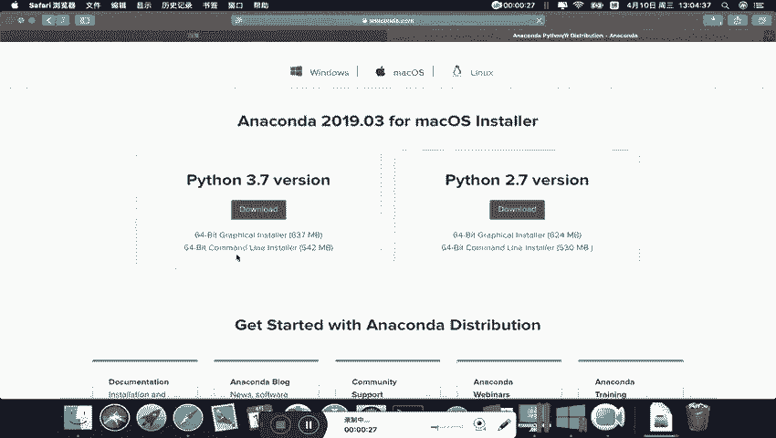
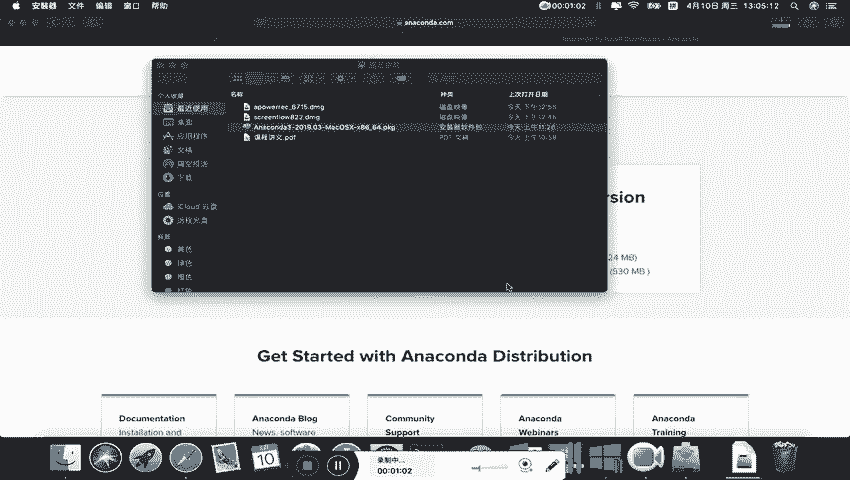
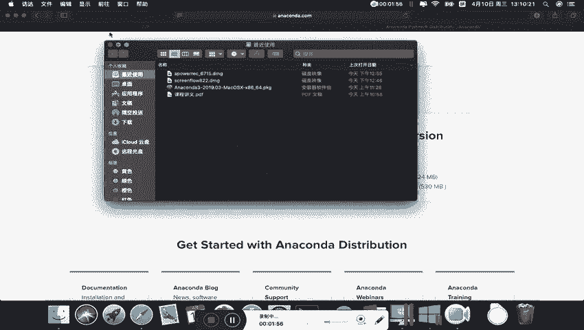
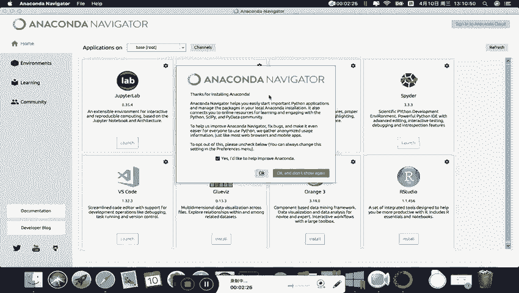
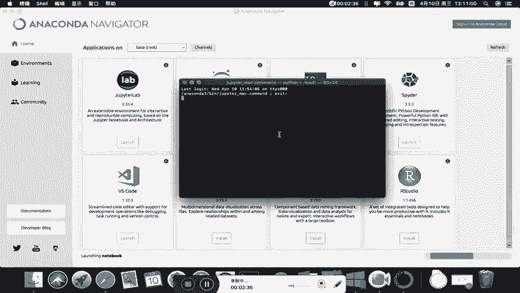
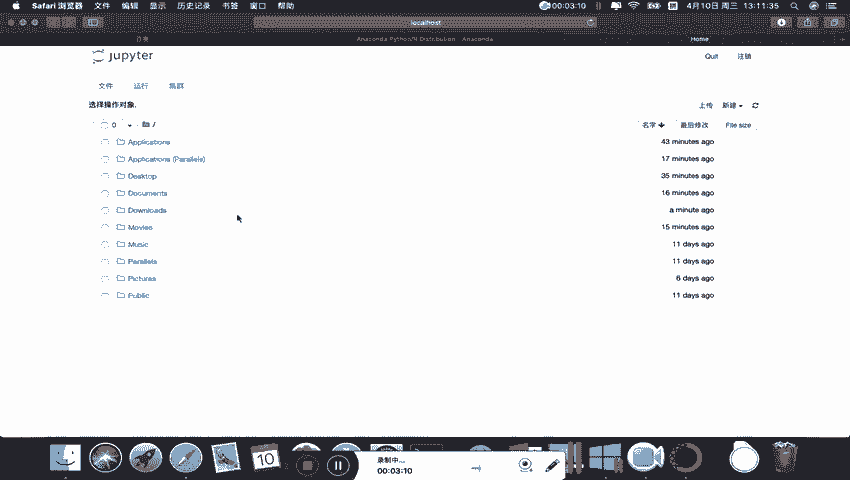
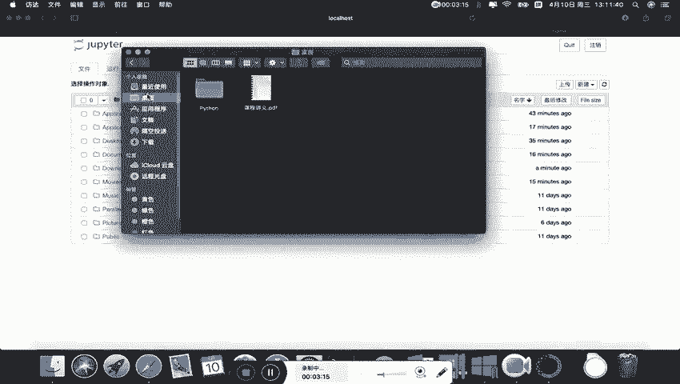
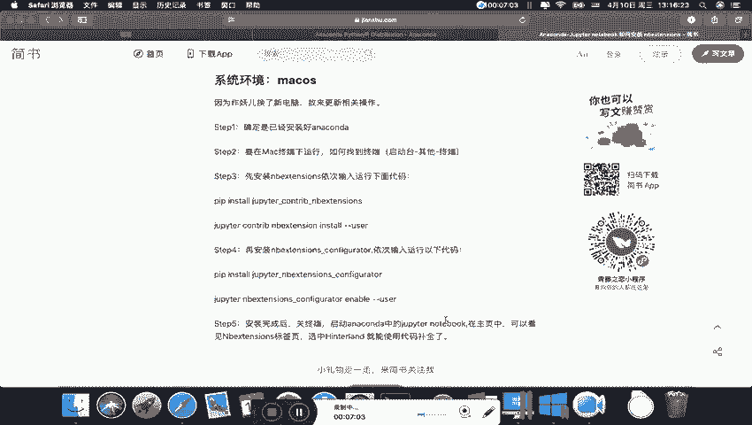

# Python金融量化：P2：02：Mac系统下安装Anaconda步骤 🍎


在本节课中，我们将学习如何在Mac操作系统上安装Anaconda，并配置Jupyter Notebook的工作环境。这是进行后续Python金融量化分析的基础。


## 概述

Anaconda是一个集成了Python和众多科学计算库的发行版，能极大简化环境配置过程。本节将指导你完成从下载到安装，再到初步配置Jupyter Notebook的完整流程。



## 下载Anaconda安装包

首先，我们需要获取Anaconda的Mac版本安装程序。



1.  打开浏览器。
2.  在搜索引擎（如百度或Google）中搜索“anaconda”。
3.  进入Anaconda官方网站。
4.  点击网站上的“Download”按钮。
5.  在下载页面选择Mac OS版本，并点击“Download”开始下载。

## 安装Anaconda

下载完成后，即可开始安装。以下是安装步骤。


1.  找到下载好的`.pkg`安装包文件并双击打开。
2.  启动安装向导后，建议保持所有默认设置，无需修改安装位置。
3.  阅读并同意软件许可协议。
4.  输入你的电脑密码以授权安装。
5.  等待安装完成，此过程根据电脑配置不同，可能需要10到20分钟。
6.  安装过程中请勿中断或重启电脑。
7.  安装成功后，点击“关闭”。安装包可以保留或移入废纸篓。



至此，Anaconda已成功安装到你的Mac电脑上。

## 启动与使用Jupyter Notebook



安装完成后，我们可以通过两种方式启动Jupyter Notebook。



### 方法一：通过Anaconda Navigator启动

这是一种图形化的启动方式。

1.  在Launchpad中找到并打开“Anaconda-Navigator”。
2.  在Navigator的主界面中，找到“Jupyter Notebook”工具。
3.  点击其下方的“Launch”按钮。
4.  Jupyter Notebook会在默认浏览器中打开，其初始工作路径通常是你的系统用户目录。



### 方法二：通过终端（Terminal）启动并指定工作路径



通过终端启动可以灵活地指定工作目录，便于管理项目文件。

上一节我们介绍了通过图形界面启动Jupyter，本节中我们来看看如何通过命令行更灵活地控制它。

首先，打开终端。你可以在“Launchpad” -> “其他”文件夹中找到“终端”应用。

在终端中，我们可以使用命令来导航文件系统和启动Jupyter。以下是关键步骤：

1.  使用 `ls` 命令查看当前目录下的文件和文件夹。
    ```bash
    ls
    ```
2.  使用 `cd` 命令切换目录。例如，进入“文档”文件夹：
    ```bash
    cd Documents
    ```
3.  在目标目录下，直接输入 `jupyter notebook` 命令启动。
    ```bash
    jupyter notebook
    ```
    此时启动的Jupyter，其工作路径就是你执行命令时所在的终端路径。

为了课程学习的便利，建议你创建一个专门的工作文件夹（例如 `jupyter_working_path`），并将课程提供的`data`数据文件夹放入其中。之后在此文件夹内启动Jupyter，即可方便地使用相对路径访问数据文件。

## 安装Jupyter Notebook扩展插件（nb extensions）

为了获得更丰富的Jupyter使用体验（如目录导航、代码折叠等），可以安装扩展插件。

在Mac系统下安装扩展插件的步骤与Windows系统基本一致，都需要在终端中执行命令。

以下是安装所需的命令序列，请在终端中逐行执行：

```bash
# 1. 安装 nbextensions
pip install jupyter_contrib_nbextensions

# 2. 将扩展脚本复制到Jupyter配置目录
jupyter contrib nbextension install --user

# 3. 安装前端扩展所需模块
pip install jupyter_nbextensions_configurator

# 4. 启用配置器
jupyter nbextensions_configurator enable --user
```

安装完成后，重新启动Jupyter Notebook，你将在主界面看到新增的“Nbextensions”标签页，可以在其中勾选启用需要的插件。

**注意**：在执行上述命令前，如果Jupyter Notebook正在运行，需要先将其关闭。在启动Jupyter的终端窗口中，按 `Ctrl + C` 组合键即可安全关闭服务。

## 总结



本节课中我们一起学习了在Mac系统上搭建Python数据分析环境的完整流程。我们首先从官网下载并安装了Anaconda，然后学习了两种启动Jupyter Notebook的方法，特别是通过终端指定工作路径的技巧，这对于管理项目文件至关重要。最后，我们介绍了如何安装功能强大的Jupyter扩展插件（nb extensions）来提升编码效率。现在，你的开发环境已经准备就绪，可以开始后续的金融量化分析学习了。